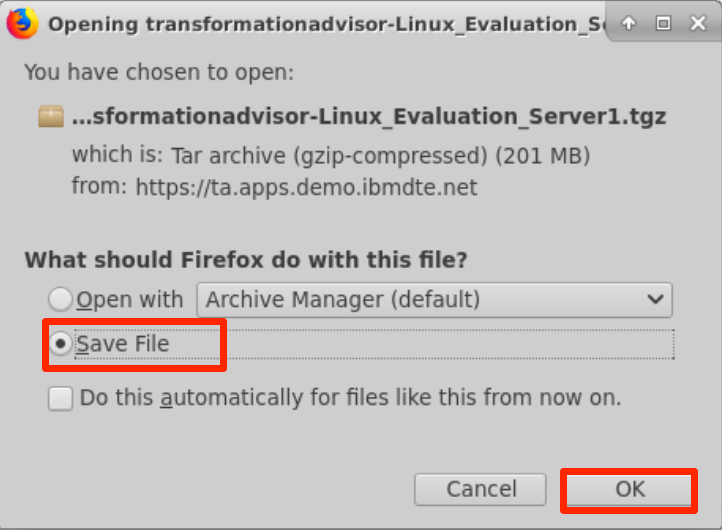
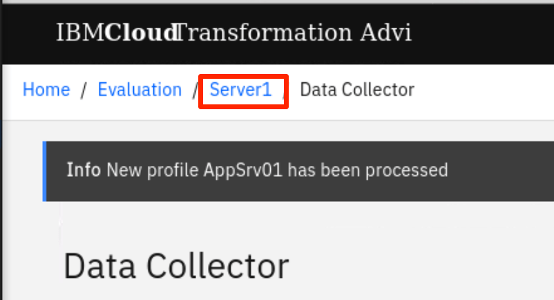

This lab is a part of the Application Modernization lab series which focus on the evaluation, re-platforming and rehosting application modernization approaches and other application modernization related solutions. This lab covers the evaluation process. It shows the value of using Transformation Advisor to evaluate on-premises Java applications and identify a migration candidate for moving to the cloud. When you complete this lab, you learn how to use this tool to quickly analyze on-premise Java applications without accessing their source code and to estimate the move to cloud efforts.

One of the tools included in the Pak is the IBM Cloud Transformation Advisor (Transformation Advisor), a developer tool that is available at no charge to help you quickly evaluate on-premises Java EE applications for deployment to the cloud. The Transformation Advisor tool can

* identify the Java EE programming models in the app.
* determine the complexity of apps by listing a high-level inventory of the content and structure of each app.
* highlight Java EE programming model and WebSphere API differences between the WebSphere profile types
* learn any Java EE specification implementation differences that might affect the app

Additionally, the tool provides a recommendation for the right-fit IBM WebSphere Application Server edition and offers advice, best practices and potential solutions to assess the ease of moving apps to Liberty or newer versions of WebSphere traditional. It accelerates application migrating to cloud process, minimize errors and risks and reduce time to market. 

### 1.	Business Scenario
As shown in the image below, your company has several web applications deployed to WebSphere Application Server (WAS) environment. 


 
Your company wants to move these applications to a lightweight WebSphere Liberty server on cloud, but you are not sure how much effort the migration process might take. You decide to use the IBM Transformation Advisor to do a quick evaluation of these applications without their source code to identify a good candidate application to move to cloud based on the analysis result.

### 2.	Objective
The objectives of this lab are to:
*	learn how to collect Java application and configuration data using the Transformation Advisor Data Collector tool. 
*	learn how to use the Transformation Advisor to evaluate the move to cloud efforts and to identify the good candidate for migration.

### 3.	Prerequisites
The following prerequisites must be completed prior to beginning this lab:
*	Familiarity with basic Linux commands
*	Have internet access
* Have basic knowledge of OpenShift Container Platform (OCP) web console and commandline operations
*	Have a SkyTap App Mod Lab environment ready

### 4.	What is Already Completed

A six Linux VMs App Mod Lab environment has been provided for this lab. 
 
  

*	The Red Hat OpenShift Container Platform (OCP) v4.6, is installed in 5 VMs, the master1 VM, the master2 VM, the master3 VM, the dns VM and the nfs VM, with 3 master nodes and 3 compute nodes (the master nodes are serving as computer nodes as well).
*	The workstation VM is the one you will use to access and work with OCP cluster in this lab.
  The login credentials for the workstation VM are:
  User ID: **ibmdemo**
  Password: **passw0rd**
  Note: Use the Password above in the workstation VM terminal for sudo in the Lab.
*	The CLI commands used in this lab are listed in the **Commands.txt** file located at the **/home/ibmdemo/add-mod-labs/am0100st** directory of the workstation VM for you to copy and paste these commands to the Terminal window during the lab.

### 5.	Lab Tasks
In this lab, you access WebSphere Application Server to review the deployment of the JEE applications. Then you are going to the Transformation Advisor to identify a good candidate application for moving to cloud. To identify which Java EE programming models are on the server, you could run the Transformation Advisor Data Collector tool against the server. The Transformation Advisor creates an inventory of the content and structure of each application and learn about problems that might occur if you move the application to cloud. Finally, you review the analysis reports to determine the complexity of the move-to-cloud efforts and select the migration candidate app.

Here are the activities involved in this process:
*	Log in to WebSphere Application Server to review the deployed JEE applications
*	Run the Transformation Advisor Data Collector tool against the WebSphere Application Server to get application data
*	Review the analysis reports that Transformation Advisor generates to identify the right candidate application for a rapid and cost-effective migration to cloud

### 6.	Execute Lab Tasks

#### 6.1	Log in to the workstation VM and Get Started 
1. If the VMs are not already started, start them by clicking the play button for the whole group.

  


2.	After the VMs are started, click the workstation VM icon to access it. 

  

  The Workstation Linux Desktop is displayed. You execute all the lab tasks on this workstation VM.

3.	If requested to log in to the Workstation OS, use credentials: **ibmdemo**/**passw0rd**
4. Open a terminal window by clicking its icon from the Desktop toolbar.

  
5. If this is your first time to run the lab series in this lab environment, do the following, otherwise if you have already downloaded the lab materials in other labs, you can skip this step.
  
  a. In the terminal window, run the following command to get the lab materials.

  ```
  /home/ibmdemo/get-lab-materials.sh
  ```

  Sample output

  ```
  Cloning into 'app-mod-labs'...
  warning: redirecting to https://github.com/wtistang/app-mod-labs.git/
  remote: Enumerating objects: 5693, done.
  remote: Counting objects: 100% (185/185), done.
  remote: Compressing objects: 100% (118/118), done.
  remote: Total 5693 (delta 53), reused 184 (delta 53), pack-reused 5508
  Receiving objects: 100% (5693/5693), 277.71 MiB | 57.39 MiB/s, done.
  Resolving deltas: 100% (2250/2250), done.
  Checking out files: 100% (6120/6120), done.
  ```
  
  The lab materials is downloaded to the **/home/ibmdemo/app-mod-labs** directory.
  
6. Open **File Manager** by clicking its icon on the Desktop toolbar.

  

7. Navigate to **/home/ibmdemo/app-mod-labs/am0100st** directory and double-click to open **Commands.txt** file in the text editor.

  

  This file contains all commands used in the lab.  When you need to enter any command in a terminal window in the lab tasks, you should come back to this file and copy/paste the command from this file, this is because you cannot directly copy and paste from your local workstation to the SkyTap workstation.

#### 6.2	Review the on-prem WebSphere apps 

In this task, you take a look at the sample applications deployed to the local WebSphere Application Server (WAS) environment. You are going to identify one of them to be the god candidate to move the cloud later.

1.	Start WebSphere Application Server

    In the workstation VM, you have a local WebSphere Application Server which hosts several sample applications. 
    To start the WAS server:
    
    a. In the terminal window, issue the command below to start the WAS server.
    
    ```
    /home/ibmdemo/app-mod-labs/shared/startWAS.sh
    ```

    If prompted for **sudo** password, enter the appsword as: **passw0rd**.
    
    Within a few minutes the WAS server is ready.

    b.	Access the WAS Admin Console to view the application deployed by clicking the Firefox icon on the Desktop toolbar.
    
    
 
    c.	From the web browser window and click WebSphere Integrated Solution Console bookmark to launch the WAS console.

    
 
    d.  If you see the **Warning: Potential Security Risk Ahead** message, click **Advanced**>**Accept the Risk and continue**.
    
    e.	In the WAS Admin Console login page, enter the User ID and Password as: **wsadmin**/**passw0rd** and click **Login**.

    f.	On the WAS Console page, click **Applications** -> **Application Types** -> **WebSphere enterprise applications** to view the apps deployed.

    
 
    In the Enterprise Applications list, you can see all applications deployed. Next, you use Transformation Advisor to analyze these applications to identify a good candidate to be moved to the cloud.

#### 6.3	Access Transformation Advisor

The Transformation Advisor is installed in the OCP cluster.  In this lab, you use the following steps to access it.

1. From web browser window, click the **IBM Cloud Transformation Advisor** bookmark and log in with the OCP account credentials.

    
 	
2. If prompted to log in to Red Hat OpenShift Container Platform, click **htpasswd** field. Then log in with **ibmadmin**/**engageibm** as the username and password.
 
     

     
    
    The Transformation Advisor Home page is displayed.
 
    

#### 6.4	Download Transformation Advisor Data Collector utility

The Transformation Advisor can evaluate any Java based applications. In this lab, you are going to use it to evaluate whether the on-premises WebSphere application, Mod Resorts, is suitable to move to cloud and what the effort might be to get it there. You can use Transformation Advisor Data Collector utility to get the application data from the WebSphere Application Server running on the workstation VM. The utility can be downloaded from the Transformation Advisor web page.

1. In the Transformation Advisor page, you first create a new workspace by entering the workspace name as **Evaluation** and then clicking **Next**.
 
   
    Note: A workspace is a designated area that houses the migration recommendations provided by Transformation Advisor against your application server environment. You can name and organize these however you want, whether it’s by business application, location or teams. 

2. Enter the collection name as **Server1** and click **Let’s go**.
 
    
    Note: Each workspace can be divided into collections for more focused assessment and planning. Like workspaces, collections can be named and organized in whatever way you want.

3. Once the Workspace and Collection are created, you have options to either download the Data Collector utility or upload existing data file. In this lab, you are going to use the Data Collector utility. Click **Data Collector** to go to the download page.

    
4. In the Download page, you can download different version of the utility based on your source operating system.  It also shows how to use the utility in command line to collect application data from WebSphere, WebLogic and Tomcat servers. Since the lab VM is a Linux OS, click Download Linux to get the utility.
  
    
5. In the Download dialog window, select the **Save File** option and click **OK**.
 
    

    The zipped Data Collector utility file is saved in **/home/ibmdemo/Downloads** directory of the lab desktop.

#### 6.5	Run Transformation Advisor Data Collector utility 

After downloading the zipped Data Collector utility, you need to unpack it and run the utility against the WAS server to collect all deployed applications and their configuration data from WAS server.

1. Go back to the terminal window.

2. In the terminal window, navigate the /home/ibmdemo/Downloads directory and view its contents with commands:

    ```
    cd /home/ibmdemo/Downloads/
    ls -l
    ```

    You see the downloaded data collector utility file saved in the directory.

3. Extract the data collector utility with commands:

    ```
    tar xvfz transformationadvisor-Linux_Evaluation_Server1.tgz
    ``` 

 The data collector utility is extracted to **/home/ibmdemo/Downloads/transformationadvisor-2.3.2** directory.

4. Execute the Data Collector utility with the commands below to start collect the deployed applications information on the WAS server.

    ```
    cd /home/ibmdemo/Downloads/transformationadvisor-2.3.2
    ./bin/transformationadvisor -w /opt/IBM/WebSphere/AppServer -p AppSrv01 wsadmin passw0rd
    ```
5. Type **1** to accept the license agreement and press **Enter**. 
 
    
    Sample outout:
    ```
    ....
    The following replaces Items 10.2b and 10.2c:

    b. special, incidental, exemplary, or indirect damages or consequential damages; or

    c. wasted management time or lost profits, business, revenue, goodwill, or anticipated savings.

    Z125-3301-14 (07/2011)

    1. I have read and agreed to the license agreements
    2. Do not accept the license agreements

    1
    ```

    The utility starts to collect application data. This process takes sometimes to complete depending on how many applications deployed on the WAS server.  In this lab, it might be a few minutes. When it is done, you see output like this:
    
    ```
    ==========================================================================================
    | Status: Running                                                                        |
    +----------------------------------------------------------------------------------------+
    | Configuration analysis: Completed                                                      |
    +----------------------------------------------------------------------------------------+
    |                                        Profile                                         |
    | Currently processing: 1/1                                                              |
    | Profile name: AppSrv01                                                                 |
    +----------------------------------------------------------------------------------------+
    |                                      Applications                                      |
    | Total: 5                                                                               |
    | Completed: 5                                                                           |
    +----------------------------------------------------------------------------------------+
    |                                          Time                                          |
    | Elapsed time: 00:00:45                                                                 |
    | Time remaining: 00:00:00                                                               |
    +----------------------------------------------------------------------------------------+
    |                                        Progress                                        |
    |                >>>>>>>>>>>>>>>>>>>>>>>>>>>>>>>>>>>>>>>>>>>>>>>>>> 100%                 |
    +----------------------------------------------------------------------------------------+
    | Current Operation:                                                                     |
    | Here is the response from the Transformation Advisor server: Thank you for uploading   |
    | your data. You can proceed to the application UI for doing further analysis.           |
    |                                                                                        |
    |                                                                                        |
    ==========================================================================================

    ```

    Your application data is collected, it is saved as a zip file under the tool directory.
 6. View the tool directory with command, you see the **AppSrv01.zip** file is created.
    
    ```
    ls -l
    ```

    Sample output:
    ```
    total 812
    drwxrwxr-x 2 ibmdemo ibmdemo   4096 Jul 19 08:34 AppSrv01
    -rw-rw-r-- 1 ibmdemo ibmdemo 663554 Jul 19 08:34 AppSrv01.zip
    drwxr-xr-x 3 ibmdemo ibmdemo   4096 Nov 23  2020 bin
    drwxr-xr-x 2 ibmdemo ibmdemo   4096 Nov 23  2020 conf
    drwxr-xr-x 2 ibmdemo ibmdemo   4096 Nov 23  2020 docs
    -rw-rw-r-- 1 ibmdemo ibmdemo   7854 Jul 19 08:34 environment.json
    drwxr-xr-x 5 ibmdemo ibmdemo   4096 Nov 23  2020 jre
    drwxr-xr-x 2 ibmdemo ibmdemo   4096 Nov 23  2020 lib
    -rw-r--r-- 1 ibmdemo ibmdemo 120193 Nov 23  2020 LICENCE
    -rw-rw-r-- 1 ibmdemo ibmdemo      0 Jul 19 08:32 licence_accepted
    drwxrwxr-x 2 ibmdemo ibmdemo   4096 Jul 19 08:29 logs
    -rw-rw-r-- 1 ibmdemo ibmdemo      5 Jul 19 08:32 version.txt
    ```
    In general, if your application server and the Transformation Advisor are in the same network infrastructure, the collected data is automatically uploaded to Transformation Advisor for you to view the analysis results.  Otherwise, you have to manually upload the data to Transformation Advisor before you can view them. 

#### 6.6	Evaluate On-Premises Java Applications

In this section, you are going to use the Transformation Advisor UI to view the application data analysis results. 

1. Go back to Transformation Advisor page in web browser, click the **Server1** link to go to the Recommendations page.

    

    In the Recommendations page, you can see all applications deployed to the WAS server are listed. 

    

    On the Recommendations page, the identified migration source environment is shown in the Profile section, and the target environment is shown in the Preferred migration section. The data collector tool detects that the source environment is your WebSphere Application Server ND AppSrv01 profile. The target environment is **Compatible Liberty Runtime**, which is the default target environment.

    The Recommendations page also shows the summary analysis results for all the apps in the AppSrv01 environment to be moved to a Liberty on OpenShift environment. For each app, you can see these results:

    * Name
    * Migration Target
    * Complexity
    * Dependencies
    * Issues
    * Estimated development cost in days

    For example, if you want to move the **modresorts-1_0_war.ear** application to Open Liberty, the complexity level is Simple, which indicates that the application code does not need to be changed before it can be moved to cloud. The application has no dependency, has two minor level issue and the estimated development effort is zero day because no code change is required.

    As you can see the default move to cloud environment is **Compatible Liberty Runtime**, however Transformation Advisor can also provide migration options if you want to migrate your application to different target environments as shown below:

    

    In this lab you are focusing on identifying a good candidate for moving to the Open Liberty on OpenShift environment, so the default target environment is good. 

    If you look at the complexities of these applications, you can see that the **moderesorts-1.0_war.ear** (Mod Resorts application) and **pbw-ear.ear** (PlansByWebSphere application) has the simple complexity, which mean that these two applications can be migrated to cloud without any code change.  But since the **moderesorts-1.0_war.ear** application has lesser issue (2) than the **pbw-ear.ear** application (7), so you should look at the analysis results for **moderesorts-1.0_war.ear** application in detail first.

2. Click the **modresorts-1_0_war.ear** link to expand its analysis results.
 
    

    The first section in the detail analysis summary page is the Complexity section. The overall complexity for the application is simple, indicating that the application can be directly moved to cloud without any code change. 
 
    

3. Scroll down to Application Details section. You can see although there is no code change required and no development cost, the estimate migration over all develop cost is 5 days. This estimate is based on data from IBM Services engagements, which includes migrating management, server configuration, and testing. 

     
4.	Continue to scroll down to the Issues section. You can see the only minor potential issue listed is on configuring the application in Docker container.
 
    
5.	Next, scroll down to the bottom of the page and click the **Technology Report** link, this opens a new browser window to show the application Evaluation Report. 
  
    
    The report lists all java technologies the application used and whether these technologies are supported by a specific WebSphere platform from Liberty for Java on IBM Cloud to WebSphere traditional for z/OS.  It is used to determine whether a particular WebSphere product is suitable for an application.

     
    As you can see from the report, the Mod Resorts application only uses Java Servlet which is supported by all WebSphere platforms.

6. Go back to the Transformation Advisor page and click the **Analysis Report** link.

    
    
    a. Click **OK** to continue.

    
 
    Now you see the Detailed Migration Analysis Report opened in a new browser window.

     
    This is the deep-dive report which shows all issue found at the code level.
    
    b. Scroll down to Detailed Results by Rule section, you can see all the java technology issues identified based on different migration rules.

     
    For the Mod Resorts application, there is one warning rule regarding the application configuration in Docker containers.
    
    c. Click the **Show results** link.

    You can see the detail analysis of the issue at code level, in a specific class file and specific line. This helps developers to pinpoint where the issue is or potential issue may be.
 
    
    
    d. Click the **Show rule help** link.

     
    
    This expands the Rule Help section which provides recommended solutions on how to fix the issue.
 
    

    For the Docker container configuration issue, the utility provides best practice suggestion to externalize the configuration for the container.

7. Go back to the Transformation Advisor page and click the **Inventory Report** link.
    
    

    The Inventory Report shows up. This report helps you examine what is in your application, including the number of modules, their relationships and the technologies in those modules. It also gives you a view of all the utility JAR files in the application that tend to accumulate over time. Potential deployment problems and performance considerations are also included. 
 
    

    a. Scroll down to view this report which serves as good decision-making tool to info you what is inside your application runtime, and to help you to have a better understanding of the application runtime, the components it has and the relationships among them.
 
    
    From the analysis reports you looked at above, you know that the Mod Resorts application is supported by Compatible Liberty Runtime which is the target environment, and the issue that the tool identified would not affect the application migration. You can confidently select the application as a good candidate for moving to liberty on cloud in the repackage process with minimum effort.
    
8. Now you know that the Mod Resorts application can be moved to Liberty on cloud, you want to know if it is also a good candidate for re-platform with WAS on cloud. To do that switch the target environment from **Compatible Liberty Runtime** to **WebSphere traditional**.

    
 
    As you can see from the TA recommendation that the Mod Resorts application is also a good candidate for re-hosting in WAS Base container on cloud.  If you want to review the recommendation details, you can follow the same steps you did before to go over them.
 
9. Evaluate the PlantsByWebSphere Application (Optional).

    You can follow the same procedure you did for the Mod Resorts application to view the analysis results for the PlantsByWebSphere application.
  
    As you can see from the Summary list, the recommendations for the application to move to cloud are as follows: 

    * The complexity level is Simple, which means that the application code can be deployed to Liberty on OpenShift without any changes. 
    * The application has 3 dependencies and 6 minor issues. 
    * The estimated development effort is 0 day because no code changes are needed.

#### 6.7 View the Mod Resorts application

From the analysis you did above, you know that the Mod Resorts application is a good candidate for moving to cloud, you can view how the application looks like.

1. From the web browser window, click new Tab to open a new browser window. Type the Mod Resorts application URL: **http://localhost:9080/resorts/** and press **Enter**.

    The Mod Resorts application home page is displayed.

    

2. Click **WHERE TO?** dropdown menu to see the city list.

    
 
3. Click **PARIS, FRANCE** from the list, it shows the weather of the city.

        
    Now you have reviewed the application, our next step is to move this application to cloud.  Please go to the Part 2 of the lab series (Lab - AM0200) to learn how to re-platform the application to Liberty on cloud or to the Part 3 of the lab series (Lab - AM0300) to learn how to re-host it for WAS container in cloud.

### 7. Summary

In this lab, you learned how to evaluate the existing Java application using IBM Cloud Transformation Advisor. As a part of IBM Application Modernization solutions, the Transformation Advisor tool provides a recommendation for the right-fit IBM WebSphere Application Server edition and offers advice, best practices and potential solutions to assess the ease of moving apps to Liberty or to WAS container, or to newer versions of WebSphere traditional. It accelerates application migrating to cloud process, minimize errors and risks and reduce time to market. To learn more about Application Modernization solutions, please continue with the rest of the lab series.

**Congratulations! You have successfully completed the lab “Evaluate On-Premises Java Apps with Transformation Advisor”.**


