In this Lab, you walk through the process using the Liberty Readiness Analysis to evaluate the existing WebSphere applications. 

The Liberty Readiness Analysis tool is included in the Cloud Pak for Applications (CP4Apps), it is an integrated tool in the Admin Console of the WebSphere Application Server (WAS) version 9.0.0.11 and above. This tool simplifies the process to evaluate your existing WebSphere applications for moving to WebSphere Liberty in your application modernization journey.

Liberty Readiness Analysis assess the readiness of your enterprise applications for WebSphere Liberty. It answers the following common questions about the Application Modernization Journey:
*	How ready are the applications in my admin console for running in Liberty?
*	Which applications can I move now and which will need to be refactored?
*	Will it be easy or problematic to prepare my applications for Liberty?
*	What resources and time will I need to invest to modernize them?
*	Which applications running my WAS administrative console are ready for Liberty?
*	Will it be easy or hard to prepare my applications for Liberty?
*	Which applications should I refactor first?
*	What resources and time will I need to invest to modernize them?

Liberty Readiness Analysis is a dynamic first step on the application modernization journey, it
*	Leverage the traditional WAS Admin Console to scan your applications and report their readiness to move to WebSphere Liberty
*	Low-touch way to determine “Easy” or “Hard” work to prepare applications for Liberty
*	Exposes users to Liberty and Migration Tools in a user interface they already know
*	Assist planning and prioritization in moving applications to a Cloud-ready, highly composable, fast to start, dynamic application server runtime, WebSphere Liberty.

Liberty Readiness Analysis enables traditional WAS administrators and developers to analyze their deployed applications from within the administrative console and get a report with the issues, warnings, and best practices for moving them to WebSphere Liberty. 

### 1. Business Scenario

The lab covers the following business scenario:

Your company has multiple Java applications running in WAS environment, you want to evaluate these applications, identify the good candidate applications to be moved to cloud and estimate the migration effort and cost. As the tech lead, you have learned the Liberty Readiness Analysis can help you to quickly conduct this type of evaluations, you are going to use the tool to scan your Java applications on the WAS server and to review the evaluation reports and the move to cloud recommendations. 

### 2. Objective

The objectives of this lab are to:
*	Learn about Liberty Readiness Analysis
*	Learn about application readiness to move to Liberty
*	Learn about Liberty and Migration Tools to be used Application Modernization Journey  

### 3. Prerequisites
The following prerequisites must be completed prior to beginning this lab:
*	Familiarity with basic Linux commands
*	Have internet access
*	Have completed SU0100 of this lab series and have the CP4Apps installed in IBM Red Hat OpenShift Kubernetes Service (OCP) cluster on IBM Cloud.

### 4. What is Already Completed

The Workstation VM is pre-configured for you to access and work with the OCP cluster in this lab.

The login credentials for the Workstation VM are provided in your Reservation Details page (https://www.ibm.com/demos/my-reservations/).

The CLI commands used in this lab are listed in the **Commands.txt** file located at the **/home/ibmdemo/app-mod-labs/am0120** directory of the Workstation VM for you to copy and paste these commands to the Terminal window during this lab.

### 5. Lab Tasks

During this lab, you complete the following tasks:
*	access the WebSphere Application Server console
*	view the Liberty Readiness Analysis Tool
*	configure the Liberty Readiness Analysis Tool
*	run the scanner against selected applications
*	review the evaluation reports
*	delete the evaluation report.

### 6. Execute Lab Tasks

#### 6.1 Log in to the Workstation VM and Get Started 

1.	Launch the VM from your local workstation web browser with the VM URL.
 
    

2.	Click **Connect** to access the VM.
 
    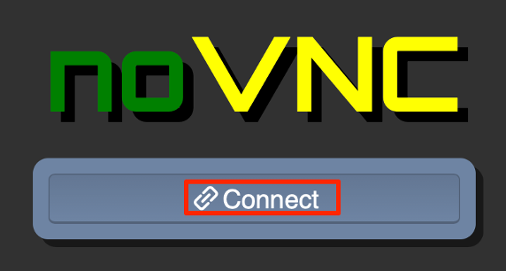

3.	Enter the password you obtained from the Reservation Details page and click **Send Password**.

    

    The VM desktop is displayed.

    

    The Workstation Desktop is displayed. You execute all the lab tasks on this VM.

#### 6.2 Access the WebSphere Application Server console

In this task, you log in to the Admin Console of WebSphere Application Server version 9.0.0.11.

1.	Start WebSphere Application Server

    In the Workstation VM, we have a local WebSphere Application Server V9 which hosts several applications. 
    
    To start the WAS server:
    
    a. Open a terminal window by clicking **Applications**>**Terminal**.
    
    

    b. In the terminal window, issue the command below to start the WAS V9 ND server.

    ```
    /home/ibmdemo/app-mod-labs/shared/startWASV9.sh
    ```
    
    Within a few minutes the WAS ND server is ready.

    c. Access the WAS Admin Console to view the application deployed by clicking **Applications**>**Firefox** to open a browser window.

    

    d. From the web browser window type the WebSphere Integrated Solution Console URL as: **https://localhost:9044/ibm/console** and press **Enter** to launch the WAS console.

    e. In the WAS Admin Console login page, enter the User ID and Password as: **wsadmin**/**passw0rd** and click **Login**. 

    f.	On the WAS Console page, click **Applications** -> **Application Types** -> **WebSphere enterprise applications** to view the applications deployed.
 
    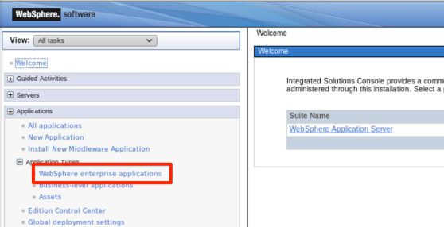

    The Enterprise Applications list is displayed. You can see all applications deployed to the WAS server. 

    
 
#### 6.3	View the Liberty Readiness Analysis Tool

In this task, you explore the features of the Liberty Readiness Analysis Tool. The tool can be configured to include and exclude specific packages from its analyses. By default, the tool is configured to exclude Java EE and some third-party packages from its analyses, which you can edit for your particular situation and add custom application class packages to the Include packages field ensures they are part of the evaluation. Additionally, you can select the target version of Java SE that you expect to use as the runtime for WebSphere Liberty. The default is set to IBM Java 8, but options are also available for IBM Java 7, Oracle Java 7 or 8, and OpenJDK11 with Eclipse OpenJ9 or Hotspot. It is important to note here that support for running Liberty with Java SE 7 will end after September 2019. 

1. As you can see in the Enterprise Application page, the Liberty Readiness Analysis tool is added to this version of WAS Admin Console.  Click the **Analyze** dropdown menu.
 
    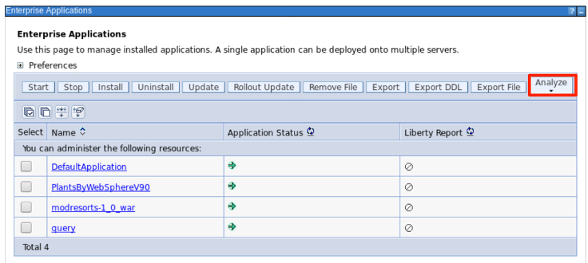
 
    From dropdown menu, you see the four key operations of this tool.
 
    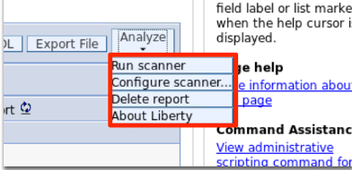

    These operations are:
    *	Run scanner – launches the WAS Migration Binary Scanner to analyze and evaluate the selected enterprise application and to create the evaluation report.
    *	Configure scanner – changes or modifies the WAS Migration Binary Scanner settings to include or exclude java packages to be scanned and set the target Java runtime.
    *	Delete report – removes the evaluation report created by the scanner.
    *	About Liberty – introduces the WebSphere liberty server.

#### 6.4	Configure the Liberty Readiness Analysis Tool

In this task, you are going to learn how to configure the Liberty Readiness Analysis Tool.

1. Click the **Configure scanner** operation from the Analyze dropdown menu.

    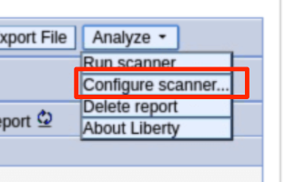 

    This takes you to the Configure scanner panel.
 
2. As you can see, in this configure panel, you can you can add or remove java package to be scanned, set up the Target Java runtime, or reset the default configuration values. Click the Target Java dropdown menu to see the list of the target Java runtimes.

    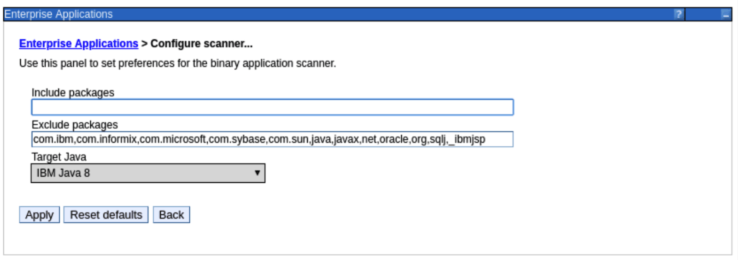 

3. In this lab, we are going to use the default IBM Java 8 as our target Java runtime, so click the **IBM Java 8** to set it as the target Java and to close the dropdown menu, then click **Back** to go back to the Enterprise Applications panel.

    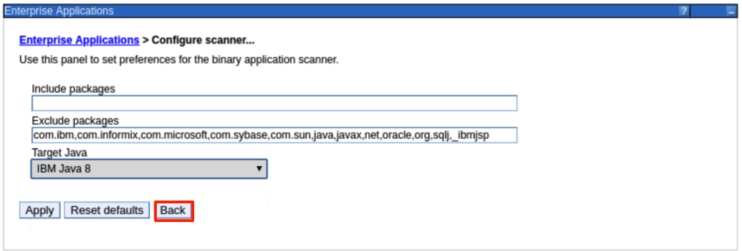

#### 6.5	Run the scanner against selected applications

In this task, you scan selected enterprise applications from the list. You submit a scan request to analyze the selected applications for migration readiness to WebSphere Liberty. Upon completion of the scan, a summary of the results is displayed. Applications that are ready to move to Liberty are tagged with a green icon with a checkmark. Applications that might need attention before moving to Liberty are flagged with one or more other icons. When the scanner detects APIs that are not available in Liberty or there are behavioral changes that can break an application, they are labeled severe issues and flagged with a red circular icon with a backslash mark. If the scanner detects APIs or behavioral changes that needs further evaluation because they might break an application, they are labeled warnings and flagged with a yellow triangular icon with an exclamation mark. Deprecated APIs or minor behavioral changes that should not affect most applications are labeled informational and flagged with a blue square icon with a lowercase i.

1. From the enterprise application list, check the box next to the **PlantsByWebSphereV90** application to select it. The application is the famous PlantsByWebSphere application.

    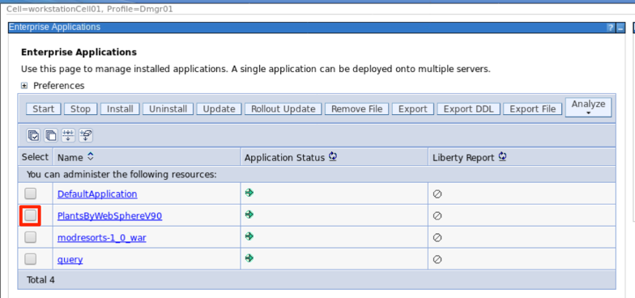

2.	Select the **Run scanner** operation from the **Analyze** dropdown menu.
 
    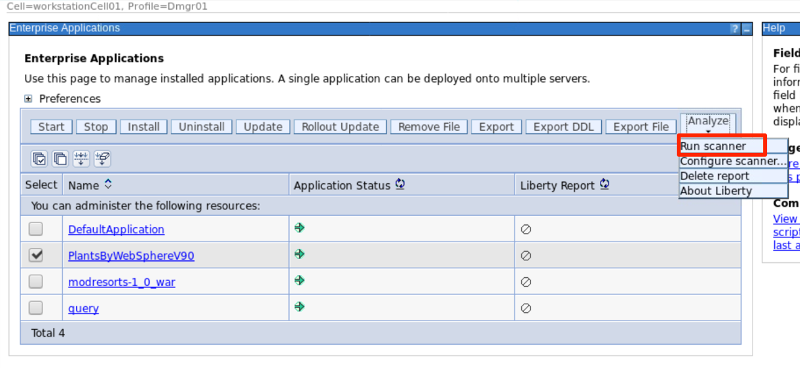

3.	You see the message “Scan submitted” in the Liberty Report section.

    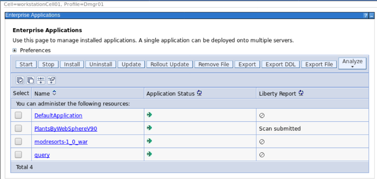
4.	After a few minutes, the report is in ready for review status.  If not, click the Refresh icon.

    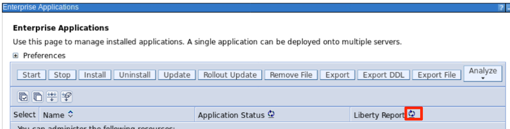
 
    The scan evaluation report is ready for review. The green check icon next to the report indicates that the application is a good candidate to be moved to Liberty server.
 5.	Perform the same operation on the **query** application. 

    a. Check the box next to the **query** application.
    b. Select the **Run scanner** operation from the **Analyze** dropdown menu.
    c. Click the **Refresh** icon

    You see the output like this:

    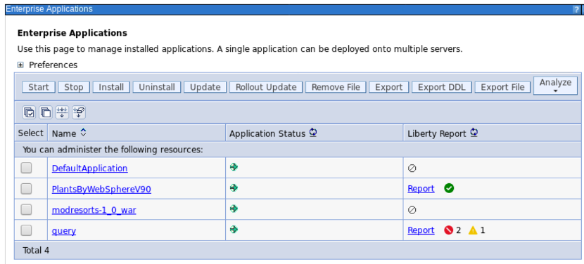
 
6. In the Liberty Report section, the red backward slash icon next to the **query** application report represents severe issues and the yellow exclamatory icon represents the warnings. It indicates that if you want to migrate the application to Liberty server, you face two severe issues and one warning.

#### 6.6	Review the evaluation reports 

In this task, you review the evaluation reports you created in the task above and learn more details about the migration assessment.

1.	Look at the report for the **query** application first.  

    a. Click the **query** application Report link in the Liberty Report section.
 
    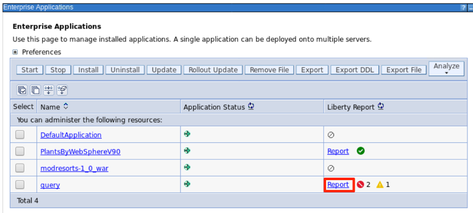

    The Application Migration Report is displayed.
 
    The report consists of three sections, including
    *	Technology Evaluation Summary - indicates which IBM Platforms are a good fit with the technologies used by the application.
    *	Migration Rule Severity Summary - shows how many rules were flagged and the number of times each was encountered.
    *	Application Migration Details - is divided into four sections: 1).	Technology Evaluation - provides a table of the technologies detected and matching IBM platforms. Technologies that are not supported are linked to analysis rules listed in the Detailed Migration Analysis section. 2).	Detailed Migration Analysis - where all the flagged rules are listed along with rule specific help information. It even identifies the file names and line numbers where the rule infractions were detected. 3).	Inventory - provides a high-level view of the content and structure of the application. 4). Liberty Feature List - contains a list of all the required features for the application in the Liberty server.xml configuration file.

    b.	View the Technology Evaluation Summary.

    The Technology Evaluation Summary shows which editions of WebSphere Application Server are best suited to run the selected application. it provides a list of Java EE programming models that are used by the application, and it indicates on which platforms the application can be supported.
 
    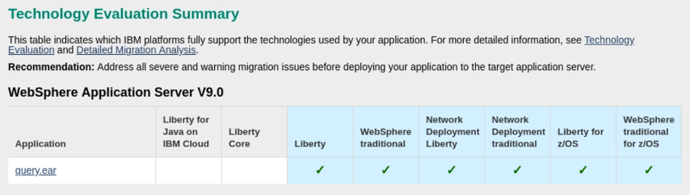

    As you can see from the summary table, the query application is not supported by Liberty for Java on IBM Cloud and Liberty Core platforms.

    c.	Click the vertical scroll bar on the right to go to the Migration Rule Severity Summary section and review it.

    The Migration Rule Severity Summary lists all issues, their severity levels, migration rules used and their descriptions. 
 
    

    In the summary report, two severe level issues and one warning level issue are identified.  Their detail analysis report can be found in the Detailed Migration Analysis section of the report. Jump links are available in the LABEL column for accessing the detailed info.

    d. The Application Migration Details section which contains four sub sections: Technology Evaluation, Detailed Migration Analysis, Inventory and Liberty Feature List.  Click Expand all to expand all sub sections.
 
    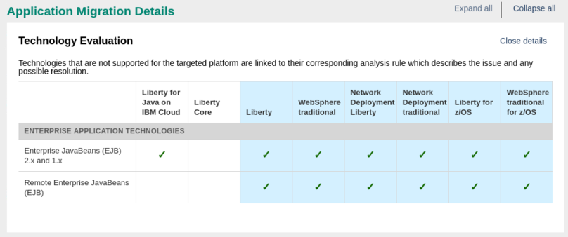

    e. Review the Technology Evaluation section.

    The section lists all the Java programming models that the application uses and whether those models are supported by a specific WebSphere platform. This information is used to determine whether a WebSphere product is suitable for the application to migrate to.
 
    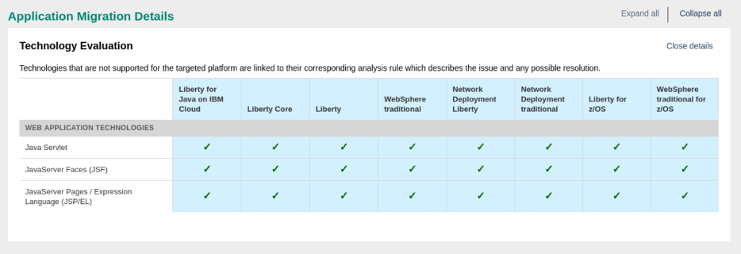

    
    The scanner identifies that the query application uses EJB, which is not supported on Liberty Core platform.  The application also uses Remote EJBs, which are not supported on both Liberty for Java on IBM Cloud and Liberty Core platforms. 

    f. Scroll to the Detailed Migration Analysis section and review it

    This section shows all the issues that were found at the code level in a specific class file and specific line. You can see the Java technology issues that were identified based on different migration rules. 
 
    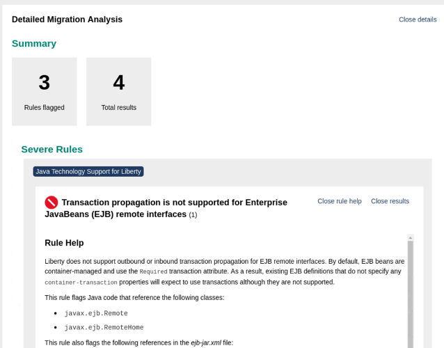
    
    As shown in the report, three migration rules are flagged, and four results are identified regarding to the Remote EJB and the EJB Query API as well as the EJB blinding locations. This information helps developers to pinpoint where the issue is. The report also provides Rule Help to assist developers to work around the issue.

    g. Scroll down to review the severe rule number 2.
 
    

    h.	Scroll down to review the Additional Rule Help section.
 
    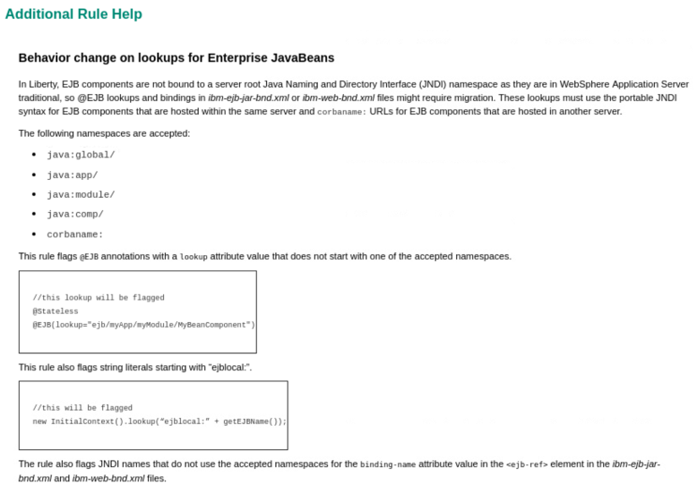

    i.	Scroll down to the Rule Analyzed section and review it.
 
    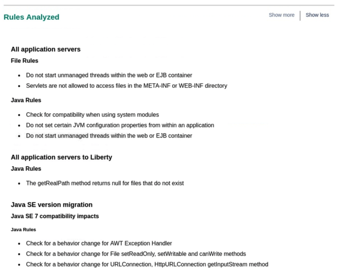

    This section lists all migration rules used to analyze the app.

    j. Scroll down to the Inventory section and review it.

    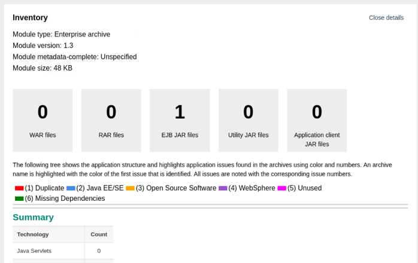

    This section shows the contents of the application, such as how many WAR, RAR, servlets, JSPs, EJBs, and utility JAR files it uses, and what their relationships are. It also lists any potential deployment problems as well as suggested solutions. This information is useful to estimate the effort that is required for your migration project.

    k.	Scroll down to review the potential deployment problems and their detail descriptions.
 
    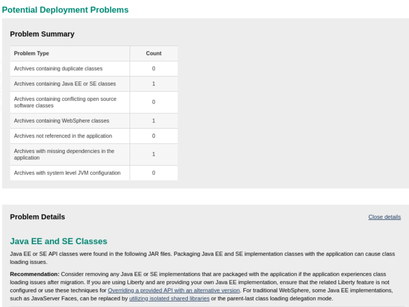

    l.	Scroll down to review the Contained Archives.

    
 
    This section list different java technologies contained in the application archive package.

    m.	Scroll down to the end of the report to review the Liberty Feature List.
    
    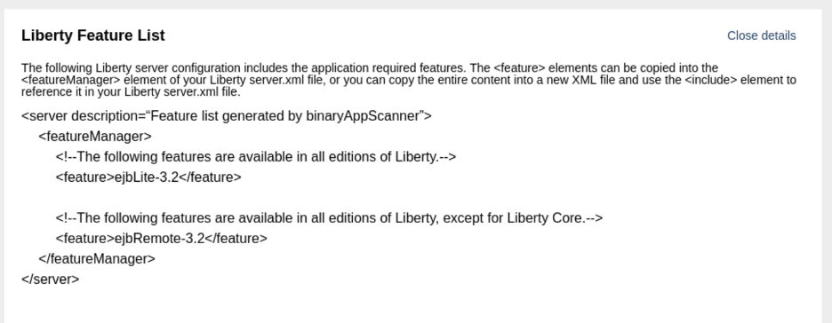
    
    The Liberty Feature List contains the application required Liberty features which should be included in the Liberty server.xml configuration file.
 
    After reviewing the query application analysis report, we know that significant development effort is required if we want to move this application to Liberty server, therefore it is not a good migration candidate. 

    m.	 Scroll up and click Back to close the report.
 
    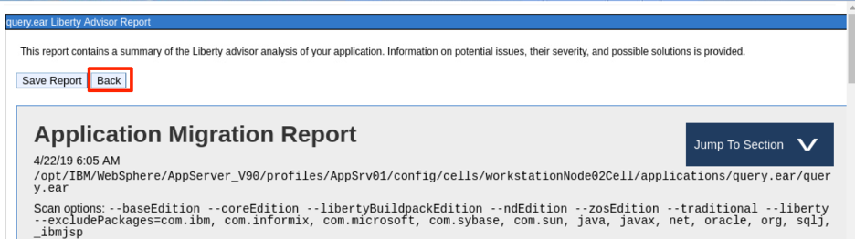

2.	Now you look at the report for the **PlantsByWebSphere** application.  
    a. Click the PlantsByWebSphereV90 application Report link.

   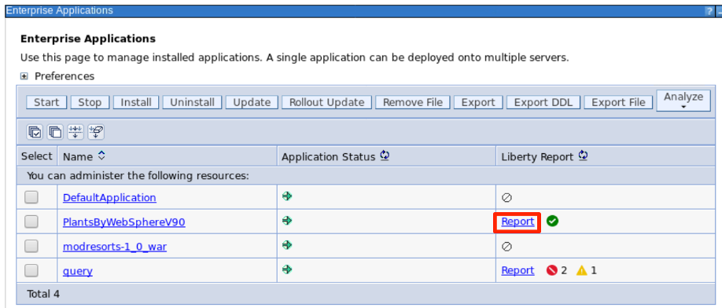 

    The Application Migration Report is displayed.

    The evaluation report shows the application is supported on all available IBM WebSphere platforms. 

    b. Click **Jump To Section** -> **Technology Evaluation** to go to the Application Migration Details/Technology Evaluation section.
 
    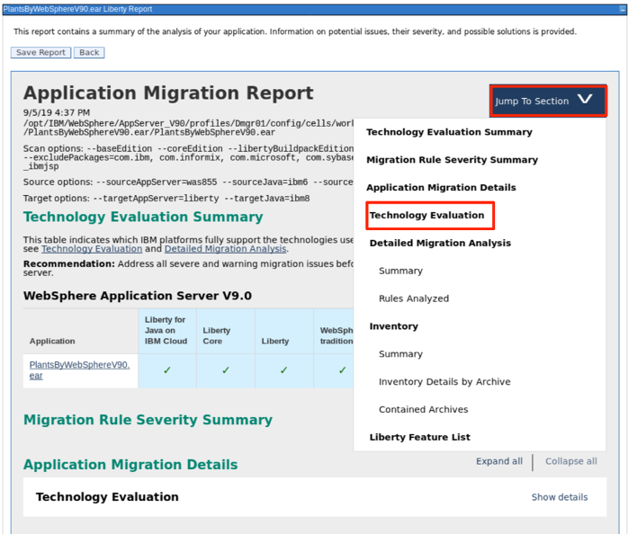

    The section lists three Java programming models that the application uses, and all those models are supported by the IBM WebSphere platforms. This means the application is suitable for migrating to Liberty.
 
    c. Scroll down to review the other sections and you see that there is no issues and problems identified, which indicating that the application is a good candidate to be moved to Liberty.

    
    
    d. Scroll down to the bottom of the page to review the Liberty Feature List.  The scanner has determined that four Liberty features are used to support the application runtime, including cdi-1.0, jsf-2.0, jsp-2.2 and servlet-3.0.
 
    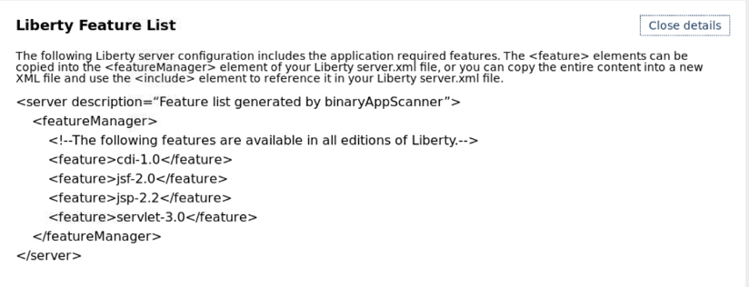

3. Scroll up to the top of the report and click **Back**.

#### 6.7	Delete the evaluation report 

The evaluation reports created by the tool can be deleted by selecting one or more applications from the enterprise applications collection. Additionally, when applications are uninstalled or redeployed, the migration reports for those application automatically get deleted. This is done to avoid there being a mismatch between the information contained in a migration report and the version of the application that is available in the admin console. 

1.	Check the box next to the **PlantsByWebSphere** application to select it.

    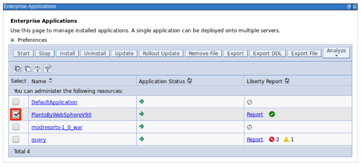

2.	Check the box next to the query application to select it.
3.	Click the **Analyze** dropdown menu and select **Delete report** operation.
 
    The analysis reports are deleted.

    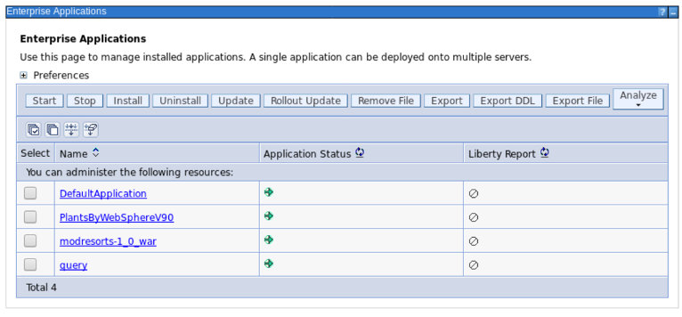
 
#### 6.8 Learn more about Liberty

You can use the **About Liberty** operation to get more detail information about Liberty server.

1.	Click the **Analyze** dropdown menu and select **About Liberty** operation.
  
    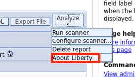

    This takes you to the About Liberty page.

    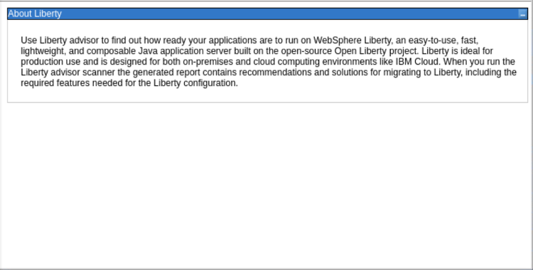
 
### 7. Summary

In this lab, you have learned the Liberty Readiness Analysis, a new add-on feature to WAS version 9.0.0.11 and how to use it to evaluate existing WebSphere workloads for moving to cloud right inside the WAS Admin Console.

For applications that have a green checkmark and are ready for Liberty, go ahead and try running them on either [Open Liberty[(http://openliberty.io/) or [WebSphere Liberty](http://wasdev.net/). Alternatively, you can use [Transformation Advisor](http://ibm.biz/CloudTA) to start planning the migration of the applications to WebSphere Liberty, moving them into containers, and even deploying to either IBM Cloud or OpenShift. Transformation Advisor helps by generating some of the necessary artifacts such as Liberty server.xml file with a features list and some migrated configuration information, Docker files for containerization, as well as OpenShift operator and deployment YAML for Kubernetes deployment.

For applications that need to be updated before moving to Liberty and you have the source code available, add the [WebSphere Application Server Migration Toolkit](http://ibm.biz/WAMT4Eclipse) to your Eclipse development environment. This toolkit analyzes application source code and generates the same report as Liberty Readiness Analysis but from within your Eclipse IDE so that changes can be made quickly and easily. WebSphere Liberty can be run directly from within the Eclipse IDE too, making it all that much easier to verify that your application runs as expected.

As a part of IBM application Modernization solutions in IBM Cloud Pak for Applications, Liberty Readiness Analysis enables traditional WAS administrators and developers to analyze their deployed applications from within the administrative console and get a report with the issues, warnings, and best practices for moving them to WebSphere Liberty. To learn more about IBM application Modernization solutions, please visit [Cloud Pak for Applications](https://www.ibm.com/cloud/cloud-pak-for-applications).

Congratulations! You have successfully completed the lab “Liberty Readiness Analysis Introduction”.

