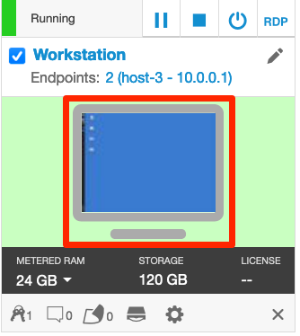
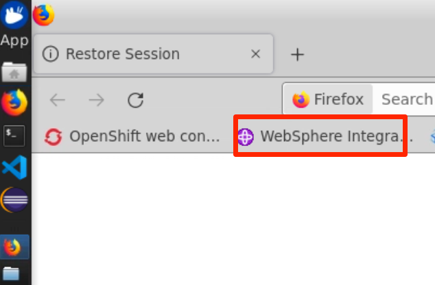
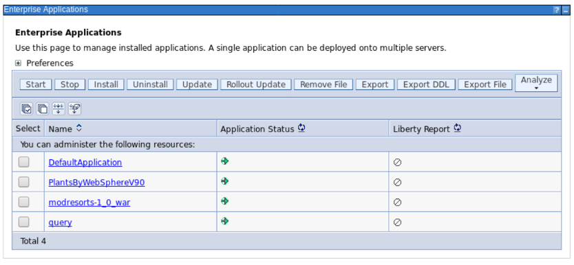

This lab exercise is a part of the Application Modernization lab series which focus on the evaluation, re-platforming and re-hosting application modernization approaches and other application modernization related solutions. In Part 1 of the Application Modernization Journey (Lab **AM0100**), you go through the process to evaluate the existing On-Prem Java applications and to identify the candidate to be moved to the cloud using the IBM Cloud Transformation Advisor.  This lab showcases the re-platform process. Re-platform uses Lift, Modify and Shift approach to move an existing application the cloud. In this lab, you learn how to package a selected candidate Java application to Liberty container without any application code change and to deploy it to a Red Hat OpenShift Container Platform (OCP) cluster using the Transformation Advisor Migration Bundle tool. 

IBM Cloud Transformation Advisor (**Transformation Advisor**) is one of the tools included in the IBM Cloud Paks.  It is a developer tool helping you quickly evaluate on-premises Java EE applications and to prepare the apps for a rapid cloud deployment. The tool identifies the Java EE programming models in the application, help determine its complexity by listing a high-level inventory of the content and structure of the application, highlight Java EE programming models and WebSphere API differences between the WebSphere profile type and show any Java EE specification implementation differences that could affect the app. You can use this tool in your move in the cloud journey to quickly analyze on-premise WebSphere apps without accessing source code and to prepare the apps for a rapid cloud deployment.

### 1.	Business Scenario

As shown in the image below, your company has a web application called Mod Resorts, a WebSphere application showing the weather in various locations. Your company wants to move this application from on-premises to the cloud.


As a tech lead, you have already analyzed the application using the Transformation Advisor tool in Part 1 of the lab series.  Based on the analysis you know that you can move this application from the traditional WebSphere Server environment to a light-weighted Liberty server environment without any code change.  Now you are planning to use the Transformation Advisor migration plan to create the migration bundle, to containerize the application, and to deploy the Docker container to an OCP cluster environment.

### 2.	Objective

The objectives of this lab are to:

* learn how Transformation Advisor can accelerate application migration to cloud process, minimize errors and risks and reduce time to market
* learn how to deploy the application to an OpenShift cluster environment using the migration bundle created by Transformation Advisor

### 3.	Prerequisites

The following prerequisites must be completed prior to beginning this lab:
*	Familiarity with basic Linux commands
*	Have internet access
*	Have a SkyTap App Mod Lab environment ready

### 4.	What is Already Completed

A six Linux VMs App Mod Lab environment has been provided for this lab. 
 
  

*	The Red Hat OpenShift Container Platform (OCP) v4.6, is installed in 5 VMs, the master1 VM, the master2 VM, the master3 VM, the dns VM and the nfs VM, with 3 master nodes and 3 compute nodes (the master nodes are serving as computer nodes as well).
*	The Workstation VM is the one you will use to access and work with OCP cluster in this lab.
  The login credentials for the Workstation VM are:
  * User ID: **ibmdemo**
  * Password: **passw0rd**
  
  Note: Use the Password above in the workstation VM terminal for sudo in the Lab.
*	The CLI commands used in this lab are listed in the **Commands.txt** file located at the **/home/ibmdemo/add-mod-labs/am0200st** directory of the Workstation VM for you to copy and paste these commands to the Terminal window during the lab.

### 5.	Lab Tasks

During this lab, you complete the following tasks:

* Review the on-premises WebSphere application
* Upload Application Data into Transformation Advisor
* Create Migration Bundle
* Update the Migration Bundle
* Testing the Migration Bundle Locally (Optional)
* Containerize Liberty Application
* Deploy the Application to OpenShift

### 6.	Execute Lab Tasks

#### 6.1 Log in to the Workstation VM and get started 
1.  If the VMs are not already started, start them by clicking the play button for the whole group.

  


2.	After the VMs are started, click the Workstation VM icon to access it. 

  

  The Workstation Linux Desktop is displayed. You execute all the lab tasks on this workstation VM.

3.	If requested to log in to the Workstation OS, use credentials: **ibmdemo**/**passw0rd**
4. Open a terminal window by clicking its icon from the Desktop toolbar.

  
5. If this is your first time to run the lab series in this lab environment, do the following, otherwise if you have already downloaded the lab materials in other labs, you can skip this step.
  
  a. In the terminal window, run the following command to get the lab materials.

  ```
  /home/ibmdemo/get-lab-materials.sh
  ```

  Sample output

  ```
  Cloning into 'app-mod-labs'...
  warning: redirecting to https://github.com/wtistang/app-mod-labs.git/
  remote: Enumerating objects: 5693, done.
  remote: Counting objects: 100% (185/185), done.
  remote: Compressing objects: 100% (118/118), done.
  remote: Total 5693 (delta 53), reused 184 (delta 53), pack-reused 5508
  Receiving objects: 100% (5693/5693), 277.71 MiB | 57.39 MiB/s, done.
  Resolving deltas: 100% (2250/2250), done.
  Checking out files: 100% (6120/6120), done.
  ```
  
  The lab materials is downloaded to the **/home/ibmdemo/app-mod-labs** directory.
  
6. Open **File Manager** by clicking its icon on the Desktop toolbar.

  

7. Navigate to **/home/ibmdemo/app-mod-labs/am0200st** directory and click to open **Commands.txt** file in the text editor.

  

  This file contains all commands used in the lab.  When you need to any command in a terminal window in the future tasks, you should come back to this file and copy/paste the command from this file, this is because you cannot directly copy and paste from your local workstation to the SkyTap workstation.

#### 6.2 Review the on-premises WebSphere application (skip this step if you are using your own workstation)

In this task, you take a look at Mod Resorts application deployed to the local WebSphere Application Server (WAS) environment. You are going to move this application to the cloud using Open Liberty Operator later.

1.	Start WebSphere Application Server

    In the workstation VM, you have a local WebSphere Application Server V9 which hosts the Mod Resorts application. 

    To start the WAS server:

    a.	In the terminal window, issue the command below to start the WAS server.
    
    ```
    /home/ibmdemo/app-mod-labs/shared/startWAS.sh
    ```
    Within a few minutes the WAS server is ready.

    b.	Access the WAS Admin Console to view the application deployed by clicking the web browser icon on the Desktop toolbar to open a browser window.
 
    

    c.	From the web browser window and click WebSphere Integrated Solution Console bookmark to launch the WAS console.
 
    

    d.	In the WAS Admin Console login page, enter the User ID and Password as: **wsadmin**/**passw0rd** and click **Login**. 

    e.	On the WAS Console page, click **Applications** -> **Application Types** -> **WebSphere enterprise applications** to view the apps deployed.
 
     

    In the Enterprise Applications list, you can see all applications deployed. The Mod Resorts application is in the list, currently it is running.
 
    

2.	View the Mod Resorts application

    a. From the web browser window, click new Tab to open a new browser window. Type the Mod Resorts application URL: **http://localhost:9080/resorts/** and press **Enter**.

    The Mod Resorts application home page is displayed.

    

    b. Click **WHERE TO?** dropdown menu to see the city list.

    
 
    c. Click **PARIS, FRANCE** from the list, it shows the weather of the city.

        
 
    Now you have reviewed the application, next you use Transformation Advisor to analyze this application to see if it is good candidate to be moved to the cloud.

#### 6.3	Access Transformation Advisor

The Transformation Advisor is installed on the OCP cluster.  In this lab, you use the following steps to access it.

1. From web browser window, click the IBM Cloud Transformation Advisor bookmark and log in to your IBM Cloud account with your credentials.
 	
     

2. If prompted to log in to Red Hat OpenShift Container Platform, click **htpasswd** field. Then log in with **ibmadmin**/**engageibm** as the username and password.
 
     

     

    The Transformation Advisor home page is displayed.

    
 
6.4	Upload Application Data into Transformation Advisor

The Transformation Advisor can evaluate any Java based applications and help to package the good candidate application to move to cloud. In AM0100 of this lab series, you have demonstrated how to use the tool to evaluate the on-premises WebSphere application, Mod Resorts, and have determined that it is suitable to move this application to cloud without any code change. Now you need to move forward to create the application migration bundle with the Transformation Advisor. 

If you have completed Lab **AM0100** with this lab environment, you already have the application data loaded to the Transformation Advisor, you can skip this task and move to the next one. Otherwise continue to execute the procedures below to load the application data to Transformation Advisor first.

1. In the Transformation Advisor page, you first create a new workspace by entering the workspace name as **Evaluation** and then clicking **Next**.
 
   

    Note: A workspace is a designated area that houses the migration recommendations provided by Transformation Advisor against your application server environment. You can name and organize these however you want, whether it’s by business application, location or teams. 

2. Enter the collection name as **Server1** and click **Let’s go**.
 
    

    Note: Each workspace can be divided into collections for more focused assessment and planning. Like workspaces, collections can be named and organized in whatever way you want.

3. Once the Workspace and Collection are created, you get the data collection options page.  You can either download the Data Collector utility and run it against your application server, or upload an existing data file. In this lab, you are going to use the upload option. Click **Upload data** to go to the upload page.

     

4. Click Drop or Add File.

  
 
5. Navigate to **/home/ibmdemo/app-mod-labs/shared** directory, select **AppSrv01.zip** file and click **Open**.

   

6. Click **Upload**.

  

  Within a few minutes, the application data is uploaded to the Transformation Advisor. You see all applications deployed to the WAS server listed.
 
  

  The Transformation Advisor provides all migration recommendations for all applications deployed to the WAS server based on the specified source and target environments. 

  On the **Recommendations** page, the identified migration source environment is shown in the **Source environment** section, and the target environment is shown in the **Preferred migration on Cloud Pak for Applications** section. The data collector tool detects that the source environment is your **WebSphere Application Server ND AppSrv01** profile. The target environment is **Compatible Liberty Runtime**, which is the default target environment.

  The Recommendations page also shows the summary analysis results for all the applications in the AppSrv01 environment to be moved to a Compatible Liberty Runtime environment. For each application, you can see these results:
    * Name
    * Migration Target
    * Complexity
    * Dependencies
    * Issues
    * Estimated development cost in days

  For example, if you want to move the **modresorts-1_0_war.ear** application to Liberty on OpenShift, the complexity level is Simple which indicates that the application code does not need to be changed before it can be moved to cloud. The application has no dependency, has two minor level issues and the estimated development effort is 0 day with no code change.

#### 6.5 Create Migration Bundle

Transformation Advisor has the ability to use the imported application analysis data to generate a migration bundle for the specified application and target environment to accelerate the migration process while minimizing the errors and risks. You use it to create our migration package for moving the Mod Resorts application to Liberty container on OpenShift cluster environment.

1. Click the action icon in **modresorts-1_0_war.ear** application row. 

    
2. Select the **View migration plan** action.

  
 
3. Transformation Advisor is now starting to prepare the migration bundle package for the application. It quickly prepares a migration bundle package with several required key files created from the application data collected from the WAS server, including server.xml, pom.xml, OpenShift Operator resource files and Dockerfile. However, it needs a few more application specific dependencies like the application runtime binary file and other library files, like database driver file the application is using.  For the Mod Resorts application, it only needs the application runtime binary file. Select **Binary** option, **Don’t use Accelerator for Teams** option, and **Manual upload** option, then click **Drag or add file** in Application binary row.

    
4. Navigate to **/home/ibmdemo/app-mod-labs/shared** directory, select **modresorts-1.0.war** file and click Open to add the file to the bundle.
 
   

    Once the file is added, your application migration bundle is completed and ready for use.
    
    If you are sure that no more changes are needed for the migration bundle, you can push it to your GitHub repository and use your delivery pipeline to deploy it to cloud.
    
    In this lab, you are going to make a few changes and deploy the bundle manually.

#### 6.6 Update the Migration Bundle

After the migration bundle is created, you need to do one additional update.

1. Click **Download** to download it to the local machine.

   

2. Select **Save File** and click **OK**.

   

  Your migration bundle is downloaded to **/home/ibmdemo/Downloads** directory.

3. After the migration bundle is downloaded, Open **File Manager** and navigate to the **/home/ibmdemo/Downloads** directory.

   
5.  Right click the migration bundle zip file and select **Extract Here**

   

  The bundle pack is extracted to the **/home/ibmdemo/Downloads/modresorts10war_migrationBundle** directory.
 
6.  Navigate to the **modresorts10war_migrationBundle** directory, you see the all files in the migration bundle package. 

   

  There are four key files you needed to build your WAS Base server container image:
    * src/main/liberty/config/server.xml - contains the Liberty server configuration for the application you are migrating. It configures application dependencies such as database connections and messaging. 
    * Dockerfile - this multi-stage file first downloads the application binary and dependencies (if specified), and then builds a docker image which includes your application configured in Liberty.
    * pom.xml – the file contains information about the project and configuration details used by Maven to build the project. In the case of a binary project generated by Transformation Advisor, it may contain coordinates for application binaries and dependencies.
    * target/application runtime – the ear or war file of your application.
    * Operator resources - deploy and manage your migrated application on OpenShift Container Platform.

11. Navigate to the **modresorts10war_migrationBundle/src/main/liberty/config** directory, open the Liberty **server.xml** file to the file editor by double-clicking it.
12. Comment out the **webApplication** element and click **Save** to save the changes.

  
 
#### 6.7 Testing the Migration Bundle Locally (Optional)

Now you have the Mod Resorts application migration package. In general, before deploying any application to the OpenShift cluster, you need to deploy it to a local Liberty server for testing first. To save time, you can skip this task, but the task steps are documented here for your reference.

1. Go back to the terminal window and issue the command below to stop the WAS server.

  ```
  sudo /opt/IBM/WebSphere/AppServer/profiles/AppSrv01/bin/stopServer.sh server1
  ```
  When prompted, enter the sudo password as: **passw0rd** and enter the WAS username and password as: **wsadmin**/**passw0rd**.
2. Create a Liberty server named **server1** in the Liberty installation directory to test the application:

  ```
  /home/ibmdemo/app-mod-labs/shared/wlp/bin/server create server1
  ```

3. Copy the application binary file in the migration bundle target directory to the **apps** directory of the Liberty server:

  ```
  cp /home/ibmdemo/Downloads/modresorts10war_migrationBundle/target/*.war /home/ibmdemo/app-mod-labs/shared/wlp/usr/servers/server1/apps/
  ```

4. Copy the **server.xml** file to the Liberty server:

  ```
  cp /home/ibmdemo/Downloads/modresorts10war_migrationBundle/src/main/liberty/config/server.xml /home/ibmdemo/app-mod-labs/shared/wlp/usr/servers/server1/server.xml
  ```

5. Start the Liberty server:

  ```
  /home/ibmdemo/app-mod-labs/shared/wlp/bin/server start server1
  ```
6.	Check the Liberty logs to confirm that your application has started correctly and to find the application URL for access:

  ```
  cat /home/ibmdemo/app-mod-labs/shared/wlp/usr/servers/server1/logs/messages.log
  ```

  You see from the log message the application is available with a URL like **<span>http://</span>localhost:9080/resorts**.

7. In the web browser window, type the application as: **localhost:9080/resorts**, and press **Enter**.  You are be able to access the application from the local Liberty server.

#### 6.8 Containerize Liberty Application

In this task, you containerize the application. You first create a Liberty Docker image that has the Mod Resorts application installed and configured, and then you test the image to confirm that it is operating correctly.

1. From the terminal window issue the command below to stop the Liberty server and to free the port:

  ```
  /home/ibmdemo/app-mod-labs/shared/wlp/bin/server stop server1
  ```

2.	Go to where your migration artifacts are located and build your image from the docker file.

  ```
  cd /home/ibmdemo/Downloads/modresorts10war_migrationBundle
  docker build . --no-cache -t modresorts10war:latest
  ```
  The base Liberty image is pulled down and used to create the image that includes your migrated application.

3. Once the Docker image is built, create a container instance from the image and confirm that it is working correctly:

  ```
  docker run -p 9080:9080 modresorts10war:latest
  ```
4. If everything looks good, the container has been started and mapped to the port 9080. You can access it from your browser with this link: **localhost:9080/resorts/**.

5. After testing, press **Ctrl-C** to stop the container.

#### 6.9 Deploy the Application to OpenShift

In this step you deploy the docker image you have created to Red Hat OpenShift and create an instance of it. Before you begin, you need push the image to the OpenShift image registry.
Note: The migration artifacts generated by Transformation Advisor (specifically the operator/application/application-cr.yaml file) assume that the default Docker Registry is being used. If you choose to use a different registry, remember to update the image property in the YAML file appropriately.

1.	From the terminal window, issue the **oc login** command to login to the OCP cluster:

  ```
  oc login https://api.demo.ibmdte.net:6443
  ```

  when prompted, enter the login credentials as: **ibmadmin**/**engageibm**.
  
  Sample output:
  ```
  Authentication required for https://api.demo.ibmdte.net:6443 (openshift)
  Username: ibmadmin
  Password: 
  Login successful.

  You have access to 66 projects, the list has been suppressed. You can list all projects with ' projects'

  Using project "default".
  ``` 
  ```
6.	Create a new project (namespace) as **modresorts10war**.

  ```
  oc new-project modresorts10war
  ```
  
  Sample output:
  ```
  Now using project "modresorts10war" on server "https://api.demo.ibmdte.net:6443".

  You can add applications to this project with the 'new-app' command. For example, try:

    oc new-app rails-postgresql-example

  to build a new example application in Ruby. Or use kubectl to deploy a simple Kubernetes application:

    kubectl create deployment hello-node --image=k8s.gcr.io/serve_hostname

  ```
7.	Get OCP internal image registry URL and cluster URL with commands:

  ```
  export INTERNAL_REG_HOST=`oc get route default-route --template='{{ .spec.host }}' -n openshift-image-registry`
  export CLUSTER_URL=`echo $INTERNAL_REG_HOST | sed 's/default-route-openshift-image-registry.//g'`
  ```

8.	Log in to the OpenShift Docker registry with the command:
    
    ```
    docker login -u $(oc whoami) -p $(oc whoami -t) $INTERNAL_REG_HOST
    ```

 
9. Execute the following command to tag and push your docker image to OpenShift image repository.

    ```
    docker tag modresorts10war:latest $INTERNAL_REG_HOST/`oc project -q`/modresorts10war:latest
    docker push $INTERNAL_REG_HOST/`oc project -q`/modresorts10war:latest
    ```
    When it is done, your application docker image is pushed to the OCP cluster image registry.

10.	Verify the pushed Docker image in OCP cluster.

    a.	From the browser window, click the OCP web console bookmark to open it.
 
    

    b. If prompted to log in to Red Hat OpenShift Container Platform, click **htpasswd** field. Then log in with **ibmadmin**/**engageibm** as the username and password.
 
     

     
    
    c. From the OCP Web Console Home page, click **Builds**>**Images Streams**.
  
     
   
    d.	Change project (namespace) from **default** to **modresorts10war**.
   
     

    e.	You can see the image you just pushed is listed. Click its link to view its details.
 
     
    
    In the Image Stream Details Page Overview section, you see the public image repository you used to push the image.  Notice that the public image repository is mapped to an internal image repository which is used to deploy the application.  The internal image repository is: image-registry.openshift-image-registry.svc:5000/modresorts10war/modresorts10war.
 
     
11.	Change the cluster user from **Administrator** to **Developer**.

  
12.	Make sure that you are in the **modsorts10war** project, then from the **Topology** page, click **Container Image** to add new content (deployment) to the project using your container image.

  
13.	In the **Deploy Image** page, select the **Image name from internal registry** option, and set the **Project**, **ImageStream** and **Tag** values as **modresorts10war**, **modresorts10war** and **latest**.

  
  
14.	Scroll down to the **General** section, accept all default settings and click **Create**.

  
15.	Your application is now deployed. To view it, click the **Open URL** link.

  

  The **Open Liberty** home page is displayed in a new browser window. If you get a **Page cannot be found** error, just wait for a few more minutes for the app pod to be ready and refresh the page.

16.	Type the application context root **/resorts** to the end of the URL and press **Enter**.

  
  
  The Mod Resorts application home page displayed.

17.	Navigate through the application web pages as you did in the WAS version to verify the application deployment.

### 7.	Summary

In this lab, you have learned how to use Transformation Advisor to prepare a migration bundle for your application and to deploy it to cloud. As a part of IBM Application Modernization solutions in IBM Cloud Paks, the Transformation Advisor accelerates application migrating to cloud process, minimize errors and risks and reduce time to market. To learn more about IBM App Mod, DevOps and Day 2 Operation solutions, please continue with the rest of the lab series.

**Congratulations! You have successfully completed the lab “Modernize Java Application for Container and OpenShift with Transformation Advisor”.**