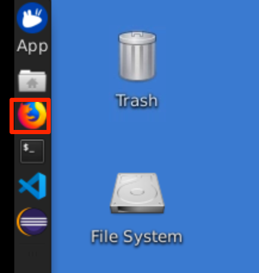
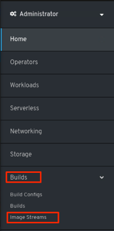

One of the solutions included in the IBM **Cloud Paks** is the Open Liberty runtime, a highly composable, fast to start, dynamic application server runtime environment for cloud-native Java microservices.

This lab exercise is a part of the Application Modernization lab series which focus on the evaluation, re-platforming and re-hosting application modernization approaches and other application modernization related solutions. In this lab, you learn another re-platform option - deploying an existing Java application to an Open Liberty container running on an IBM Red Hat OpenShift Kubernetes Service (OCP) cluster in IBM Cloud using the Open Liberty Operator. 

An Operator is an extension to Kubernetes which implements a custom controller for packaging, deployment and management of a Kubernetes application in OCP. The Open Liberty Operator deploys and manages a Java EE/MicroProfile/Spring application running on Open Liberty in a OCP cluster.

### 1.	Business Scenario

Assume that your company has a web application called Mod Resorts, depicted in the image below, a WebSphere application showing the weather in various locations. Your company wants to move this application from an on-premises standalone deployment to a cloud capable deployment.

 

As a tech lead, you have already analyzed the application using the IBM Transformation Advisor tool. Based on the analysis you know that you can move this application from the traditional WebSphere Server environment to a light-weighted Open Liberty server environment without any code change (The Transformation Advisor analysis steps are covered in the lab 1 of this lab series!). Now you are planning to deploy this application to an Open Liberty instance running on an OpenShift Kubernetes cluster. In this lab, you are going to implement this solution. The Mod Resorts application is currently deployed on-premises in the local WebSphere Application Server (WAS). You create an Open Liberty Docker image with the Mod Resorts application and deploy the Docker container to OpenShift Kubernetes cluster using the Open Liberty Operator.

### 2.	Objective

The objectives of this lab are to:
*	Obtain some knowledge of the Open Liberty Operator
*	Learn how to create an Open Liberty Docker image
*	Learn how to use the Open Liberty Operator to deploy the Open Liberty Docker container to OpenShift Kubernetes cluster.

### 3.	Prerequisites

The following prerequisites must be completed prior to beginning this lab:
*	Familiarity with basic Linux commands
*	Have internet access
*	Have a SkyTap App Mod Lab environment ready

### 4.	What is Already Completed

A six Linux VMs App Mod Lab environment has been provided for this lab. 
 
  

*	The Red Hat OpenShift Container Platform (OCP) v4.6, is installed in 5 VMs, the master1 VM, the master2 VM, the master3 VM, the dns VM and the nfs VM, with 3 master nodes and 3 compute nodes (the master nodes are serving as computer nodes as well).
*	The workstation VM is the one you will use to access and work with OCP cluster in this lab.
  The login credentials for the workstation VM are:
  * User ID: **ibmdemo**
  * Password: **passw0rd**
  
  Note: Use the Password above in the workstation VM terminal for sudo in the Lab.
*	The CLI commands used in this lab are listed in the **Commands.txt** file located at the **/home/ibmdemo/add-mod-labs/am0200st** directory of the workstation VM for you to copy and paste these commands to the Terminal window during the lab.

### 5.	Lab Tasks

During this lab, you complete the following tasks:
*	review the Mod Resorts app on local WAS server.
*	build an Open Liberty Docker image.
*	push the Open Liberty Docker image to a OCP cluster internal image registry.
*	deploy the Open Liberty container to a OCP cluster sing the Open Liberty Operator.
*	verify Open Liberty container deployment.
*	test and verify the Mod Resorts app on Open Liberty container.
*	update the Mod Resorts app deployment configuration.

### 6.	Execute Lab Tasks

#### 6.1 Log in to the workstation VM and get started 
1.  If the VMs are not already started, start them by clicking the play button for the whole group.

  


2.	After the VMs are started, click the workstation VM icon to access it. 

  

  The Workstation Linux Desktop is displayed. You execute all the lab tasks on this workstation VM.

3.	If requested to log in to the Workstation OS, use credentials: **ibmdemo**/**passw0rd**
4. Open a terminal window by clicking its icon from the Desktop toolbar.

  
5. If this is your first time to run the lab series in this lab environment, do the following, otherwise if you have already downloaded the lab materials in other labs, you can skip this step.
  
  a. In the terminal window, run the following command to get the lab materials.

  ```
  /home/ibmdemo/get-lab-materials.sh
  ```

  Sample output

  ```
  Cloning into 'app-mod-labs'...
  warning: redirecting to https://github.com/wtistang/app-mod-labs.git/
  remote: Enumerating objects: 5693, done.
  remote: Counting objects: 100% (185/185), done.
  remote: Compressing objects: 100% (118/118), done.
  remote: Total 5693 (delta 53), reused 184 (delta 53), pack-reused 5508
  Receiving objects: 100% (5693/5693), 277.71 MiB | 57.39 MiB/s, done.
  Resolving deltas: 100% (2250/2250), done.
  Checking out files: 100% (6120/6120), done.
  ```
  
  The lab materials is downloaded to the **/home/ibmdemo/app-mod-labs** directory.
  
6. Open **File Manager** by clicking its icon on the Desktop toolbar.

  

7. Navigate to **/home/ibmdemo/app-mod-labs/am0220st** directory and click to open **Commands.txt** file in the text editor.

  

  This file contains all commands used in the lab.  When you need to enter any command in a terminal window in the lab tasks, you should come back to this file and copy/paste the command from this file, this is because you cannot directly copy and paste from your local workstation to the SkyTap workstation.

#### 6.2 Review the on-premises WebSphere application (skip this step if you are using your own workstation)

In this task, you take a look at Mod Resorts application deployed to the local WebSphere Application Server (WAS) environment. You are going to move this application to the cloud using Open Liberty Operator later.

1.	Start WebSphere Application Server

    In the workstation VM, you have a local WebSphere Application Server which hosts several sample applications. 
    To start the WAS server:
    
    a. In the terminal window, issue the command below to start the WAS server.
    
    ```
    /home/ibmdemo/app-mod-labs/shared/startWAS.sh
    ```

    If prompted for **sudo** password, enter the password as: **passw0rd**.
    
    Within a few minutes the WAS server is ready.

    b.	Access the WAS Admin Console to view the application deployed by clicking the Firefox icon on the Desktop toolbar.
    
    
 
    c.	From the web browser window and click WebSphere Integrated Solution Console bookmark to launch the WAS console.

    
 
    d.  If you see the **Warning: Potential Security Risk Ahead** message, click **Advanced**>**Accept the Risk and continue**.
    
    e.	In the WAS Admin Console login page, enter the User ID and Password as: **wsadmin**/**passw0rd** and click **Login**.

    f.	On the WAS Console page, click **Applications** -> **Application Types** -> **WebSphere enterprise applications** to view the apps deployed.

    
 
    In the Enterprise Applications list, you can see all applications deployed. Next, you use Transformation Advisor to analyze these applications to identify a good candidate to be moved to the cloud.

2.	View the Mod Resorts application

    a. From the web browser window, click new Tab to open a new browser window. Type the Mod Resorts application URL: **http://localhost:9080/resorts/** and press **Enter**.

    The Mod Resorts application home page is displayed.

    

    b. Click **WHERE TO?** dropdown menu to see the city list.

    
 
    c. Click **PARIS, FRANCE** from the list, it shows the weather of the city.

        
 
    Now that you have reviewed the application, next you learn how the solution included in IBM Cloud Paks helps to move this application to the cloud.

    d. Go back to the terminal window and issue the command below to stop the WAS server.

    ```
    sudo /opt/IBM/WebSphere/AppServer/profiles/AppSrv01/bin/stopServer.sh server1
    ````
    If prompted, enter the sudo password as; **passw0rd** and WAS admin credentials as: **wsadmin**/**passw0rd**.

### 6.3	Install the Open Liberty Operator

In OCP, the Kubernetes-native applications are deployed on Kubernetes cluster and managed with the Kubernetes APIs and OCP specific API’s. A Kubernetes Operator is a custom controller in OCP, which packages, deploys and manages a Kubernetes-native application, and eases operational complexity. The Open Liberty Operator is an implementation of a Kubernetes Operator, which deploys and manages a Java EE/MicroProfile/Spring application running on Open Liberty in OCP. 

The Open Liberty Operator can be used to deploy and manage applications running on Open Liberty. You can also perform Day-2 operations such as gathering traces and dumps using the operator. 

The operator provides the following key features:
*	Routing - expose your application to external users via a single toggle.
*	High Availability - run multiple instances of your application for high availability. Either specify a static number of replicas or easily configure auto scaling to create (and delete) instances based on resource consumption.
*	Persistence - enable persistence for your application by specifying storage requirements.
*	Serviceability - easily use a single storage for serviceability related operations, such as gathering server traces or dumps.
*	Service Binding - easily bind to available services in your cluster.
*	Knative - deploy your serverless application on Knative using a single toggle.

The architecture of the Open Liberty Operator follows the basic controller pattern: the Operator container with the controller is deployed into a Pod and listens for incoming resources with a Kind: OpenLibertyApplication. The operator introduces relies on an OpenLibertyApplication custom resource definition (CRD). Then applying an OpenLibertyApplication custom resource (CR) triggers the Open Liberty Operator to create, update or delete Kubernetes resources needed by the application to run on your cluster.

In this lab, you use the following steps to install the Open Liberty Operator from the OCP Operator Hub.

1.	From the browser window, click the OCP web console bookmark to open it.
 
    

2. If prompted to log in to Red Hat OpenShift Container Platform, click **htpasswd** field. Then log in with **ibmadmin**/**engageibm** as the username and password.
 
     

     
    
3.	In the OpenShift Web Console page, click **Operators**>**OperatorHub**.

     
4.	The OperatorHub page is displayed, change Project to openshift-operator.

     
5.	Enter liberty in the Filter field.

     
6.	Click **Open Liberty Operator** icon to install it.

     
7.	Click **Install** to start the process.

     
8.	In the next page, click **Subscribe**.

     

    The Open Liberty Operator is now installed, and the Custom Resource Definitions used by the operator are deployed.

    In order to deploy an Open Liberty application to a OCP cluster with the Open Liberty Operator, you need:
    *	An Open Liberty Image
    *	An Open Liberty Operator CR

#### 6.4	Build an Open Liberty Docker Image.

The IBM Cloud Paks has a tool called Transformation Advisor, which can be used to analyze your existing java applications and evaluate the efforts to move them to cloud. The analysis of the Mod Resorts application is covered in lab **AM0100** of this lab series. The analysis report shows that the Mod Resorts application can be directly moved the Open Liberty server in a Docker container without any code change. In this task, you are going to build an Open Liberty Docker image containing the Mod Resorts application. 
The Dockerfile is the key file you needed to build your Docker image. It defines how the Docker image that has the Mod Resorts application and configuration pre-loaded is built.

1.	Review the Dockerfile file.

    a. From the **File Manager** window nvigate to **/home/ibmdemo/app-mod-labs/am0220st/appmod-resorts/** directory.

    
    c. Double click the **dockerfile** to open it in the Text editor for reviewing.
    
    Sample output:
    ```
    FROM openliberty/open-liberty:javaee8-ubi-min
    COPY --chown=1001:0 data/examples/modresorts-1.0.war /config/dropins
    COPY --chown=1001:0 server.xml /config/
    ```
        
    As you can see, the file defines the following activities to create the Open Liberty Docker image:
    *	Pulls the Open Liberty Java EE 8 image from Docker Hub
    *	Adds the application binary file to the base image
    *	Adds the Open Liberty server.xml file to the base image

    Note: the **server.xml** file is the Open Liberty server configuration file. In this lab, a sample server.xml is used, it contains the default Open Liberty server settings meet all the Mod Resorts application needs.
 
2.	Build the Docker image.

    a. To build the Docker image, execute the following commands in the terminal window:

    ```
    cd /home/ibmdemo/app-mod-labs/am0220st/appmod-resorts/
    docker build . -t app-modernization:v1.0.0
    ```
    
    The command above combines what is normally two steps in the image build process:
    *	Building the Docker image
    *	Tagging the image with a name that is consistent with OCP cluster registry requirements

    Sample output:
    ```
    Sending build context to Docker daemon  18.15MB
    Step 1/3 : FROM openliberty/open-liberty:javaee8-ubi-min
    ---> e8f8cc10305e
    Step 2/3 : COPY --chown=1001:0 data/examples/modresorts-1.0.war /config/dropins
    ---> 5e1ece57533c
    Step 3/3 : COPY --chown=1001:0 server.xml /config/
    ---> d94c64534e78
    Successfully built d94c64534e78
    Successfully tagged app-modernization:v1.0.0
    ```

    b. After the docker container image is created, you can issue the command below to check it:
    
    ```
    docker images | grep app-modernization
    ```
    Sample output:
    ```
    app-modernization                                                                             v1.0.0                    d94c64534e78        2 minutes ago       452MB
    ```
    c. To verify the docker image, you can create and run a local container called **modresorts-loc** with the command below:
    
    ```
    docker run --name modsorts-loc -p 9443:9443 -d app-modernization:v1.0.0
    ```

    d. Once the container is created, you can test the **Mod Resorts** application by launching it in a web browser window with the URL: **https:<span></span>//localhost:9443/resorts**.

#### 6.5	Push the Open Liberty Docker Image to OCP cluster Image Registry

After the Open Liberty Docker image is built, you need to push it to the OpenShift cluster image registry, so you can use it to deploy the Open Liberty container to OCP cluster.

1. From the terminal window, issue the **oc login** command to login to the OCP cluster:

  ```
  oc login https://api.demo.ibmdte.net:6443
  ```

  when prompted, enter the login credentials as: **ibmadmin**/**engageibm**.
  
  Sample output:
  ```
  Authentication required for https://api.demo.ibmdte.net:6443 (openshift)
  Username: ibmadmin
  Password: 
  Login successful.

  You have access to 66 projects, the list has been suppressed. You can list all projects with ' projects'

  Using project "default".
  ``` 
  ```
6.	Create a new project (namespace) as **modresorts10war**.

  ```
  oc new-project demo
  ```
  
  Sample output:
  ```
  Now using project "demo" on server "https://api.demo.ibmdte.net:6443".

  You can add applications to this project with the 'new-app' command. For example, try:

    oc new-app rails-postgresql-example

  to build a new example application in Ruby. Or use kubectl to deploy a simple Kubernetes application:

    kubectl create deployment hello-node --image=k8s.gcr.io/serve_hostname

  ```
7.	Get OCP internal image registry URL and cluster URL with commands:

  ```
  export INTERNAL_REG_HOST=`oc get route default-route --template='{{ .spec.host }}' -n openshift-image-registry`
  export CLUSTER_URL=`echo $INTERNAL_REG_HOST | sed 's/default-route-openshift-image-registry.//g'`
  ```

8.	Log in to the OpenShift Docker registry with the command:
    
    ```
    docker login -u $(oc whoami) -p $(oc whoami -t) $INTERNAL_REG_HOST
    ```
 
9. Execute the following command to push your docker image to OpenShift image repository.

    ```
    docker tag app-modernization:v1.0.0 $INTERNAL_REG_HOST/`oc project -q`/app-modernization:v1.0.0
    docker push $INTERNAL_REG_HOST/`oc project -q`/app-modernization:v1.0.0
    ```
    
    When it is done, your application docker image is pushed to the OCP image registry.

10.	Verify the pushed Docker image in OCP cluster.

    a.	From the OCP Web Console Home page, click **Builds**>**Images Streams**.
  
    
   
    b.	Change the **Project** from **default** to **demo**.
   
    

    c.	You can see the image you just pushed is listed. Click its link to view its details.
 
    

    In the Image Stream Details Page Overview section, you see the public image repository you used to push the image.  Notice that the public image repository is mapped to an internal image repository which is used to deploy the application.  The internal image repository is: **image-registry.openshift-image-registry.svc:5000/demo/app-modernization**.
 
    
 
#### 6.6	Deploy the Open Liberty Container to OCP using the Open Liberty Operator

In this task, you are going to deploy the Open Liberty container to the OCP cluster using the Open Liberty operator CR. The operator provides an easy way to quickly provision an Open Liberty container in an OpenShift Kubernetes cluster environment.

1.	Review the Open Liberty operator CR YAML file. From the File Manager navigate to **/home/ibmdemo/app-mod-labs/am0220st/appmod-resorts/deploy/apps/appmod/v1.0.0/**  directory. Double click the **app-mod_cr.yaml** to open it in Text editor for reviewing.

    Sample output:
    ```
    apiVersion: openliberty.io/v1beta1
    kind: OpenLibertyApplication
    metadata:
    name: appmod
    spec:
    stack: java-microprofile
    applicationImage: image-registry.openshift-image-registry.svc:5000/demo/app-modernization:v1.0.0
    ```

    This CR file contains the minimum required spec entries for application deployment. The CR file specifies that it is using the Open Liberty Operator CRD (OpenLibertyApplication) with an application image URL.

    For more information about the configuration parameters in the OpenLibertyApplication CR, please visit: https://github.com/OpenLiberty/open-liberty-operator/blob/master/doc/user-guide.md.

2.	Deploy the Open Liberty container.

    Use the following OpenShift CLI commands to deploy the Open Liberty container:

    ```
    cd /home/ibmdemo/app-mod-labs/am0220st/appmod-resorts/
    oc apply -f deploy/apps/appmod/v1.0.0/app-mod_cr.yaml -n demo
    ```
    Sample output:
    ```
    openlibertyapplication.openliberty.io/appmod created
    ```
    The Open Liberty container is deployed to OpenShift Kubernetes cluster demo namespace by the Open Liberty Operator.

    As you can see in the verification section next, although you just have the application image URL specified in the CR file, the Open Liberty Operator takes care of application deployment process and creates the Kubernetes service for the application automatically.

#### 6.7	Verify the Open Liberty Container Deployment

After the Open Liberty container is deployed, you can go to the OCP console to take a look at the deployment details.

1.	Go back to the OCP cluster Web Console window, select **Workloads**>**Pods**, then selection demo project.
    
    
    You can see that your application is in list and it is running.

    
2.	To view the application service, from the OCP cluster Web Console navigation menu, select **Networking**>**Services**. You see the application service is created by the Open Liberty Operator.

    
3.	To access the application URL, you need to create a route with the application service resource. from the OCP cluster Web Console navigation menu, select **Networking**>**Routes** and click **Create Route**.

    

4.	In the Create Route page, enter the following values and click Create.

    **Name** = appmod
    
    **Path** = /resorts

    **Service** = appmod

    **Target** = 9080


    

5.	The route is created, click the **Location** URL to launch the application from a new browser window.

    
 
 6.	The Mod Resorts application home page is displayed. Click **WHERE TO?** to view city list.
 
7.	Click **LAS VEGAS, USA** from the list and it shows the weather of the city.
 
### 7.	Summary

In this lab, you learned how to use Open Liberty Operator to deploy your JEE applications to cloud. As a part of IBM Application Modernization solutions in IBM Cloud Paks, the Open Liberty Operator helps users effectively deploying and managing applications running on Open Liberty containers to a Kubernetes cluster. To learn more about Application Modernization solutions, please continue with the rest of the lab series.

**Congratulations! You have successfully completed the Deploy a Java App to OCP using the Open Liberty Operator lab!**
