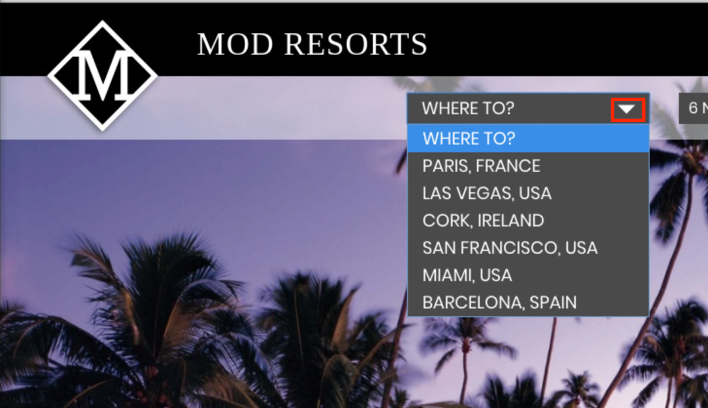
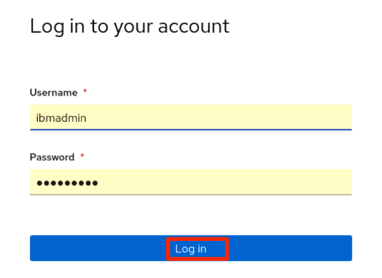

This lab exercise is a part of the Application Modernization lab series which focus on the evaluation, re-platforming and rehosting application modernization approaches and other application modernization related solutions. In Part 1 of the Application Modernization Journey (Lab AM0100), you go through the process to evaluate the existing On-Prem Java applications and to identify the candidate to be moved to the cloud using the IBM Cloud Transformation Advisor. In Part 2 of the Application Modernization Journey (Lab AM0200), you learn how to re-platform an existing WebSphere application the Liberty container and to deploy it to a Red Heat OpenShift Kubernetes Service (OCP) cluster in IBM Cloud. This lab showcases the rehost process. Rehost uses Lift and Shift approach to move an existing application to the same server environment in the cloud. In this lab, you learn how to move a selected candidate Java application from traditional WebSphere Application Server (tWAS) environment to a WAS container without any code change and to deploy it to a OCP environment.

### 1. Business Scenario

As illustrated below, your company has a web app called **Mod Resorts**, a WebSphere application showing the weather in various locations. Your company wants to move this application from on-premises (in VMs) to the cloud (in Containers) using IBM Cloud Pak for Applications.


This transition delivers improved operational efficiencies for the application by leveraging scalable cloud capabilities with IBM Cloud Pak for Applications that the enterprise currently enjoys with its cloud native applications.  
 
As a tech lead, you have already analyzed the application using the Transformation Advisor tool in Part 1 of the lab series.  Based on the analysis you know that you can move this application from the traditional WebSphere Server environment to a containerized WAS Base server environment without any code change.  

Now you are planning to package the application in WAS Base container and to deploy it to an OpenShift Kubernetes cluster environment. 

In general, by moving an application from a traditional WAS ND cell to a WAS Base container in cloud, you can take advantage of cloud to support application high availability and scalability, minimize application migration effort, reduce on-prem infrastructure and operation cost while leveraging your team’s existing WebSphere admin skill. 

### 2. Objective

The objectives of this lab are to help you:

* understand how to move a WebSphere app from an on-premises environment to the OpenShift cluster without any changes to the app code, while utilizing exiting WebSphere administration skills.
*	learn the process to create a WAS docker container.
*	get familiar with the WAS Base container on OpenShift deployment process.

### 3.	Prerequisites

The following prerequisites must be completed prior to beginning this lab:
*	Familiarity with basic Linux commands
*	Have internet access
*	Have a SkyTap App Mod Lab environment ready

### 4.	What is Already Completed

A six Linux VMs App Mod Lab environment has been provided for this lab. 
 
  

*	The Red Hat OpenShift Container Platform (OCP) v4.6, is installed in 5 VMs, the master1 VM, the master2 VM, the master3 VM, the dns VM and the nfs VM, with 3 master nodes and 3 compute nodes (the master nodes are serving as computer nodes as well).
*	The Workstation VM is the one you will use to access and work with OCP cluster in this lab.
  The login credentials for the Workstation VM are:
  * User ID: **ibmdemo**
  * Password: **passw0rd**
  
  Note: Use the Password above in the workstation VM terminal for sudo in the Lab.
*	The CLI commands used in this lab are listed in the **Commands.txt** file located at the **/home/ibmdemo/add-mod-labs/am0200st** directory of the Workstation VM for you to copy and paste these commands to the Terminal window during the lab.

### 5.	Lab Tasks
During this lab, you complete the following tasks:
*	review the Mod Resorts app on local WAS server.
*	build a WAS Base server container image.
*	push the WAS Base server container image to OpenShift image repository.
*	deploy the WAS Base server container to OpenShift cluster
*	verify WAS server deployment.
*	test and verify the Mod Resorts app on WAS container

### 6.	Execute Lab Tasks

#### 6.1 Log in to the Workstation VM and get started 
1.  If the VMs are not already started, start them by clicking the play button for the whole group.

  


2.	After the VMs are started, click the Workstation VM icon to access it. 

  

  The Workstation Linux Desktop is displayed. You execute all the lab tasks on this workstation VM.

3.	If requested to log in to the Workstation OS, use credentials: **ibmdemo**/**passw0rd**
4. Open a terminal window by clicking its icon from the Desktop toolbar.

  
5. If this is your first time to run the lab series in this lab environment, do the following, otherwise if you have already downloaded the lab materials in other labs, you can skip this step.
  
  a. In the terminal window, run the following command to get the lab materials.

  ```
  /home/ibmdemo/get-lab-materials.sh
  ```

  Sample output

  ```
  Cloning into 'app-mod-labs'...
  warning: redirecting to https://github.com/wtistang/app-mod-labs.git/
  remote: Enumerating objects: 5693, done.
  remote: Counting objects: 100% (185/185), done.
  remote: Compressing objects: 100% (118/118), done.
  remote: Total 5693 (delta 53), reused 184 (delta 53), pack-reused 5508
  Receiving objects: 100% (5693/5693), 277.71 MiB | 57.39 MiB/s, done.
  Resolving deltas: 100% (2250/2250), done.
  Checking out files: 100% (6120/6120), done.
  ```
  
  The lab materials is downloaded to the **/home/ibmdemo/app-mod-labs** directory.
  
6. Open **File Manager** by clicking its icon on the Desktop toolbar.

  

7. Navigate to **/home/ibmdemo/app-mod-labs/am0300st** directory and click to open **Commands.txt** file in the text editor.

  

  This file contains all commands used in the lab.  When you need to any command in a terminal window in the future tasks, you should come back to this file and copy/paste the command from this file, this is because you cannot directly copy and paste from your local workstation to the SkyTap workstation.

#### 6.2 Review the on-premises WebSphere application 
In this task, you take a look at **Mod Resorts** application deployed to the local WebSphere Application Server (WAS) environment. You are going to move this application to the cloud using Open Liberty Operator later.

1.	Start WebSphere Application Server

    In the Workstation VM, you have a local WebSphere Application Server which hosts several sample applications. 
    To start the WAS server:
    
    a. In the terminal window, issue the command below to start the WAS server.
    
    ```
    /home/ibmdemo/app-mod-labs/shared/startWAS.sh
    ```

    If prompted for **sudo** password, enter the appsword as: **passw0rd**.
    
    Within a few minutes the WAS server is ready.

    b.	Access the WAS Admin Console to view the application deployed by clicking the Firefox icon on the Desktop toolbar.
    
    
 
    c.	From the web browser window and click WebSphere Integrated Solution Console bookmark to launch the WAS console.

    
 
    d.  If you see the **Warning: Potential Security Risk Ahead** message, click **Advanced**>**Accept the Risk and continue**.
    
    e.	In the WAS Admin Console login page, enter the User ID and Password as: **wsadmin**/**passw0rd** and click **Login**.

    f.	On the WAS Console page, click **Applications** -> **Application Types** -> **WebSphere enterprise applications** to view the apps deployed.

    
 
    In the Enterprise Applications list, you can see all applications deployed. Next, you use Transformation Advisor to analyze these applications to identify a good candidate to be moved to the cloud.

2.	View the Mod Resorts application

    a. From the web browser window, click new Tab to open a new browser window. Type the Mod Resorts application URL: **http://localhost:9080/resorts/** and press **Enter**.
    
    The Mod Resorts application home page is displayed.

    
    
    b. Click **WHERE TO?** dropdown menu to see the city list.

    

    c. Click **PARIS, FRANCE** from the list, it shows the weather of the city.

    

    You have reviewed the application.  Next you learn how to re-platform the application in WAS container without any code change and to deploy it to an OpenShift cluster.

    d. Stop the WAS server by issuing the following command in the Terminal window:

    ```
    sudo /opt/IBM/WebSphere/AppServer/profiles/AppSrv01/bin/stopServer.sh server1
    ``` 
     If prompted, enter the sudo password as; **passw0rd** and WAS admin credentials as: **wsadmin**/**passw0rd**.  

#### 6.3	Build a WAS Base Server Container Image.
In this task, you are going to build a WAS Base server Docker container image with the Mod Resorts application installed. 

Note: according to Docker's best practices you should create a new WAS Base image which adds a single application and the corresponding configuration. You should avoid configuring the image manually (after it started) via Admin Console or wsadmin unless it is for debugging purposes, because such changes won't be present if you spawn a new container from the image.

There are five key files you needed to build your WAS Base server container image:
*	Dockerfile – the file defines how the Docker image that has your application and configuration pre-loaded is built.
*	App runtime – the ear or war file of your application.
*	app-install.props – the file defines how to install your application in the WAS server.
*	appConfig.py – the WAS admin script in Jython format configures the WAS server for your application.
*	PASSWORD – the file contains the WAS server console password use in the WAS container.

1.	Review Dockerfile, app-install.props file, and appConfig.py file.

    a.	From the **File Manager** window, navigate to **/home/ibmdemo/app-mod-labs/am0300st** directory.
 
    c.	Double click the **Dockerfile** to open it in Text editor for reviewing.
 
    Sample output:
    ```
    FROM ibmcom/websphere-traditional:9.0.0.11

    #Hardcode password for admin console

    COPY PASSWORD /tmp/PASSWORD

    COPY appConfig.py /work/config/

    COPY app-install.props  /work/config/app-install.props

    COPY modresorts-1.0.war /work/config/modresorts-1.0.war

    RUN /work/configure.sh
    ```
    As you can see, the Dockerfile file defines the following activities to create a WAS Base container image:
    *	get the base WAS image from Docker Hub
    *	add WAS admin console password to the WAS Base image
    *	add the WAS server configuration script to the WAS base image
    *	add the application installation script to the WAS base image
    *	add the application runtime file to the WAS base image
    *	run the configuration script to config the WAS server instance inside the container to configure the WAS server and to install the application
    
    d.	Go back to File Manager and double click **app-install.props** file to review it. This is the script file you use to install the Mod Resorts application to the WAS server instance. 
    
    Sample output:
    ```
    #
    # Header
    #
    ResourceType=Application
    ImplementingResourceType=Application
    CreateDeleteCommandProperties=true
    ResourceId=Deployment=
    #

    #
    # Properties
    #
    Name=modresorts
    TargetServer=!{serverName}
    TargetNode=!{nodeName}
    EarFileLocation=/work/config/modresorts-1.0.war

    #Environment Variables
    cellName=DefaultCell01
    nodeName=DefaultNode01
    serverName=server1
    ```
    
    e.	In the File Manager window, double click **appConfig.py** file to review its contents. This is a standard WAS admin script with Jython format for configuring the WAS to run the Mod Resorts application. This is the WAS admin script file you use to convert your application settings, include JDBC and JMS resources, from a WAS ND cell to a WAS Base container. 
 
    Sample output:
    ```
    Server=AdminConfig.getid('/Cell:' + AdminControl.getCell() + '/Node:' + AdminControl.getNode() + '/Server:server1')
    Node=AdminConfig.getid('/Cell:' + AdminControl.getCell() + '/Node:' + AdminControl.getNode() + '/')
    Cell=AdminConfig.getid('/Cell:' + AdminControl.getCell() + '/')
    NodeName=AdminControl.getNode()

    AdminConfig.save()
    ```

2.	Build the WAS Base server container image.

    a. Go back to the terminal window and navigate to the **/home/ibmdemo/app-mod-labs/am0300st** directory with command:
    
    ```
    cd /home/ibmdemo/app-mod-labs/am0300st 
    ```
    
    b. Execute the following command to build the WAS Base docker container image with the Dockerfile you just reviewed:	

    ```
    docker build . -t modresorts-twas:latest
    ```
    This creates a WAS Base docker image called modresorts-twas:latest.

    c. After the docker container image is created, you can issue the command below to check it:

    ```
    docker images |grep twas
    ```
    Sample output:
    ```
    modresorts-twas                                                                               latest                    027b02250ad5        8 minutes ago       1.92GB
    ```
    You see the docker image is created.

    d. To verify the docker image, you can create and run a local container called modresorts-twas with the command below:

    ```
    docker run --name modsorts-twas -p 9443:9443 -d modresorts-twas:latest
    ```

    e. once the container is created, you can test the Moderesorts application by launching it in a web browser window with the URL: **https://localhost:9443/resorts**.

#### 6.4	Push the WAS Container Image to OCP Image Registry
After the WAS container image is built, you need to push it to an image registry first. In this lab, you are using the OCP Image Registry to host your WAS container image.

1. From the terminal window, issue the **oc login** command to login to the OCP cluster:

  ```
  oc login https://api.demo.ibmdte.net:6443
  ```

  when prompted, enter the login credentials as: **ibmadmin**/**engageibm**.
  
  Sample output:
  ```
  Authentication required for https://api.demo.ibmdte.net:6443 (openshift)
  Username: ibmadmin
  Password: 
  Login successful.

  You have access to 66 projects, the list has been suppressed. You can list all projects with ' projects'

  Using project "default".
  ``` 
  ```
6.	Create a new project (namespace) as **am0300**.

  ```
  oc new-project am0300
  ```
  
  Sample output:
  ```
  Now using project "am0300" on server "https://api.demo.ibmdte.net:6443".

  You can add applications to this project with the 'new-app' command. For example, try:

    oc new-app rails-postgresql-example

  to build a new example application in Ruby. Or use kubectl to deploy a simple Kubernetes application:

    kubectl create deployment hello-node --image=k8s.gcr.io/serve_hostname

  ```
7.	Get OCP internal image registry URL and cluster URL with commands:

  ```
  export INTERNAL_REG_HOST=`oc get route default-route --template='{{ .spec.host }}' -n openshift-image-registry`
  export CLUSTER_URL=`echo $INTERNAL_REG_HOST | sed 's/default-route-openshift-image-registry.//g'`
  ```

8.	Log in to the OpenShift Docker registry with the command:
    
    ```
    docker login -u $(oc whoami) -p $(oc whoami -t) $INTERNAL_REG_HOST
    ```

9. Execute the following command to push your docker image to OpenShift image repository.

  ```
  docker tag modresorts-twas:latest $INTERNAL_REG_HOST/`oc project -q`/modresorts-twas:latest

  docker push $INTERNAL_REG_HOST/`oc project -q`/modresorts-twas:latest

  ```

  When it is done, your application docker image is pushed to the OCP image registry.

10.	Verify the pushed Docker image in OCP cluster.

    a.	From the browser window, click OCP web onsole bookmark to open it.

     

    b. If prompted to log in to Red Hat OpenShift Container Platform, click **htpasswd** field. Then log in with **ibmadmin**/**engageibm** as the username and password.
 
     

     
    
    c. In the OCP Web Console Home page, click **Builds**>**Images Streams**.
  
     
   
    d.	Change project (namespace) from **default** to **am0300**.
   
     

    e.	You can see the image you just pushed is listed. Click its link to view its details.
 
     

    In the Image Stream Details Page Overview section, you see the public image repository you used to push the image.  Notice that the public image repository is mapped to an internal image repository which is used to deploy the application.  The internal image repository is: **image-registry.openshift-image-registry.svc:5000/am0300/modresorts**.
 
     
 
#### 6.5	Deploy the WAS Container to OCP cluster
Once the WAS container image is pushed to the OCP cluster image registry, you can deploy the WAS container to the OCP cluster with OpenShift CLI.

1.	View the deployment YAML files. In this lab you are going to use three YAML files to deploy the WAS container, these files are:
    *	deploy.yaml – create a WAS container in the OpenShift cluster
    *	service.yaml – create a service for the WAS container
    *	route.yaml – create a route of the WAS container service

    a.	From the File Manager window, navigate to **/home/ibmdemo/app-mod-labs/am0300st/deploy** directory where these three YAML files are located.
 
    b.	Double-click the **deploy.yaml** file to open it in the text editor. The file contains the basic requirements of the WAS container deployment. The container name is set as **modresorts-app-twas**.
 
    Sample output:
    ```
    apiVersion: v1
    items:
    - apiVersion: apps.openshift.io/v1
      kind: DeploymentConfig
      metadata:
        annotations:
          openshift.io/generated-by: OpenShiftNewApp
        creationTimestamp: null
        labels:
          app: modresorts-app-twas
        name: modresorts-app-twas
      spec:
        replicas: 1
        selector:
          app: modresorts-app-twas
          deploymentconfig: modresorts-app-twas
        strategy:
          resources: {}
        template:
          metadata:
            annotations:
              openshift.io/generated-by: OpenShiftNewApp
            creationTimestamp: null
            labels:
              app: modresorts-app-twas
              deploymentconfig: modresorts-app-twas
          spec:
            containers:
            - image: image-registry.openshift-image-registry.svc:5000/am0300/modresorts-twas:latest
              name: modresorts-app-twas
              resources: {}
        test: false
        triggers:
        - type: ConfigChange
        - imageChangeParams:
            automatic: true
            containerNames:
            - modresorts-app-twas
            from:
              kind: ImageStreamTag
              name: modresorts-twas:latest
          type: ImageChange
      status:
        availableReplicas: 0
        latestVersion: 0
        observedGeneration: 0
        replicas: 0
        unavailableReplicas: 0
        updatedReplicas: 0
    kind: List
    metadata: {}
    ```
    
    c.	 Double-click the **service.yaml** file to view its contents. The file exposes the Mod Resorts application ports 9080 and 9443.  The port type in the OpenShift cluster is set as CluerIP. 

    Sample output:
    ```
    kind: Service
    apiVersion: v1
    metadata:
      name: modresorts-app-twas
      labels:
        app: modresorts-app-twas
    spec:
      ports:
        - name: 9080-tcp
          protocol: TCP
          port: 9080
          targetPort: 9080
        - name: 9443-tcp
          protocol: TCP
          port: 9443
          targetPort: 9443
      selector:
        app: modresorts-app-twas
        deploymentconfig: modresorts-app-twas
      type: ClusterIP
      sessionAffinity: None
    status:
      loadBalancer: {}
    ```

    d.	Double-click the **route.yaml** file to open it. The file defined the OpenShift route used for the WAS container which enables users to access the Mod Resorts application on a public address.  

    Sample output:
    ```
    kind: Route
    apiVersion: route.openshift.io/v1
    metadata:
      name: modresorts-app-twas
      labels:
        app: modresorts-app-twas
    spec:
      to:
        kind: Service
        name: modresorts-app-twas
        weight: 100
      port:
        targetPort: 9443-tcp
      tls:
        termination: passthrough
      wildcardPolicy: None
      ```


2.	Now you can deploy the WAS container to OCP cluster with these YAML files. From the Terminal window, change to the **/home/ibmdemo/app-mod-labs/am0300st** directory.

    ```
    cd /home/ibmdemo/app-mod-labs/am0300st
    ```
3.	Issue OpenShift CLI command to deploy the WAS container to the OpenShift cluster:

    ```
    oc apply -f deploy -n am0300
    ``` 
    this command deploys the three YAML files in the deploy directory and create WAS container pod, service and route in the **am0300** namespace.

    Sample output:
    ```
    deploymentconfig.apps.openshift.io/modresorts-app-twas created
    route.route.openshift.io/modresorts-app-twas created
    service/modresorts-app-twas created
    ````

#### 6.6	Verify the Deployment

In this task, you access the OpenShift Web Console to verify the WAS container deployment.

1.	Go back to the OCP Web Console, click **Workloads**>**Pods**, then select **am0300** project from the project list. You see that the WAS container is deployed and is in running status. You can click its name link to go to its overview page where you can see its memory and CPU usage and other detail information.

    

2.	Now from the OCP cluster Web Console navigation panel, click **Networking**>**Services**. You see the WAS container service. Click the service name to view its details.
 
    In the Service Details page, you can see the service ports as you defined in the **service.yaml** file. 
 
    
4.	Next navigate to **Networking**>**Route** to view the WAS container service route. Click the **Location** URL to launch the **Mod Resort** application.
 
    
5.	The **Mod Resort** application URL is launched in a new web browser window. Type the application context root **/resorts** in the end of the application URL and press **Enter**.
  
6.	Click **Advanced**>**Accept Risk and Continue**, the Mod Resorts application home page is displayed.

7.	Click **WHERE TO?** to view city list.

8.	Click **LAS VEGAS, USA** from the list, the weather of the city is displayed.

### 7.	Summary

In this lab, you learned the App Modernization rehosting process. You learned how to move an existing traditional WAS application to WAS Base container and how to deploy it to an OpenShift cluster without any code change. 
IBM Cloud Paks, built on the Red Hat OpenShift Container Platform, provides a long-term solution to help you transition between public, private, and hybrid clouds, and to create new business applications. As a key component of IBM Cloud Paks, traditional WebSphere application Server can still run in containers, and reap the benefits of consistency and reliability that containers provide. To learn more about IBM App Modernization, DevOps and Day 2 Operation solutions, please continue with the rest of the lab series.

**Congratulations! You have successfully completed App Modernization using WAS Base Container on OCP Lab!**

