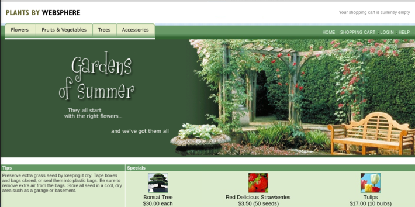
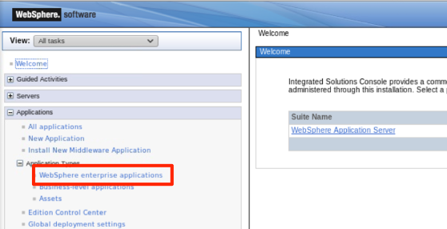
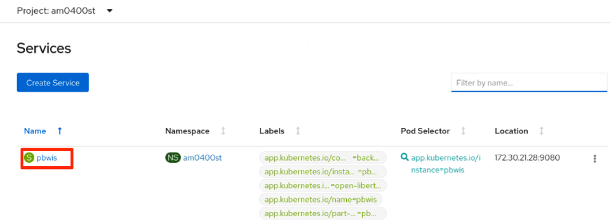

This lab exercise is a part of the Application Modernization lab series which focus on the evaluation, re-platforming, rehosting and refactoring application modernization approaches and other application modernization related solutions. In Part 1 of the Application Modernization Journey (Lab AM0100), you go through the process to evaluate the existing On-Prem Java applications and to identify the candidate to be moved to the cloud using the IBM Cloud Transformation Advisor. In Part 2 of the Application Modernization Journey (Lab AM0200), you learn how to re-platform an existing WebSphere application to a Liberty container and to deploy it to a Red Heat OpenShift Container Platform (OCP) cluster. In Part 3 of the Application Modernization Journey (Lab AM0300), you use the rehost process to move an existing WebSphere application to a WebSphere Application Server (WAS) container and to deploy it to a OCP cluster. In this lab, you start to refactor a monolithic Java application by moving one of its functions into a microservice and modifying the application to access the microservice via REST. Over time this pattern of moving services from an application to a microservice will allow for the eventual sunset of the initial monolithic application, once all of its function has been deployed as microservices. 
### 1. Business Scenario

Your company has a traditional WebSphere Application Server application called **PlantsByWebSphere**, a monolith web application allowing users to search and order garden products online.  The application is running is a traditional WAS environment.



As a tech leader, you are leading the effort to modernize the monolith application using the refactor option. At your first approach, you focus on refactoring the image module of the monolith application and break the monolith application into two parts:

* The original monolith ( **1**  in the image below) has been modified with a Servlet Filter to intercept requests for images and redirect the requests to a new image microservice application, the old image module is disabled in the modified code.  The modified monolith application is still running in the WAS environment.
* The image module of the application is refactored as a new microservice application as showing in **2** in the image below. The microservice exposes the image service via a JAX-RS interface which accesses the image library and images in the database via JPA reusing the same code that was used in the original monolith application. The new image microservice application is containerized and deployed to a OCP cluster. 


### 2. Objective

The objectives of this lab are to help you:

* get familiar with the application modernization refactor process.
*	learn the process to deploy a refactored microservice to OCP cluster.
*	learn how to configure the modified monolith application to consume the refactored microservice from WAS console.

### 3.	Prerequisites

The following prerequisites must be completed prior to beginning this lab:
*	Familiarity with basic Linux commands
*	Have internet access
*	Have a SkyTap App Mod Lab environment ready

### 4.	What is Already Completed

A six Linux VMs App Mod Lab environment has been provided for this lab. 
 
  

*	The Red Hat OpenShift Container Platform (OCP) v4.6, is installed in 5 VMs, the master1 VM, the master2 VM, the master3 VM, the dns VM and the nfs VM, with 3 master nodes and 3 compute nodes (the master nodes are serving as computer nodes as well).
*	The workstation VM is the one you will use to access and work with OCP cluster in this lab.
  The login credentials for the workstation VM are:
  User ID: **ibmdemo**
  Password: **passw0rd**
  Note: Use the Password above in the workstation VM Terminal for sudo in the Lab.
*	The CLI commands used in this lab are listed in the **Commands.txt** file located at the **/home/ibmdemo/add-mod-labs/am0400st** directory of the workstation VM for you to copy and paste these commands to the Terminal window during the lab.

### 5.	Lab Tasks
During this lab, you complete the following tasks:
*	review the original and modified versions of **PlantsByWebSphere** application on local WAS server.
*	deploy the image microservice to a OCP cluster.
*	test and verify the deployed image microservice.
*	configure the modified **PlantsByWebSphere** application to consume the image microservice in WAS console.
*	test and verify the modified **PlantsByWebSphere** application.


### 6.	Execute Lab Tasks
#### 6.1 Log in to the workstation VM and get started 
1.  If the VMs are not already started, start them by clicking the play button for the whole group.

  


1.	After the VMs are started, click the workstation VM icon to access it. 

  

  The Workstation Linux Desktop is displayed. You execute all the lab tasks on this workstation VM.

1.	If requested to log in to the Workstation OS, use credentials: **ibmdemo**/**passw0rd**
1. Open a terminal window by clicking its icon from the Desktop toolbar.

  
1. In the terminal window, run the following command to get the lab materials.

  ```
  /home/ibmdemo/get-lab-materials.sh
  ```

  Sample output

  ```
  Cloning into 'app-mod-labs'...
  warning: redirecting to https://github.com/wtistang/app-mod-labs.git/
  remote: Enumerating objects: 5693, done.
  remote: Counting objects: 100% (185/185), done.
  remote: Compressing objects: 100% (118/118), done.
  remote: Total 5693 (delta 53), reused 184 (delta 53), pack-reused 5508
  Receiving objects: 100% (5693/5693), 277.71 MiB | 57.39 MiB/s, done.
  Resolving deltas: 100% (2250/2250), done.
  Checking out files: 100% (6120/6120), done.
  ```
  
  The lab materials is downloaded to the **/home/ibmdemo/app-mod-labs** directory.
  
1. Open **File Manager** by clicking its icon on the Desktop toolbar.

  

1. Navigate to **/home/ibmdemo/app-mod-labs/am0400st** directory and click to open **Commands.txt** file in the text editor.

  

  This file contains all commands used in the lab.  When you need to enter any command in a terminal window in the lab tasks, you should come back to this file and copy/paste the command from this file, this is because you cannot directly copy and paste from your local workstation to the SkyTap workstation.

#### 6.2 Review the on-premises WebSphere application 

In this task, you take a look at **PlantsByWebSphere** application deployed to the local WebSphere Application Server (WAS) environment. You are going to move this application to the cloud using Open Liberty Operator later.

1.	In the terminal window, issue the command below to start the WAS server (You can copy and paste the command from the **Commands.txt** file in the **/home/ibmdemo/app-mod-labs/am0400st** directory).

    ```
    /home/ibmdemo/app-mod-labs/shared/startWASV9.sh
    ```
    
    When prompted, enter the sudo password as: **passw0rd**.
    
    Within a few minutes the WAS server is ready.

1.	Access the WAS Admin Console to view the application deployed by clicking the browser incon from the Desktop toolbar to open a browser window.
 
    

1.	From the web browser window, type the WebSphere Integrated Solution Console URL as: https://localhost:9044/ibm/console and press **Enter** to launch the WAS V9 console.

1.	In the WAS Admin Console login page, enter the User ID and Password as: **wsadmin**/**passw0rd** and click **Login**. 

1.	On the WAS Console page, click **Applications** -> **Application Types** -> **WebSphere enterprise applications** to view the apps deployed.
 
    

    In the Enterprise Applications list, you can see two versions of the **PlantsByWebSphere** applications deployed, the original and the modified. Due to the port conflict, both versions of the application cannot run at the same time. Currently the original version is running. 
    
    

1.	View the original **PlantsByWebSphere** application. From the web browser window, click new Tab to open a new browser window with the **PlantsByWebSphere** application URL: http://localhost:9081/PlantsByWebSphere.
    
    The **PlantsByWebSphere** application home page is displayed.

    

    This is a typical online shopping application, you can click the Flowers, Fruits & Vegetables, Trees and Accessories tabs to view the product catalogs. 
    
    

1. View the modified **PlantsByWebSphere** application.

  a.	Go back to WAS console windows and navigate to **Applications** > **Application Types** > **WebSphere enterprise applications** page.

  b.	Stop the original PlantsByWebSphere application by checking the box next to PlantsByWebSphereV90 and clicking Stop.
 
  
  c.	Start the modified version of the application by checking the box next to PlantsByWebSphereV90V2 and clicking Start.
 
  
  d.	Click the refresh icon next to the Application Status.
 
  
  
    You see that the modified application is running now
 
  

  e.	Go to the **PlantsByWebSphere** application window to relaunch it with URL: http://localhost:9081/PlantsByWebSphere.  
  
  You see that its home page looks below without any images.  This is because the original image molder is disable and the new image microservice the application is looking for is not available yet.

  
 
#### 6.3	Review the WAS configuration needed for the modified application

In the refactor process, the **PlantsByWebSphere** application code is modified to add a new Servlet Filter module which consume the image microservice service. 

The source code of Servlet Filter module is as follows:
```
package com.ibm.websphere.samples.pbw.war;
import java.io.IOException;
import javax.servlet.Filter;
import javax.servlet.FilterChain;
import javax.servlet.FilterConfig;
import javax.servlet.ServletException;
import javax.servlet.ServletRequest;
//* add the following
import javax.servlet.http.HttpServletRequest;
import javax.servlet.ServletResponse;
//* add the following
import javax.servlet.http.HttpServletResponse ;
//import javax.servlet.annotation.WebFilter;
import javax.servlet.annotation.*;
/**
* Servlet Filter implementation class RedirectFilter
*/
@WebFilter(filterName="RedirectFilter",
servletNames={"com.ibm.websphere.samples.pbw.war.ImageServlet", "FacesServlet"},
urlPatterns="*" )
public class RedirectFilter implements Filter {
// Read the Kubernetes service environment variables for the Image Service and
// construct the Image Service service endpoint
String httpPre = "http://" ;
String colon = ":" ;
String pbwisIp = System.getenv("PBWIS_SERVICE_HOST") ;
String pbwisPort = System.getenv("PBWIS_SERVICE_PORT") ;
String pbwisUrl = "/pbwis" ;
String serviceEndpoint = httpPre+pbwisIp+colon+pbwisPort+pbwisUrl;
@Override
public void doFilter(ServletRequest request, ServletResponse response, FilterChain chain)
throws IOException, ServletException {
if(response.isCommitted() || (serviceEndpoint == null)) {
//can't do anything as the response has already been committed
chain.doFilter(request, response);
return;
}
HttpServletResponse resp = (HttpServletResponse) response;
HttpServletRequest req = (HttpServletRequest) request;
if("ln=images".equals(req.getQueryString())) {
String path = req.getServletPath();
if(path.endsWith(".jsf")) {
String resource = path.substring(path.lastIndexOf('/'), path.lastIndexOf('.'));
// resp.sendRedirect(serviceEndpoint + "/images/resources" + resource);
resp.sendRedirect(serviceEndpoint + "/resources/images" + resource);
return;
}
}
if(req.getServletPath().endsWith("/ImageServlet")) {
IBM Software
Lab 06 – Application Modernization with Microservices Page 25
// resp.sendRedirect(serviceEndpoint + "/images/product/inventory/" +
req.getParameterMap().get("inventoryID")[0]);
resp.sendRedirect(serviceEndpoint + "/product/inventory/" +
req.getParameterMap().get("inventoryID")[0]);
return;
}
chain.doFilter(request, response);
}
public void init(FilterConfig fConfig) throws ServletException {
// TODO Auto‐generated method stub
}
public void destroy() {
// TODO Auto‐generated method stub
}
}
```

The source code of Image Service Implementation is shown below:

```
// Enables JAX‐RS
package com.ibm.websphere.samples.pbw.ms.image;
import javax.ws.rs.ApplicationPath;
import javax.ws.rs.core.Application;
@ApplicationPath("/product/*")
public class ImageApplication extends Application
{
}
// ImageService REST endpoint for the monolith to access the image service
package com.ibm.websphere.samples.pbw.ms.image;
import java.io.IOException;
import java.io.OutputStream;
import javax.naming.Context;
import javax.naming.InitialContext;
import javax.naming.NamingException;
import javax.persistence.EntityManager;
import javax.ws.rs.GET;
import javax.ws.rs.Path;
import javax.ws.rs.PathParam;
import javax.ws.rs.Produces;
import javax.ws.rs.WebApplicationException;
import javax.ws.rs.core.Response;
import javax.ws.rs.core.Response.ResponseBuilder;
import javax.ws.rs.core.Response.Status;
import javax.ws.rs.core.StreamingOutput;
@Path("/inventory")
public class ImageService {
private EntityManager getEntityManager() {
try {
Context ctx = new InitialContext();
IBM Software
Page 26 IBM Cloud Private: Application Modernization
return (EntityManager)ctx.lookup("java:comp/env/images/em");
} catch (NamingException e) {
}
return null;
}
@GET
@Produces({"image/jpeg"})
@Path("{inventoryID}"
public Response getMessage(@PathParam("inventoryID") String inventoryID) {
Inventory inv = getInv(inventoryID);
if (inv != null) {
final byte[] retval = inv.getImgbytes();
StreamingOutput stream = new StreamingOutput() {
public void write(OutputStream output) throws IOException,
WebApplicationException {
output.write(retval);
}
};
return Response.ok(stream).build();
}
return Response.status(Response.Status.NOT_FOUND).build();
}
private Inventory getInv(String inventoryID) {
EntityManager em = getEntityManager();
if (em == null) {
return null;
}
return (Inventory)em.find(Inventory.class, inventoryID);
}
}
```

As you can see from the Servlet Filter source code listed above, the module uses WAS environment variables for the image microservice service **host** and **port**:
```
String httpPre = "http://" ;
String colon = ":" ;
String pbwisIp = System.getenv("PBWIS_SERVICE_HOST") ;
String pbwisPort = System.getenv("PBWIS_SERVICE_PORT") ;
String pbwisUrl = "/pbwis" ;
String serviceEndpoint = httpPre+pbwisIp+colon+pbwisPort+pbwisUrl;
```

The **host** and **port** two environment variables are configured in the WAS console.

1.	To view these two WAS environment variables, go to WAS console window and navigate to **Servers** > **Server Types** > **WebSphere application servers**.

  
 
1.	Click **server1** link.

  

1.	Click **Process definition** link under the **Java and Process Management** section.

  

1.	Click **Environment Entries** link under the **Additional Properties** section.

  

  You can see that the two environment variables are added to the list.  You will need to update their values with the image microservice host and port after you deploy the service to OCP cluster which you will do next.

  
 
 
#### 6.4	Deploy the image microservice to OCP cluster

The image microservice has been created and packaged for you, in this task you need to deploy it to the OCP cluster.

1.	Build the image microservice container image

  a.	Go back to the terminal window and navigate to the **/home/ibmdemo/app-mod-labs/am0400st/pbwis** directory with command:

  ```
  cd /home/ibmdemo/app-mod-labs/am0400st/pbwis 
  ```
  b.	Execute the following command to build the image microservice docker container image with the Dockerfile you just reviewed:	
  
  ```
  docker build . -t default-route-openshift-image-registry.apps.demo.ibmdte.net/am0400st/pbwis:latest
  ```
  
  Sample output:
  
  ```
  ......
  Starting server defaultServer.
  Server defaultServer started with process ID 106.
  ......
  Removing intermediate container 4548b89939d5
  ---> c18d4bfc55c6
  Successfully built c18d4bfc55c6
  Successfully tagged default-route-openshift-image-registry.apps.demo.ibmdte.net/am0400st/pbwis:latest
  ```
  This will create a image microservice docker image called **default-route-openshift-image-registry.apps.demo.ibmdte.net/am0400st/pbwis:latest**.
  
  Where 
    *	default-route-openshift-image-registry.apps.demo.ibmdte.net is the OCP cluster image registry Push URL
    *	am0400st is the OCP cluster namespace
    *	pbwis:latest is the image name

  c.	After the docker container image is created, you can issue the command below to check it:
  
  ```
  docker images |grep pbwis
  ```
  Sample output:
  ```
  default-route-openshift-image-registry.apps.demo.ibmdte.net/am0400st/pbwis   latest                    c18d4bfc55c6        2 minutes ago       440MB
  default-route-openshift-image-registry.apps.demo.ibmdte.net/am0400st/pbwis   <none>                    7eeba2a363a8        13 months ago       440MB
  ```
  You see the docker image **default-route-openshift-image-registry.apps.demo.ibmdte.net/am0400st/pbwis:latest** is created.
  
  After the image is built, you need to push it to an image registry first. In this lab, you are using the OCP cluster Image Registry to host your image microservice container image.
1.	Push the image to the OCP cluster Image Registry.

  a.	Issue the command below to login to the OCP cluster.
  
  ```
  oc login -u ibmadmin -p engageibm https://api.demo.ibmdte.net:6443
  ```
  Sample output:
  ```
  Login successful.

  You have access to 68 projects, the list has been suppressed. You can list all projects with ' projects'

  Using project "default".
  ```
  b.	Create a new OpenShift project (namespace) called **am0400st** to host the image.
  
  ```
  oc new-project am0400st
  ```
  Sample output:
  ```
  Now using project "am0400st" on server "https://api.demo.ibmdte.net:6443".

  You can add applications to this project with the 'new-app' command. For example, try:

      oc new-app rails-postgresql-example

  to build a new example application in Ruby. Or use kubectl to deploy a simple Kubernetes application:

      kubectl create deployment hello-node --image=k8s.gcr.io/serve_hostname
  ```
  c.	Execute the following commands to login to the OpenShift image repository and to push your docker image it.
  
  ```
  docker login -u $(oc whoami)  -p $(oc whoami -t) default-route-openshift-image-registry.apps.demo.ibmdte.net
  
  docker push default-route-openshift-image-registry.apps.demo.ibmdte.net/am0400st/pbwis:latest
  ```
  
  Sample output:
  ```
  WARNING! Using --password via the CLI is insecure. Use --password-stdin.
  WARNING! Your password will be stored unencrypted in /home/ibmdemo/.docker/config.json.
  Configure a credential helper to remove this warning. See
  https://docs.docker.com/engine/reference/commandline/login/#credentials-store

  Login Succeeded
  ......
  The push refers to repository [default-route-openshift-image-registry.apps.demo.ibmdte.net/am0400st/pbwis]
  46baa379c323: Pushed 
  21bb0685d205: Pushed 
  77880769aa5f: Pushed 
  3eb66bf2096d: Pushed 
  0d545f717af3: Pushed 
  edae1801c681: Pushed 
  ba47bea7e48c: Pushed 
  2f711586fa28: Pushed 
  dd37a93f7bfd: Pushed 
  ac29e970eb23: Pushed 
  2adc7ff74115: Pushed 
  419e305cdda6: Pushed 
  b26061f6a892: Pushed 
  d14729e6ca5b: Pushed 
  6f4acc6ac0c0: Pushed 
  latest: digest: sha256:6a763a71886f3a771d444eb8ee843bfcf7cb369bed74d46a9d9c87ed2c54f729 size: 3466

  ```
  
  When it is done, your docker image is pushed to OpenShift image repository.

1.	Verify the pushed Docker image in OCP cluster.

  a.	From the browser window, open a new tan and click the OCP web console bookmark to open it.
 
    

  b. If prompted to log in to Red Hat OpenShift Container Platform, click **htpasswd** field. Then log in with **ibmadmin**/**engageibm** as the username and password.
 
     

     
  
  The OCP web console Home page is displayed.

  c.	From the OCP web console Home page, click **Builds**>**Images Streams**, and change project (namespace) to **am0400st**.
  
    

  d.	You can see the image you just pushed is listed. Click its link to view its details.
 
    

    In the Image Stream Details page **Overview** section, you will see the public image repository you used to push the image.  Notice that the public image repository is mapped to an internal image repository which will be used to deploy the application.  The internal image repository is: **image-registry.openshift-image-registry.svc:5000/am0400st/pbwis**.
 
    

1.	Setup Db2 secret in OCP cluster.

  The image microservice uses the same Db2 database as the modified **PlantsByWebSphere** application, the database is running in a Docker container in the workstation VM. Now the image microservice is deployed to the OCP cluster, you need to create a database secret which contains all database connecting info in the OCP cluster for the image microservice to access the database. To do it, execute the following commands to create the Db2 secret in OCP cluster **am0400st** namespace:

  ```
  oc -n am0400st delete secret db2-secret > /dev/null 2>&1
  
  oc -n am0400st create secret generic db2-secret --from-literal=JDBC_ID=db2inst1 --from-literal=JDBC_PASSWORD=engageibm --from-literal=JDBC_HOST=10.0.0.1 --from-literal=JDBC_PORT=50000 --from-literal=JDBC_DB=PBW
  ```

1.	Deploy the image microservice to the OCP cluster.

  a.	From the terminal window, change to the **/home/ibmdemo/app-mod-labs/am0400st** directory.
  ```
  cd /home/ibmdemo/app-mod-labs/am0400st/pbwis/operator
  ```
  
  b.	Issue OpenShift CLI command to deploy the WAS container to the OpenShift cluster:
  ```
  oc apply -f application/ -n am0400st
  ```
  this command will deploy the three YAML files in the applications directory and create the image microservice container pod, service and route in the **am0400st** namespace.

#### 6.5	Verify the deployment

In this task, you access the OCP web console to verify the image microservice container deployment.

1.	Go back to the OpenShift web console, click **Workloads**>**Pods**, then select **am0400st** project from the project list.

  

1.	You will see that the image microservice container is deployed and is in running status. You can click its name link to go to its overview page where you can see its memory and CPU usage and other detail information.

   

1.	Now from the OpenShift web console navigation panel, click **Networking**>**Services**. You will see the image microservice container service. Click the service name to view its details.

   

1.	Next navigate to **Networking**>**Route** to view the image microservice container service route. Click the **Location** URL to launch the image microservice application.

   
  
  The image microservice application is launched in a new web browser window. You will see the Liberty welcome page.

  
1.	Write down the image microservice host name from the URL: **pbwis-am0400st.apps.demo.ibmdte.net**. This is the value you are going to use to configure the modified **PlantsByWebSphere** application.
1.	Add **/pbwis/resources/images/seeds_promo.gif** to the end of the URL in the browser and press **Enter** to test accessing static image. 

  The static image is displayed.

   
1.	Next replace **/pbwis/resources/images/seeds_promo.gif** in the URL with **/pbwis/product/inventory/V0006** to test accessing a catalog image from the database.

  The catalog image is displayed.

   
 
#### 6.6	Update the WAS configuration

Now the image microservice application is deployed and running, you need to go to WAS console to update the WAS configuration with the image microservice **host** and **port** info.

1.	Go back to the WAS console and follow the same steps presented section 6.3 to access the **Application servers** > **server1** > **Process definition** > **Environment Entries**. 

1.	Click the **PBWIS_SERVICE_HOST** link.

    
1.	Update its value to **pbwis-am0400st.apps.demo.ibmdte.net** and click **Apply**.

     
1.	Click **Save** to save the change.

     
1.	Repeat the same process to change the value of **PBWIS_SERVICE _PORT** to **80**.

1.	After clicking **Apply**, click **Review**.
 
   

1.	Check the **Synchronize changes with Nodes** box and click **Save**.
  
   

1.	Click **OK**.

    
1.	Restart **server1** by going to the Application servers section, checking the box next to **server1** and clicking **Stop**.  After the **server1** is stopped, repeat the same step to start it by checking the box and clicking **Start**.

  
  
  You have done with the WAS configuration update.

#### 6.7	Verify the refactor solution

After the WAS configuration is updated, you are ready to test and verify the implementation of the image microservice.

1.	In the WAS console go to WebSphere enterprise applications section, stop the **PlantsByWebSphereV90** application and start the **PlantsByWebSphereV90V2 application** as you did before.

    
2.	Go back to the **PlantsBySphere** application browser window and refresh the page. The application home page is displayed with all images loaded and a new Image Service subtitle added.

    
3.	Navigate around to verify that the application is working as before.


### 7.	Summary

In this lab, you learned the Application Modernization refactor process. You learned how to an existing traditional WAS application can be broken into a microservice running in a container in OCP cluster while the rest of the application can still run in the traditional WAS environment. To learn more about Application Modernization solutions, please continue with the rest of the lab series.

**Congratulations! You have successfully completed Application Modernization with Microservices Lab!**

