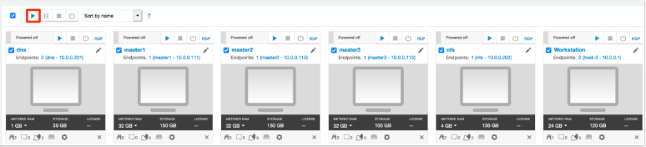

The goal of this lab session is to provide background working with standalone Docker images and containers running an IBM WebSphere® Liberty application. You can start by learning some basic concepts on how to use Docker and how to run a containerized application.

### 1. What is Docker

Docker is a Linux kernel extension that provides for operating system virtualization, also known as “containerization”. Applications are packaged in Docker images and then deployed as containers. Containers are isolated from each other and bundle their own programs, libraries, applications and configuration, which can communicate with other containers. A typical example for an application would be one container with the web or application server and a second container running a database. 

### 2. Objective

The objectives of this lab are to help you:

* learn how to build a Docker image using the Dockerfile
*	learn how to create Docker containers

### 3.	Prerequisites

The following prerequisites must be completed prior to beginning this lab:
*	Familiarity with basic Linux commands
*	Have internet access
*	Have a SkyTap App Mod Lab environment ready

### 4.	What is Already Completed

A six Linux VMs App Mod environment has been provided for this lab. 
 
  

*	The Red Hat OpenShift Container Platform (OCP) v4.6, is installed in 5 VMs, the master1 VM, the master2 VM, the master3 VM, the dns VM and the nfs VM, with 3 master nodes and 3 compute nodes (the master nodes are serving as computer nodes as well).
*	The Workstation VM is the one you will use to access and work with OCP cluster in this lab.
  The login credentials for the Workstation VM are:
  User ID: **ibmdemo**
  Password: **passw0rd**
  Note: Use the Password above in the Workstation VM Terminal for sudo in the Lab.
*	The CLI commands used in this lab are listed in the **Commands.txt** file located at the **/home/ibmdemo/add-mod-labs/dk0100st** directory of the Workstation VM for you to copy and paste these commands to the terminal window during the lab.

### 5.	Lab Tasks
During this lab, you complete the following tasks:
*	review the files used in the Docker image build
*	build Docker Images
*	create Docker containers and test container applications

### 6.	Execute Lab Tasks
#### 6.1 Log in to the Workstation VM and get started 

1.	If the VMs are not already started, start them by clicking the play button for the whole group.

  


2.	After the VMs are started, click the Workstation VM icon to access it. 

  

  The Workstation Linux Desktop is displayed. You execute all the lab tasks on this workstation VM.

3.	If requested to log in to the Workstation OS, use credentials: **ibmdemo**/**passw0rd**

#### 6.2 Review the files used in the Docker image build

1.	Open a terminal window by clicking its icon on the Desktop tool bar.
 
    

2.	In the terminal window, issue the following command to navigate to the **/home/ibmdemo/app-mod-labs/dk0100st** directory.

  ```
  cd /home/ibmdemo/app-mod-labs/dk0100st
  ```
  The output of the command is like this:
  ```
  ibmdemo@workstation:~/app-mod-labs/dk0100st$ 
  ```
3. Review the lab contents in this directory using command:

  ```
  ls -l
  ```
  The output of the command is like this:
  ```
  total 20
  -rw-rw-r-- 1 ibmdemo ibmdemo  459 Jul  7 14:45 Commands.txt
  -rw-rw-r-- 1 ibmdemo ibmdemo  785 Jul  7 06:00 Dockerfile
  -rw-rw-r-- 1 ibmdemo ibmdemo  316 Jul  7 06:00 server.xml
  -rw-rw-r-- 1 ibmdemo ibmdemo 7441 Jul  7 06:00 ServletApp.war
  ```
  You see the following files:

    * Commands.txt - the file lists all the commands used in the lab.
    * Dockerfile - the file used to build a Docker image.
    * Server.xml - the Liberty server configurations.
    * ServletApp.war - the application runtime.
4. Check the Docker version using command:

  ```
  docker version
  ````
  The output of the command is like this:
  ```
  Client:
    Version:           18.09.6
    API version:       1.39
    Go version:        go1.10.8
    Git commit:        481bc77
    Built:             Sat May  4 02:35:57 2019
    OS/Arch:           linux/amd64
    Experimental:      false

  Server: Docker Engine - Community Engine:
    Version:          18.09.6
    API version:      1.39 (minimum version 1.12)
    Go version:       go1.10.8
    Git commit:       481bc77
    Built:            Sat May  4 01:59:36 2019
    OS/Arch:          linux/amd64
    Experimental:     false

  ```

5. Examine the **Dockerfile** which builds a Liberty Docker image with command:

  ```
  cat Dockerfile 
  ```  

  The output of the command is like this:
  ```
  # (C) Copyright IBM Corporation 2015,2018.
  #
  # Licensed under the Apache License, Version 2.0 (the "License");
  # you may not use this file except in compliance with the License.
  # You may obtain a copy of the License at
  #
  #      http://www.apache.org/licenses/LICENSE-2.0
  #
  # Unless required by applicable law or agreed to in writing, software
  # distributed under the License is distributed on an "AS IS" BASIS,
  # WITHOUT WARRANTIES OR CONDITIONS OF ANY KIND, either express or implied.
  # See the License for the specific language governing permissions and
  # limitations under the License.

  FROM websphere-liberty:webProfile7
  COPY server.xml /config/
  COPY ServletApp.war /config/apps/

  RUN server start && server stop && rm -rf /output/resources/security/ && rm -rf /output/messaging
  ```

  This file builds a Liberty Docker image with an application with the following actions:
    *	Use the **From** instruction to pull the **websphere-liberty-webprofile7** base image from Docker Hub. This must always be the first instruction in the Dockerfile.
    * Use the **Copy** instruction to copy a Liberty server.xml file from the current directory to the /config directory in the image.
    * Use the **Copy** instruction to copy an application war file from the current directory to the /config/apps directory. 
    * Use the **Run** instruction to execute the server start and stop commands.

6. Examine the Liberty server.xml for this lab with command:

  ```
  cat server.xml 
  ```

  The output of the command is like this:
  ```
  <server description="default servlet engine">

    <!-- Enable features -->
    <featureManager>
        <feature>servlet-3.1</feature>
    </featureManager>

    <httpEndpoint id="defaultHttpEndpoint" host="*" httpPort="9080" httpsPort="-1"/>      
    <webApplication contextRoot="/" location="ServletApp.war" />

  </server>

  ```

  The server.xml file:   
    * Specifies that only the servlet-3.1 API feature is added to Liberty for this application.
    * Exposes port 9080 for http(s) traffic  
    * Define the contextRoot for the application in the application in the ServletApp.war file. 

### 6.3 Build Docker Images

1.	Build a Liberty docker image named **simpleapp** by typing command:

  ```
  docker build . -t simpleapp
  ```

  Note: the “.” in the command indicates that a Docker image is built using the Dockerfile in the current directory.             

  The output of the command is like this:
  ```
  Sending build context to Docker daemon   12.8kB
  Step 1/4 : FROM websphere-liberty:webProfile7
    ---> 4f80b39623c7
  Step 2/4 : COPY server.xml /config/
    ---> 630c8afcdcb5
  Step 3/4 : COPY ServletApp.war /config/apps/
    ---> 1d90b8bc3cfd
  Step 4/4 : RUN server start && server stop && rm -rf /output/resources/security/ && rm -rf /output/messaging
    ---> Running in 043249eeb32c

  Starting server defaultServer.
  Server defaultServer started with process ID 38.

  Stopping server defaultServer.
  Server defaultServer stopped.
  Removing intermediate container 043249eeb32c
    ---> 468df215e750
  Successfully built 468df215e750
  Successfully tagged simpleapp:latest

  ```
2.	You can obtain a list of all images in the local Docker registry using the **docker images** command. 

  ```
  docker images
  ```
  The list of Docker images on the Workstation is displayed.


  
3.	You can use the **grep** command to filter the images listed by running command:

  ```
  docker images | grep simpleapp  
  ```

  The output of the command is like this:
  ```
  simpleapp                       latest                    468df215e750        2 minutes ago       419MB                                                                  latest                    468df215e750        2 minutes ago       419MB

  ```

#### 6.4	Create Docker containers and test container applications
1.	Now that you have an image, run it in a container by typing the following command:

  ```
  docker run --name=simpleC1 --hostname=localhost -d -p 8081:9080 simpleapp  
  ```

  The **simpleapp** container instance is created.
  ```
  dc6da4239b4fed3f56e9e498a1eba48b3effdc898675efc54740650658596031
  ```

  This starts a container named **simpleC1** and map the port **9080** in the container to port **8081** on the localhost using the image **simpleapp** which you just created.
2.	You can obtain a list of all running containers using the **docker ps** command and see the container you just created.

  ```
  docker ps
  ```
  The output of the command is like this:
  ```
  CONTAINER ID        IMAGE                     COMMAND                  CREATED             STATUS                    PORTS                                                          NAMES
  dc6da4239b4f        simpleapp                 "/opt/ibm/helpers/ru…"   2 minutes ago       Up 2 minutes              9443/tcp, 0.0.0.0:8081->9080/tcp                               simpleC1
  2c162453b1bc        gitlab/gitlab-ce:latest   "/assets/wrapper"        18 months ago       Up 34 minutes (healthy)   0.0.0.0:24->22/tcp, 0.0.0.0:82->80/tcp, 0.0.0.0:445->443/tcp   gitlab

  ```
3.	You can inspect the running **simpleC1** container using command:

  ```
  docker container inspect simpleC1
  ```

  By inspecting the container, you can access detailed information about the container and get to know the details about network settings, volumes, configs, state etc.

  ```
  [
    {
        "Id": "dc6da4239b4fed3f56e9e498a1eba48b3effdc898675efc54740650658596031",
        "Created": "2021-07-09T13:05:16.638462842Z",
        "Path": "/opt/ibm/helpers/runtime/docker-server.sh",
        "Args": [
            "/opt/ibm/wlp/bin/server",
            "run",
            "defaultServer"
        ],
        "State": {
            "Status": "running",
            "Running": true,
            "Paused": false,
            "Restarting": false,
            "OOMKilled": false,
            "Dead": false,
            "Pid": 12222,
            "ExitCode": 0,
            "Error": "",
            "StartedAt": "2021-07-09T13:05:17.204274597Z",
            "FinishedAt": "0001-01-01T00:00:00Z"
        },
        "Image": "sha256:468df215e750024c4a68fab3226f2cf5f6849ce73f0f43bd7b8618606424fa0d",
        "ResolvConfPath": "/var/lib/docker/containers/dc6da4239b4fed3f56e9e498a1eba48b3effdc898675efc54740650658596031/resolv.conf",
        "HostnamePath": "/var/lib/docker/containers/dc6da4239b4fed3f56e9e498a1eba48b3effdc898675efc54740650658596031/hostname",
        "HostsPath": "/var/lib/docker/containers/dc6da4239b4fed3f56e9e498a1eba48b3effdc898675efc54740650658596031/hosts",
        "LogPath": "/var/lib/docker/containers/dc6da4239b4fed3f56e9e498a1eba48b3effdc898675efc54740650658596031/dc6da4239b4fed3f56e9e498a1eba48b3effdc898675efc54740650658596031-json.log",
        "Name": "/simpleC1",
        "RestartCount": 0,
        "Driver": "overlay2",
        "Platform": "linux",
        "MountLabel": "",
        "ProcessLabel": "",
        "AppArmorProfile": "docker-default",
        "ExecIDs": null,
        "HostConfig": {
            "Binds": null,
            "ContainerIDFile": "",
            "LogConfig": {
                "Type": "json-file",
                "Config": {}
            },
            "NetworkMode": "default",
            "PortBindings": {
                "9080/tcp": [
                    {
                        "HostIp": "",
                        "HostPort": "8081"
                    }
                ]
            },
            "RestartPolicy": {
                "Name": "no",
                "MaximumRetryCount": 0
            },
            "AutoRemove": false,
            "VolumeDriver": "",
            "VolumesFrom": null,
            "CapAdd": null,
            "CapDrop": null,
            "Dns": [],
            "DnsOptions": [],
            "DnsSearch": [],
            "ExtraHosts": null,
            "GroupAdd": null,
            "IpcMode": "shareable",
            "Cgroup": "",
            "Links": null,
            "OomScoreAdj": 0,
            "PidMode": "",
            "Privileged": false,
            "PublishAllPorts": false,
            "ReadonlyRootfs": false,
            "SecurityOpt": null,
            "UTSMode": "",
            "UsernsMode": "",
            "ShmSize": 67108864,
            "Runtime": "runc",
            "ConsoleSize": [
                0,
                0
            ],
            "Isolation": "",
            "CpuShares": 0,
            "Memory": 0,
            "NanoCpus": 0,
            "CgroupParent": "",
            "BlkioWeight": 0,
            "BlkioWeightDevice": [],
            "BlkioDeviceReadBps": null,
            "BlkioDeviceWriteBps": null,
            "BlkioDeviceReadIOps": null,
            "BlkioDeviceWriteIOps": null,
            "CpuPeriod": 0,
            "CpuQuota": 0,
            "CpuRealtimePeriod": 0,
            "CpuRealtimeRuntime": 0,
            "CpusetCpus": "",
            "CpusetMems": "",
            "Devices": [],
            "DeviceCgroupRules": null,
            "DiskQuota": 0,
            "KernelMemory": 0,
            "MemoryReservation": 0,
            "MemorySwap": 0,
            "MemorySwappiness": null,
            "OomKillDisable": false,
            "PidsLimit": 0,
            "Ulimits": null,
            "CpuCount": 0,
            "CpuPercent": 0,
            "IOMaximumIOps": 0,
            "IOMaximumBandwidth": 0,
            "MaskedPaths": [
                "/proc/asound",
                "/proc/acpi",
                "/proc/kcore",
                "/proc/keys",
                "/proc/latency_stats",
                "/proc/timer_list",
                "/proc/timer_stats",
                "/proc/sched_debug",
                "/proc/scsi",
                "/sys/firmware"
            ],
            "ReadonlyPaths": [
                "/proc/bus",
                "/proc/fs",
                "/proc/irq",
                "/proc/sys",
                "/proc/sysrq-trigger"
            ]
        },
        "GraphDriver": {
            "Data": {
                "LowerDir": "/var/lib/docker/overlay2/02ef0917238240791da4ae09802d486ad71e4bad5792985d617cb70d9cbd5dfe-init/diff:/var/lib/docker/overlay2/9d1c5add0ab689743ec358de91476b3a5ab256f546a0694f4290b9230c1d5bbe/diff:/var/lib/docker/overlay2/71ba4acbc7845049cc1b05874764d83443281e96b10fc49954063f1fb602f6e5/diff:/var/lib/docker/overlay2/c4c68cc0e6c08292c0e1bd90c381e7fd3d118c6f1264aea45fe3d8681324266f/diff:/var/lib/docker/overlay2/00d09f50ce874e02143658a5be141e7403739ac8c0dbeecbd4644d9024a61904/diff:/var/lib/docker/overlay2/a4dc1dbe6ac5e2c3c718a50f109ff776a96033d981dd5083ab66583ed6508323/diff:/var/lib/docker/overlay2/4007227543e98f5610d351665ff478a97dddeee92847fb926c52efae9f23b933/diff:/var/lib/docker/overlay2/6fab3e33ad1798833b4ec3b7879042b38773df4430eb8d74a4b6aa1f0dc05e36/diff:/var/lib/docker/overlay2/bc17f56e215df505a414014c15da8f560e04fce3b967d6d201c27f0012f6fb6b/diff:/var/lib/docker/overlay2/fe422fc02010e858a5b089fb647a743b49c32dfa00d046c92488ef71c8f936af/diff:/var/lib/docker/overlay2/7d9999e1d7dc8f44702f970e1334f4e799ec19593182af706fafb12e9a41960f/diff:/var/lib/docker/overlay2/101c9a2e2cad291416ca575c13b81325b51d360b1808576f1a9364d634a52d3a/diff:/var/lib/docker/overlay2/74e21212bcf657f0d8100fc073ca6e2c4910b136fde7fed5dc92f4305fec5afa/diff:/var/lib/docker/overlay2/adf15b61fcc0b2ac3047444933bbdede3eafa97728698efe021d6d7146061c6d/diff:/var/lib/docker/overlay2/3c44971e33c6938281563c8198869f0f3e89cc7642deaef015e39bb04196931f/diff:/var/lib/docker/overlay2/fbc500ce863ea7b7d83c6f8d92822c3cf9752430abfa4f74d534a47fcbe413b3/diff:/var/lib/docker/overlay2/42b9a4d42c35ebeaf95263a267265199f8a22c46e3a91c81a88f2e2fca9352d2/diff:/var/lib/docker/overlay2/6127420e2b63e2adffb528926d08c0c98c9e9f6ffc91060ca2c6f638332ec1e8/diff",
                "MergedDir": "/var/lib/docker/overlay2/02ef0917238240791da4ae09802d486ad71e4bad5792985d617cb70d9cbd5dfe/merged",
                "UpperDir": "/var/lib/docker/overlay2/02ef0917238240791da4ae09802d486ad71e4bad5792985d617cb70d9cbd5dfe/diff",
                "WorkDir": "/var/lib/docker/overlay2/02ef0917238240791da4ae09802d486ad71e4bad5792985d617cb70d9cbd5dfe/work"
            },
            "Name": "overlay2"
        },
        "Mounts": [],
        "Config": {
            "Hostname": "localhost",
            "Domainname": "",
            "User": "1001",
            "AttachStdin": false,
            "AttachStdout": false,
            "AttachStderr": false,
            "ExposedPorts": {
                "9080/tcp": {},
                "9443/tcp": {}
            },
            "Tty": false,
            "OpenStdin": false,
            "StdinOnce": false,
            "Env": [
                "PATH=/opt/ibm/wlp/bin:/opt/ibm/helpers/build:/opt/ibm/java/jre/bin:/usr/local/sbin:/usr/local/bin:/usr/sbin:/usr/bin:/sbin:/bin",
                "JAVA_VERSION=1.8.0_sr5fp41",
                "JAVA_HOME=/opt/ibm/java/jre",
                "IBM_JAVA_OPTIONS=-Xshareclasses:name=liberty,nonfatal,cacheDir=/output/.classCache/ -XX:+UseContainerSupport",
                "LIBERTY_VERSION=19.0.0_10",
                "LOG_DIR=/logs",
                "WLP_OUTPUT_DIR=/opt/ibm/wlp/output",
                "RANDFILE=/tmp/.rnd"
            ],
            "Cmd": [
                "/opt/ibm/wlp/bin/server",
                "run",
                "defaultServer"
            ],
            "ArgsEscaped": true,
            "Image": "simpleapp",
            "Volumes": null,
            "WorkingDir": "",
            "Entrypoint": [
                "/opt/ibm/helpers/runtime/docker-server.sh"
            ],
            "OnBuild": null,
            "Labels": {
                "BuildLabel": "cl191020191002-0300",
                "ProductID": "fbf6a96d49214c0abc6a3bc5da6e48cd",
                "ProductName": "WebSphere Application Server Liberty",
                "ProductVersion": "19.0.0.10",
                "org.opencontainers.image.authors": "Arthur De Magalhaes, Chris Potter",
                "org.opencontainers.image.documentation": "https://www.ibm.com/support/knowledgecenter/SSAW57_liberty/com.ibm.websphere.wlp.nd.multiplatform.doc/ae/cwlp_about.html",
                "org.opencontainers.image.revision": "cl191020191002-0300",
                "org.opencontainers.image.url": "http://wasdev.net",
                "org.opencontainers.image.vendor": "IBM",
                "org.opencontainers.image.version": "19.0.0.10"
            }
        },
        "NetworkSettings": {
            "Bridge": "",
            "SandboxID": "5aa160931c270e5cd3912199083bef9c7173a25a5bca4e585ea6cefc98ecd254",
            "HairpinMode": false,
            "LinkLocalIPv6Address": "",
            "LinkLocalIPv6PrefixLen": 0,
            "Ports": {
                "9080/tcp": [
                    {
                        "HostIp": "0.0.0.0",
                        "HostPort": "8081"
                    }
                ],
                "9443/tcp": null
            },
            "SandboxKey": "/var/run/docker/netns/5aa160931c27",
            "SecondaryIPAddresses": null,
            "SecondaryIPv6Addresses": null,
            "EndpointID": "252d731f797d958563af719b00d6328ae3a8e8cf658a2e2577b8ae2ea2d3327a",
            "Gateway": "172.17.0.1",
            "GlobalIPv6Address": "",
            "GlobalIPv6PrefixLen": 0,
            "IPAddress": "172.17.0.3",
            "IPPrefixLen": 16,
            "IPv6Gateway": "",
            "MacAddress": "02:42:ac:11:00:03",
            "Networks": {
                "bridge": {
                    "IPAMConfig": null,
                    "Links": null,
                    "Aliases": null,
                    "NetworkID": "5e52bd4a0e3726501e16f47325bc2f190f5b2752eade4ac323834d35c659f5a1",
                    "EndpointID": "252d731f797d958563af719b00d6328ae3a8e8cf658a2e2577b8ae2ea2d3327a",
                    "Gateway": "172.17.0.1",
                    "IPAddress": "172.17.0.3",
                    "IPPrefixLen": 16,
                    "IPv6Gateway": "",
                    "GlobalIPv6Address": "",
                    "GlobalIPv6PrefixLen": 0,
                    "MacAddress": "02:42:ac:11:00:03",
                    "DriverOpts": null
                }
            }
        }
    }
  ]
  ```
4. Next access the containerized appliction from the web browser. Launch the Firefox browser by clicking its icon on the Desktop tool bar.
 
  

5.	Enter the address: **http://localhost:8081/Simple**.
 
  

    The **simpleapp** page is displayed.
6.	Change the address bar to: **http://localhost:8081/Snoop** to launch the default **Snoop** application.

   
7.	Scroll down the browser page and note the Request Information specifically the addresses and ports which reflect the container environment. 

   
8.	Return to the command line and start another container by running the following command:

  ```
  docker run --name=simpleC2 --hostname=localhost -d -p 8082:9080 simpleapp  
  ```
  
  Which starts a new container named **simpleC2** and map the port **9080** in the container to port **8082** on the localhost using the same image (note the use of port 8082 to avoid port conflicts)   

9.	Open a browser tab and enter the address: **http://localhost:8082/Simple**.

   

    The **simpleapp** page is displayed.
10.	Change the address bar to: **http://localhost:8082/Snoop** to launch the deafult **Snoop** application.  

   
11.	Again, scroll down to the Request Information and note the addresses and ports which reflect the container environment, noted that while the Liberty is using port 9080 to serve the requests in each container, each container has different a different local address and remote port  

   
12.	Now return to the terminal window and run command:

  ```
  docker ps | grep simple 
  ```

  Which shows the docker container processes running for this lab (without limiting the results with “grep simple” all the docker processes would have been listed including those for the containers in this lab)    
	
  ```
  4bf60db162bc        simpleapp                 "/opt/ibm/helpers/ru…"   12 seconds ago      Up 11 seconds             9443/tcp, 0.0.0.0:8082->9080/tcp                               simpleC2
  dc6da4239b4f        simpleapp                 "/opt/ibm/helpers/ru…"   10 minutes ago      Up 10 minutes             9443/tcp, 0.0.0.0:8081->9080/tcp                               simpleC1
  ```
  You now have some familiarity with docker images and containers. As you can see it’s easy to create images and run containers, at least on a small scale, but an enterprise needs to run containers at scale, route traffic to those contains and assign QOS values the containers which is where Kubernetes and Red Hat OpenShift Container Platform (OCP) come in. 
#### 6.5	Stop and delete Docker containers
1.	Issue **docker stop** commands to stop the two running containers **simpleC1** and **simpleC2**.

  ```
  docker stop simpleC1 simpleC2  
  ```

   

  The two containers are stopped. If you try to access the app in the web browser, you will get an error.
  ```
  simpleC1
  simpleC2
  ```
2.	Run the **docker rm** command to delete the two containers **simpleC1** and **simpleC2**.

  ```
  docker rm simpleC1 simpleC2  
  ```
  

  The two containers are deleted.

  ```
  simpleC1
  simpleC2
  ```
3. Run the command **docker ps | grep simple** again, this time you will not see anything because the containers have already been deleted.

  ```
  docker ps | grep simple 
  ```

### 7.	Summary

In this lab, you have learned how to create a Docker container image and run container applications with the image. To learn more about App Mod and DevOps, please continue with the rest of the lab series.

**Congratulations! You have successfully completed Docker Introduction Lab!**

