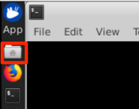

This lab is intended primarily for system administrator/infrastructure professionals who manage the Kubernetes clusters. This lab explains Kubernetes principles and the internal working of the cluster.
### 1.	What is Kubernetes

Kubernetes is an open-source platform for building an ecosystem of components and tools to deploy, scale and manage containerized applications. Kubernetes is often referred to as a container orchestration framework. 

The kubectl is a command line tool to communicate with the Kubernetes master node that runs an API server. The API server provides REST API endpoints and kubectl internally uses the REST APIs to communicate with the API server, which communicates with the Kubernetes Objects in the cluster. 

### 2. Objective

The objectives of this lab are to help you:

* get familiar with the kubectl commands
*	learn how to push a Docker image to a Kubernetes cluster internal image registry
* learn how to deploy an application to Kubernetes cluster

### 3.	Prerequisites

The following prerequisites must be completed prior to beginning this lab:
*	Familiarity with basic Linux commands
*	Have internet access
*	Have a SkyTap App Mod Lab environment ready

### 4.	What is Already Completed

A six Linux VMs App Mod environment has been provided for this lab. 
 
  

*	The Red Hat OpenShift Container Platform (OCP) v4.6, is installed in 5 VMs, the master1 VM, the master2 VM, the master3 VM, the dns VM and the nfs VM, with 3 master nodes and 3 compute nodes (the master nodes are serving as computer nodes as well).
*	The Workstation VM is the one you will use to access and work with OCP cluster in this lab.
  The login credentials for the Workstation VM are:
  User ID: **ibmdemo**
  Password: **passw0rd**
  Note: Use the Password above in the Workstation VM Terminal for sudo in the Lab.
*	The CLI commands used in this lab are listed in the Commands.txt file located at the /home/ibmdemo/add-mod-labs/dk0200st directory of the Workstation VM for you to copy and paste these commands to the Terminal window during the lab.

### 5.	Lab Tasks
During this lab, you complete the following tasks:
*	access a Kubernetes cluster (OCP cluster)
* work with Kubernetes commands
* deploy an application to the Kubernetes cluster

### 6.	Execute Lab Tasks
#### 6.1 Log in to the Workstation VM and get started 
1. If the VMs are not already started, start them by clicking the play button for the whole group.

  


2.	After the VMs are started, click the Workstation VM icon to access it. 

  

  The Workstation Linux Desktop is displayed. You execute all the lab tasks on this workstation VM.

3.	If requested to log in to the Workstation OS, use credentials: **ibmdemo/passw0rd**
4. Open a terminal window by clicking its icon from the Desktop toolbar.

  
5. If this is your first time to run the lab series in this lab environment, do the following, otherwise if you have already downloaded the lab materials in other labs, you can skip this step.
  
  a. In the terminal window, run the following command to get the lab materials.

  ```
  /home/ibmdemo/get-lab-materials.sh
  ```

  Sample output

  ```
  Cloning into 'app-mod-labs'...
  warning: redirecting to https://github.com/wtistang/app-mod-labs.git/
  remote: Enumerating objects: 5693, done.
  remote: Counting objects: 100% (185/185), done.
  remote: Compressing objects: 100% (118/118), done.
  remote: Total 5693 (delta 53), reused 184 (delta 53), pack-reused 5508
  Receiving objects: 100% (5693/5693), 277.71 MiB | 57.39 MiB/s, done.
  Resolving deltas: 100% (2250/2250), done.
  Checking out files: 100% (6120/6120), done.
  ```
  
  The lab materials is downloaded to the **/home/ibmdemo/app-mod-labs** directory.
  
6. Open **File Manager** by clicking its icon on the Desktop toolbar.

  

7. Navigate to **/home/ibmdemo/app-mod-labs/dk0200st** directory and double-click to open **Commands.txt** file in the text editor.

  

  This file contains all commands used in the lab.  When you need to any command in a terminal window in the future tasks, you should come back to this file and copy/paste the command from this file, this is because you cannot directly copy and paste from your local workstation to the SkyTap workstation.
 
#### 6.2 Access the OCP Cluster

The Kubernetes command-line tool, **kubectl**, has been installed in the workstation.  It allows you to run commands against Kubernetes clusters, to deploy applications, to inspect, to manage cluster resources, and to view logs. kubectl must be configured for the environment that it can be running against. In this lab you are using the OpenShift Container Platform (OCP) cluster as the Kubernetes cluster. So you need to login into the OCP cluster with the OCP command line tool **oc** which can provide the required configuration

1. In the terminal window, issue the following command to navigate to the **/home/ibmdemo/app-mod-labs/dk0200st** directory.

  ```
  cd /home/ibmdemo/app-mod-labs/dk0200st
  ```
2. Issue the **oc login** command to login to the OCP cluster:

  ```
  oc login https://api.demo.ibmdte.net:6443
  ```

  when prompted, enter the login credentials as: **ibmadmin**/**engageibm**.
  
  ```
  Authentication required for https://api.demo.ibmdte.net:6443 (openshift)
  Username: ibmadmin
  Password: 
  Login successful.

  You have access to 66 projects, the list has been suppressed. You can list all projects with ' projects'

  Using project "default".
  ``` 
   
  **oc** extends **kubectl** and offers the same capabilities as the kubectl but it is further extended to natively support OpenShift Container Platform features, such as OpenShift resources such as DeploymentConfigs, BuildConfigs, Routes, ImageStreams, and ImageStreamTags which are specific to OpenShift distributions, and not available in standard Kubernetes.

  The kubectl command line interface is now configured to communicate with the OCP cluster.

3. Test to verify the **kubectl** is installed.

  ```
  kubectl version --client
  ```
  
  Sample output:
  ```
  Client Version: version.Info{Major:"1", Minor:"14", GitVersion:"v1.14.0+724e12f93f", GitCommit:"4ac9078476ffe9a96e78a24d1b8083ae0283ec27", GitTreeState:"clean", BuildDate:"2019-12-04T06:58:28Z", GoVersion:"go1.12.12", Compiler:"gc", Platform:"linux/amd64"}
  ```

#### 6.3 Work with Kubernetes Commands

##### 6.3.1 List Kubernetes Nodes

1.	List all the nodes in the OCP cluster with the command **kubectl get nodes**.

  ```
  kubectl get nodes
  ```
  
  Sample output:
  ```
  NAME      STATUS   ROLES           AGE    VERSION
  master1   Ready    master,worker   379d   v1.19.0+43983cd
  master2   Ready    master,worker   379d   v1.19.0+43983cd
  master3   Ready    master,worker   379d   v1.19.0+43983cd
  ```
  
  This is a 3 nodes cluster, with each node serves as master and worker node.
    *	Master node(s) – runs four main components of Kubernetes. 1. API Server. 2. Scheduler, 3. Controller Manager and 4. etcd.
    *	Worker node(s) – run application workloads. 

2.	You can also use **kubectl describe node** command to get more information about a specific node. In this sample below, the master1 node is used.

  ```
  kubectl describe node master1
  ```
  
  Sample output:
  ```
  Name:               master1
  Roles:              master,worker
  Labels:             beta.kubernetes.io/arch=amd64
                    beta.kubernetes.io/os=linux
                    kubernetes.io/arch=amd64
                    kubernetes.io/hostname=master1
                    kubernetes.io/os=linux
                    node-role.kubernetes.io/master=
                    node-role.kubernetes.io/worker=
                    node.openshift.io/os_id=rhcos
  Annotations:        machineconfiguration.openshift.io/currentConfig: rendered-master-8736bcd3d73605acaf734e00a94680a1
                    machineconfiguration.openshift.io/desiredConfig: rendered-master-8736bcd3d73605acaf734e00a94680a1
                    machineconfiguration.openshift.io/reason: 
                    machineconfiguration.openshift.io/state: Done
                    volumes.kubernetes.io/controller-managed-attach-detach: true
  CreationTimestamp:  Wed, 24 Jun 2020 11:13:56 -0700
  Taints:             <none>
  Unschedulable:      false
  Conditions:
    Type             Status  LastHeartbeatTime                 LastTransitionTime                Reason                       Message
    ----             ------  -----------------                 ------------------                ------                       -------
    MemoryPressure   False   Fri, 09 Jul 2021 08:22:14 -0700   Thu, 01 Jul 2021 13:09:45 -0700   KubeletHasSufficientMemory   kubelet has sufficient memory available
    DiskPressure     False   Fri, 09 Jul 2021 08:22:14 -0700   Thu, 01 Jul 2021 13:09:45 -0700   KubeletHasNoDiskPressure     kubelet has no disk pressure
    PIDPressure      False   Fri, 09 Jul 2021 08:22:14 -0700   Thu, 01 Jul 2021 13:09:45 -0700   KubeletHasSufficientPID      kubelet has sufficient PID available
    Ready            True    Fri, 09 Jul 2021 08:22:14 -0700   Thu, 01 Jul 2021 13:09:45 -0700   KubeletReady                 kubelet is posting ready status
  Addresses:
    InternalIP:  10.0.0.111
    Hostname:    master1
  Capacity:
  cpu:                16
  ephemeral-storage:  156734444Ki
  hugepages-2Mi:      0
  memory:             32931496Ki
  pods:               250
  Allocatable:
  cpu:                15500m
  ephemeral-storage:  143372721528
  hugepages-2Mi:      0
  memory:             31780520Ki
  pods:               250
  System Info:
  Machine ID:                                        33a0d7b66d9d4ba1becba58666ddfd2d
  System UUID:                                       422e8c97-34fa-d310-ac45-adc46e59ba75
  Boot ID:                                           ea7bc332-a736-422d-a2ca-fc095f5c4843
  Kernel Version:                                    4.18.0-193.29.1.el8_2.x86_64
  OS Image:                                          Red Hat Enterprise Linux CoreOS 46.82.202011210620-0 (Ootpa)
  Operating System:                                  linux
  Architecture:                                      amd64
  Container Runtime Version:                         cri-o://1.19.0-25.rhaos4.6.gitf51f94a.el8
  Kubelet Version:                                   v1.19.0+43983cd
  Kube-Proxy Version:                                v1.19.0+43983cd
  PodCIDR:                                            10.128.4.0/24
  Non-terminated Pods:                                (56 in total)
    Namespace                                         Name                                                      CPU Requests  CPU Limits  Memory Requests  Memory Limits  AGE
    ---------                                         ----                                                      ------------  ----------  ---------------  -------------  ---
    dk0300st                                          example-5fb6876865-8bdhn                                  0 (0%)        0 (0%)      0 (0%)           0 (0%)         23h
    nfs-storage                                       nfs-client-provisioner-7bd5cb954-bznt4                    0 (0%)        0 (0%)      0 (0%)           0 (0%)         23h
    openshift-apiserver                               apiserver-7b65f5d4b6-mflzg                                110m (0%)     0 (0%)      250Mi (0%)       0 (0%)         41h
    openshift-authentication-operator                 authentication-operator-7496b88c8b-z4744                  10m (0%)      0 (0%)      50Mi (0%)        0 (0%)         7d19h
    openshift-authentication                          oauth-openshift-557b49c746-dkdbs                          10m (0%)      0 (0%)      50Mi (0%)        0 (0%)         7d19h
    openshift-cloud-credential-operator               cloud-credential-operator-7c4fff9f-7rgzm                  20m (0%)      0 (0%)      170Mi (0%)       0 (0%)         23h
    openshift-cluster-node-tuning-operator            tuned-bnd6w                                               10m (0%)      0 (0%)      50Mi (0%)        0 (0%)         218d
    openshift-console                                 console-9d4f5fdbc-x4v8s                                   10m (0%)      0 (0%)      100Mi (0%)       0 (0%)         7d19h
    openshift-console                                 downloads-756d9458cc-b29q2                                10m (0%)      0 (0%)      50Mi (0%)        0 (0%)         7d19h
    openshift-controller-manager-operator             openshift-controller-manager-operator-78984f4647-528gb    10m (0%)      0 (0%)      50Mi (0%)        0 (0%)         7d19h
    openshift-controller-manager                      controller-manager-5r8tw                                  100m (0%)     0 (0%)      100Mi (0%)       0 (0%)         7d19h
    openshift-dns                                     dns-default-2g22m                                         65m (0%)      0 (0%)      110Mi (0%)       512Mi (1%)     218d
    openshift-etcd-operator                           etcd-operator-7bb5c44558-vl2pc                            10m (0%)      0 (0%)      50Mi (0%)        0 (0%)         7d19h
    openshift-etcd                                    etcd-master1                                              430m (2%)     0 (0%)      860Mi (2%)       0 (0%)         218d
    openshift-etcd                                    etcd-quorum-guard-76769c67b4-wrq4g                        10m (0%)      0 (0%)      5Mi (0%)         0 (0%)         7d19h
    openshift-image-registry                          image-registry-b6df7b688-hdrb7                            100m (0%)     0 (0%)      256Mi (0%)       0 (0%)         7d19h
    openshift-image-registry                          node-ca-lv6m8                                             10m (0%)      0 (0%)      10Mi (0%)        0 (0%)         218d
    openshift-ingress-operator                        ingress-operator-6b4d6848f5-d2hcr                         20m (0%)      0 (0%)      40Mi (0%)        0 (0%)         23h
    openshift-ingress                                 router-default-9578b6f69-dvxdv                            100m (0%)     0 (0%)      256Mi (0%)       0 (0%)         7d19h
    openshift-insights                                insights-operator-564d567866-nnmd7                        10m (0%)      0 (0%)      30Mi (0%)        0 (0%)         23h
    openshift-kube-apiserver                          kube-apiserver-master1                                    340m (2%)     0 (0%)      1224Mi (3%)      0 (0%)         41h
    openshift-kube-controller-manager-operator        kube-controller-manager-operator-7c748b799c-nfz6m         10m (0%)      0 (0%)      50Mi (0%)        0 (0%)         7d19h
    openshift-kube-controller-manager                 kube-controller-manager-master1                           100m (0%)     0 (0%)      500Mi (1%)       0 (0%)         218d
    openshift-kube-scheduler                          openshift-kube-scheduler-master1                          20m (0%)      0 (0%)      100Mi (0%)       0 (0%)         218d
    openshift-kube-storage-version-migrator-operator  kube-storage-version-migrator-operator-78468b7ff-7wxx7    10m (0%)      0 (0%)      50Mi (0%)        0 (0%)         7d19h
    openshift-kube-storage-version-migrator           migrator-7bfc77895c-8jv2p                                 100m (0%)     0 (0%)      200Mi (0%)       0 (0%)         7d19h
    openshift-machine-config-operator                 machine-config-controller-787468c654-7824t                20m (0%)      0 (0%)      50Mi (0%)        0 (0%)         23h
    openshift-machine-config-operator                 machine-config-daemon-vl8g6                               40m (0%)      0 (0%)      100Mi (0%)       0 (0%)         218d
    openshift-machine-config-operator                 machine-config-server-rjh99                               20m (0%)      0 (0%)      50Mi (0%)        0 (0%)         218d
    openshift-marketplace                             community-operators-6nlq6                                 10m (0%)      0 (0%)      50Mi (0%)        0 (0%)         146m
    openshift-marketplace                             marketplace-operator-d8465b958-zd47x                      10m (0%)      0 (0%)      50Mi (0%)        0 (0%)         7d19h
    openshift-marketplace                             redhat-operators-pctbs                                    10m (0%)      0 (0%)      50Mi (0%)        0 (0%)         20h
    openshift-monitoring                              alertmanager-main-0                                       8m (0%)       0 (0%)      270Mi (0%)       0 (0%)         7d19h
    openshift-monitoring                              grafana-76fc5cc67d-r2zn5                                  5m (0%)       0 (0%)      120Mi (0%)       0 (0%)         23h
    openshift-monitoring                              kube-state-metrics-6f78c8fc59-j5s86                       4m (0%)       0 (0%)      120Mi (0%)       0 (0%)         7d19h
    openshift-monitoring                              node-exporter-8lzc9                                       9m (0%)       0 (0%)      210Mi (0%)       0 (0%)         218d
    openshift-monitoring                              openshift-state-metrics-56966dd4bd-gf7rt                  3m (0%)       0 (0%)      190Mi (0%)       0 (0%)         7d19h
    openshift-monitoring                              prometheus-adapter-66c985cd5f-h9wlw                       1m (0%)       0 (0%)      25Mi (0%)        0 (0%)         7d19h
    openshift-monitoring                              prometheus-k8s-0                                          75m (0%)      0 (0%)      1194Mi (3%)      0 (0%)         7d19h
    openshift-monitoring                              thanos-querier-5d966f4cc5-s5jpc                           9m (0%)       0 (0%)      92Mi (0%)        0 (0%)         7d19h
    openshift-multus                                  multus-85mq4                                              10m (0%)      0 (0%)      150Mi (0%)       0 (0%)         218d
    openshift-multus                                  multus-admission-controller-p7qr8                         20m (0%)      0 (0%)      20Mi (0%)        0 (0%)         218d
    openshift-multus                                  network-metrics-daemon-jnqcq                              20m (0%)      0 (0%)      120Mi (0%)       0 (0%)         218d
    openshift-network-operator                        network-operator-74646b4d69-lrwxq                         10m (0%)      0 (0%)      50Mi (0%)        0 (0%)         23h
    openshift-oauth-apiserver                         apiserver-6469975956-ws58h                                150m (0%)     0 (0%)      200Mi (0%)       0 (0%)         7d19h
    openshift-operator-lifecycle-manager              catalog-operator-6fcf9cf98d-nwtlh                         10m (0%)      0 (0%)      80Mi (0%)        0 (0%)         7d19h
    openshift-operator-lifecycle-manager              olm-operator-898696f9d-qvf47                              10m (0%)      0 (0%)      160Mi (0%)       0 (0%)         7d19h
    openshift-operator-lifecycle-manager              packageserver-596f8ddc6c-xvx5c                            0 (0%)        0 (0%)      0 (0%)           0 (0%)         7d19h
    openshift-operators                               open-liberty-operator-5bb85ddbd5-2r6sn                    0 (0%)        0 (0%)      0 (0%)           0 (0%)         7d19h
    openshift-operators                               openshift-pipelines-operator-7bc6fbddc6-6tdjm             0 (0%)        0 (0%)      0 (0%)           0 (0%)         7d19h
    openshift-pipelines                               tekton-pipelines-controller-59747dc59c-2t6pg              0 (0%)        0 (0%)      0 (0%)           0 (0%)         7d19h
    openshift-pipelines                               tekton-triggers-controller-594d8b9fd8-vsgzj               0 (0%)        0 (0%)      0 (0%)           0 (0%)         7d19h
    openshift-pipelines                               tekton-triggers-webhook-65688c6d48-4kgk5                  0 (0%)        0 (0%)      0 (0%)           0 (0%)         7d19h
    openshift-sdn                                     ovs-tvk7z                                                 100m (0%)     0 (0%)      400Mi (1%)       0 (0%)         218d
    openshift-sdn                                     sdn-controller-zzc8z                                      10m (0%)      0 (0%)      50Mi (0%)        0 (0%)         218d
    openshift-sdn                                     sdn-p5d79                                                 110m (0%)     0 (0%)      220Mi (0%)       0 (0%)         218d
      Allocated resources:
    (Total limits may be over 100 percent, i.e., overcommitted.)
    Resource           Requests      Limits
    --------           --------      ------
    cpu                2299m (14%)   0 (0%)
    memory             8632Mi (27%)  512Mi (1%)
    ephemeral-storage  0 (0%)        0 (0%)
    Events:
    Type    Reason                   Age                  From              Message
    ----    ------                   ----                 ----              -------
    Normal  Starting                 177m                 kubelet, master1  Starting kubelet.
    Normal  NodeHasSufficientMemory  177m (x8 over 177m)  kubelet, master1  Node master1 status is now: NodeHasSufficientMemory
    Normal  NodeHasNoDiskPressure    177m (x8 over 177m)  kubelet, master1  Node master1 status is now: NodeHasNoDiskPressure
    Normal  NodeHasSufficientPID     177m (x7 over 177m)  kubelet, master1  Node master1 status is now: NodeHasSufficientPID
    Normal  NodeAllocatableEnforced  177m                 kubelet, master1  Updated Node Allocatable limit across pods
  ```
3.	Scroll down to review the output above. You see that this node is running the Linux OS and is a master/worker node. Next, see the information about the operation of node itself.  Following that is the status of the node which indicates that it has sufficient disk and memory, and it is in Ready state. The information about capacity displays next. Next the kernel and OS information for the node. (which is followed by a list of running pods and their resource consumption) 

##### 6.3.2	Check running pods
1.	Run the command **kubectl get pods -n default**. This command lists all pods in the **default** OCP Project (namespace). The **-n** switch is for Project name.  When the switch is not defined, like kubectl get pods, the current Project scope is used.
 
  ```
  kubectl get pods -n default
  ```
  
  Sample output:
  ```
  NAME                READY   STATUS      RESTARTS   AGE
  ibm-toolkit-h9z8n   0/1     Completed   0          3d
  ```
2.	Run the commands **kubectl get pods --all-namespaces** to get the list of running pods in all namespaces. 
 
  ```
  kubectl get pods --all-namespaces
  ```
3.	Review the function of each OpenShift Container Platform pod.
 
  * docker-registry	- Internal image registry 
  * router - Directs service requests to the service endpoints 
  * apiserver - handles all api requests
  * controller-manager - watches etcd for changes to replication controller objects and then uses the API to enforce the desired state.
  * master-controllers - Scheduler and Replication Controller, responsible for the placement and maintenance of pods
  * master-etcd - kubernetes etcd database to hold state of cluster
  * console, web-console - web console 
  * hawkular-metrics, hawkular-metrics-schema - metrics engine and schema
  * hawkular-cassandra - Cassandra database for metrics 
  * heapster - scrapes the metrics for CPU, memory and network usage for each node then exports them into Hawkular Metrics
  * metrics-server - Cluster-wide aggregator of resource usage data
  * alertmanager-main - manages incoming alerts; this includes silencing, inhibition, aggregation, and sending out notifications through methods such as email, PagerDuty,
  * cluster-monitoring-operator - watches over the deployed monitoring components and resources, and ensures that they are up to date
  * grafana - cluster monitoring dashboard interface 
  * kube-state-metrics - converts Kubernetes objects to metrics consumable by Prometheus
  * node-exporter	- agent deployed on every node to collect node metrics
  * prometheus-k8s - Prometheus
  * node-problem-detector - monitors node health and reportsproblems to the API server
  * sync -detects configuration map change, updates the node-config.yaml  and restarts the appropriate nodes
  * ovs, sdn - OpenShift software-defined networking (SDN) which configures an overlay network using Open vSwitch (OVS).
  * catalog-operator - responsible for resolving and installing ClusterServiceVersions (CSVs) and the Custom Resource Definitions (CRD) specified resources
  * olm-operator - install, update, and manage the lifecycle of all Operators and their associated services

4.	The fourth component of Kubernetes is the etcd database that holds the state of the cluster. The etcd container runs in a separate pod. Run the following **kubectl get pods --all-namespaces | grep -i etcd** command to review the etcd pods.

  ```
  kubectl get pods --all-namespaces | grep -i etcd
  ```
  
  Sample output:
  ```
  openshift-etcd-operator                            etcd-operator-7bb5c44558-vl2pc                                    1/1     Running     0          7d19h
  openshift-etcd                                     etcd-master1                                                      3/3     Running     0          218d
  openshift-etcd                                     etcd-master2                                                      3/3     Running     0          218d
  openshift-etcd                                     etcd-master3                                                      3/3     Running     0          218d
  openshift-etcd                                     etcd-quorum-guard-76769c67b4-5nsq2                                1/1     Running     0          7d19h
  openshift-etcd                                     etcd-quorum-guard-76769c67b4-hlwsx                                1/1     Running     0          7d19h
  openshift-etcd                                     etcd-quorum-guard-76769c67b4-wrq4g                                1/1     Running     0          7d19h
  openshift-etcd                                     revision-pruner-8-master1                                         0/1     Completed   0          7d19h
  openshift-etcd                                     revision-pruner-8-master2                                         0/1     Completed   0          7d19h
  openshift-etcd                                     revision-pruner-8-master3                                         0/1     Completed   0          7d19h
  ```

#### 6.4	Deploy a Application to the Kubernetes Cluster

##### 6.4.1 Create a pod
1.	Build the Docker Image.
  
  Note: if you have completed lab **dk0100st** in this environment, you can skip this task.
  
  a.	From the terminal window, navigate to /home/ibmdemo/app-mod-labs/dk0100st directory.

  ```
  cd /home/ibmdemo/app-mod-labs/dk0100st
  ```
  b.	Build a Liberty docker image named simpleapp using the Dockerfile in the directory by typing command:
	
  ```
  docker build . -t simpleapp
  ```
  Note: the **.** in the command indicates that a Docker image is built using the Dockerfile in the current directory.             
2.	Create an Kubernetes namespace named **dk0200st** with command:

  ```
  kubectl create namespace dk0200st
  ```
  Sample output:
  ```
  namespace/dk0200st created
  ```
  Note: You can also use **oc new-project dk0200st** command to create the project/namespace.
3.	Push the simpleapp image to the OCP internal image registry.
  
  You are going to use the simpleapp image to create the pod, you need to tag and place the image in the OCP image registry first.
  
  a.	Change to the **dk0200st** namespace scope.

  ```
  oc project dk0200st
  ```  
  b. Get OCP internal image registry URL and cluster URL with commands:

  ```
  export INTERNAL_REG_HOST=`oc get route default-route --template='{{ .spec.host }}' -n openshift-image-registry`
  export CLUSTER_URL=`echo $INTERNAL_REG_HOST | sed 's/default-route-openshift-image-registry.//g'`
  ```
  c.	Log in to the OpenShift Docker registry with the command:
    
  ```
  docker login -u $(oc whoami) -p $(oc whoami -t) $INTERNAL_REG_HOST
  ```
  Sample output:
  ```
  WARNING! Using --password via the CLI is insecure. Use --password-stdin.
  WARNING! Your password will be stored unencrypted in /home/ibmdemo/.docker/config.json.
  Configure a credential helper to remove this warning. See
  https://docs.docker.com/engine/reference/commandline/login/#credentials-store

  Login Succeeded
  ```
  d. Execute the following command to push your docker image to OpenShift image repository.

  ```
  docker tag simpleapp:latest $INTERNAL_REG_HOST/dk0200st/simpleapp:latest 

  docker push $INTERNAL_REG_HOST/dk0200st/simpleapp:latest 

  ```

  When it is done, your application docker image is pushed to the OCP image registry.

4.	Deploy the application to OCP cluster.

  a.	Navigate to **/home/ibmdemo/app-mod-labs/dk0200st** directory.

  ```
  cd /home/ibmdemo/app-mod-labs/dk0200st
  ```
  
  b.	List the contents of the directory with command:

  ```
  ls -l
  ```
  Sample output:
  ```
  total 16
  -rw-rw-r-- 1 ibmdemo ibmdemo 946 Jul  7 14:50 Commands.txt
  -rw-rw-r-- 1 ibmdemo ibmdemo 316 Jul  7 17:41 deployment.yaml
  -rw-rw-r-- 1 ibmdemo ibmdemo 344 Jul  7 17:48 route.yaml
  -rw-rw-r-- 1 ibmdemo ibmdemo 205 Jul  7 06:00 service.yaml
  ```
  There are three YAML files you are going to use to deploy the application to the OCP cluster, including deployment.yaml, service.yaml and route.yaml. The YAML manifest files are used extensively in Kubernetes.
  
  c.	Run **cat deployment.yaml** to review the manifest file. 

  ```
  cat deployment.yaml
  ```
 
   Sample output:
  ```
  # A simple yaml file to create a ghost pod
  apiVersion: v1
  kind: Pod
  metadata:
    name: simpleapp
    labels:
      app: simpleapp
  spec:
    containers:
      - image: image-registry.openshift-image-registry.svc:5000/dk0200/simpleapp:latest
        name: simpleapp
        ports:
        - containerPort: 9080
          protocol: TCP
  ```
  This is a basic YAML file to create a Pod which uses Docker image simpleapp and names the Pod simpleapp. 
 
  A basic understanding of the organization of the manifest file is needed to create resources in Kubernetes. Notice that the kube01.yaml manifest file has the following structure:
    *	Define which Kubernetes API is to be used. The name is **apiVersion**.
    *	The possible values of **apiVersion** are v1, apps/v1, v1beta1, v1beta2, batch/v1, extension/v1beta1 and several others. Refer to API documentation at http://kubernetes.io.
    *	The second name-value pair is **kind**, which can be Pod, PodList, Service, Deployment, DeamonSet, ReplicaSet, Job and many others.
    *	The third name-value pair is **metadata**, which describes information such as name, annotations, labels, namespace etc.
    * The fourth name-value pair is **spec**, which defines containers, their name, image name, and the commands to run with start-up options.

  d. Run **kubectl apply -f deployment.yaml** to deploy the application and create the Pod.

  ```
  kubectl apply -f deployment.yaml
  ```

  Sample output:
  ```
  pod/simpleapp created
  ```
  
  The pod is created.

  e.	Run **kubectl get pods** to check the status of the pod.
 
  ```
  kubectl get pods
  ```
  
  Sample output:
  ```
  NAME        READY   STATUS    RESTARTS   AGE
  simpleapp   1/1     Running   0          8m47s
  ```
  f.	Check the pod again with command **kubectl get pods -o wide**.
  
  ```
  kubectl get pods -o wide
  ```
  Sample output:
  ```
  NAME        READY   STATUS    RESTARTS   AGE   IP            NODE      NOMINATED NODE   READINESS GATES
  simpleapp   1/1     Running   0          11m   10.129.0.38   master2   <none>           <none>
  ```
  Notice that the pod is created, it is deployed to the **master2** node in this example, but it could be deployed on any of the nodes in the cluster. 
  
##### 6.4.2	Create a Service

The application is deployed to OCP cluster, it is isolated in the IP address assigned to a pod on a host, and there was no connection between outside world and the application residing in the pod.
Next, you create a service to route the traffic to the application running inside a pod.
The service should be able to find the pod where application is running. It does this by using labels.

1.	Review **service.yaml** to create the service. 

  ```
  cat service.yaml
  ```
  Sample output:
  ```
  # A simple yaml file to create a service
  apiVersion: v1
  kind: Service
  metadata:
    labels:
      app: simpleapp
    name: simpleapp
  spec:
    selector:
      app: simpleapp
    ports:
    - port: 9080
    type: NodePort
  ```
  Note that the service simpleapp is assigned through a label to app: **simpleapp** and port 9080 is automatically assigned on the host using type: **NodePort**.

2.	Create the service using **kubectl apply -f service.yaml** then check the service using **kubectl get svc** (svc is shorthand for service) command.

  ```
  kubectl apply -f service.yaml
  ```
  ```
  kubectl get svc
  ```
  Sample output:
  ```
  NAME        TYPE       CLUSTER-IP     EXTERNAL-IP   PORT(S)          AGE
  simpleapp   NodePort   172.30.169.2   <none>        9080:30650/TCP   12s
  ```
  
  Note the **nodeport** is 30650 in the sample output, as it will be different in your case.

3.	Open a web browser window by clicking its icon on the Desktop tool bar.
 
    
    
4. Enter the URL **http<span></span>://master1.demo.ibmdte.net:NodePort/Simple** and substitute the **NodePort** with the number from the **kubectl get svc** command. 
 
  The application page is displayed.
  
  

  Since you have an environment with multiple nodes, the proxy server would be running on all nodes, so you just use any of the hosts, in this case **master1** node, to reach to the proper host pod. 
 	
##### 6.4.3	Create a Route

The service you created exposes the application with a unique IP address and port, allows internal communication to expose the application. There was no connection between outside world and the application residing in the pod.

Next, you create a route to make the service reachable from outside the cluster. Kubernetes routers provide external host name mapping and load balancing to services in the Kunernetes cluster, it is isolated in the IP address assigned to a pod on a host.

1.	Review **route.yaml** to create the service. 

  ```
  cat route.yaml
  ```
  Sample output:
  ```
  # A simple yaml file to create a route
  kind: Route
  apiVersion: route.openshift.io/v1
  metadata:
    name: simpleapp
    namespace: dk0200st
    labels:
      app: simpleapp
  spec:
    host: simpleapp-dk0200st.apps.demo.ibmdte.net
    path: /Simple
    to:
      kind: Service
      name: simpleapp
      weight: 100
    port:
      targetPort: 9080
    wildcardPolicy: None
  ```
  Note that the service **simpleapp** and its port **9080** are assigned to the route.
  
2.	Create the route using **kubectl apply -f route.yaml** then check the route via **kubectl get route** command. 

  ```
  kubectl apply -f route.yaml
  ```

  ```
  kubectl get route
  ```
  Sample output:
  ```
  # A simple yaml file to create a route
  kind: Route
  apiVersion: route.openshift.io/v1
  metadata:
    name: simpleapp
    namespace: dk0200st
    labels:
      app: simpleapp
  spec:
    host: simpleapp-dk0200st.apps.demo.ibmdte.net
    path: /Simple
    to:
      kind: Service
      name: simpleapp
      weight: 100
    port:
      targetPort: 9080
    wildcardPolicy: None
  ```
  You can see your route is created and its URL is **simpleapp-dk0200st.apps.demo.ibmdte.net/Simple**.

3.	Switch to the browser and try the URL **http<span></span>://simpleapp-dk0200st.apps.demo.ibmdte.net/Simple**.

  Your application is displayed.
  
  


### 7.	Summary

In this lab, you have learned how to run kubectl commands and how to deploy an application to a Kubernetes cluster using the kubectl commands and YAML files. To learn more about App Mod, please continue with the rest of the lab series.

**Congratulations! You have successfully completed Kubernetes Introduction Lab!**

