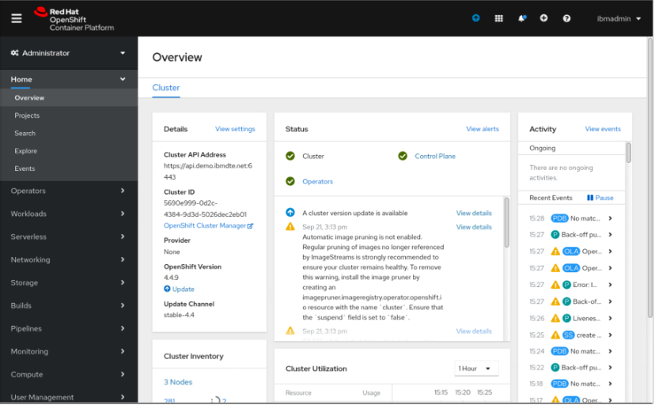

The goal of this session is to provide a quick introduction to Red Hat OpenShift Container Platform (OCP). You can start by learning some basic OCP concepts.

### 1. What is Red Hat OpenShift Container Platform
The Red Hat OpenShift Container Platform offers full access to an enterprise ready Kubernetes.  OCP includes a Kubernetes distribution that has undergone an extensive compatibility test matrix with many of the software elements you will find in your datacenter. As with the rest of the Red Hat software portfolio OCP includes service level agreements for support, bug fixes, and Common Vulnerabilities and Exposures (CVE) protection. OCP provides default security context constraints, pod security policies, best practice network and storage settings, service account configuration, SELinux integration, HAproxy edge routing configuration, and other out of the box protections needed for an enterprise deployment. OCP offers an integrated monitoring solution, based on Prometheus, that offer deep coverage and alerting of common Kubernetes’ issues.

### 2. Objective

The objectives of this lab are to help you:

* learn how to work with OCP cluster through OCP web console
* learn how to work with OCP cluster in command line

### 3.	Prerequisites

The following prerequisites must be completed prior to beginning this lab:
*	Familiarity with basic Linux commands
*	Have internet access
*	Have a SkyTap App Mod Lab environment ready

### 4.	What is Already Completed

A six Linux VMs App Mod Lab environment has been provided for this lab. 
 
  

*	The Red Hat OpenShift Container Platform (OCP) v4.6, is installed in 5 VMs, the master1 VM, the master2 VM, the master3 VM, the dns VM and the nfs VM, with 3 master nodes and 3 compute nodes (the master nodes are serving as computer nodes as well).
*	The Workstation VM is the one you will use to access and work with OCP cluster in this lab.
  The login credentials for the Workstation VM are:
  User ID: **ibmdemo**
  Password: **passw0rd**
  Note: Use the Password above in the Workstation VM Terminal for sudo in the Lab.
*	The CLI commands used in this lab are listed in the **Commands.txt** file located at the **/home/ibmdemo/add-mod-labs/dk0300st** directory of the Workstation VM for you to copy and paste these commands to the Terminal window during the lab.

### 5.	Lab Tasks

During this lab, you complete the following tasks:
*	access OCP cluster Web Console
* view OCP resources in OCP cluster Web Console
* deploy a sample app to the OCP cluster from OCP cluster web console
* work with the OCP cluster from command line

### 6.	Execute Lab Tasks

#### 6.1 Log in to the Workstation VM and get started 
1.  If the VMs are not already started, start them by clicking the play button for the whole group.

  


2.	After the VMs are started, click the Workstation VM icon to access it. 

  

  The Workstation Linux Desktop is displayed. You execute all the lab tasks on this workstation VM.

3.	If requested to log in to the Workstation OS, use credentials: **ibmdemo**/**passw0rd**
4. Open a terminal window by clicking its icon from the Desktop toolbar.

  
5. In the terminal window, run the following command to get the lab materials.

  ```
  /home/ibmdemo/get-lab-materials.sh
  ```

  Sample output

  ```
  Cloning into 'app-mod-labs'...
  warning: redirecting to https://github.com/wtistang/app-mod-labs.git/
  remote: Enumerating objects: 5693, done.
  remote: Counting objects: 100% (185/185), done.
  remote: Compressing objects: 100% (118/118), done.
  remote: Total 5693 (delta 53), reused 184 (delta 53), pack-reused 5508
  Receiving objects: 100% (5693/5693), 277.71 MiB | 57.39 MiB/s, done.
  Resolving deltas: 100% (2250/2250), done.
  Checking out files: 100% (6120/6120), done.
  ```
  
  The lab materials is downloaded to the **/home/ibmdemo/app-mod-labs** directory.
  
6. Open **File Manager** by clicking its icon on the Desktop toolbar.

  

7. Navigate to **/home/ibmdemo/app-mod-labs/dk0300st** directory and double-click to open **Commands.txt** file in the text editor.

  

  This file contains all commands used in the lab.  When you need to any command in a terminal window in the future tasks, you should come back to this file and copy/paste the command from this file, this is because you cannot directly copy and paste from your local workstation to the SkyTap workstation.
 
#### 6.2 Work with OCP cluster through OCP Web Console

##### 6.2.1 Access OCP cluster Web Console

1. Open a Firefox web browser window by clicking its icon on the Desktop toolbar.

   

2. From the browser window, click OCP cluster Web Console bookmark to open it.

   
  
3. If prompted to log in to Red Hat OpenShift Container Platform, click **htpasswd** field. Then log in with **ibmadmin**/**engageibm** as the username and password.
 
   

   

  The OCP cluster We Console page is displayed. The default view is the Cluster Overview.
  
  

4. Scroll down to view the utilization of cluster resources and cluster inventory. Click through each item in the inventory to find out more.

  Note that:

    * Nodes represent physical or virtual hardware that your Openshift cluster is running.
    * Pods are used to host and run one or more containers. Each node may run multiple pods. Containers in the same pod share the same network and storage.
    * Storage classes represent the different types of storage configured and made available for your Openshift cluster.
    * Persistent Volume Claims (PVCs) represent the usage of storage by the pods. After a pod is removed, data not persistent to persistent storage are gone.

##### 6.2.2 View OCP projects

OCP organizes deployments by **project**. A project extends a Kubernetes **namespace** by providing additional annotations, provides an easy way to observe and change all the resources such as workloads, networking, storage, etc. associated with a Project. The cluster administrator user has access to all projects and all resources.

Kubernetes namespaces provide:

  *	A unique scope to named resources to avoid naming collisions.
  * Delegated management for trusted users. 
  * The ability to limit resource consumption.

Most objects in the system are scoped by namespace, but some are excepted and have no namespace, including nodes and users.

1.	Click **Projects** on the left navigation menu to access the Projects page.
 
   

2.	Click the **default** project from the list.
 
   
  
  The **default** project **Overview** page is displayed.

   
 
3.	Click on each of the tabs of the project to view its details. 

  Note that: 
    
    * The YAML tab shows the YAML representation of the project. Every resource in Openshift is represented as a REST data structure. you will be working with YAML files a lot more when interacting with Openshift via the command line. 
    * The Role Bindings tab shows you the security configurations that apply to your project. For now, just take notice that there are many different roles already defined when a project is created. Each of these roles is used for a different purpose, and already mapped to different users and groups, or service accounts.

4. Click **Details**>**Annotations**.

   
 
5. As previously stated, a OCP project extends a Kubernetes namespace with additional annotations and associates Kubernetes artifacts to the project. Click **Cancel** to exit this view.

   

#### 6.2.3 Create a OCP project

You can create a OCP project from the OCP web console or in command line. In this task you create a project from the OCP web console.

1.	Click **Projects** and click **Create Project**.

    

2.	Enter **dk0300st** for both the Name and Display Name, and **my lab dk0300st** as Description then click **Create**.
 
   

  The project **dk0300st** is created.
  
   

#### 6.2.4 Create a sample application 

Once you have the project create in OCP cluster, you are ready to deploy your first application.

The typical artifacts you will need to run an application in Openshift are:
  * A container image containing your application, hosted in a container registry
  * One or more pods that specifies where to fetch an image and how it should be hosted.
  * A deployment to control the number of instances pods. You don't normally configure a pod directly. Instead, you configure a deployment to manage a set of pods.
  * A service that exposes the application within the internal network, and enables the application to be load balanced within the Openshift cluster.
  * A route or ingress to make the application accessible outside of the Openshift cluster firewall.

   

1. Make sue that you are in the **dk0300st** project scope, then from the **Workloads**, click **Deployments**, followed by **Create Deployment**:

   

2. Note that the console shows you the YAML file for the deployment. Change the number of replicas from default **3** to **2**, then click **Create**:

   

  Here is the specification of the deployment in its entirety:

  ```
  apiVersion: apps/v1
  kind: Deployment
  metadata:
    name: example
    namespace: dk0300st
  spec:
    selector:
      matchLabels:
        app: hello-openshift
    replicas: 2
    template:
      metadata:
        labels:
          app: hello-openshift
      spec:
        containers:
          - name: hello-openshift
            image: openshift/hello-openshift
            ports:
              - containerPort: 8080
  ```

3. Review this resource:

    - Every resource in Openshift has a group, version, and kind. For the **Deployment** resource:
      - The group is **apps**
      - The version is **v1**
      - The kind is **Deployment**
    - The metadata specifies data that is needed for the runtime:
      - The name of this instance is **example**
      - The namespace where the resource is running is **dk0300st**
      - Though not shown here, any labels associated with the resource. We will see the use of labels later.
    - The **spec** section defines the details specific to this kind of resource:
      - The **selector** defines details of the **pods** that this **deployment** will manage. The **matchLabels** attribute with value **app: hello-openshift** means this **deployment** instance will search for and manage all pods whose labels contain **app: hello-openshift**.
    - The **replicas: 2**  field specifies the number of instances to run.
    - The **template** section describes information about how to run the container image and create the **pods**:
      - The **labels** section specifies what labels to add to the pods being to be created. Note that it matches the labels defined in the **selector**.
      - The **containers** section specifies where to fetch the container image and which ports to expose. For our example, the image to run is **openshift/hello-openshift**.
    
4. Wait for both pods to be running:

    

5. Click on the YAML tab, and note the additions to the original input YAML file.

    

    Here is a sample YAML after the deployment is created :

    ```
    kind: Deployment
    apiVersion: apps/v1
    metadata:
      annotations:
        deployment.kubernetes.io/revision: '1'
      selfLink: /apis/apps/v1/namespaces/dk0300st/deployments/example
      resourceVersion: '2202243'
      name: example
      uid: 48bbff65-27d5-4823-9734-7d90e9a4a007
      creationTimestamp: '2021-07-09T19:16:28Z'
      generation: 1
      managedFields:
        - manager: Mozilla
          operation: Update
          apiVersion: apps/v1
          time: '2021-07-09T19:16:28Z'
          fieldsType: FieldsV1
          fieldsV1:
            'f:spec':
              'f:progressDeadlineSeconds': {}
              'f:replicas': {}
              .....
        - manager: kube-controller-manager
          operation: Update
          apiVersion: apps/v1
          time: '2021-07-09T19:16:32Z'
          fieldsType: FieldsV1
          fieldsV1:
            'f:metadata':
              'f:annotations':
                .: {}
                'f:deployment.kubernetes.io/revision': {}
            .....
      namespace: dk0300st
    spec:
      replicas: 2
      selector:
        matchLabels:
          app: hello-openshift
      template:
        metadata:
          creationTimestamp: null
          labels:
            app: hello-openshift
        spec:
          containers:
            - name: hello-openshift
              image: openshift/hello-openshift
              ports:
                - containerPort: 8080
                  protocol: TCP
              resources: {}
              terminationMessagePath: /dev/termination-log
              terminationMessagePolicy: File
              imagePullPolicy: Always
          restartPolicy: Always
          terminationGracePeriodSeconds: 30
          dnsPolicy: ClusterFirst
          securityContext: {}
          schedulerName: default-scheduler
      strategy:
        type: RollingUpdate
        rollingUpdate:
          maxUnavailable: 25%
          maxSurge: 25%
      revisionHistoryLimit: 10
      progressDeadlineSeconds: 600
    status:
      observedGeneration: 1
      replicas: 2
      updatedReplicas: 2
      readyReplicas: 2
      availableReplicas: 2
      conditions:
        - type: Available
          status: 'True'
          lastUpdateTime: '2021-07-09T19:16:32Z'
          lastTransitionTime: '2021-07-09T19:16:32Z'
          reason: MinimumReplicasAvailable
          message: Deployment has minimum availability.
        - type: Progressing
          status: 'True'
          lastUpdateTime: '2021-07-09T19:16:32Z'
          lastTransitionTime: '2021-07-09T19:16:28Z'
          reason: NewReplicaSetAvailable
          message: ReplicaSet "example-5fb6876865" has successfully progressed.
    ```

  Note that:

    - There are quite a bit more **metadata**. Metadata may be added by any number of controllers as needed to help with their function.
    - The **spec** has more attributes filled in as well. These are default values that were not specified in our original YAML file. But sometimes it is also possible that some values are overridden by background admission controllers.
    - The **status** sub-resource is how Openshift communicates that status of the resource. The **status** is updated regularly as the underlying state of the resource changes.

6. Click on **Workloads**>**Pods**. 

  Note that the pods resources are managed by the controller for your **deployment**.  You do not create the pod resources yourself. That is the reason that **Pods** tab is under the **deployment** resource you just created.

    

8. Click on one of the pods:

    

9. Explore the various tabs for the pod.

    

   - Overview: displays the overall resource usage for your pod. Note that for CPU usage, the unit is m, or milli-core, which is 1/1000th of one core.
   - YAML: examine the YAML that describes your pod. This YAML is created by the deployment controller based on the specification you supplied in your deployment. Note that labels associated with your pod are what you had specified in the deployment.
   - Environment: lists the environment variables defined for your pod. For your **hello-openshift** pod, there is none.
   - Logs: shows the console log for your container. Note that it is the same log as the log from the Introduction to Docker lab, as the same image is being used.
   - Terminal: Opens a remote shell into your container. As with the Introduction to Docker lab, no shell is available within the container for this image. This makes it more secure, but also more difficult to debug.

#### 6.2.5 Create a service for the application in the OCP cluster

A service enables the pods you just created to be load balanced within the Openshift cluster. 

1. Scroll down to the **Networking** tab on the left navigation, click **Services**, then click **Create Service**:

    

2. Update the YAML parameters as follows, then click **Create**:
    
    - Under spec.selector, 
      - change **MyApp** to **hello-openshift**. 
      - This is how the service will find the pods to load balance. Therefore, it matches the labels (**spec.selector.matchLabels**) that we used when creating the deployment for the hello-openshift application.
    - Under spec.ports, 
      - change **80** to **8080** and 
      - change **9376** to **8080** (the same ports we used previously).

  

3. After the service is created, click on the YAML tab:

    

    The YAML file looks like:
    ```
    kind: Service
    apiVersion: v1
    metadata:
      name: example
      namespace: dk0300st
      selfLink: /api/v1/namespaces/dk0300st/services/example
      uid: 15ce0c1e-6f27-4ea6-9586-a7a8fbb7a724
      resourceVersion: '2211781'
      creationTimestamp: '2021-07-09T19:36:15Z'
      managedFields:
        - manager: Mozilla
          operation: Update
          apiVersion: v1
          time: '2021-07-09T19:36:15Z'
          fieldsType: FieldsV1
          fieldsV1:
            'f:spec':
              'f:ports':
                .: {}
                'k:{"port":8080,"protocol":"TCP"}':
                  .: {}
                  'f:port': {}
                  'f:protocol': {}
                  'f:targetPort': {}
              'f:selector':
                .: {}
                'f:app': {}
              'f:sessionAffinity': {}
              'f:type': {}
    spec:
      ports:
        - protocol: TCP
          port: 8080
          targetPort: 8080
      selector:
        app: hello-openshift
      clusterIP: 172.30.23.104
      type: ClusterIP
      sessionAffinity: None
    status:
      loadBalancer: {}
    ```

  Note that for this service, there is a cluster wide IP address created, and that it is being load balanced. Also session affinity is not set for this service.

#### 6.2.6 Create a route for the application in the OCP cluster

A route exposes your internal endpoints outside your cluster's built-in firewall. 

1. Click on the **Route** tab under **Networking** in the left navigation, then click **Create Route**:

    

2. Supply inputs to the following parameters, then click **Create**:

    - Name: **example**
    - Service: **example**
    - Target Port: **8080 --> 8080 (TCP)**

    

    Note that you are ignoring TLS configuration just for the purpose of this lab.  Security will be addressed in a different lab.

3. Access the app route at the link provided under **Location**:

    

  If you have configured everything correctly, the browser will show **Hello Openshift!**. 

  Congratulations, you just deployed your first application to Openshift.

    

#### 6.2.7 Changing Replica Instances

1. Click on the **Projects** tab under **Home** from the left navigation, then click on **dk0300st**:

    

2. Scroll down to the **Inventory** section and see the resources that were created. Recall that we have created one deployment with 2 pods in the specification. We also created one service, and one route.

    

3. Click on the 2 pods:

   


4. Delete one of the pods by clicking on the menu on the right, then selecting **Delete pod**. When prompted, click **Delete**.

    

    This is not the right way to reduce number of instances. You will notice that as soon as one of the pods is being terminated, another one is being created. The reason is that the controller for the **deployment** resource knows that your specification is for 2 instances, and it honors that specification by creating another one. This also gives you automatic failure recovery should one of the pods crashes on its own.

5. To change the number of instances, you will need to change the specification of your deployment. Click on the **Workloads**>**Deployments** in the left navigation, then click on **example** deployment:

    

6. Click on the down arrow to reduce the replica size down to 1:

    

7. After the operation is completed, click on the YAML tab to view the YAML file contents:

    

    ```
    kind: Deployment
    apiVersion: apps/v1
    metadata:
      annotations:
        deployment.kubernetes.io/revision: '1'
      selfLink: /apis/apps/v1/namespaces/dk0300st/deployments/example
      resourceVersion: '2224790'
      name: example
      uid: 48bbff65-27d5-4823-9734-7d90e9a4a007
      creationTimestamp: '2021-07-09T19:16:28Z'
      generation: 2
      managedFields:
        - manager: Mozilla
          operation: Update
          apiVersion: apps/v1
          time: '2021-07-09T20:03:23Z'
          fieldsType: FieldsV1
          fieldsV1:
            'f:spec':
            ....
              'f:updatedReplicas': {}
      namespace: dk0300st
    spec:
      replicas: 1
      selector:
        matchLabels:
          app: hello-openshift
      template:
        metadata:
          creationTimestamp: null
          labels:
            app: hello-openshift
        spec:
          ....

    ```
    Note that the console had changed the REST specification on your behalf so that the replica count is now 1:

### 6.3 Work with OCP cluster through the command line

You can use both **oc**, the openshift command line tool, or **kubectl**, the Kubernetes command line tool, to interact with Openshift. 
Resources in Openshift are configured via REST data structure. **oc** extends **kubectl** and offers the same capabilities as the kubectl but it is further extended to natively support OpenShift Container Platform features, such as OpenShift resources such as DeploymentConfigs, BuildConfigs, Routes, ImageStreams, and ImageStreamTags which are specific to OpenShift distributions, and not available in standard Kubernetes.
For the command line tools, the REST data structure may be stored either in  a YAML file, or in a JSON file.
The command line tools may be used to:

- List available resources
- Create resources
- Update existing resources
- Delete resources

#### 6.3.1  Login to OCP cluster from Command Line

1. In the terminal window change directory to:  **/home/ibmdemo/app-mod-labs/dk0300st**

  ```
  cd /home/ibmdemo/app-mod-labs/dk0300st
  ```

3. Issue the **oc login** command to login to the OCP cluster:

  ```
  oc login https://api.demo.ibmdte.net:6443
  ```

  when prompted, enter the login credentials as: **ibmadmin**/**engageibm**.
  
  ```
  Authentication required for https://api.demo.ibmdte.net:6443 (openshift)
  Username: ibmadmin
  Password: 
  Login successful.

  You have access to 66 projects, the list has been suppressed. You can list all projects with ' projects'

  Using project "default".
  ``` 

#### 6.3.2 Listing OCP cluster resources

1. Use **oc api-resources** command to list all available resource kinds. 

  ```
  oc api-resources
  ```

  Note that resources in Openshift have a group, version, and kind. Some resources are global (not in a namespace), while others are scoped to a namespace. Many resources also have short names to save typing when using the command line tool. For example, you may use **cm** instead of ConfigMap as a command line parameter when the parameter is for a **KIND**.
  
  Sample output:

  ```
  NAME                                  SHORTNAMES       APIGROUP                              NAMESPACED   KIND
  bindings                                                                                     true         Binding
  componentstatuses                     cs                                                     false        ComponentStatu
  s
  configmaps                            cm                                                     true         ConfigMap
  endpoints                             ep                                                     true         Endpoints
  events                                ev                                                     true         Event
  limitranges                           limits                                                 true         LimitRange
  namespaces                            ns                                                     false        Namespace
  nodes                                 no                                                     false        Node
  ```

2. List all projects with the following command:

  ```
  oc get projects
  ```
  Example output:
  ```
  NAME          DISPLAY NAME   STATUS
  default                      Active
  ibm-observe                  Active
  kube-node-lease              Active
  kube-public                  Active
  kube-system                  Active
  ...
  ```


3. List all pods in all namespaces:

  ```
  oc get pods --all-namespaces
  ```
  Sample output:
  ```
  NAMESPACE                                          NAME                                                              READY   STATUS      RESTARTS   AGE
  default                                            ibm-toolkit-h9z8n                                                 0/1     Completed   0          3d6h
  dk0200st                                           simpleapp                                                         1/1     Running     0          175m
  dk0300st                                           example-5fb6876865-mtpmt                                          1/1     Running     0          118m
  nfs-storage                                        nfs-client-provisioner-7bd5cb954-bznt4                            1/1     Running     0          29h
  openshift-apiserver-operator                       openshift-apiserver-operator-67fbc98b9d-27xsx                     1/1     Running     0          29h
  openshift-apiserver                                apiserver-7b65f5d4b6-9fcwd                                        2/2     Running     0          29h
  openshift-apiserver                                apiserver-7b65f5d4b6-jqlr7                                        2/2     Running     0          47h
  ...
  ```

4.  List all cluster nodes:

  ```
  oc get nodes
  ```

  ```
  NAME      STATUS   ROLES           AGE    VERSION
  master1   Ready    master,worker   380d   v1.19.0+43983cd
  master2   Ready    master,worker   380d   v1.19.0+43983cd
  master3   Ready    master,worker   380d   v1.19.0+43983cd
  ```

5. List all projects with command:

  ```
  oc get projects
  ```

  ```
  NAME                                                    DISPLAY NAME   STATUS
  default                                                                Active
  ibm-cert-store                                                         Active
  ibm-system                                                             Active
  kube-node-lease  
  ....                                                      Active
  ```

6. Switch to a specific project **dk0300st** from the **default** project. 

  ```
  oc project dk0300st
  ``` 

  ```
  Now using project "dk0300st" on server "https://api.demo.ibmdte.net:6443".
  ```

#### 6.3.3 Work with existing resources

1. View the deployment you did in the section above using the OCP web console.

  ```
  oc get deployments
  ```
  ```
  NAME      READY   UP-TO-DATE   AVAILABLE   AGE
  example   1/1     1            1           2d18h
  ```
2. Check the status of deployment.

  ```
  oc get deployment example -o yaml
  ```
  
  ```
  apiVersion: apps/v1
  kind: Deployment
  metadata:
    annotations:
      deployment.kubernetes.io/revision: "1"
    creationTimestamp: "2021-07-09T19:16:28Z"
    generation: 2
    managedFields:
    - apiVersion: apps/v1
      fieldsType: FieldsV1
      fieldsV1:
        f:spec:
          ...
      manager: Mozilla
      operation: Update
      time: "2021-07-09T20:03:23Z"
    - apiVersion: apps/v1
      fieldsType: FieldsV1
      fieldsV1:
        f:metadata:
          ....
      manager: kube-controller-manager
      operation: Update
      time: "2021-07-09T20:03:23Z"
    name: example
    namespace: dk0300st
    resourceVersion: "2224790"
    selfLink: /apis/apps/v1/namespaces/dk0300st/deployments/example
    uid: 48bbff65-27d5-4823-9734-7d90e9a4a007
  spec:
    progressDeadlineSeconds: 600
    replicas: 1
    revisionHistoryLimit: 10
    selector:
      matchLabels:
        app: hello-openshift
    strategy:
      rollingUpdate:
        maxSurge: 25%
        maxUnavailable: 25%
      type: RollingUpdate
    template:
      metadata:
        creationTimestamp: null
        labels:
          app: hello-openshift
      spec:
        containers:
        - image: openshift/hello-openshift
          imagePullPolicy: Always
          name: hello-openshift
          ports:
          - containerPort: 8080
            protocol: TCP
          ...
  status:
    availableReplicas: 1
    conditions:
    - lastTransitionTime: "2021-07-09T19:16:28Z"
      lastUpdateTime: "2021-07-09T19:16:32Z"
      message: ReplicaSet "example-5fb6876865" has successfully progressed.
      reason: NewReplicaSetAvailable
      status: "True"
      type: Progressing
    - lastTransitionTime: "2021-07-09T19:57:13Z"
      lastUpdateTime: "2021-07-09T19:57:13Z"
      message: Deployment has minimum availability.
      reason: MinimumReplicasAvailable
      status: "True"
      type: Available
    observedGeneration: 2
    readyReplicas: 1
    replicas: 1
    updatedReplicas: 1

  ```

3. List the running pods created by the controller for the deployment.

  ```
  oc get pods
  ```

  ```
  NAME                      READY   STATUS    RESTARTS   AGE
  example-5fb6876865-mtpmt   1/1     Running   0          2d18h
  ```

4. Get the detail information of the pod.

  ```
  oc describe pod example-5fb6876865-mtpmt
  ```
  ```
  Name:         example-5fb6876865-mtpmt
  Namespace:    dk0300st
  Priority:     0
  Node:         master1/10.0.0.111
  Start Time:   Fri, 09 Jul 2021 12:16:28 -0700
  Labels:       app=hello-openshift
                pod-template-hash=5fb6876865
  Annotations:  k8s.v1.cni.cncf.io/network-status:
                  [{
                      "name": "",
                      "interface": "eth0",
                      "ips": [
                          "10.128.0.14"
                      ],
                      "default": true,
                      "dns": {}
                  }]
                k8s.v1.cni.cncf.io/networks-status:
                  [{
                      "name": "",
                      "interface": "eth0",
                      "ips": [
                          "10.128.0.14"
                      ],
                      "default": true,
                      "dns": {}
                  }]
                openshift.io/scc: restricted
  Status:       Running
  IP:           10.128.0.14
  IPs:
    IP:           10.128.0.14
  Controlled By:  ReplicaSet/example-5fb6876865
  Containers:
    hello-openshift:
      Container ID:   cri-o://72d60b9a47ff457d0ae60a30e7aed7b3809251989de6ebcf6725731f9645da7d
      Image:          openshift/hello-openshift
      Image ID:       docker.io/openshift/hello-openshift@sha256:aaea76ff622d2f8bcb32e538e7b3cd0ef6d291953f3e7c9f556c1ba5baf47e2e
      Port:           8080/TCP
      Host Port:      0/TCP
      State:          Running
        Started:      Mon, 12 Jul 2021 06:12:54 -0700
      Ready:          True
      Restart Count:  0
      Environment:    <none>
      Mounts:
        /var/run/secrets/kubernetes.io/serviceaccount from default-token-twzqj (ro)
  Conditions:
    Type              Status
    Initialized       True 
    Ready             True 
    ContainersReady   True 
    PodScheduled      True 
  Volumes:
    default-token-twzqj:
      Type:        Secret (a volume populated by a Secret)
      SecretName:  default-token-twzqj
      Optional:    false
  QoS Class:       BestEffort
  Node-Selectors:  <none>
  Tolerations:     node.kubernetes.io/not-ready:NoExecute op=Exists for 300s
                  node.kubernetes.io/unreachable:NoExecute op=Exists for 300s
  Events:
    Type    Reason   Age   From     Message
    ----    ------   ----  ----     -------
    Normal  Pulling  19m   kubelet  Pulling image "openshift/hello-openshift"
    Normal  Pulled   19m   kubelet  Successfully pulled image "openshift/hello-openshift" in 1.147946396s
    Normal  Created  19m   kubelet  Created container hello-openshift
    Normal  Started  19m   kubelet  Started container hello-openshift

  ```

5. Show the logs of the pod.

  ```
  oc logs example-5fb6876865-mtpmt
  ```

  ```
  serving on 8888
  serving on 8080
  Servicing request.
  Servicing request.
  Servicing request.
  Servicing request.
  serving on 8888
  serving on 8080
  ```

#### 6.3.4 Changing Replica Instance

1. List pods.

  ```
  oc get pods
  ```

  ```
  NAME                      READY   STATUS    RESTARTS   AGE
  example-5fb6876865-mtpmt   1/1     Running   0          2d18h
  ```

2. Delete the pod with command **oc delete pod PODNAME**

  ```
  oc delete pod example-5fb6876865-mtpmt
  ```

  ```
  pod "example-5fb6876865-mtpmt" deleted
  ```

3. List pods again with command **oc get pods** and note that a new instance of the pod has been created as expected. The deployment specified 1 instance, so the controller tries to maintain 1 instance.

  ```
  NAME                      READY   STATUS    RESTARTS   AGE
  example-5fb6876865-qkj4r   1/1     Running   0          13s    example-75778c488-rhjrx   1/1     Running   0          28s
  ```

4. To increse the number of pod instances, we can patch the resource in one of two ways:
   - Scripted patch using the **patch** option of the command line:
      ```
      oc patch deployment example -p '{ "spec": { "replicas": 1 } }'
      ```
   - Interactive patch using the **edit** option of the command line through **vi** editor:
      ```
      oc edit deployment example
      ```
      Under the **spec** section (not under the **status** section), change **replicas: 1** to **replicas: 2**, and save the change (by **:wq**).

    

      The output:
      ```
      deployment.extensions/example edited
      ```

      Note: The above edits the copy that is stored in Openshift.

  Once the change is made, it will be applied to the pod automatically.
5. List the pods to show only 1 pod is running: **oc get pods**.

    ```
    NAME                       READY   STATUS    RESTARTS   AGE
    example-5fb6876865-76klt   1/1     Running   0          16s
    example-5fb6876865-qkj4r   1/1     Running   0          8m23s
    ```

#### 6.3.5 Deploy new applications

You can also using **oc** commands to deploy applications to OCP cluster, the deployment process is simliar to the Kubernetes deployment introduced in the **[DK0200 - Kubernetes Introduction](/labs/basic-labs/dk0200-kubernetes101/)** Lab, you just need to replace the **kubectl** with **oc** in the commands.  If you are intrested, please learn from the  **[DK0200 - Kubernetes Introduction](/labs/basic-labs/dk0200-kubernetes101/)** Lab.


### 7.	Summary
In this lab, you have learned some basic features and functions of Red Hat OpenShift Container Platform (OCP) and how to use them. To learn more about App Mod and DevOps, please continue with the rest of the lab series.

**Congratulations! You have successfully completed OCP Introduction Lab!**

