The goal of this session is to provide a hands-on experience with ArgoCD.

### 1. Argocd Introduction
Continuous Integration, Delivery, and Deployment are important devOps practices. These processes are valuable and ensures that the software is up to date timely.
* Continuous Integration is an automation process which allows developers to integrate their work into a repository. When a developer pushes his work into the source code repository, it ensures that the software continues to work properly. It helps to enable collaborative development across the teams and also helps to identify the integration bugs sooner.
* Continuous Delivery comes after Continuous Integration. It prepares the code for release. It automates the steps that are needed to deploy a build.
* Continuous Deployment is the final step which succeeds Continuous Delivery. It automatically deploys the code whenever a code change is done. Entire process of deployment is automated.

GitOps in short is a set of practices to use Git pull requests to manage infrastructure and application configurations. Git repository in GitOps is considered the only source of truth and contains the entire state of the system so that the trail of changes to the system state are visible and auditable.
* Traceability of changes in GitOps is no novelty in itself as this approach is almost universally employed for the application source code. However GitOps advocates applying the same principles (reviews, pull requests, tagging, etc) to infrastructure and application configuration so that teams can benefit from the same assurance as they do for the application source code.
* Although there is no precise definition or agreed upon set of rules, the following principles are an approximation of what constitutes a GitOps practice:

ArgoCD is a declarative, GitOps continuous delivery tool for Kubernetes. Applications, application definitions, configurations, and environments should be declarative and version controlled. Also application deployment and lifecycle management should be automated, auditable, and easy to understand. All this can be done using Argo. Check these guides out if you want to know more about Argo - [Argo CD - Declarative GitOps CD for Kubernetes](https://argoproj.github.io/argo-cd/).

### 2. Objective

The objectives of this lab are to help you:

* learn how to deploy application to OCP cluster using ArgoCD UI
* learn how to work with ArgoCD in command line

### 3.	Prerequisites

The following prerequisites must be completed prior to beginning this lab:
*	Familiarity with basic Linux commands
*	Have internet access
*	Have a SkyTap App Mod Lab environment ready

### 4.	What is Already Completed

A six Linux VMs App Mod Lab environment has been provided for this lab. 
 
  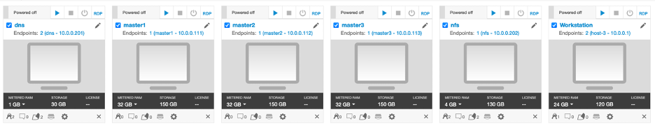

*	The Red Hat OpenShift Container Platform (OCP) v4.6, is installed in 5 VMs, the master1 VM, the master2 VM, the master3 VM, the dns VM and the nfs VM, with 3 master nodes and 3 compute nodes (the master nodes are serving as computer nodes as well).
*	The Workstation VM is the one you will use to access and work with OCP cluster in this lab.
  The login credentials for the Workstation VM are:
  User ID: **ibmdemo**
  Password: **passw0rd**
  Note: Use the Password above in the Workstation VM Terminal for sudo in the Lab.
*	The CLI commands used in this lab are listed in the **Commands.txt** file located at the **/home/ibmdemo/add-mod-labs/dv0100st** directory of the Workstation VM for you to copy and paste these commands to the Terminal window during the lab.

### 5.	Lab Tasks

During this lab, you complete the following tasks:
*	access ArgoCD UI
* deploy a sample app to the OCP cluster from ArgoCD UI
* work with the ArgoCD from command line

### 6.	Execute Lab Tasks

#### 6.1 Log in to the Workstation VM and get started 
1.  If the VMs are not already started, start them by clicking the play button for the whole group.

  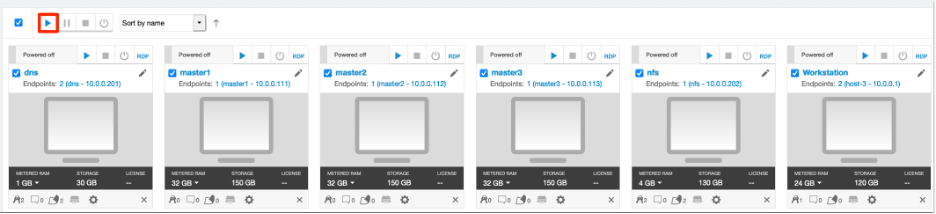


2.	After the VMs are started, click the Workstation VM icon to access it. 

  

  The Workstation Linux Desktop is displayed. You execute all the lab tasks on this workstation VM.

3.	If requested to log in to the Workstation OS, use credentials: **ibmdemo**/**passw0rd**

#### 6.2 Deploy application in ArgoCD UI

##### 6.2.1 Get ArgoCD login information from the OCP cluster
ArgoCD can be install to the OpenShift Container Platform (OCP) clsuter with ArgoCD operator or from the command line.  

In this lab environment, the ArgoCD is installled to the OCP cluster using IBM Cloud Native Toolkit. The Cloud-Native Toolkit is an open-source collection of assets that enable application development and support teams to deliver business value quickly using Red Hat OpenShift or IBM Cloud-managed Kubernetes. This guide provides information to help Developers, Administrators, and Site Reliability Engineers use the Toolkit to support delivering business applications through the entire Software Development Life Cycle (SDLC). Click the link to learn more about the [Cloud Native Toolkit](https://cloudnativetoolkit.dev).

To access the ArgoCD, you need to get its server and login credientals information.

1. Open a terminal window by clicing its icon from the Desktop toolbar.

  

2. From the termical window, issue the **oc login** command to login to the OCP cluster:

  ```
  oc login https://api.demo.ibmdte.net:6443
  ```

  when promted, enter the login credientials as: **ibmadmin**/**engageibm**.
  
  ```
  Authentication required for https://api.demo.ibmdte.net:6443 (openshift)
  Username: ibmadmin
  Password: 
  Login successful.

  You have access to 66 projects, the list has been suppressed. You can list all projects with ' projects'

  Using project "default".
  ``` 
3. Get ArgoCD username info:

  ```
  export ARGOCD_USER=$(oc get secret argocd-access -n tools -o jsonpath='{.data.ARGOCD_USER}' | base64 -d)
  echo $ARGOCD_USER
  ```
4. Get ArgoCD password info:
  ```
  export ARGOCD_PASSWORD=$(oc get secret argocd-access -n tools -o jsonpath='{.data.ARGOCD_PASSWORD}' | base64 -d)
  echo $ARGOCD_PASSWORD
  ```
5. Get AroCD server info:
  
  ```
  export ARGOCD_URL=$(oc get secret argocd-access -n tools -o jsonpath='{.data.ARGOCD_URL}' | base64 -d)
  export ARGOCD_SERVER=$(echo $ARGOCD_URL|sed -E 's/^\s*.*:\/\///g')
  echo $ARGOCD_SERVER
  ```
6. Write down the ArgoCD username, password and server information.  You will use them to login to the ArgoCD server from the ArgoCD UI and from the commandline.
##### 6.2.2 Deploy app through ArgoCD UI
1. Open a Firefox web browser window by clicking its icon on the Desktop toolbar.

   
2. From the browser window, click the Could Native Toolkit **Developer Dashboard** bookmark to open it.

  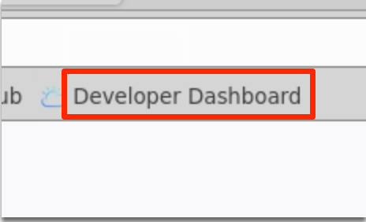 
  
3. Click **Open with OpenShift** to cotinue.

  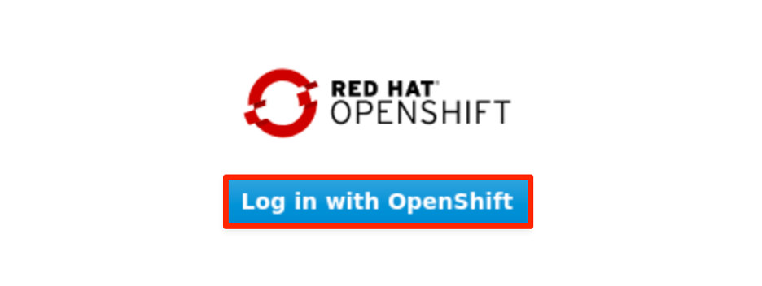

4. If prompted to log in to Red Hat OpenShift Container Platform, click **htpasswd** field. Then log in with **ibmadmin**/**engageibm** as the username and password.
 
   

   

  The IBM Cloud Native Toolkit Developer Dashboard page is displayed. 
  
  

4. Click the ArgoCD link to access the ArgoCD UI

  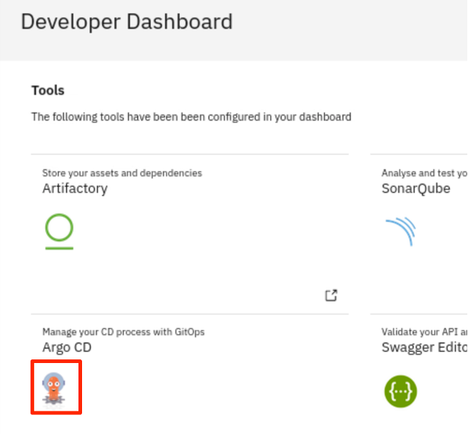 

  The ArgoCD page is dispalyed.

  

5. Login with the username and password with the information you obtained above and click **SIGN IN**.

  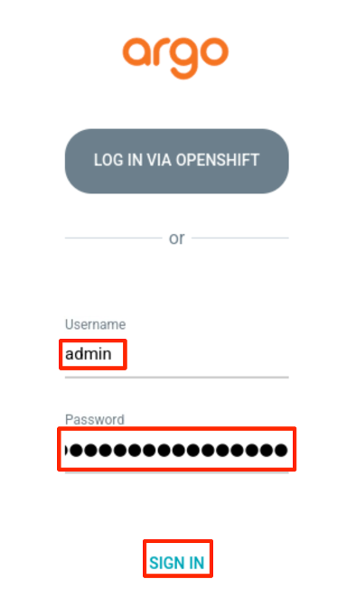
6. From the ArgoCD Home page, click **NEW APP**.

  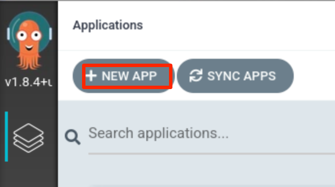

7. Add the following details and click **Create** to finish:
  * Application Name: **sample**
  * Project: **default**
  * SYNC POLICY: **Manual**
  * REPO URL: **https://github.com/ibm-cloud-architecture/cloudnative_sample_app_deploy**
  * Revision: **HEAD**
  * Path: **openshift**
  * Cluster: **https://kubernetes.default.svc** 
  * Namespace: **default**

  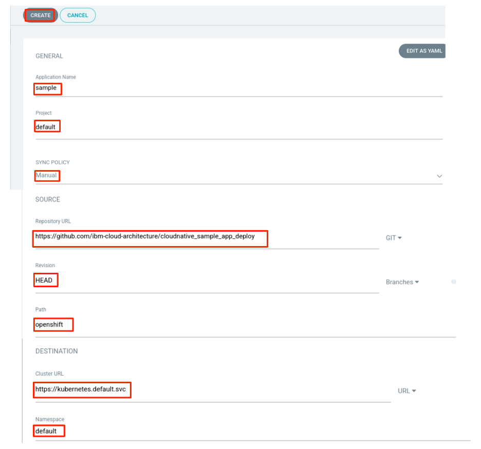

  You will now see the available apps. Initially, the app will be out of sync. It is yet to be deployed. You need to sync it for deploying.

   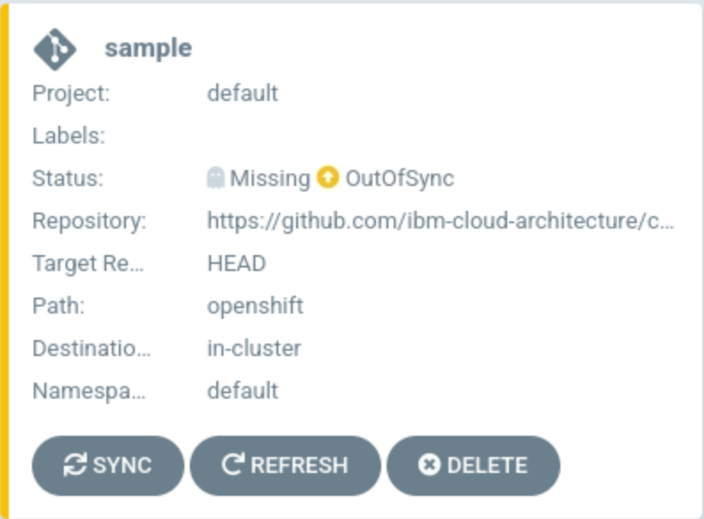

8. To sync the application, click **SYNC** and then click **SYNCHRONIZE**.

  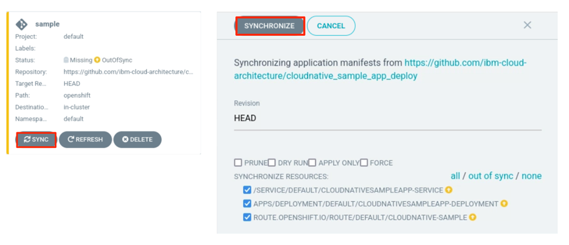

  Once the sync is done, the deployment process gets started. Wait till the app is deployed.

  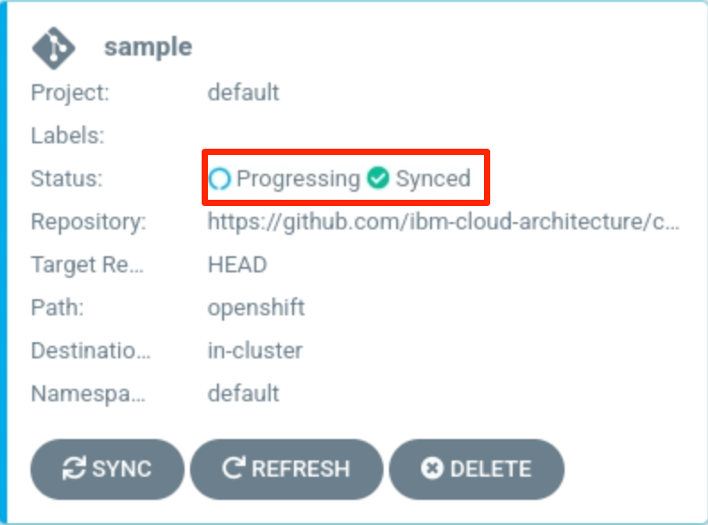

9. Once the app is deployed, click on it to see the details.

  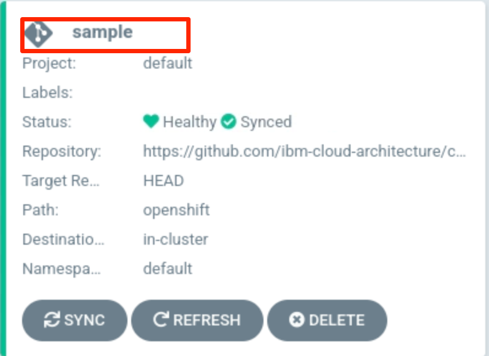

10. In the **APPLICATION DETAILS** page, click each deployment block to view its detail information.

  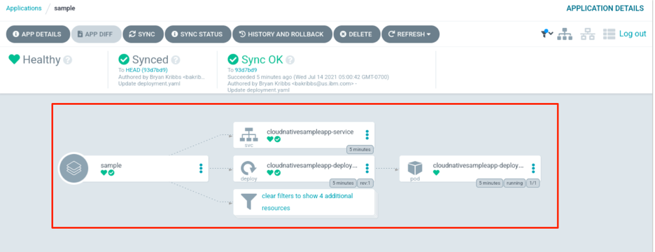

##### 6.2.3 Verify the deployment
Access the app to verify if it is correctly deployed.

1. Go back to the terminal window, list the **cloudnativesampleapp-service** route with command.

  ```
  oc get route -n default
  ```
  
  It should have a hostname under **HOST/PORT** column

  ```
  NAME                 HOST/PORT                                         PATH   SERVICES                       PORT   TERMINATION   WILDCARD
  cloudnative-sample   cloudnative-sample-default.apps.demo.ibmdte.net          cloudnativesampleapp-service   9080                 None
  ```

2. Set an environment variable **APP_URL** using the **HOST/PORT**.

  ```
  export APP_URL="http://$(oc get route cloudnative-sample -o jsonpath='{.status.ingress[0].host}')"
  echo ARGOCD_SERVER=$APP_URL
  ```
  
  The output is:

  ```
  ARGOCD_SERVER=http://cloudnative-sample-default.apps.demo.ibmdte.net
  ```
  
3. Access the app url using curl:

  ```
  curl "$APP_URL/greeting?name=Carlos"
  ```
  
  The output is:
  
  ```
  {"id":2,"content":"Welcome to Cloudnative bootcamp !!! Hello, Carlos :)"}
  ```

  You have verified that the deployment is successful.
#### 6.3 Using the ArgoCD CLI
1. Login using the cli.

  ```
  argocd login --username $ARGOCD_USER --password $ARGOCD_PASSWORD $ARGOCD_SERVER
  ```
2. when you see the message like this, type **y** and press **ENTER** to continue.

  ```
  WARNING: server certificate had error: x509: cannot validate certificate for 10.97.240.99 because it doesn't contain any IP SANs. Proceed insecurely (y/n)? y

  'admin' logged in successfully
  ```
3. List the applications

  ```
  argocd app list
  ```
  ```
  NAME    CLUSTER                         NAMESPACE  PROJECT  STATUS  HEALTH   SYNCPOLICY  CONDITIONS  REPO                                                                     PATH   TARGET
  sample  https://kubernetes.default.svc  default    default  Synced  Healthy  <none>      <none>      https://github.com/ibm-cloud-architecture/cloudnative_sample_app_deploy  openshift  HEAD
  ```
4. Get application details

  ```
  argocd app get sample
  ```
  
  ```
  Name:               sample
  Project:            default
  Server:             https://kubernetes.default.svc
  Namespace:          default
  URL:                https://10.97.240.99/applications/sample
  Repo:               https://github.com/ibm-cloud-architecture/cloudnative_sample_app_deploy
  Target:             HEAD
  Path:               openshift
  SyncWindow:         Sync Allowed
  ```

5. Show application deployment history

  ```
  argocd app history sample
  ```
  
  ```
  ID  DATE                           REVISION
  0   2021-02-12 21:10:32 -0500 EST  HEAD (9684037)
  ```

### 7.	Summary
In this lab, you have learned some basic features and functions of ArgoCD and how to use it. To learn more about App Mod and DevOps, please continue with the rest of the lab series.

**Congratulations! You have successfully completed ArgoCD Introduction Lab!**

