The goal of this session is to provide a hands-on experience on how to work with OpenShift Serverless Serving.

### 1. OpenShift Serverless Serving Introduction
OpenShift Serverless is based on Knative, an open-source project started by Google. Specifically, OpenShift Serverless uses the Serving component of Knative. Knative Serving extends Kubernetes using Custom Resource Definitions (CRDs) to support deploying and serving of serverless applications and functions. 

Knative Serving is ideal for running application services inside Kubernetes by providing a more simplified deployment syntax with automated scale-to-zero and scale-out based on HTTP load. The Knative platform will manage the service’s deployments, revisions, networking and scaling. Knative Serving exposes the service via an HTTP URL and has a lot of sane defaults for its configurations. For many practical use cases you might need to tweak the defaults to your needs and might also need to adjust the traffic distribution amongst the service revisions. As the Knative Serving Service has the built in ability to automatically scale down to zero when not in use, it is called as **serverless service**.

In this lab, you learn how to install OpenShift Serverless Operator, deploying a few serverless serving applications, and work with Knative revision, traffic distribution and scaling capabilities. You will see that Knative Serving is easy to get started with and scales to support advanced scenarios.


### 2. Objective

The objectives of this lab are to help you:

* learn how to install OpenShift Serverless Operator
* learn how to create Knative Serving application with Knative Knative Command Line Interface (CLI)
* learn how to deploy Knative Serving application
* learn how to use Knative Serving features like revision, traffic distribution and scaling

### 3.	Prerequisites

The following prerequisites must be completed prior to beginning this lab:
*	Familiarity with basic Linux commands
*	Have internet access
* Have basic knowledge of OpenShift Container Platform (OCP) web console and commandline operations
*	Have a SkyTap App Mod Lab environment ready

### 4.	What is Already Completed

A six Linux VMs App Mod Lab environment has been provided for this lab. 
 
  

*	The Red Hat OpenShift Container Platform (OCP) v4.6, is installed in 5 VMs, the master1 VM, the master2 VM, the master3 VM, the dns VM and the nfs VM, with 3 master nodes and 3 compute nodes (the master nodes are serving as computer nodes as well).
*	The workstation VM is the one you will use to access and work with OCP cluster in this lab.
  The login credentials for the workstation VM are:
  User ID: **ibmdemo**
  Password: **passw0rd**
  Note: Use the Password above in the workstation VM Terminal for sudo in the Lab.
*	The CLI commands used in this lab are listed in the **Commands.txt** file located at the **/home/ibmdemo/add-mod-labs/cn0100st** directory of the workstation VM for you to copy and paste these commands to the Terminal window during the lab.

### 5.	Lab Tasks

During this lab, you complete the following tasks:
*	Install OpenShift Serverless Operator through OCP web console
* Install Knative CLI
* create a sample Knative Serving application
* deploy a Knative Serving application
* manage traffics of the Knative Serving application

### 6.	Execute Lab Tasks

#### 6.1 Log in to the workstation VM and get started 
1.  If the VMs are not already started, start them by clicking the play button for the whole group.

  


2.	After the VMs are started, click the workstation VM icon to access it. 

  

  The Workstation Linux Desktop is displayed. You execute all the lab tasks on this workstation VM.

3.	If requested to log in to the Workstation OS, use credentials: **ibmdemo**/**passw0rd**
4. Open a terminal window by clicking its icon from the Desktop toolbar.

  
5. If this is your first time to run the lab series in this lab environment, do the following, otherwise if you have already downloaded the lab materials in other labs, you can skip this step.
  
  a. In the terminal window, run the following command to get the lab materials.

  ```
  /home/ibmdemo/get-lab-materials.sh
  ```

  Sample output

  ```
  Cloning into 'app-mod-labs'...
  warning: redirecting to https://github.com/wtistang/app-mod-labs.git/
  remote: Enumerating objects: 5693, done.
  remote: Counting objects: 100% (185/185), done.
  remote: Compressing objects: 100% (118/118), done.
  remote: Total 5693 (delta 53), reused 184 (delta 53), pack-reused 5508
  Receiving objects: 100% (5693/5693), 277.71 MiB | 57.39 MiB/s, done.
  Resolving deltas: 100% (2250/2250), done.
  Checking out files: 100% (6120/6120), done.
  ```
  
  The lab materials is downloaded to the **/home/ibmdemo/app-mod-labs** directory.
  
6. Open **File Manager** by clicking its icon on the Desktop toolbar.

  

7. Navigate to **/home/ibmdemo/app-mod-labs/cn0100st** directory and double-click to open **Commands.txt** file in the text editor.

  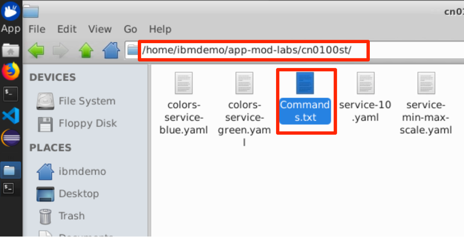

  This file contains all commands used in the lab.  When you need to enter any command in a terminal window in the lab tasks, you should come back to this file and copy/paste the command from this file, this is because you cannot directly copy and paste from your local workstation to the SkyTap workstation.
 
#### 6.2 Install OpenShift Serverless Operator

The best way to add serverless capabilities to an OpenShift cluster is by installing the OpenShift Serverless Operator. Adding the operator to an OpenShift cluster is straightforward.

1. Open a Firefox web browser window by clicking its icon on the Desktop toolbar.

   

2. From the browser window, click the **OpenShift web console** bookmark to open it.

   

3. If prompted to log in to Red Hat OpenShift Container Platform, click **htpasswd** field. Then log in with **ibmadmin**/**engageibm** as the username and password.
 
  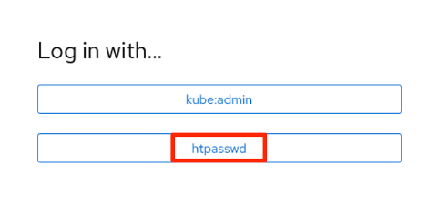 

   

  The OpenShift web console page is displayed. 
  
  

4. Set the project to **openshift-operators** and click **Operators** > **Operator Hub** menu item.

  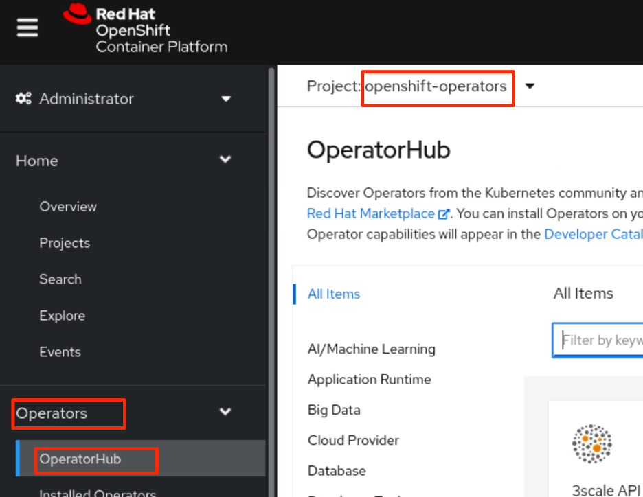

5. Search for **OpenShift Serverless** in the **Filter by keyword** search box. The Red Hat OpenShift Serverless Operator is shown.

  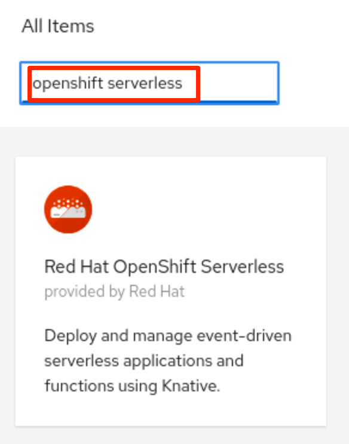

6. Click **OpenShift Serverless Operator** to start installing. 

  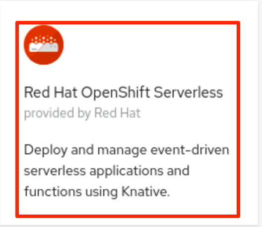

7. Review all information on the page and click **Install**.

  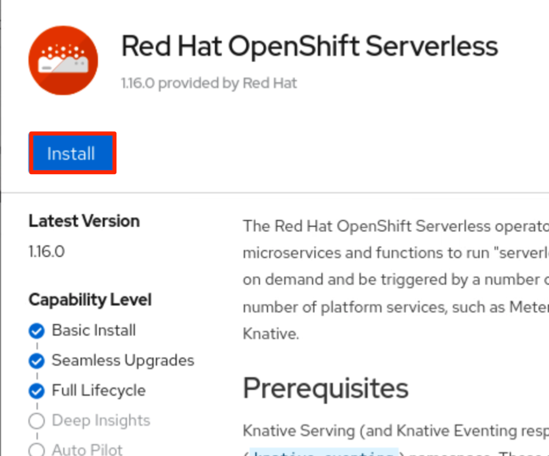

8. Accept all the default options and click **Install**.

  

  The installation process is started. OpenShift Serverless Operator depends on Red Hat OpenShift Service Mesh, which in turn depends on Elasticsearch, Jaeger, and Kiali. Wait till the Status column for all operators has a green checkmark indicating InstallSucceeded.

9. Once the installation is completed, click **View Operator** to view its details.

  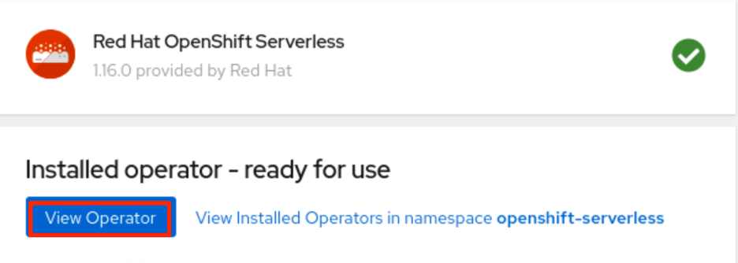

#### 6.3 Create Serverless Serving Object

1. Navigate to **Operators**>**Installed Operators** and change the project to **knative-serving**. This is where the Knative Serving object that manages all serverless applications on your cluster will live.

  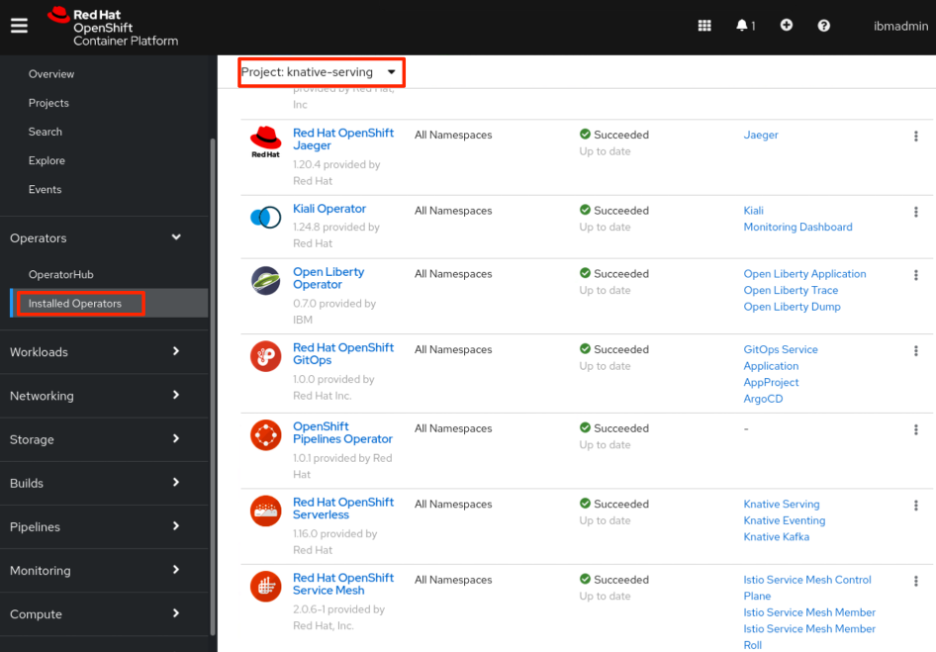

  You see that all the operators installed in openshift-operators project get copied here.

2. Click on the **OpenShift Serverless Operator** to access its details page.

3. In the Operator Details view, click the **Knative Serving** tab link. If the view shows a 404 page, just refresh after a few seconds.

  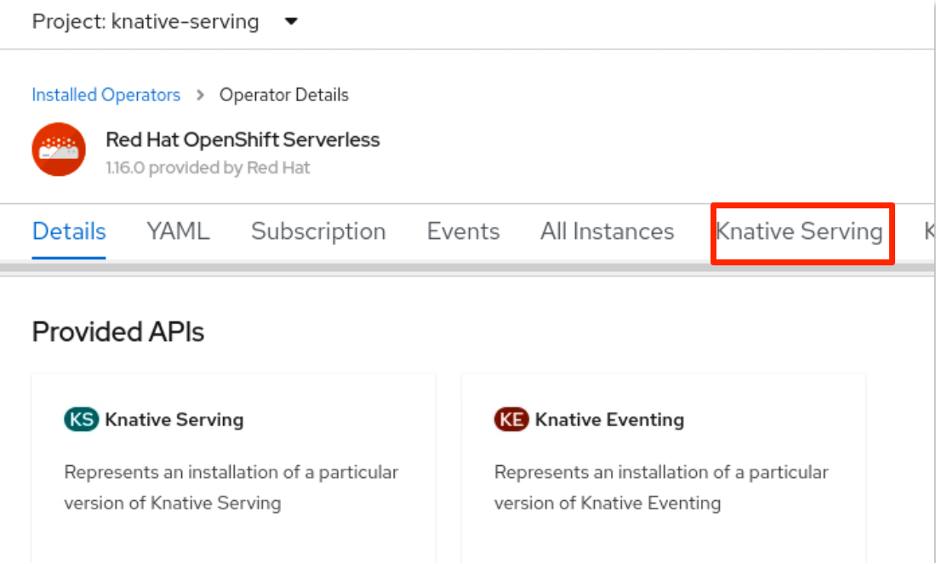

4. Click the **Create Knative Serving** button. 

  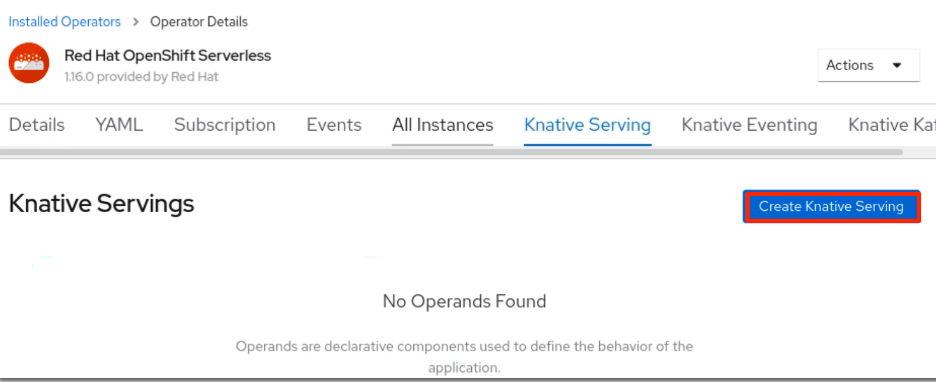

5. In the Create Knative Serving form view, click **Create** to create the Serving object using the default out-of-box YAML file.

  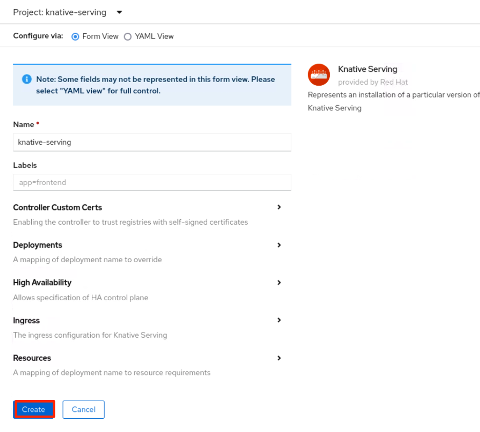

  After a few minutes, Knative Serving object is created.

  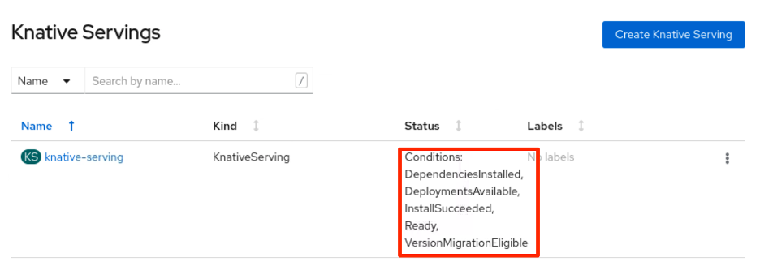 
  
  Once the Knative Serving object is created, users on your cluster can start deploying serverless applications. 

#### 6.4 Download Knative CLI

You need to have the Knative client (**kn**) to work with Knative, **kn** allows you to create Knative resources interactively from the command line or from within scripts.

After you installed the Red Hat OpenShift Serverless operator and created Serverless Serving Object in the OCP cluster, you can download the Knative client from the OCP web console.

1. Click the **?** icon on the top right of the web console page and click **Command Line Tools** link.

  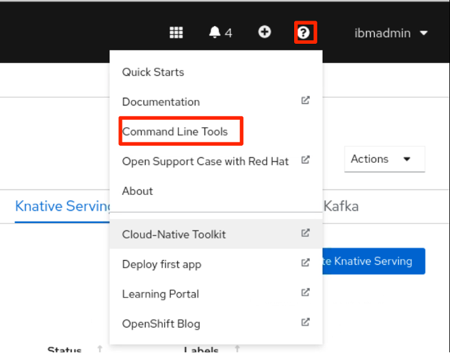 

1. Scroll down to **kn - OpenShift Serverless Command Line Interface (CLI)** section and click **Download for Linux for x86_64** link.

   

1. If you see the **Warning: Potential Security Risk Ahead** message, click **Advanced**>**Accept the Risk and continue**.
     
1. Click **Save File** option and click **OK**.

  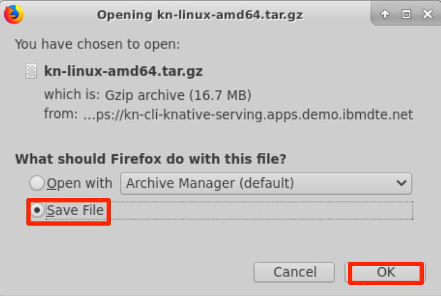 

  The Knative CLI package is saved to **/home/ibmdemo/Downloads** directory.

1. Run the commands below to unpack the Knative CLI and set it up.

  ```
  cd /home/ibmdemo/Downloads
  tar xvzf kn-linux-amd64.tar.gz
  sudo mv kn /usr/local/bin/kn
  ```
  If prompted, enter the **sudo** password as: **passw0rd**. 

1. To verify the Knative CLI installation, issue the following command:

  ```
  kn version
  ```

  Sample output:

  ```
  Version:      v0.22.0
  Build Date:   2021-06-24 13:34:34
  Git Revision: 1835a5fb
  Supported APIs:
  Serving
    - serving.knative.dev/v1 (knative-serving v0.22.0)
  Eventing
    - sources.knative.dev/v1alpha2 (knative-eventing v0.22.0)
    - eventing.knative.dev/v1beta1 (knative-eventing v0.22.0)
  ```

  the Knative CLI is ready to use.
#### 6.5 Create a Sample Serverless Serving Application

Once you have the Knative CLI installed, you can use it to create Knative applications.

In this task, you are going to create a simple **Greetings** Knative serving application.

1. First, create a new directory called **greetings** and navigate to it.

  ```
  cd /home/ibmdemo/app-mod-labs/cn0100st/
  mkdir greetings
  cd greetings
  ```

2. Run the following command to create a new serverless function:

  ```
  kn func create
  ``` 
  Sample output
  ``` 
  Project path: /home/ibmdemo/app-mod-labs/cn0100st/greetings
  Function name: greetings
  Runtime: node
  Template: http
  ```

  Note: By default, the function is initialized with a project template for plain HTTP requests. You can choose your programming language by entering **Node.js**, **Quarkus**, or **Go** as the value for the **-l** flag. If you do not provide a runtime with the **-l** flag, the default runtime is **Node.js**. You are using **Node.js** for this application.
  
3. Review the contents of the directory.
  ```
  ls -l
  ```
  Sample output:
  ```
  total 116
  -rw-r--r-- 1 ibmdemo ibmdemo   233 Jul 27 08:20 func.yaml
  -rw-r--r-- 1 ibmdemo ibmdemo  1468 Jul 27 08:20 index.js
  -rw-r--r-- 1 ibmdemo ibmdemo   545 Jul 27 08:20 package.json
  -rw-r--r-- 1 ibmdemo ibmdemo 95507 Jul 27 08:20 package-lock.json
  -rw-r--r-- 1 ibmdemo ibmdemo  2096 Jul 27 08:20 README.md
  drwxr-xr-x 2 ibmdemo ibmdemo  4096 Jul 27 08:20 test
  ```

4. Make the code changes in **index.js** file to add a return message of **Greeting &ltusername&gt** in the provided **handleGet(context)** method. 

  a. launch **VS Code** editor with command:
  ```
  code .
  ```

  b. Click **Yes, I trust..** to continue.

  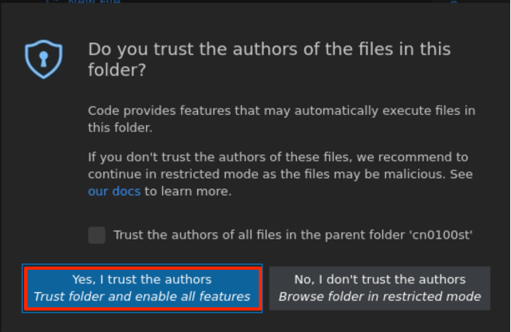

  c. Click **index.js** file to open it is the editor.

  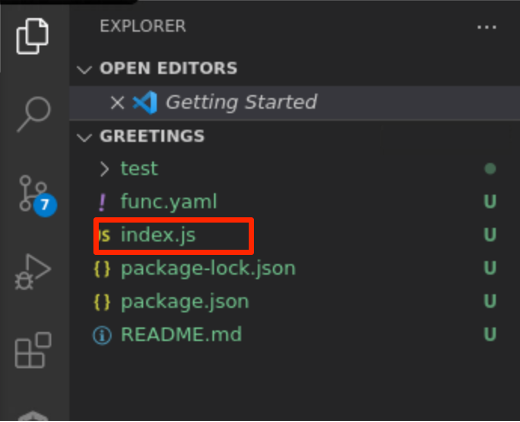

  d. Modify the **handleGet** function
  
  From:

  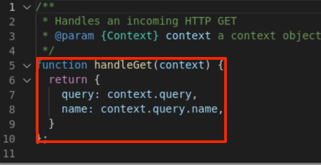
  
  To:

  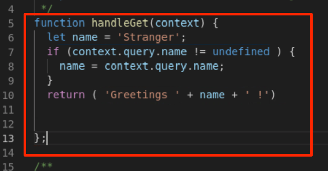

  with code: 
  ```
  function handleGet(context) {
    let name = 'Stranger';
    if (context.query.name != undefined ) {
      name = context.query.name;
    }
    return ( 'Greetings ' + name + ' !')

  };
  ```
  e. After the code change, click **File**>**Save** to change the change, then click **File**>**exit** to finish.

  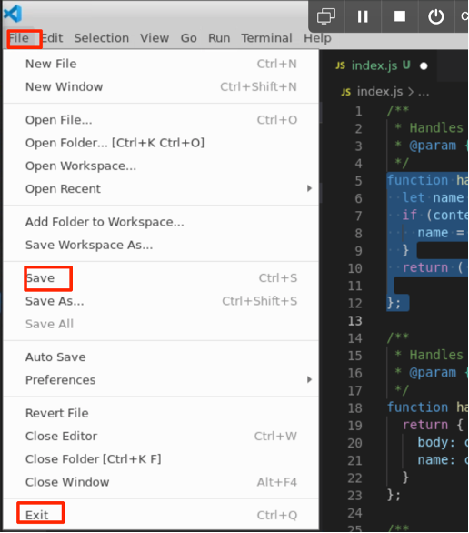

5. Build the service application with command:

  ```
  kn func build -r default-route-openshift-image-registry.apps.demo.ibmdte.net/cn0100st
  ```

  where **-r** is the image registry flag and **default-route-openshift-image-registry.apps.demo.ibmdte.net/cn0100st** is the OCP image registry to be used.

  Sample output:
  ```
  Function image built: default-route-openshift-image-registry.apps.demo.ibmdte.net/cn0100st/greetings:latest
  ```

6. Test the service application locally.

  a. Launch the service application in command line.
  ```
  kn func run
  ```
  b. In a new browser window, type **http:<snap></snap>//localhost:8080/?name=John** and press **Enter**. You see the application returns **Greetings John !** message in the **Raw Data** tab. 
  
  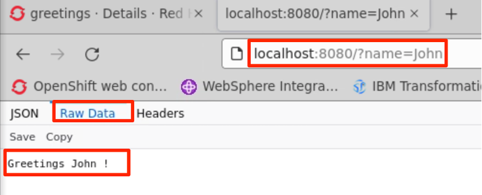
  
  You service application is working.
  
  c. Stop the service application using **CTRL-C** command.

#### 6.6 Deploy the Sample Serverless Serving Application

Next, you are going to deploy this service application to the OpenShift cluster. 

1. Issue the **oc login** command to login to the OCP cluster:

  ```
  oc login -u ibmadmin -p engageibm https://api.demo.ibmdte.net:6443
  ```

  when prompted, enter the login credentials as: **ibmadmin**/**engageibm**.
  
  Sample output:
  ```
  Authentication required for https://api.demo.ibmdte.net:6443 (openshift)
  Username: ibmadmin
  Password: 
  Login successful.

  You have access to 66 projects, the list has been suppressed. You can list all projects with ' projects'

  Using project "default".
  ``` 
2. Create a new project called **cn0100st**.

  ```
  oc new-project cn0100st
  ```
  
  Sample output:
  ```
  Now using project "cn0100st" on server "https://api.demo.ibmdte.net:6443".

  You can add applications to this project with the 'new-app' command. For example, try:

    oc new-app rails-postgresql-example

  to build a new example application in Ruby. Or use kubectl to deploy a simple Kubernetes application:

    kubectl create deployment hello-node --image=k8s.gcr.io/serve_hostname

  ```
3. Push the application image to OpenShift cluster image registry.

  Note: Knative CLI has a command **kn func deploy** to deploy the application, but it is only working with **quay.io** or **docker** image registries, so in this lab you deploy the application in the traditional way.

  a. Get OCP internal image registry URL and cluster URL with commands:

  ```
  export INTERNAL_REG_HOST=`oc get route default-route --template='{{ .spec.host }}' -n openshift-image-registry`
  export CLUSTER_URL=`echo $INTERNAL_REG_HOST | sed 's/default-route-openshift-image-registry.//g'`
  ```

  b.	Log in to the OpenShift Docker registry with the command:
    
    ```
    docker login -u $(oc whoami) -p $(oc whoami -t) $INTERNAL_REG_HOST
    ```

  c. Execute the following command to push your docker image to OpenShift image repository.

  ```
  docker push $INTERNAL_REG_HOST/`oc project -q`/greetings:latest

  ```
  When it is done, your application image is pushed to the OCP image registry.

4. Go back to OCP web console and switch to **Developer** prospective.

  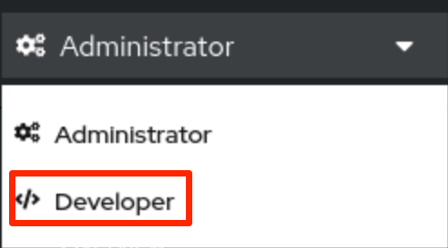

5. Set project to **cn0100st** and click **+Add**>**Container Image** to deploy the application from the container image you uploaded.

  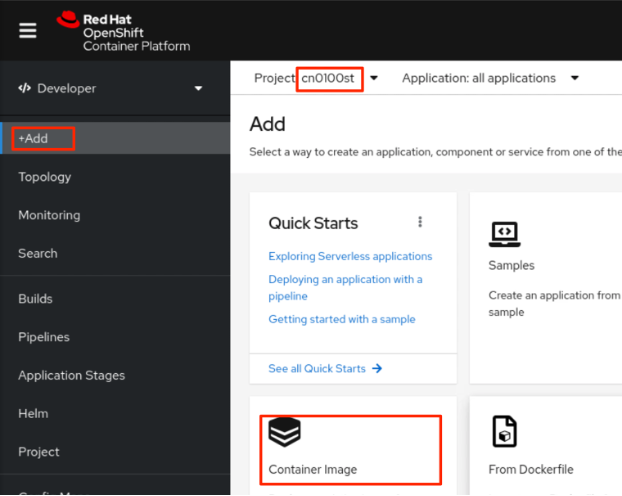

6. In the **Deploy Image** page, select **Image stream tag from internal registry** option, set **Project** as **cn0100st**, set **Image Stream** as **greetings**, set **Tag** as **latest**, select **Knative Service** option and click **Create**.

  

7. The application is deployed.  Once it is running, click the upper arrow icon to open the application service URL.

  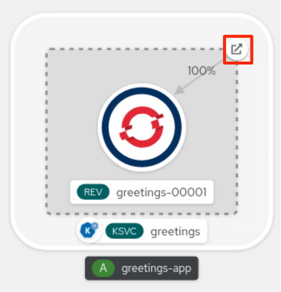

8. The application is launched is a new browser window.  Type **/?name=Kevin** at the end of the URL and press **Enter**.  You see the messages retuned as expected.

  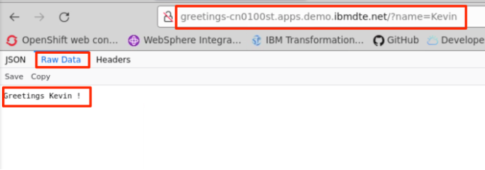

9. Wait for a few minutes, go back to the OCP web console, you see that the application pod is not running anymore. 

  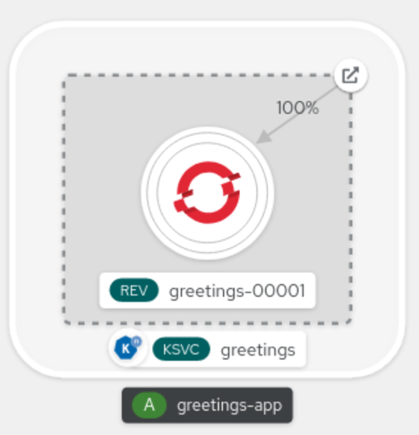

10. Change back to **Administrator** prospective, select **Workloads**>**Pods**, you see no pod running now. This is because it is a serverless service, which means that once no more traffic is directed into the service, it comes down automatically. This is called **scale-to-zero**.

  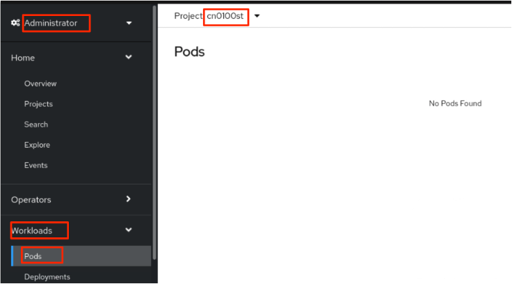
11. Go back to the application service URL page and refresh it to invoke the service, after a few seconds, the service comes back. If you go back to the OC web console, you see the application service pod is running again.

#### 6.7 Deploy Serverless Application for Traffic Control Testing


1. In the terminal window navigate to **/home/ibmdemo/app-mod-labs/cn0100st** directory.

  ```
  cd /home/ibmdemo/app-mod-labs/cn0100st/ 
  ```
2. List the contents in the directory.

  ```
  ls -l
  ```
  Sample output:
  ```
  total 20
  -rw-rw-r-- 1 ibmdemo ibmdemo 352 Jul 15 12:52 colors-service-blue.yaml
  -rw-rw-r-- 1 ibmdemo ibmdemo 354 Jul 15 12:53 colors-service-green.yaml
  -rw-rw-r-- 1 ibmdemo ibmdemo 296 Jun 26  2020 Commands.txt
  -rw-rw-r-- 1 ibmdemo ibmdemo 458 Jul 16 07:26 service-10.yaml
  -rw-rw-r-- 1 ibmdemo ibmdemo 558 Jul 16 07:41 service-min-max-scale.yaml
  ```
  The four YAML files are the knative service YAMLs you are going to deploy later.

3. Review the content of **colors-service-blue** and **colors-service-green** with commands:

  ```
  cat colors-service-blue.yaml
  ```
  Sample output:
  ```
  apiVersion: serving.knative.dev/v1
  kind: Service
  metadata:
    name: blue-green-canary
  spec:
    template:
      spec:
        containers:
          - image: quay.io/rhdevelopers/blue-green-canary
            env:
              - name: BLUE_GREEN_CANARY_COLOR
                value: "#6bbded"
              - name: BLUE_GREEN_CANARY_MESSAGE
                value: "Hello"
  ```

  ```
  cat colors-service-green.yaml
  ```
  Sample output:
  ```
  apiVersion: serving.knative.dev/v1
  kind: Service
  metadata:
    name: blue-green-canary
  spec:
    template:
      spec:
        containers:
          - image: quay.io/rhdevelopers/blue-green-canary
            env:
              - name: BLUE_GREEN_CANARY_COLOR
                value: "#5bbf45"
              - name: BLUE_GREEN_CANARY_MESSAGE
                value: "Namaste"
  ```
  As you can see they are sample Red Hat serverless service YAML for the same service **blue-green-canary** with different color schemes.

4. Deploy the serverless application **blue-green-canary** with command:

  ```
  oc apply -f colors-service-blue.yaml
  ```
  Sample output:
  ```
  service.serving.knative.dev/blue-green-canary created
  ```
  
5. Go back to OCP web console and navigate to **Workloads**>**pods** under **cn0100st** project, you can see the serverless pod is running.

  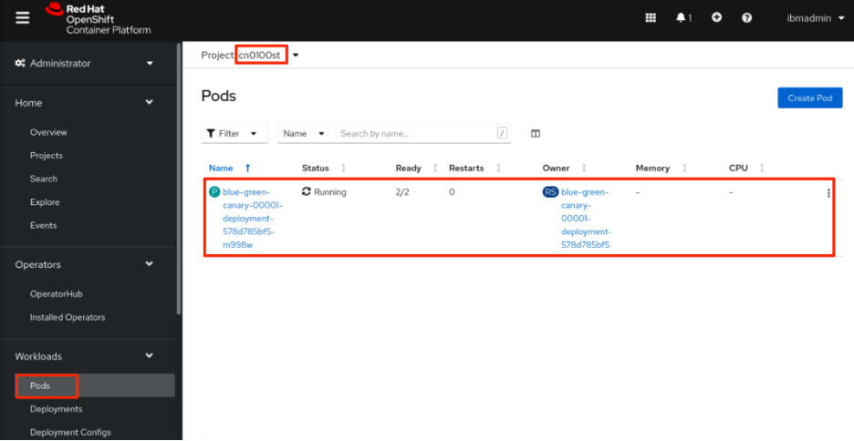

6. Run the Knative CLI (kn) command below in the terminal window to obtain the service URL information.

  ```
  kn service describe blue-green-canary -o url
  ```
  Sample output:
  ```
  url: http://blue-green-canary-cn0100st.apps.demo.ibmdte.net
  ```

  The service URL is: **http://blue-green-canary-cn0100st.apps.demo.ibmdte.net**

7. Launch the service URL in a new browser window to invoke the service, you see a blue background browser page, with greeting as **Hello**.

  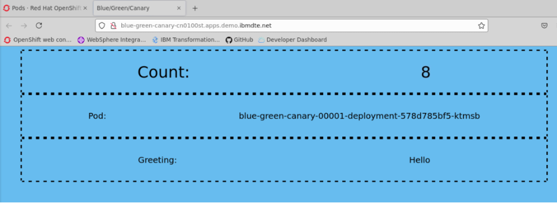

#### 6.8 Traffic distribution 
1. From the terminal window, deploy the version 2 of the **blue-green-canary** service with command:

  ```
  oc apply -f colors-service-green.yaml
  ```
  Sample output:
  ```
  service.serving.knative.dev/blue-green-canary configured
  ```
2. Go back to the web browser window to invoke the service again using the service URL, you see a green color browser page with greeting **Namaste**

  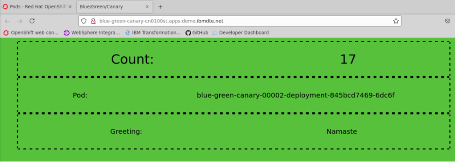

3. Check the service revisions with **kn revision list** command:

  ```
  kn revision list
  ```
  Sample output:
  ```
  NAME                      SERVICE             TRAFFIC   TAGS   GENERATION   AGE   CONDITIONS   READY   REASON
  blue-green-canary-00002   blue-green-canary   100%             2            13m   4 OK / 4     True    
  blue-green-canary-00001   blue-green-canary                    1            42m   3 OK / 4     True    
  ```

  As you can see from the output, the Knative service **blue-green-canary** now has two revisions namely **blue-green-canary-00001** and **blue-green-canary-00002**. When Knative rolls out a new revision, it increments the **GENERATION** by 1 and then routes 100% of the **TRAFFIC** to it, hence you can use the **GENERATION** or **TRAFFIC** to identify the latest revision.

  Since the **Revision** names are autogenerated it is hard to comprehend to which code/configuration set it corresponds to. Knative provides a solution to tag the revision names with a logical definition, so it is easy to identify the revision and to perform traffic distribution amongst them.
  
  Knative offers a simple way of switching 100% of the traffic from one Knative service revision to another newly rolled out revision. If the new revision has erroneous behavior then it is easy to rollback the change with tags.
  
4.  Next you apply a tag named **blue** to revision **blue-green-canary-00001** and apply a tag named **green** and a tag named **latest** to revision **blue-green-canary-00002**.

  ```
  kn service update blue-green-canary --tag=blue-green-canary-00001=blue
  kn service update blue-green-canary --tag=blue-green-canary-00002=green
  kn service update blue-green-canary --tag=@latest=latest
  ```
  Sample output:
  ```
   --tag=blue-green-canary-00001=blue
  Updating Service 'blue-green-canary' in namespace 'cn0100st':

    0.059s The Route is still working to reflect the latest desired specification.
    0.138s Ingress has not yet been reconciled.
    0.187s Waiting for load balancer to be ready
    0.368s Ready to serve.

  Service 'blue-green-canary' with latest revision 'blue-green-canary-00002' (unchanged) is available at URL:
  http://blue-green-canary-cn0100st.apps.demo.ibmdte.net

  ```

  ```
  Updating Service 'blue-green-canary' in namespace 'cn0100st':

  0.043s The Route is still working to reflect the latest desired specification.
  0.147s Ingress has not yet been reconciled.
  0.213s Waiting for load balancer to be ready
  0.316s Ready to serve.

  Service 'blue-green-canary' with latest revision 'blue-green-canary-00002' (unchanged) is available at URL:
  http://blue-green-canary-cn0100st.apps.demo.ibmdte.net

  ```
  ```
  Updating Service 'blue-green-canary' in namespace 'cn0100st':

  0.054s The Route is still working to reflect the latest desired specification.
  0.224s Ingress has not yet been reconciled.
  0.290s Waiting for load balancer to be ready
  0.361s Ready to serve.

  Service 'blue-green-canary' with latest revision 'blue-green-canary-00002' (unchanged) is available at URL:
  http://blue-green-canary-cn0100st.apps.demo.ibmdte.net
  ```
5. Check the service revisions with **kn revision list** command again, you see the tags are added to the revisions.

  ```
  kn revision list
  ```
  Sample output:  
  ```
  NAME                      SERVICE             TRAFFIC   TAGS           GENERATION   AGE   CONDITIONS   READY   REASON
  blue-green-canary-00002   blue-green-canary   100%      latest,green   2            15h   4 OK / 4     True    
  blue-green-canary-00001   blue-green-canary             blue           1            16h   3 OK / 4     True  
  ```
  
  With the tags added to the revision, you can apply the Blue-Green deployment pattern with the Knative Service. Assuming that due to a critical bug in revision **blue-green-canary-00002** you need to roll back to revision **blue-green-canary-00001**, you can apply the Blue-Green deployment pattern to the service using **kn** command to roll back the older revision.

6. Run the **kn** command below to roll back the revision.

  ```
  kn service update blue-green-canary --traffic blue=100,green=0,latest=0
  ```
  Sample output:
  ```
  Updating Service 'blue-green-canary' in namespace 'cn0100st':

  0.029s The Route is still working to reflect the latest desired specification.
  0.111s Ingress has not yet been reconciled.
  0.155s Waiting for load balancer to be ready
  0.335s Ready to serve.

  Service 'blue-green-canary' with latest revision 'blue-green-canary-00002' (unchanged) is available at URL:
  http://blue-green-canary-cn0100st.apps.demo.ibmdte.net

  ```
7. Check the service revisions with **kn revision list** command one more time, you see the traffic is now directed to the **blue-green-canary-00001** revision.

  ```
  kn revision list
  ```
  Sample output:
  ```
  NAME                      SERVICE             TRAFFIC   TAGS           GENERATION   AGE   CONDITIONS   READY   REASON
  blue-green-canary-00002   blue-green-canary             latest,green   2            15h   4 OK / 4     True    
  blue-green-canary-00001   blue-green-canary   100%      blue           1            16h   4 OK / 4     True  
  ```

8. Go back to the web browser window to invoke the service by refreshing it, you see a blue color browser page with greeting **Hello**

  

9. Check the service pod with **oc get pod**, you see that only the **blue-green-canary-00001** pod is available and the **blue-green-canary-00002** pod has been terminated.

  ```
  oc get pod
  ```
  Sample output:
  ```
  NAME                                                  READY   STATUS    RESTARTS   AGE
  blue-green-canary-00001-deployment-578d785bf5-wp2hp   2/2     Running   0          6m32s
  ```

  You can also apply the Canary Release Pattern to the serverless service. A Canary release is more effective when you want to reduce the risk of introducing new feature. It allows you a more effective feature-feedback loop before rolling out the change to your entire user base. Knative allows you to split the traffic between revisions in increments as small as 1%.

10. Issue the **kn** command below to allow 80% of the traffic to the **blue-green-canary-00001** revision and the rest of the traffic to go the **blue-green-canary-00002** revision.

  ```
  kn service update blue-green-canary --traffic="blue=80" --traffic="green=20"
  ```
11. Check the service revisions with **kn revision list** command one more time, you see the traffic is directed to both revisions as designed.

  ```
  kn revision list
  ```
  Sample output:
  ```
  NAME                      SERVICE             TRAFFIC   TAGS           GENERATION   AGE   CONDITIONS   READY   REASON
  blue-green-canary-00002   blue-green-canary   20%       latest,green   2            15h   4 OK / 4     True    
  blue-green-canary-00001   blue-green-canary   80%       blue           1            16h   4 OK / 4     True    
  ```

12. Check the service pod with **oc get pod**, you see that both revision pods are available now.

  ```
  oc get pod
  ```
  Sample output:
  ```
  NAME                                                  READY   STATUS    RESTARTS   AGE
  blue-green-canary-00001-deployment-578d785bf5-wp2hp   2/2     Running   0          17m
  blue-green-canary-00002-deployment-845bcd7469-22rjx   2/2     Running   0          2m41s
  ```
13. Go to the service web page, you can see the outputs of both service revisions.
14. Close the service web page.

#### 6.9 Scaling
As you know that **scale-to-zero** is one of the main properties making Knative a serverless platform. After a defined time of idleness (the so called **stable-window**) a revision is considered inactive. Now, all routes pointing to the now inactive revision will be pointed to the so-called activator. This reprogramming of the network is asynchronous in nature so the **scale-to-zero-grace-period** should give enough slack for this to happen. Once the **scale-to-zero-grace-period** is over, the revision will finally be scaled to zero replicas. If another request tries to get to this revision, the activator will get it, instruct the autoscaler to create new pods for the revision as quickly as possible and buffer the request until those new pods are created.

By default the **scale-to-zero-grace-period** is **30s**, and the **stable-window** is **60s**. Firing a request to the greeter service will bring up the pod if it is already terminated to serve the request. Leaving it without any further requests will automatically cause it to scale to zero in approx 60-70 secs. There are at least 20 seconds after the pod starts to terminate and before it’s completely terminated. This gives the Kourier Ingress enough time to leave out the pod from its own networking configuration.

By default Knative Serving allows **100** concurrent requests into a pod. This is defined by the **container-concurrency-target-default** setting in the configmap config-autoscaler in the **knative-serving** namespace.

In the next lab task, you make your service handle only 10 concurrent requests. This will cause Knative autoscaler to scale to more pods as soon as you run more than 10 requests in parallel against the revision.

1. From the terminal window, view the content of the **service-10.yaml** file with command:

  ```
  cat service-10.yaml
  ```
  Sample output:
  ```
  apiVersion: serving.knative.dev/v1
  kind: Service
  metadata:
    name: prime-generator
  spec:
    template:
      metadata:
        annotations:
          # Target 10 in-flight-requests per pod.
          autoscaling.knative.dev/target: "10"
      spec:
        containers:
        - image: quay.io/rhdevelopers/prime-generator:v27-quarkus
          livenessProbe:
            httpGet:
              path: /healthz
          readinessProbe:
            httpGet:
              path: /healthz
  ```
  The Knative service definition allows each service pod to handle max of 10 in-flight requests per pod (configured via **autoscaling.knative.dev/target** annotation) before automatically scaling to new pod(s).
2. Deploy the service with command:

  ```
  oc apply -f service-10.yaml
  ```
3. Go back to OCP web console, navigate to **Workloads**>**Pods** under **cn0100st** project scope and wait for all pods to be terminated.

  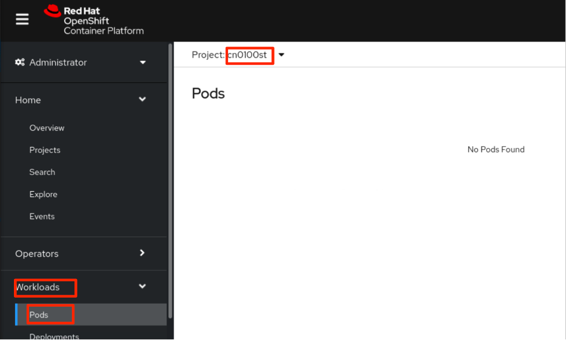
4. Run the command below to load the service.

  ```
  export SVC_URL=$(kn service describe prime-generator -o url) 
  hey -c 50 -z 10s "$SVC_URL/?sleep=3&upto=10000&memload=100"
  ```
  
  You are sending some load to the **prime-generator** service. The command sends 50 concurrent requests (-c 50) for the next 10s (-z 10s)

5. From the OCP web console, you can see that after you have successfully run this small load test, the number of greeter service pods will have scaled to more pods automatically.

  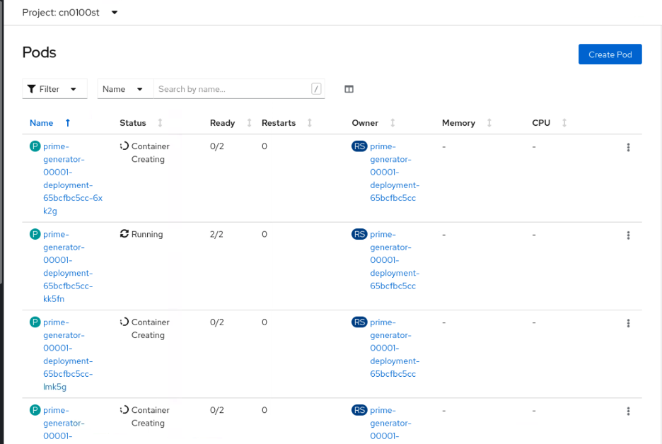

  In real world scenarios your service might need to handle sudden spikes in requests. Knative starts each service with a default of 1 replica. As described above, this will eventually be scaled to zero as described above. If your app needs to stay particularly responsive under any circumstances and/or has a long startup time, it might be beneficial to always keep a minimum number of pods around. This can be done via an the annotation **autoscaling.knative.dev/minScale**.
  The following task, you learn how to make Knative create services that start with a replica count of 2 and never scale below it.

6. From the terminal window, issue the following command to view the **service-min-max-scale.yaml** file.

  ```
  cat service-min-max-scale.yaml
  ```
  Sample output:
  ```
  apiVersion: serving.knative.dev/v1
  kind: Service
  metadata:
    name: prime-generator
  spec:
    template:
      metadata:
        annotations:
          # the minimum number of pods to scale down to
          autoscaling.knative.dev/minScale: "2"
          # Target 10 in-flight-requests per pod.
          autoscaling.knative.dev/target: "10"
      spec:
        containers:
        - image: quay.io/rhdevelopers/prime-generator:v27-quarkus
          livenessProbe:
            httpGet:
              path: /healthz
          readinessProbe:
            httpGet:
              path: /healthz
  ```
  The deployment of this service will always have a minimum of 2 pods and it allows each service pod to handle max of 10 in-flight requests per pod before automatically scaling to new pods.

7. Deploy the service with command:

  ```
  oc apply -f service-min-max-scale.yaml
  ```

8. Now apply some work load to the service.

  ```
  hey -c 50 -z 10s "$SVC_URL/?sleep=3&upto=10000&memload=100"
  ```
9. Observe the pod changes in the OCP web console.  You can that when all requests are done and if beyond the scale-to-zero-grace-period, Knative has terminated all but 2 pods. This is because you have configured Knative to always run two pods via the annotation autoscaling.knative.dev/minScale: **2**.
### 7.	Summary
In this lab, you have learned some basic features and functions of OpenShift Serverless (Knative) and how to use it. To learn more about App Mod and DevOps, please continue with the rest of the lab series.

**Congratulations! You have successfully completed OpenShift Serverless (Knative) Introduction Lab!**

