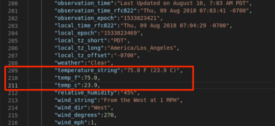

The goal of this session is to provide a hands-on experience on how to work with OpenShift Do (**ODO**) development tool.

### 1. OpenShift Serverless Serving Introduction
On the journey to cloud, enterprise customers are facing challenges moving their existing on-premises applications to cloud and creating cloud native business applications quickly and cost-effectively.  The IBM Cloud Paks and Red Hat OpenShift provides a complete and consistent experience and solution for cloud-native deployments. 

Customers can easily modernize their existing applications with IBM and Red Hat integrated tools and develop new cloud-native applications faster with enterprise governance on any cloud. 

One of the features integrated is OpenShift ODO 2.0, a modern microservices-based framework that enables developers, architects and operation teams to work together, faster on end-to-end solutions for the team to build, deploy, and manage the lifecycle of Kubernetes-based applications on OpenShift Container Platform. 

OpenShift Do (ODO) ODO is a fast and easy-to-use CLI tool for creating applications on OpenShift Container Platform. It allows developers to concentrate on creating applications without the need to administrate an OpenShift Container Platform cluster itself. Creating deployment configurations, build configurations, service routes and other OpenShift Container Platform elements are all automated by ODO.

In this lab, you are using ODO to develop and test your application in an OpenShift Container Platform (OCP) cluster.

The lab covers the following business scenario:

As illustrated below, your team is developing a web application called **Mod Resorts**, a cloud native application showing the weather in various locations. Your company wants to move this application from on-premises (in VMs) to the cloud (in Containers). This transition delivers improved operational efficiencies for the application by leveraging scalable cloud capabilities with OCP.  
 


### 2. Objective

The objectives of this lab are to help you:

* learn how to use ODO to create a cloud native application
* learn how to use ODO to deploy a cloud native application to an OCP cluster
* learn how to use ODO and VS code to test, fix and re-deploy the could native application

### 3.	Prerequisites

The following prerequisites must be completed prior to beginning this lab:
*	Familiarity with basic Linux commands
*	Have internet access
* Have basic knowledge of OpenShift Container Platform (OCP) web console and commandline operations
*	Have a SkyTap App Mod Lab environment ready

### 4.	What is Already Completed

A six Linux VMs App Mod Lab environment has been provided for this lab. 
 
  

*	The Red Hat OpenShift Container Platform (OCP) v4.6, is installed in 5 VMs, the master1 VM, the master2 VM, the master3 VM, the dns VM and the nfs VM, with 3 master nodes and 3 compute nodes (the master nodes are serving as computer nodes as well).
*	The workstation VM is the one you will use to access and work with OCP cluster in this lab.
  The login credentials for the workstation VM are:
  User ID: **ibmdemo**
  Password: **passw0rd**
  Note: Use the Password above in the workstation VM Terminal for sudo in the Lab.
*	The CLI commands used in this lab are listed in the **Commands.txt** file located at the **/home/ibmdemo/add-mod-labs/cn0100st** directory of the workstation VM for you to copy and paste these commands to the Terminal window during the lab.

### 5.	Lab Tasks

During this lab, you complete the following tasks:
*	create ODO project
* package, deploy and test cloud native application with ODO
* edit, re-Deploy and test application

### 6.	Execute Lab Tasks

#### 6.1 Log in to the workstation VM and get started 
1.  If the VMs are not already started, start them by clicking the play button for the whole group.

  


2.	After the VMs are started, click the workstation VM icon to access it. 

  

  The Workstation Linux Desktop is displayed. You execute all the lab tasks on this workstation VM.

3.	If requested to log in to the workstation OS, use credentials: **ibmdemo**/**passw0rd**
4. Open a terminal window by clicking its icon from the Desktop toolbar.

  
5. If this is your first time to run the lab series in this lab environment, do the following, otherwise if you have already downloaded the lab materials in other labs, you can skip this step.
  
  a. In the terminal window, run the following command to get the lab materials.

  ```
  /home/ibmdemo/get-lab-materials.sh
  ```

  Sample output

  ```
  Cloning into 'app-mod-labs'...
  warning: redirecting to https://github.com/wtistang/app-mod-labs.git/
  remote: Enumerating objects: 5693, done.
  remote: Counting objects: 100% (185/185), done.
  remote: Compressing objects: 100% (118/118), done.
  remote: Total 5693 (delta 53), reused 184 (delta 53), pack-reused 5508
  Receiving objects: 100% (5693/5693), 277.71 MiB | 57.39 MiB/s, done.
  Resolving deltas: 100% (2250/2250), done.
  Checking out files: 100% (6120/6120), done.
  ```
  
  The lab materials is downloaded to the **/home/ibmdemo/app-mod-labs** directory.
  
6. Open **File Manager** by clicking its icon on the Desktop toolbar.

  

7. Navigate to **/home/ibmdemo/app-mod-labs/cn0200st** directory and double-click to open **Commands.txt** file in the text editor.

  

  This file contains all commands used in the lab.  When you need to enter any command in a terminal window in the lab tasks, you should come back to this file and copy/paste the command from this file, this is because you cannot directly copy and paste from your local workstation to the SkyTap workstation.
 
#### 6.2 Create an ODO project

To work with ODO, you need to create your ODO project working directory first.

1.	Click the terminal icon in the Desktop toolbar.

  

2.	First create a working directory called **my-odo-app** and navigate to it with commands: 

  ```
  cd /home/ibmdemo
  mkdir my-odo-app 
  cd my-odo-app/
  ```
3.	Log in to the OCP cluster using command:

  ```
  odo login -u ibmadmin -p engageibm https://api.demo.ibmdte.net:6443
  ```
  Sample output:
  ```
  Connecting to the OpenShift cluster

  Login successful.

  You have access to 70 projects, the list has been suppressed. You can list all projects with 'odo project list'

  Using project "default".

  ```
4.	You need to create a project/namespace in the OCP cluster to host your application.  To do this, run the following command to create a project called **myodo** in the cluster:

  ```
  odo project create myodo
  ```
  Sample output:
  ```
  ✓  Project 'myodo' is ready for use
  ✓  New project created and now using project: myodo
  ```
  **myodo** project is created and is used as current ODO working project.

 
#### 6.3	Package, Deploy and Test Your Application with ODO

Your teammate has developed the **Mod Rsorts** application, you need to package it with ODO, deploy it to the OCP cluster and test it.

1.	Run the command below to copy the application code to the **my-odo-app** directory:

  ```
  cd /home/ibmdemo/my-odo-app/
  cp -R /home/ibmdemo/app-mod-labs/cn0200st/modresorts-devfile/* .
  ```
2.	Review the contents of the application using command:
  ```
  ls -l
  ```
  Sample output:
  ```
  total 20
  -rw-rw-r-- 1 ibmdemo ibmdemo 1108 Aug  6 08:41 app-deploy.yaml
  -rw-rw-r-- 1 ibmdemo ibmdemo 7847 Aug  6 08:41 pom.xml
  -rw-rw-r-- 1 ibmdemo ibmdemo 3977 Aug  6 08:41 READ_THIS_FIRST.md
  drwxrwxr-x 4 ibmdemo ibmdemo 4096 Aug  6 08:41 src
  ```
  
  The **Mod Resorts** application is a Maven based java application using the OpenLiberty framework.  

3.	Apply the Maven command to build the application:

  ```
  mvn package
  ```
  Sample output:
  ```
  ....
  Downloaded from central: https://repo.maven.apache.org/maven2/com/thoughtworks/xstream/xstream/1.4.10/xstream-1.4.10.jar (590 kB at 14 MB/s)
  [INFO] Packaging webapp
  [INFO] Assembling webapp [modresorts10] in [/home/ibmdemo/my-odo-app/target/modresorts10]
  [INFO] Processing war project
  [INFO] Copying webapp resources [/home/ibmdemo/my-odo-app/src/main/webapp]
  [INFO] Webapp assembled in [63 msecs]
  [INFO] Building war: /home/ibmdemo/my-odo-app/target/modresorts10.war
  [INFO] ------------------------------------------------------------------------
  [INFO] BUILD SUCCESS
  [INFO] ------------------------------------------------------------------------
  [INFO] Total time:  15.089 s
  [INFO] Finished at: 2021-08-06T08:43:07-07:00
  [INFO] ------------------------------------------------------------------------
  ```
4.	Review the contents of the application again:
  ```
  ls -l
  ```
  Sample output:
  ```
  total 24
  -rw-rw-r-- 1 ibmdemo ibmdemo 1108 Aug  6 08:41 app-deploy.yaml
  -rw-rw-r-- 1 ibmdemo ibmdemo 7847 Aug  6 08:41 pom.xml
  -rw-rw-r-- 1 ibmdemo ibmdemo 3977 Aug  6 08:41 READ_THIS_FIRST.md
  drwxrwxr-x 4 ibmdemo ibmdemo 4096 Aug  6 08:41 src
  drwxrwxr-x 9 ibmdemo ibmdemo 4096 Aug  6 08:43 target
  ```
  You can see that the application runtime is created in the **target** directory.
 
5.	Package the application with ODO command:

  ```
  odo create java-openliberty my-odo-app
  ```
  Sample output:
  ```
  Devfile Object Validation
  ✓  Checking devfile existence [36845ns]
  ✓  Creating a devfile component from registry: DefaultDevfileRegistry [55794ns]
  Validation
  ✓  Validating if devfile name is correct [38708ns]

  Please use `odo push` command to create the component with source deployed
  ```
6.	Review the contents of the application with command:

  ```
  ls -l
  ```
  Sample output:
  ```
  total 28
  -rw-rw-r-- 1 ibmdemo ibmdemo 1108 Aug  6 08:41 app-deploy.yaml
  -rw-rw-r-- 1 ibmdemo ibmdemo 3313 Aug  6 08:45 devfile.yaml
  -rw-rw-r-- 1 ibmdemo ibmdemo 7847 Aug  6 08:41 pom.xml
  -rw-rw-r-- 1 ibmdemo ibmdemo 3977 Aug  6 08:41 READ_THIS_FIRST.md
  drwxrwxr-x 4 ibmdemo ibmdemo 4096 Aug  6 08:41 src
  drwxrwxr-x 9 ibmdemo ibmdemo 4096 Aug  6 08:43 target

  ```
  The odo create process generates a java-openliberty based **devfile.yaml** for your application. The file defines how to deploy your application to the OCP cluster.

7.	Deploy the application to the OpenShift cluster with ODO push command:

  ```
  odo push
  ```
  Sample output:
  ```
  Validation
  ✓  Validating the devfile [50203ns]

  Creating Kubernetes resources for component my-odo-app
  ✓  Waiting for component to start [51s]
  ✓  Waiting for component to start [37ms]

  Applying URL changes
  W0806 08:48:40.738551    9606 warnings.go:70] extensions/v1beta1 Ingress is deprecated in v1.14+, unavailable in v1.22+; use networking.k8s.io/v1 Ingress
  ✓  URL ep1: http://ep1-my-odo-app-myodo.apps.demo.ibmdte.net/ created

  Syncing to component my-odo-app
  ✓  Checking files for pushing [7ms]
  ✓  Syncing files to the component [367ms]

  Executing devfile commands for component my-odo-app
  ✓  Waiting for component to start [2ms]
  ✓  Executing build command "/stack/ol/scripts/maven/devbuild-cmd.sh 21.0.0.6" [14s]
  ✓  Executing run command "mvn -Dliberty.runtime.version=21.0.0.6 -Ddebug=false -DhotTests=true -DcompileWait=3 liberty:dev", if not running [1s]

  Pushing devfile component "my-odo-app"
  ✓  Changes successfully pushed to component

  ```
8.	Now your application is deployed to the OCP cluster successfully, you can check it status with OpenShift CLI **oc** commands:

  ```
  oc login -u ibmadmin -p engageibm https://api.demo.ibmdte.net:6443
  
  oc get pod -n myodo
  ```
  Sample output:
  ```
  Login successful.

  You have access to 71 projects, the list has been suppressed. You can list all projects with ' projects'

  Using project "myodo".

  NAME                             READY   STATUS    RESTARTS   AGE
  my-odo-app-app-c99c74768-tqlfz   1/1     Running   0          2m33s

  ```
  Your application pod is running.

9.	Check the application service and route information with commands

  ```
  oc get service -n myodo
  
  oc get route -n myodo
  ```
  Sample output:
  ```
  NAME         TYPE        CLUSTER-IP       EXTERNAL-IP   PORT(S)    AGE
  my-odo-app   ClusterIP   172.30.202.227   <none>        9080/TCP   3m59s
 
  NAME             HOST/PORT                                   PATH   SERVICES     PORT   TERMINATION   WILDCARD
  ep1-my-odo-app   ep1-my-odo-app-myodo.apps.demo.ibmdte.net   /      my-odo-app   9080                 None
  ``` 

  You can see that the application service type and port as ClusterIP and 9080 and the route url is: http://ep1-my-odo-app-myodo.apps.demo.ibmdte.net.

10.	Open a Firefox web browser window by clicking its icon on the Desktop toolbar.

   
  
11. Launch the application from a new browser window with the route url, the **Mod Resorts** application Home page is displayed.

    

11.	Click **WHERE TO?** dropdown menu to see the city list.

    
 
12. Click **PARIS, FRANCE** from the list, it shows the weather of the city.

        
 
13.	Click **LAS VEGAS, US** from the list, it shows the weather of the city.

   

  As you can see, it is easy and quick to deploy and test an application the OCP cluster with ODO.
  
  Next you will learn how to make change to the application, redeploy and test it.
 
#### 6.4	Edit, Re-Deploy and Test Your Application

Assuming that you noticed an issue in your testing: the showing temperature values of 83.9/28.8 in Las Vegas are wrong. You want to fix it and redeploy application. 

In this section you go through this process to see how quick you can modify your application and redeploy it with ODO and VS Code. The VS Code editor has the OpenShift Connector plug-in which make the inner circle development with OCP cluster more efficient.

1.	In the Terminal window, start the VS Code editor inside the my-odo-app directory with command:
  ```
  cd /home/ibmdemo/my-odo-app/
  
  code .
  ```
  
  This command launches the VS Code editor and loads **my-odo-app** application source code.
 
2.	Click **Yes, I trust..** to continue.

   

  The VS Code is launched with the **my-odo-app** application source code.

   

3. Click the OpenShift icon to get connected to your cluster.
 
   

  The VS code is pre-configured to connect with the lab OCP cluster with URL: https://api.demo.ibmdte.net:6443, the cluster is listed.
4. Click the **https://api.demo.ibmdte.net:6443** link.

   

  You can see that your project and the application pod deployed

  
     
5.	Now you are ready to make your code change, click the **Explorer** icon to access your application source code.

  

6.	In the Explorer, open the file **lasVegas20180810Weather.json** under **src/main/resources** directory for editing.

  

7.	Change the temperature values in lines **209** to **211** from **83.9 F (28.8 C)/83.9/28.8** to **75.0 F (23.9 C)/75.0/23.9** as shown below.
  
    Before:

    

    After:

    

 
8.	Click **File**>**Save** to save your changes.
 
9.	Now click the OpenShift icon to go back to cluster, right-click **my-odo-app** pod and click **push** to redeploy the updated application.

  
  
  Your application is redeployed and you can see the push output messages in the VS code **TERMINAL** window.

  

10.	From the web browser the **Mod Resorts** application Home page, click **WHERE TO?** dropdown menu and select **LAS VEGAS, US**, you can see that the temperature values are updated.
 
  

### 7.	Summary

In this lab, you have learned how to create, package, deploy and test a cloud native application using ODO, RHOCP and VS Code.  You can see that with ODO and VS Code, it is a quick and easy process to build and test a cloud native application for RHOCP in the development inner loop. 

**Congratulations! You have successfully completed Create and Deploy Cloud Native Application Using ODO 2.0 Lab.**
