The goal of this session is to provide a hands-on experience with Red Hat OpenShift Service Mesh

### 1. Introduction

Istio is an open-source project for integrating and managing traffic flow across services. It works in concert with an underlying cluster manager (like Kubernetes). Centralized components, sidecar proxies, and node agents work together to create the data and control planes over a distributed application. With Istio, You can manage network traffic, load balance across microservices, enforce access policies, verify service identity, secure service communication and observe what exactly is going on with your services.

Based Istio project, Red Hat OpenShift Service Mesh adds a transparent layer on existing distributed applications without requiring any changes to the service code. You add Red Hat OpenShift Service Mesh support to services by deploying a special sidecar proxy to relevant services in the mesh that intercepts all network communication between microservices. You configure and manage the Service Mesh using the control plane features.

In this lab, you can see how to install Istio alongside microservices for a simple mock app called **Guestbook**. When you deploy Guestbook's microservices into an OpenShift Container Platform (OCP) cluster where Istio is installed, you can choose to inject the Istio Envoy sidecar proxies in the pods of certain microservices.

### 2. Objective

The objectives of this lab are to help you to learn how to:

* download and install Istio in your cluster
* deploy the Guestbook sample app
* use metrics, logging and tracing to observe services
* set up the Istio Ingress Gateway
* perform simple traffic management, such as A/B tests and canary deployments
* secure your service mesh
* enforce policies for your microservices

### 3.	Prerequisites

The following prerequisites must be completed prior to beginning this lab:
*	Familiarity with basic Linux commands
*	Have internet access
*	Have a SkyTap App Mod Lab environment ready

### 4.	What is Already Completed

A six Linux VMs App Mod Lab environment has been provided for this lab. 
 
  

*	The Red Hat OpenShift Container Platform (OCP) v4.6, is installed in 5 VMs, the master1 VM, the master2 VM, the master3 VM, the dns VM and the nfs VM, with 3 master nodes and 3 compute nodes (the master nodes are serving as computer nodes as well).
*	The Workstation VM is the one you will use to access and work with OCP cluster in this lab.
  The login credentials for the Workstation VM are:
  User ID: **ibmdemo**
  Password: **passw0rd**
  Note: Use the Password above in the Workstation VM Terminal for sudo in the Lab.
*	The CLI commands used in this lab are listed in the **Commands.txt** file located at the **/home/ibmdemo/add-mod-labs/dv0100st** directory of the Workstation VM for you to copy and paste these commands to the Terminal window during the lab.

### 5.	Lab Tasks

During this lab, you complete the following tasks:
*	Install Red Hat OpenShift Service Mesh
* Deploy the BookInfo application on Service Mesh
* Expose the app with the Istio Ingress Gateway and Route
* Observe service telemetry: metrics and tracing
* Perform traffic management
* Secure your services
* Enable SSL for traffic coming in to your cluster (HTTPS)

### 6.	Execute Lab Tasks

#### 6.1 Log in to the Workstation VM and get started 
1.  If the VMs are not already started, start them by clicking the play button for the whole group.

  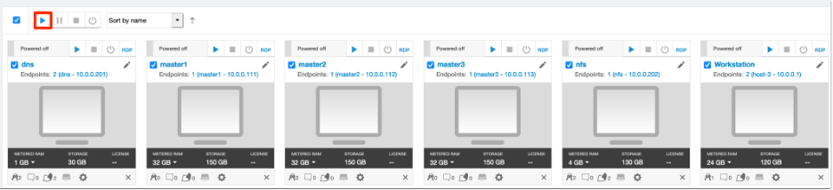


2.	After the VMs are started, click the Workstation VM icon to access it. 

  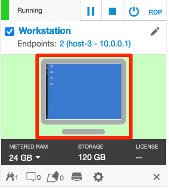

  The Workstation Linux Desktop is displayed. You execute all the lab tasks on this workstation VM.

3.	If requested to log in to the Workstation OS, use credentials: **ibmdemo**/**passw0rd**
4. Open a terminal window by clicking its icon from the Desktop toolbar.

  
5. If this is your first time to run the lab series in this lab environment, do the following, otherwise if you have already downloaded the lab materials in other labs, you can skip this step.
  
  a. In the terminal window, run the following command to get the lab materials.

  ```
  /home/ibmdemo/get-lab-materials.sh
  ```

  Sample output

  ```
  Cloning into 'app-mod-labs'...
  warning: redirecting to https://github.com/wtistang/app-mod-labs.git/
  remote: Enumerating objects: 5693, done.
  remote: Counting objects: 100% (185/185), done.
  remote: Compressing objects: 100% (118/118), done.
  remote: Total 5693 (delta 53), reused 184 (delta 53), pack-reused 5508
  Receiving objects: 100% (5693/5693), 277.71 MiB | 57.39 MiB/s, done.
  Resolving deltas: 100% (2250/2250), done.
  Checking out files: 100% (6120/6120), done.
  ```
  
  The lab materials is downloaded to the **/home/ibmdemo/app-mod-labs** directory.
  
6. Open **File Manager** by clicking its icon on the Desktop toolbar.

  

7. Navigate to **/home/ibmdemo/app-mod-labs/d20100st** directory and click to open **Commands.txt** file in the text editor.

  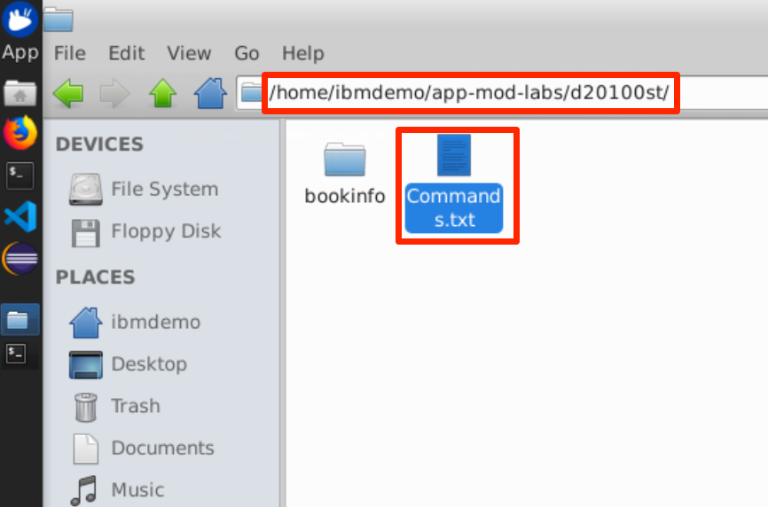

  This file contains all commands used in the lab.  When you need to any command in a terminal window in the future tasks, you should come back to this file and copy/paste the command from this file, this is because you cannot directly copy and paste from your local workstation to the SkyTap workstation.
  
#### 6.2 Install Red Hat OpenShift Service Mesh

To install Red Hat OpenShift Service Mesh, first install the required Operators on OpenShift Container Platform and then create a ServiceMeshControlPlane resource to deploy the control plane.

Red Hat OpenShift Service Mesh requires the following four Operators:
  * OpenShift Elasticsearch - (Optional) Provides database storage for tracing and logging with Jaeger. It is based on the open source Elasticsearch project.
  * Jaeger - Provides tracing to monitor and troubleshoot transactions in complex distributed systems. It is based on the open source Jaeger project.
  * Kiali - Provides observability for your service mesh. Allows you to view configurations, monitor traffic, and analyze traces in a single console. It is based on the open source Kiali project.
  * Red Hat OpenShift Service Mesh - Allows you to connect, secure, control, and observe the microservices that comprise your applications. The Service Mesh Operator defines and monitors the ServiceMeshControlPlane resources that manage the deployment, updating, and deletion of the Service Mesh components. It is based on the open source Istio project.

In this lab environment, these operators are alrady installed in the OCP cluster, you need to deploy a basic installation of the ServiceMeshControlPlane through OCP web console to complete the OpenShift Service Mesh installation.

1. Open a Firefox web browser window by clicking its icon on the Desktop toolbar.

  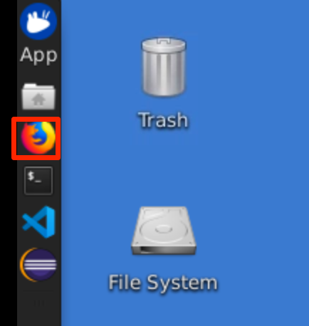 
2. From the browser window, click **OpenShift web console** bookmark to open it.

  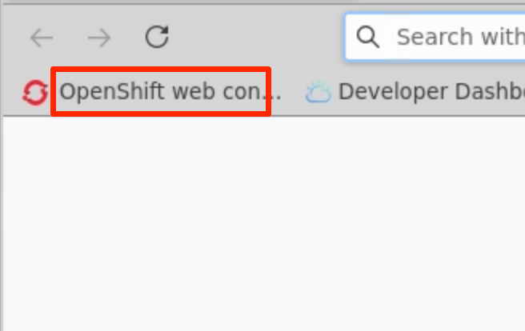 
  
3. If prompted to log in to Red Hat OpenShift Container Platform, click **htpasswd** field. Then log in with **ibmadmin**/**engageibm** as the username and password.
 
   

   

  The OCP web console Overview page is displayed. 
  
  
  
4. View the installed operators by selecting **Operators**>**Installed Operators** and then selecting **all projects** scope.

  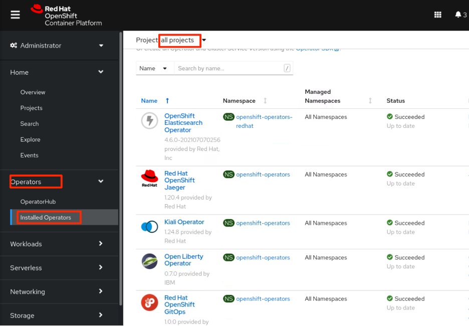

5. Scroll through the installed operator list, you can see that these four required operators, including OpenShift Elasticsearch, Jaeger, Kiali and Red Hat OpenShift Service Mesh, are installed

  To deploy a ServiceMeshControlPlane, you need to cerate a new project. The ServiceMeshControlPlane resource must be installed in a project that is separate from your microservices and Operators. This lab uses **istio-system** project as an example, but you can deploy your control plane in any project as long as it is separate from the project that contains your services.

6. Click **Projects**>**Create Project**.

  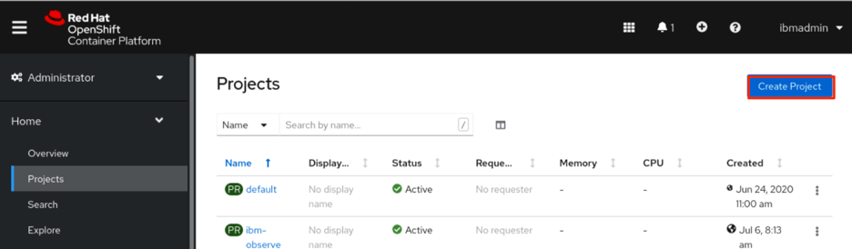

7. Enter Name and Display Name as: **istio-system** and click **Create**.

   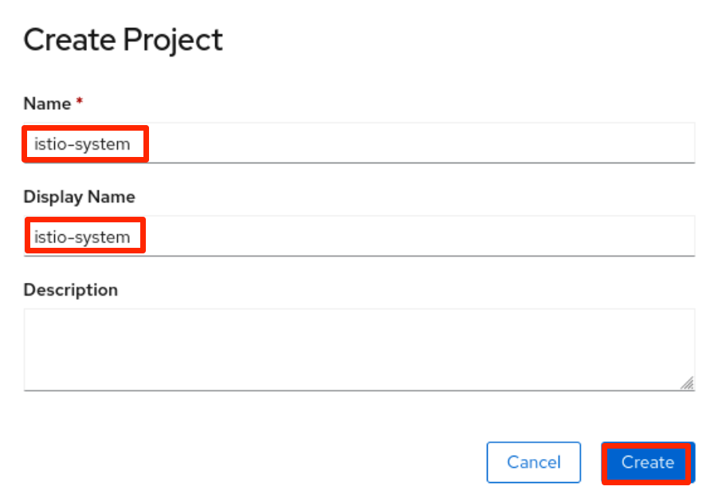

   The **istio-system** project is created.

8. Navigate to **Operators**>**Installed Operators** .under the **istio-system** scope.

  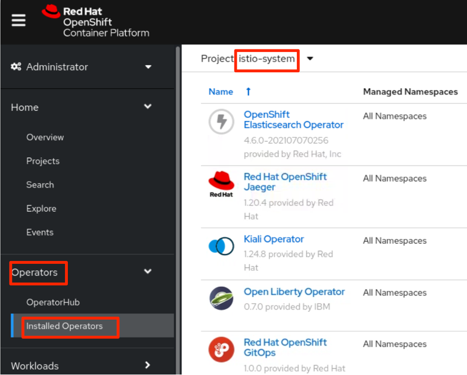

9. Click the **Red Hat OpenShift Service Mesh Operator**.

  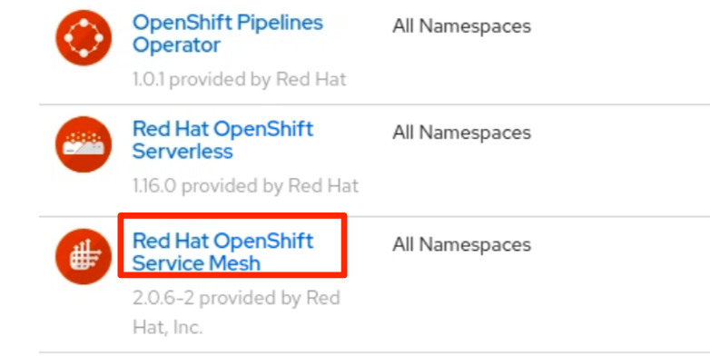

10. Click **Istio Service Mesh Control Plane** tab.

  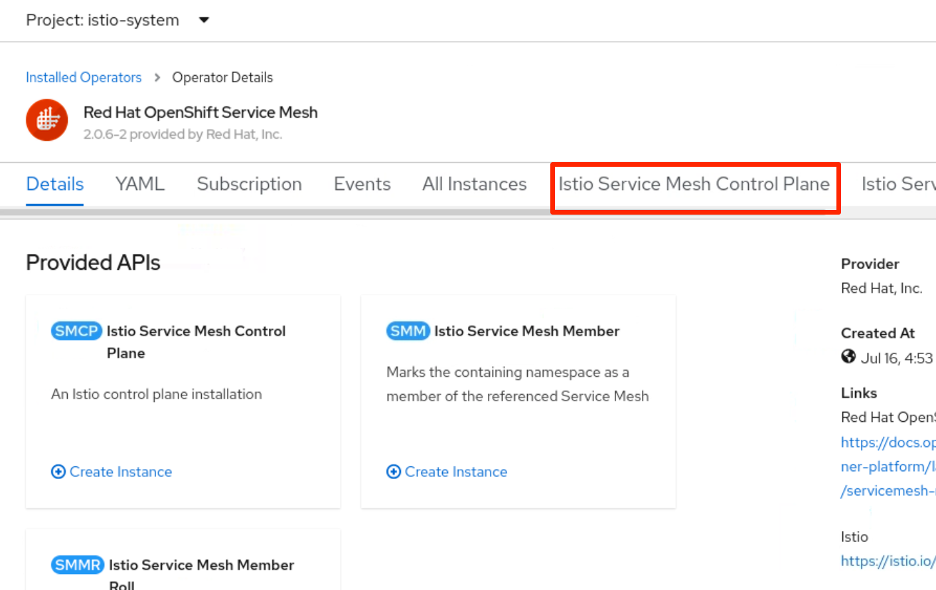

11. On the **Istio Service Mesh Control Plane** tab, click **Create ServiceMeshControlPlane**.

  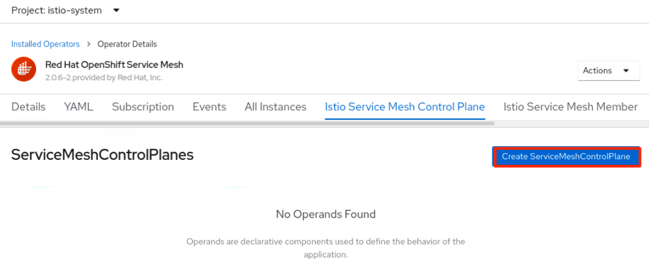

12. On the **Create ServiceMeshControlPlane** page, accept the default control plane version to take advantage of the features available in the most current version of the product and click **Create**. 

  The Operator creates pods, services, and Service Mesh control plane components based on your configuration parameters. When it is done, you see something like this:

  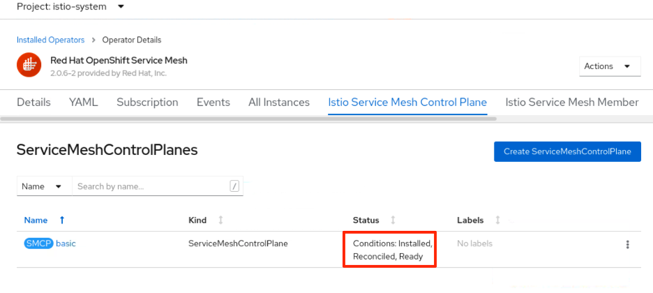
  
13. To verify the control plane installed correctly, click the name of the new control plane.

  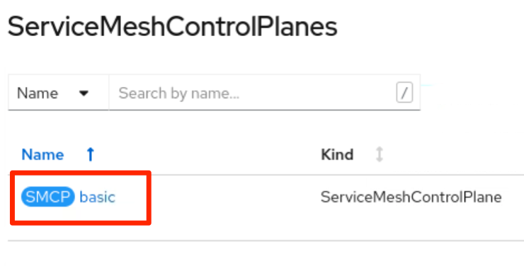

14. Click the **Resources** tab to see the Red Hat OpenShift Service Mesh control plane resources the Operator created and configured.

  To complete the installation, you need to create a **ServiceMeshMemberRoll**. ServiceMeshMemberRoll resource is used to specify the projects/namespaces associated with the Service Mesh. 
15. Navigate to **Operators** > **Installed Operators** again, then click **Red Hat OpenShift Service Mesh**.
16. Click **Istio Service Mesh Member Roll** tab and click **Create ServiceMeshMemberRoll**.

  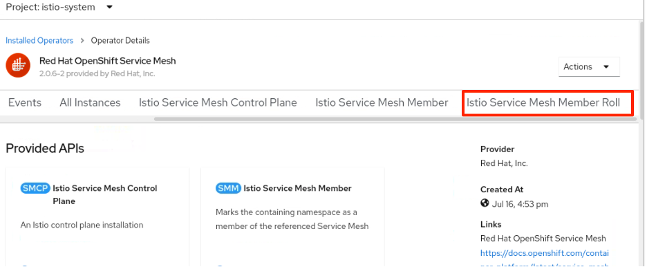

17. Enter **bookinfo** as the first value, click **Remove Member** to delete the second value and click **Create**.

  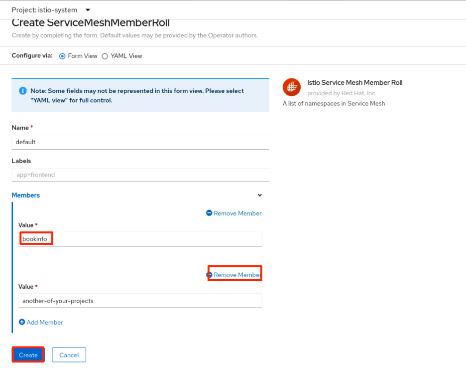

You successfully installed Istio into your cluster.

#### 6.3 Deploy the BookInfo application on Service Mesh

The BookInfo application displays information about a book, similar to a single catalog entry of an online book store. Displayed on the page is a description of the book, book details (ISBN, number of pages, and so on), and a few book reviews.

The Bookinfo application is broken into four separate microservices:
  * productpage. The productpage microservice calls the details and reviews microservices to populate the page.
  * details. The details microservice contains book information.
  * reviews. The reviews microservice contains book reviews. It also calls the ratings microservice.
  * ratings. The ratings microservice contains book ranking information that accompanies a book review.

There are 3 versions of the reviews microservice:
  * Version v1 doesn’t call the ratings service.
  * Version v2 calls the ratings service, and displays each rating as 1 to 5 black stars.
  * Version v3 calls the ratings service, and displays each rating as 1 to 5 red stars.

The end-to-end architecture of the application is shown below.

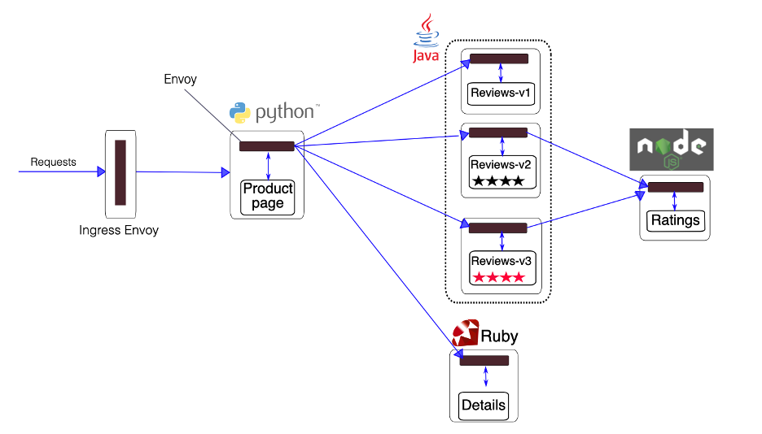

Red Hat OpenShift Service Mesh relies on the Envoy sidecars within the application’s pod to provide Service Mesh capabilities to the application. You can enable automatic sidecar injection or manage it manually. Automatic injection using the annotation is the recommended way.

1. Open a terminal window by clicking its icon from the Desktop toolbar.

  

2. Navigate to **/home/ibmdemo/app-mod-labs/d20100st** directory.

  ```
  cd /home/ibmdemo/app-mod-labs/d20100st/ 
  ```
3. List the contents in the directory.

  ```
  ls -l
  ```

  Sample output:
  ```
  total 8
  drwxrwxr-x 7 ibmdemo ibmdemo 4096 Jul 17 07:03 bookinfo
  -rw-rw-r-- 1 ibmdemo ibmdemo  296 Jun 26  2020 Commands.txt
  ```
  The **bookinfo** directory contains the artifacts you are going to use to deploy the application with the service mesh.
  
4. Next issue the **oc login** command to login to the OCP cluster:

  ```
  oc login https://api.demo.ibmdte.net:6443
  ```

  when prompted, enter the login credentials as: **ibmadmin**/**engageibm**.
  
  Sample output:
  ```
  Authentication required for https://api.demo.ibmdte.net:6443 (openshift)
  Username: ibmadmin
  Password: 
  Login successful.

  You have access to 66 projects, the list has been suppressed. You can list all projects with ' projects'

  Using project "default".
  ``` 
  ```
6. Create a new project called **bookinfo**.

  ```
  oc new-project bookinfo
  ```
  
  Sample output:
  ```
  Now using project "bookinfo" on server "https://api.demo.ibmdte.net:6443".

  You can add applications to this project with the 'new-app' command. For example, try:

    oc new-app rails-postgresql-example

  to build a new example application in Ruby. Or use kubectl to deploy a simple Kubernetes application:

    kubectl create deployment hello-node --image=k8s.gcr.io/serve_hostname

  ```
  In OpenShift, a project is a Kubernetes namespace with additional annotations.

7. Deploy the **Bookinfo** application in the **bookinfo** project by applying the **bookinfo.yaml** file on to the OpenShift cluster. This deploys both the v1 and v2 versions of the app.

  ```
  oc apply -f bookinfo/platform/kube/bookinfo.yaml
  ```
  
  The bookinfo.yaml file is annotated sidecar.istio.io/inject: "true" to enable automatic injection of the Istio sidecar for Red Hat OpenShift Service Mesh. So, these pods will also include an Envoy sidecar as they are started in the cluster.
  
  Sample output:
  ```
  service/details created
  serviceaccount/bookinfo-details created
  deployment.apps/details-v1 created
  service/ratings created
  serviceaccount/bookinfo-ratings created
  deployment.apps/ratings-v1 created
  service/reviews created
  serviceaccount/bookinfo-reviews created
  deployment.apps/reviews-v1 created
  deployment.apps/reviews-v2 created
  deployment.apps/reviews-v3 created
  service/productpage created
  serviceaccount/bookinfo-productpage created
  deployment.apps/productpage-v1 created
  ```

  Note: An installation of Red Hat OpenShift Service Mesh differs from upstream Istio community installations in multiple ways. By default, Istio injects the sidecar if you have labeled the project istio-injection=enabled. Red Hat OpenShift Service Mesh handles this differently and requires you to opt in to having the sidecar automatically injected to a deployment, so you are not required to label the project. This avoids injecting a sidecar if it is not wanted (for example, in build or deploy pods).

8. Verify that the pods are up and running.

  ```
  oc get pods
  ```
  
  Sample output:

  ```
  NAME                              READY     STATUS    RESTARTS   AGE
  details-v1-789c5f58f4-9twtw       2/2       Running   0          4m12s
  productpage-v1-856c8cc5d8-xcx2q   2/2       Running   0          4m11s
  ratings-v1-5786768978-tr8z9       2/2       Running   0          4m12s
  reviews-v1-5874566865-mxfgm       2/2       Running   0          4m12s
  reviews-v2-86865fc7d9-mf6t4       2/2       Running   0          4m12s
  reviews-v3-8d4cbbbbf-rfjcz        2/2       Running   0          4m12s
  ```
  Note that each bookinfo pods has 2 containers in it. One is the bookinfo container, and the other is the Envoy proxy sidecar.

  Your bookinfo app is running, but you can't access it as the service is not yet configured to receive external traffic. In the next section, you will expose the productpage service to allow incoming traffic.

#### 6.4 Expose the app with the Istio Ingress Gateway and Route

The components deployed on the service mesh by default are not exposed outside the cluster. External access to individual services so far has been provided by creating an external load balancer or node port on each service.

An Ingress Gateway resource can be created to allow external requests through the Istio Ingress Gateway to the backing services.

1. Configure the **bookinfo** default route with the Istio Ingress Gateway.

  ```
  oc create -f bookinfo/networking/bookinfo-gateway.yaml
  ```
  
  Sample output:
  
  ```
  gateway.networking.istio.io/bookinfo-gateway created
  virtualservice.networking.istio.io/bookinfo created
  ```
2. Get the ROUTE of the Istio Ingress Gateway.

  ```
  oc get routes -n istio-system istio-ingressgateway
  ```

  Sample output:

  ```
  NAME                   HOST/PORT                                                PATH   SERVICES               PORT   TERMINATION   WILDCARD
  istio-ingressgateway   istio-ingressgateway-istio-system.apps.demo.ibmdte.net          istio-ingressgateway   8080                 None
  ```

3. Save the HOST address that you retrieved in the previous step, as it will be used to access the **BookInfo** app in later parts of the tutorial. 

4. Create an environment variable called **$INGRESS_HOST** with your HOST address.

  ```
  export INGRESS_HOST=istio-ingressgateway-istio-system.apps.demo.ibmdte.net
  ```

5. Visit the application by going to http://istio-ingressgateway-istio-system.apps.demo.ibmdte.net/productpage in a new web borswer window. If you keep hitting Refresh, you should see different versions of the page in random order (v1 - no stars, v2 - black stars, v3 - red stars).

  

#### 6.4 Observe service telemetry: metrics and tracing


Istio's tracing and metrics features are designed to provide broad and granular insight into the health of all services. Istio's role as a service mesh makes it the ideal data source for observability information, particularly in a microservices environment. As requests pass through multiple services, identifying performance bottlenecks becomes increasingly difficult using traditional debugging techniques. Distributed tracing provides a holistic view of requests transiting through multiple services, allowing for immediate identification of latency issues. With Istio, distributed tracing comes by default. This will expose latency, retry, and failure information for each hop in a request.

##### 6.4.1 Visualize Metrics with Grafana

Grafana allows you to query, visualize, alert on and understand your metrics no matter where they are stored.

1. From the OpenShift web console, select **Networking**>**Routes** under the **istio-system** project scope.

  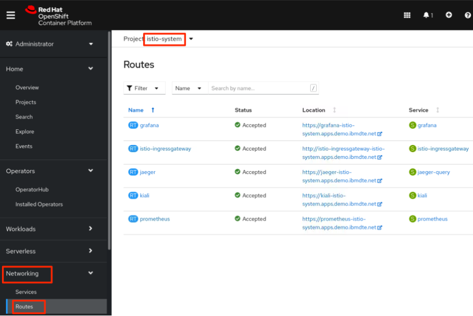

2. Click the URL(Location) next to **grafana** to open the Grafana dashboard in a new browser window.

  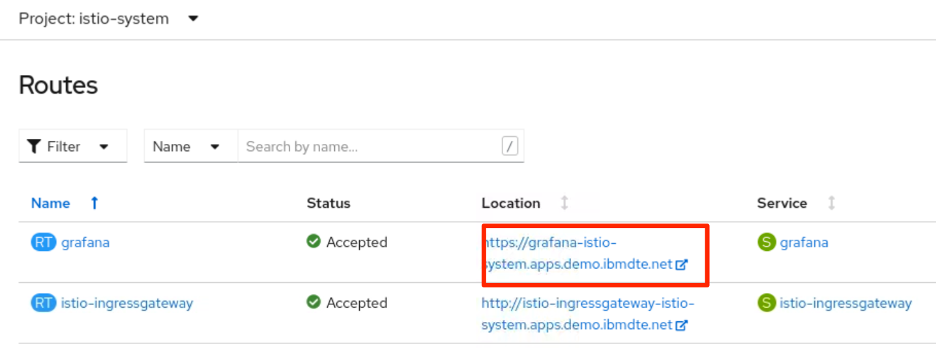

3. If you see the **Warning: Potential Security Risk Ahead** message, click **Advanced**>**Accept the Risk and continue**.
4. Click **Log In with OpenShift**.

  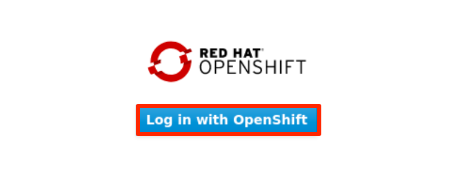

5. If prompted to log in to Red Hat OpenShift Container Platform, click **htpasswd** field. Then log in with **ibmadmin**/**engageibm** as the username and password.
 
   

   

6. If you see the **Authorize Access** page, click **Allow selected permissions**.

  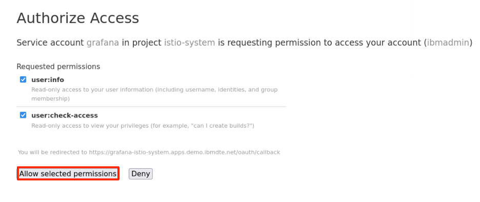

  The Grafana Home Dashboard is displayed. 

7. Click the Dashboard menu in the left navigation panel, select the **Manage**.

  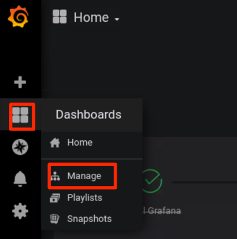

8. Select **Istio** and **Istio Service Dashboard**.

  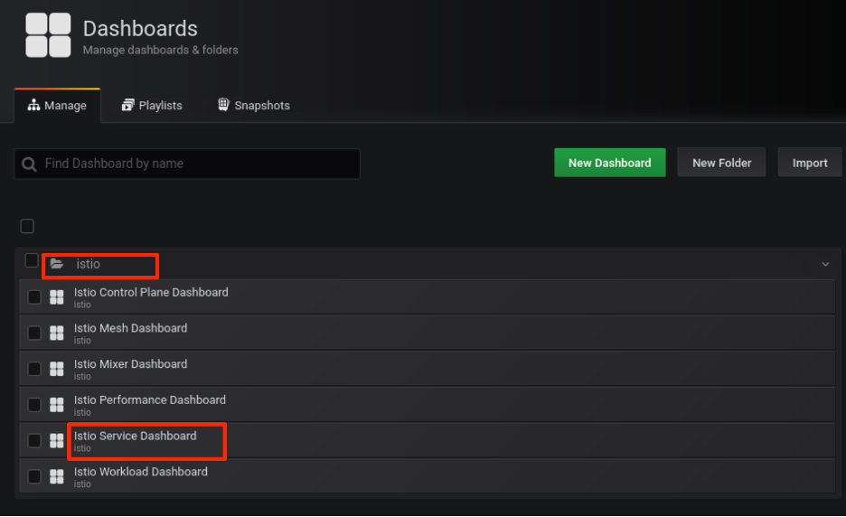

9. Select **productpage.bookinfo.svc.cluster.local** in the Service drop down.

  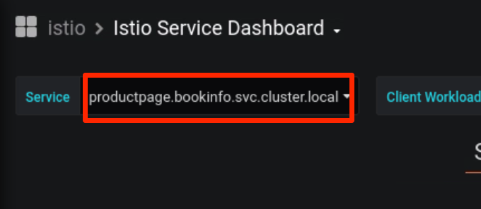

10. From the terminal window, generate a small load to the app by sending traffic to the Ingress host location you set in the last section.

  ```
  for i in {1..20}; do sleep 0.5; curl -I $INGRESS_HOST/productpage; done
  ```

11. Go back to the Grafana dashboard to see the results

  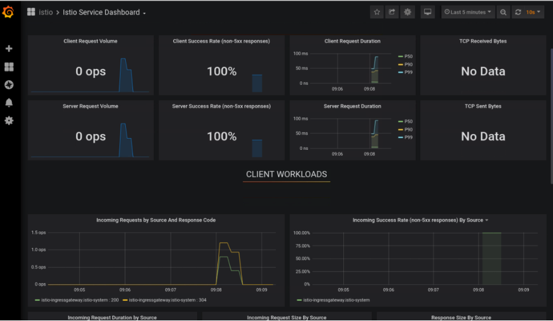
  
  This Grafana dashboard provides metrics for each workload. Explore the other dashboards provided as well.

##### 6.4.2 Observe your Service mesh with Kiali

Kiali is an open-source project that installs as an add-on on top of Istio to visualize your service mesh. Kiali provides deeper insight into how your microservices interact with one another, and provides features such as circuit breakers and request rates for your services.

1. From the OpenShift web console, select **Networking**>**Routes** under the **istio-system** project scope.
2. Click the URL(Location) next to **kiali** to open the Grafana dashboard in a new browser window.

  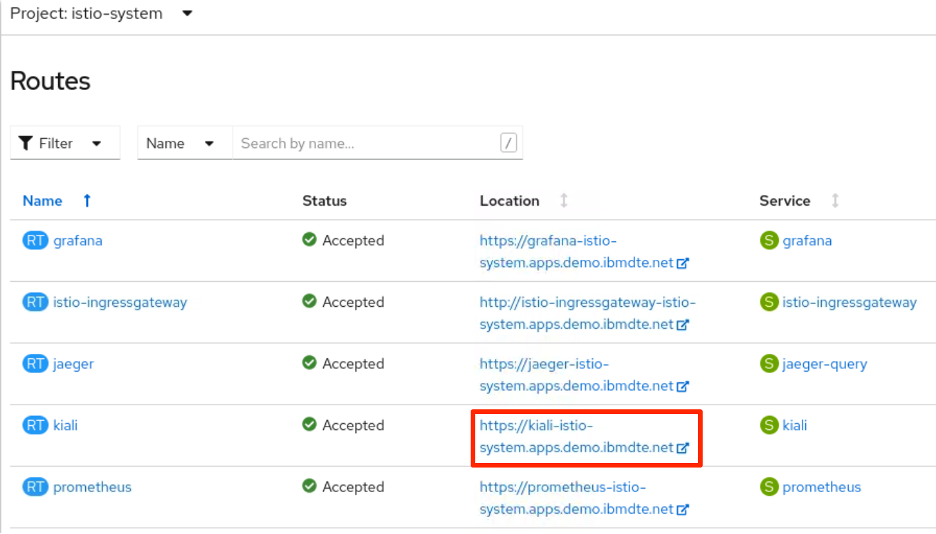

3. If you see the **Warning: Potential Security Risk Ahead** message, click **Advanced**>**Accept the Risk and continue**.
4. Click **Log In with OpenShift**.
5. Click the **Graph** on the left pane and select the **bookinfo** and **istio-system** namespaces from the top bar to see the visual **Versioned app graph** of the various services in your Istio mesh.

  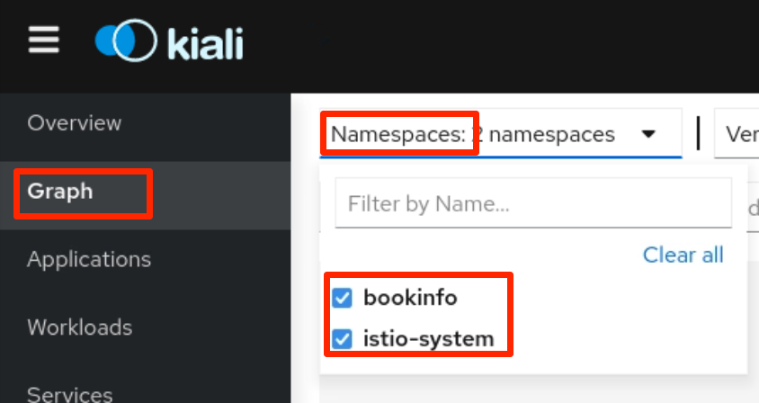 
6. To see the request rates, click **Display** and choose **Requests Per second**.

  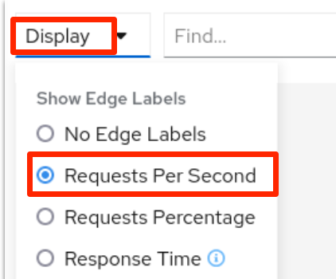 
7. In a different browser tab/window, visit the **BookInfo** application URL and refresh the page multiple times to generate some load, or run the load script in the previous section to generate load.
8. Now, check the Kiali Graph to see the requests per second.

  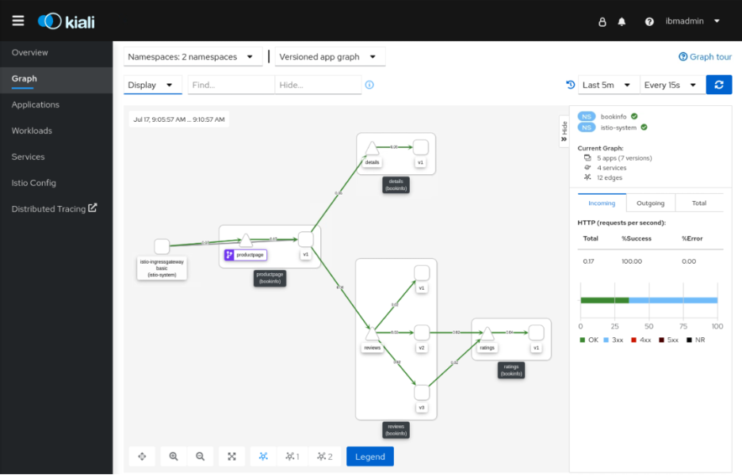    

  Kiali has a number of views to help you visualize your services. Click through the various tabs to explore the service graph, and the various views for workloads, applications and services.

#### 6.5 Perform traffic management


Istio’s traffic routing rules let you easily control the flow of traffic and API calls between services. Istio simplifies configuration of service-level properties like circuit breakers, timeouts, and retries, and makes it easy to set up important tasks like A/B testing, canary rollouts, and staged rollouts with percentage-based traffic splits. It also provides out-of-box failure recovery features that help make your application more robust against failures of dependent services or the network.

Istio’s traffic management model relies on the Envoy proxies (sidecars) that are deployed along with your services. All traffic that your services send and receive (data plane traffic) is proxied through Envoy, making it easy to direct and control traffic around your mesh without making any changes to your services.

Pilot translates high-level rules into low-level configurations and distributes this config to Envoy instances. Pilot uses three types of configuration resources to manage traffic within its service mesh: Virtual Services, Destination Rules, and Service Entries.

#### 6.5.1 A/B testing with Istio

A/B testing is a method of performing identical tests against two separate service versions in order to determine which performs better. To prevent Istio from performing the default routing behavior between the original and modernized service, define the following rules:

1. Run the following command to create default destination rules for the Bookinfo services,

  ```
  oc create -f bookinfo/networking/destination-rule-all.yaml
  ```
  
  Sample output:
  ```
  destinationrule.networking.istio.io/productpage created
  destinationrule.networking.istio.io/reviews created
  destinationrule.networking.istio.io/ratings created
  destinationrule.networking.istio.io/details created
  ```
  Note: A DestinationRule defines policies that apply to traffic intended for a service after routing has occurred. These rules specify configuration for load balancing, connection pool size from the sidecar, and outlier detection settings to detect and evict unhealthy hosts from the load balancing pool. Any destination host and subset referenced in a VirtualService rule must be defined in a corresponding DestinationRule.

2. A VirtualService defines a set of traffic routing rules to apply when a host is addressed. Each routing rule defines matching criteria for traffic of a specific protocol. If the traffic is matched, then it is sent to a named destination service (or subset/version of it) defined in the registry. Run the below command to send all reviews traffic to v1

  ```
  oc create -f bookinfo/networking/virtual-service-all-v1.yaml
  ```

  Sample output:
  ```
  virtualservice.networking.istio.io/productpage created
  virtualservice.networking.istio.io/reviews created
  virtualservice.networking.istio.io/ratings created
  virtualservice.networking.istio.io/details created

  ```
  Note: The VirtualService defines a rule that captures all HTTP traffic coming in to reviews service, and routes 100% of the traffic to pods of the service with label "version: v1". A subset or version of a route destination is identified with a reference to a named service subset which must be declared in a corresponding DestinationRule.

3. View the **BookInfo** application in browser window using the app URL: **http://istio-ingressgateway-istio-system.apps.demo.ibmdte.net/productpage** and you should only get the v1 of the **BookInfo** application - No stars for ratings.


4. To enable the Istio service mesh for A/B testing against the new service version, modify the original VirtualService rule to send only Firefox traffic to v2. You may change the user-agent to any other installed browser on your machine

  ```
  cat <<EOF | oc replace -f -
  apiVersion: networking.istio.io/v1alpha3
  kind: VirtualService
  metadata:
    name: reviews
  spec:
    hosts:
    - reviews
    http:
    - match:
      - headers:
          user-agent:
            regex: '.*Firefox.*'
      route:
      - destination:
          host: reviews
          subset: v2
    - route:
      - destination:
          host: reviews
          subset: v3
  EOF
  ```

  Sample output:
  ```
  virtualservice.networking.istio.io/reviews replaced
  ```

  Note: In Istio VirtualService rules, there can be only one rule for each service and therefore when defining multiple HTTPRoute blocks, the order in which they are defined in the yaml matters. Hence, the original VirtualService rule is modified rather than creating a new rule. With the modified rule, incoming requests originating from Firefox browsers will go to the v2 version(Black stars) of bookinfo. All other requests fall-through to the next block, which routes all traffic to the v3(Red Stars) version of bookinfo.

#### 6.5.2 Canary deployment

In Canary Deployments, newer versions of services are incrementally rolled out to users to minimize the risk and impact of any bugs introduced by the newer version. To begin incrementally routing traffic to the newer version of the bookinfo service, modify the original VirtualService rule:

1. Run the below command to send 80% of traffic to v1,

  ```
  oc replace -f bookinfo/networking/virtual-service-reviews-80-20.yaml
  ```

  In the modified rule, the routed traffic is split between two different subsets of the reviews microservice. In this manner, traffic to the modernized version 2 of reviews is controlled on a percentage basis to limit the impact of any unforeseen bugs. This rule can be modified over time until eventually all traffic is directed to the newer version of the service.

2. View the **BookInfo** application in web browser using the app URL: **http://istio-ingressgateway-istio-system.apps.demo.ibmdte.net/productpage** and You should notice that the bookinfo application should swap between V1 or V2 at about the weight you specified.

3. To route all traffic to reviews v3, run command:

  ```
  oc replace -f bookinfo/networking/virtual-service-reviews-v3.yaml
  ```
4.  View the **BookInfo** application in web browser using the app URL: **http://istio-ingressgateway-istio-system.apps.demo.ibmdte.net/productpage** and you should only get the v3 of the **BookInfo** application - Red stars for ratings.

#### 6.6  Secure your services

Istio can secure the communication between microservices without requiring application code changes. Security is provided by authenticating and encrypting communication paths within the cluster. This is becoming a common security and compliance requirement. Delegating communication security to Istio (as opposed to implementing TLS in each microservice), ensures that your application will be deployed with consistent and manageable security policies.

1. To configure mutual Transport Layer Security (mTLS), you need to modify your previous destination rules to use ISTIO_MUTUAL.

  ```
  oc replace -f bookinfo/networking/destination-rule-all-mtls.yaml
  ```

2. Send more traffic to your application. Everything should still continue to work as expected.
3. Launch Kiali again and go to Graph.
4. Select **bookinfo** from the top Namespace bar.

  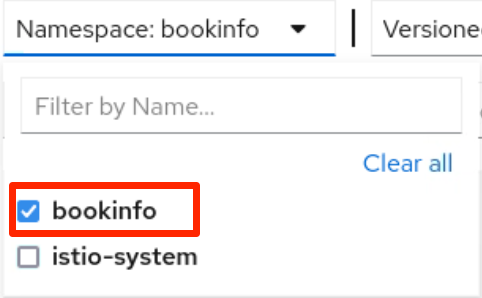  
5. Under Display, select Security. 

  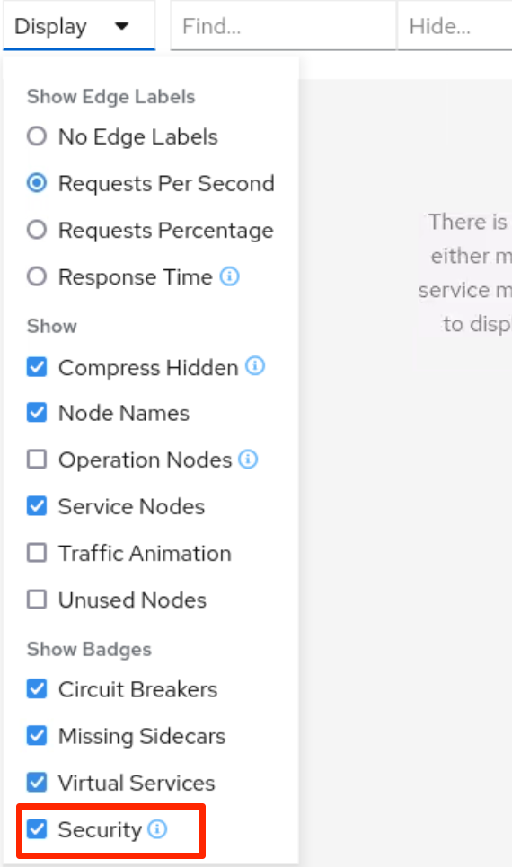  

  You should see lock icon on all the arrows(traffic).

  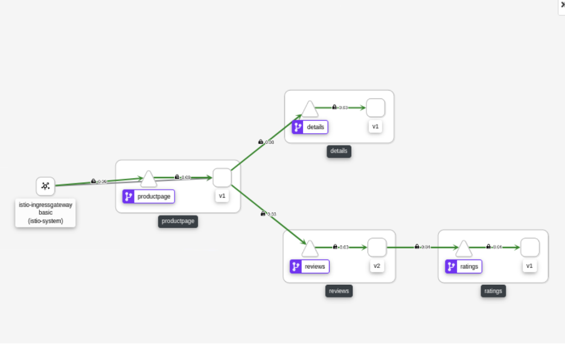  

6. To confirm your traffic is secure, click on the arrow from productpage to v1 and you should see mTLS Enabled with lock icon on the right pane.

  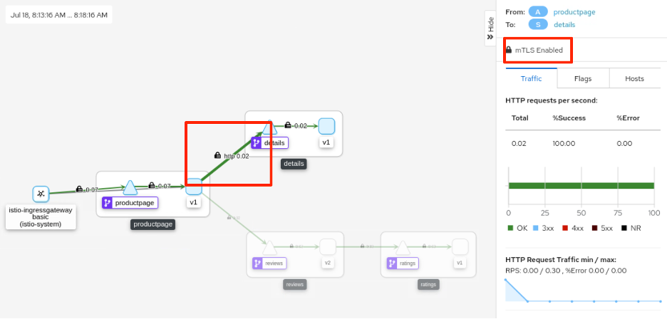 
#### 6.7  Enable SSL for traffic coming in to your cluster (HTTPS)

In this task, you will create a secure Route to the Ingress Gateway with Edge termination using the default certificate provided by OpenShift. With an edge route, the Ingress Controller terminates TLS encryption before forwarding traffic to the istio-ingressgateway Pod.

1. From the OpenShift web console, select **Networking**>**Routes** under **istio-system** project scope.

   
2. Click **Create Route** to create a new route.

  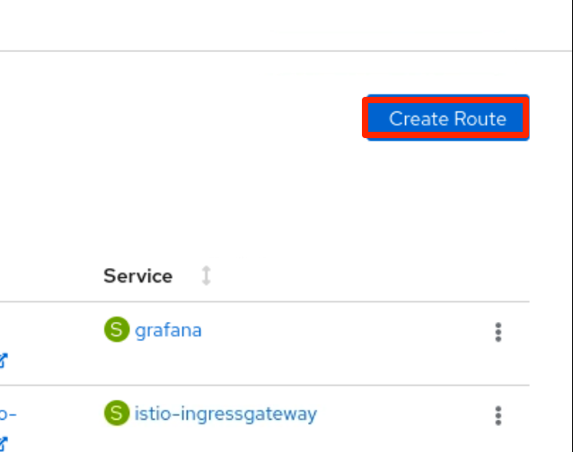

3. Enter the following parmeters and click **Create**.

    * Name: **istio-ingressgateway-secure**
    * Service: **istio-ingressgateway**
    * Target Port: **80->8080(TCP)**
    * Check Secure Route
    * TLS Termination: **Edge**
    * Insecure Traffic: **None**
 
  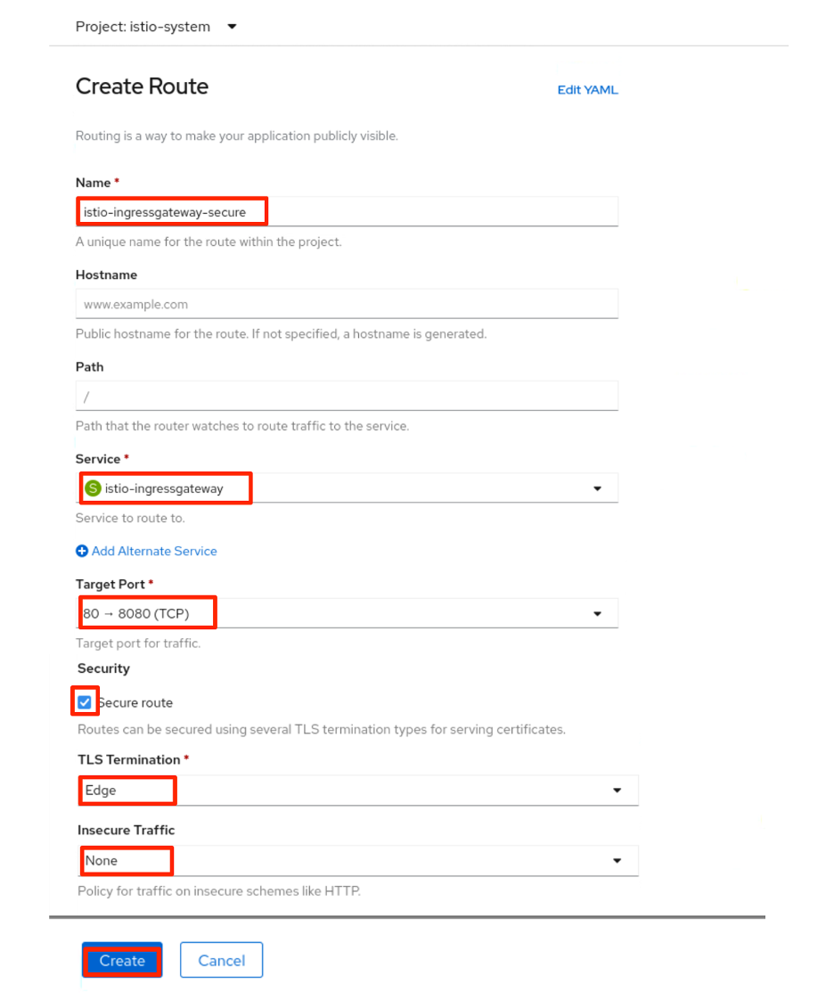

  The route **istio-ingressgateway-secure** is created.
4. Visit the new HTTPS URL under Location section of **istio-ingressgateway-secure** route. Remember to add **/productpage** at the end of the URL!

  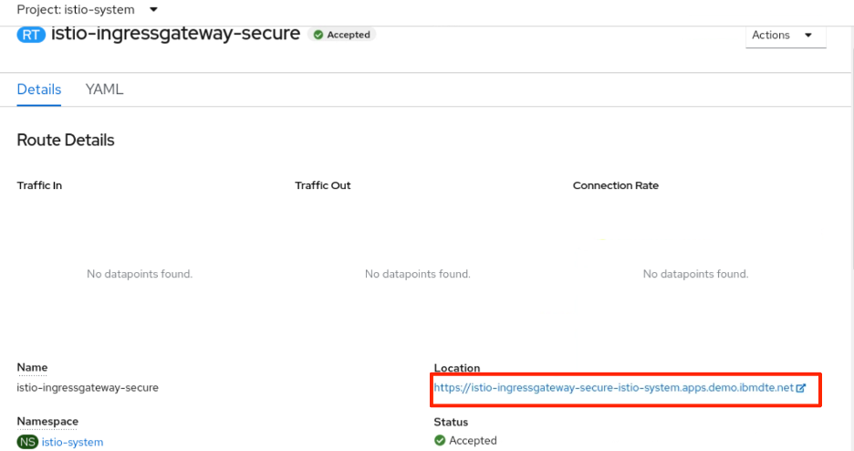

### 7.	Summary
In this lab, you have learned some basic features and functions of Red Hat OpenShift Service Mesh and how to use it. To learn more about App Mod and DevOps, please continue with the rest of the lab series.

**Congratulations! You have successfully completed OpenShift Service Mesh Introduction Lab!**

