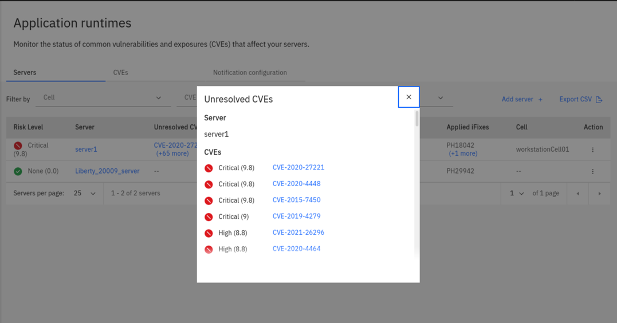

The goal of this session is to provide a hands-on experience with IBM WebSphere Automation.

### 1. Introduction

Organizations are challenged to transform quickly and maximize ROI, while keeping traditional and modern applications running together securely. Reclaiming productivity is key to giving teams back the time required to innovate and build resiliency.

Unfortunately, massive transformation programs are hard to greenlight and most fail to deliver immediate results. According to Gartner, AI augmentation will recover 6.2 billion hours of worker productivity in 20211 – time that can be invested in creating a solid and secure base for WebSphere transformation.

By leveraging AI and automation, organizations can achieve immediate savings and business benefits, while laying a solid and secure technology foundation for future growth.

With AI and automation, teams can modernize and secure their IT estate as well as adapt and respond to incidents efficiently. WebSphere system administrators can reduce the cost, effort, and risk of addressing vulnerabilities and anomalies, automate critical activities, preserve uptime and remediate capacity incidents.

IBM WebSphere Automation makes business efficiency and resiliency standard. It helps teams work less on maintenance tasks and gives time back to focus more on strategic activities, to extend the life, increase the ROI, and unlock new value from WebSphere investments.

IBM WebSphere Automation is a complete solution to help administrators and operators quickly unlock value with increased security, resiliency and performance.

**Secure operations to reduce risk and meet compliance**
  * Automatically recognize and recommend relevant CVEs for specific server deployments.
  * Deliver security patches more efficiently to targeted environments.
  * Maintain the notification system for all the security response team members from a central location.

**Build operational resiliency**
  * Sense and respond to security vulnerabilities faster to avoid disruptions for WebSphere apps.

**Optimize runtimes and applications for operational performance**
  * Access consolidated information for a streamlined operational experience.
  * Reduce tedious tasks and achieve cost and time savings through optimal resource utilization, capacity provisioning and implementation of best practices across environments.

**Start small, scale and standardize on IBM Automation**
  * Build automation capabilities on top of the IBM Automation foundation for enterprise-level hybrid application management, observability, governance and compliance.

IBM WebSphere Automation is available as a stand-alone offering or as an addition to IBM Cloud Pak® for Watson AIOps. As part of IBM Automation platform, IBM WebSphere Automation includes containerized components and common software services on top of a common automation layer, to manage WebSphere’s incidents, hybrid applications, and cost with complete observability, governance and compliance. Deploy virtually anywhere through containers supported by Red Hat® OpenShift® software, on IBM Cloud®, on essentially any existing infrastructure on-premises, or through private and public clouds. Use only the capabilities you need with a fully modular approach that’s designed to be easy to consume.

### 2. Objective

You are a WebSphere Administrator part of a WebSphere Operations Team. Today, you subscribe and receive IBM Security Bulletins to be aware about vulnerabilities, its potential impact, severity and recommended solutions. Based on that you check if this CVE applies to your managed inventory. Now, your inventory is a spreadsheet, with all the information about your servers, which versions, which operational system, which iFixes were applied, etc. It is very manual process and you are trying to automate it.

You would like to have:
- **Management dashboard:** Consolidated dashboard increases awareness and response time to common vulnerabilities and exposures (CVEs).
- **Automated vulnerability tracking:** Let WebSphere Automation track new security bulletins across your existing traditional WebSphere and Liberty environments, on virtual machines or containers.
- **Contextual notifications:** Receive security bulletin notifications only when new vulnerabilities affect the environment you manage, reducing noise and interruptions to the WebSphere operations team.
- **Shared, live visibility to key stakeholders:** WebSphere operators and security compliance teams can see the real-time security posture of the WebSphere estate, accelerating action and minimizing the risk of miscommunication.

In this tutorial, you use the IBM WebSphere Automation to secure operatios to reduce risk and meet compliance.

At the end of this lab, you will be able to connect teams with the most relevant information through a single dashboard to discover, analyze and remediate common vulnerabilities and exposures across instances.


### 3.	Prerequisites

The following prerequisites must be completed prior to beginning this lab:
*	Familiarity with basic Linux commands
*	Have internet access
*	Have a SkyTap App Mod Lab environment ready

### 4.	What is Already Completed

A six Linux VMs App Mod Lab environment has been provided for this lab. 
 
  

*	The Red Hat OpenShift Container Platform (OCP) v4.6, is installed in 5 VMs, the master1 VM, the master2 VM, the master3 VM, the dns VM and the nfs VM, with 3 master nodes and 3 compute nodes (the master nodes are serving as computer nodes as well).
*	The Workstation VM is the one you will use to access and work with OCP cluster in this lab.
  The login credentials for the Workstation VM are:
  User ID: **ibmdemo**
  Password: **passw0rd**
  Note: Use the Password above in the Workstation VM Terminal for sudo in the Lab.
*	The CLI commands used in this lab are listed in the **Commands.txt** file located at the **/home/ibmdemo/add-mod-labs/d20200st** directory of the Workstation VM for you to copy and paste these commands to the Terminal window during the lab.

### 5.	Lab Tasks

During this lab, you complete the following tasks:
*	Install Red Hat OpenShift Service Mesh
* Deploy the BookInfo application on Service Mesh
* Expose the app with the Istio Ingress Gateway and Route
* Observe service telemetry: metrics and tracing
* Perform traffic management
* Secure your services
* Enable SSL for traffic coming in to your cluster (HTTPS)

### 6.	Execute Lab Tasks

#### 6.1 Log in to the Workstation VM and get started 
1.  If the VMs are not already started, start them by clicking the play button for the whole group.

  


2.	After the VMs are started, click the Workstation VM icon to access it. 

  

  The Workstation Linux Desktop is displayed. You execute all the lab tasks on this workstation VM.

3.	If requested to log in to the Workstation OS, use credentials: **ibmdemo**/**passw0rd**
4. Open a terminal window by clicking its icon from the Desktop toolbar.

  
5. In the terminal window, run the following command to get the lab materials.

  ```
  /home/ibmdemo/get-lab-materials.sh
  ```

  Sample output

  ```
  Cloning into 'app-mod-labs'...
  warning: redirecting to https://github.com/wtistang/app-mod-labs.git/
  remote: Enumerating objects: 5693, done.
  remote: Counting objects: 100% (185/185), done.
  remote: Compressing objects: 100% (118/118), done.
  remote: Total 5693 (delta 53), reused 184 (delta 53), pack-reused 5508
  Receiving objects: 100% (5693/5693), 277.71 MiB | 57.39 MiB/s, done.
  Resolving deltas: 100% (2250/2250), done.
  Checking out files: 100% (6120/6120), done.
  ```
  
  The lab materials is downloaded to the **/home/ibmdemo/app-mod-labs** directory.
  
6. Open **File Manager** by clicking its icon on the Desktop toolbar.

  

7. Navigate to **/home/ibmdemo/app-mod-labs/d20200st** directory and click to open **Commands.txt** file in the text editor.

  

  This file contains all commands used in the lab.  When you need to any command in a terminal window in the future tasks, you should come back to this file and copy/paste the command from this file, this is because you cannot directly copy and paste from your local workstation to the SkyTap workstation.

#### 6.2 Receiving vulnerability notifications

##### 6.2.1 Accessing the WebSphere Automation UI

A WebSphere administrator sets up WebSphere Automation by registering and configuring WebSphere Application Server and WebSphere Application Server Liberty servers for vulnerability tracking and by configuring email notifications. WebSphere administrators can also view the results of vulnerability assessment in WebSphere Automation to plan their response for the WebSphere Application Server and WebSphere Application Server Liberty servers that they manage.

For this tutorial, WebSphere Automation is pre-installed on an OCP cluster. You have your individual WebSphere Automation installation. Let's access your environment.

1. From the browser window, click the **WAS Automation** bookmark to launch the **WebSphere Automation** UI.

  

  If necessary, accept all the warnings and certificates. Depending on your browser, you might have to scroll down to permit access.

2. On the login page, click **htpasswd** field. Then log in with **ibmadmin**/**engageibm** as the username and password.
 
   

   

  The **IBM Automation Welcome page** is displayed.

  

5. On the Welcome page, open the **Menu**, click **Operate**, and then click **Application runtimes**.

  

  The Application runtimes page is displayed. There should be no data since no WebSphere servers are registered/configured yet.

  

  Next, you are going to register your WebSphere application servers with the **WebSphere Austomation**. In general, before start to register servers, you should configure your email to received notifications abouts CVEs first.
 
6. Open the **Notification configuration** tab.

  

  If your Email server is configed in the cluster, you can add your email here to receive notifications of new security vulnerabilities from **WebSphere Automation**.  Since the Email server is not configired in the lab, you can skip this step.
  
### 6.2 Getting configuration parameters

Add each of your WebSphere® Application Server servers and WebSphere Application Server Liberty servers to WebSphere Automation by registering them with the usage metering service.

To register your application servers with the usage metering service in WebSphere Automation, you must configure the usage metering feature in each application server. To configure the usage metering feature in each of your application servers, you must obtain the following usage metering items:
- **URL**: The URL of the usage metering service in WebSphere Automation. This service registers WebSphere Application Server servers and Liberty servers with WebSphere Automation so that you can track security vulnerabilities.
- **API Key**: The token used to authenticate the WebSphere Application Server servers and Liberty servers during the registration process.
- **Usage metering certificate**: The certificate that contains the public key. This key allows an application server that is registering with WebSphere Automation to do an SSL handshake with the metering service.

In this section, you will get these configuration parameters. Let's start it!

1. From the terminal window log in to the OCP Cluster using the command below:
  ```
  oc login https://api.demo.ibmdte.net:6443
  ```

  when prompted, enter the login credentials as: **ibmadmin**/**engageibm**.
  
  Sample output:
  ```
  Authentication required for https://api.demo.ibmdte.net:6443 (openshift)
  Username: ibmadmin
  Password: 
  Login successful.

  You have access to 66 projects, the list has been suppressed. You can list all projects with ' projects'

  Using project "default".
  ````
2. Make sure that the project you are working on is **websphere-automation**:
  ```
  oc project websphere-automation
  ```
 
  Sample output:
  ```
  Now using project "websphere-automation" on server "https://api.demo.ibmdte.net:6443".

  ```
5. Use the oc command to get the URL of the usage metering service in WebSphere Automation and save it in a file:
  ```
  sudo echo https://$(oc get route cpd -n websphere-automation -o jsonpath='{.spec.host}')/websphereauto/meteringapi > /opt/IBM/WebSphere/metering-url.txt
  ```
  if prompted, enter the sudo password as: **passw0rd**.
6. Het the api-key and save it in a file too.
  ```
  sudo oc -n websphere-automation get secret wsa-secure-metering-apis-encrypted-tokens -o jsonpath='{.data.wsa-secure-metering-apis-sa}' | base64 -d > /opt/IBM/WebSphere/api-key.txt; echo >> /opt/IBM/WebSphere/api-key.txt
  ```

7. Finally, get the Server certificate and save it in a file.
  ```
  sudo oc get secret external-tls-secret -n websphere-automation -o jsonpath='{.data.cert\.crt}' | base64 -d > /opt/IBM/WebSphere/cacert.pem
  ```

  Great! Now you have all the configuration parameters to register your application servers with the usage metering service in WebSphere Automation. Next section, you register your first server in WebSphere Automation.

### 6.4 Configuring Liberty server v20.0.0.9

In this section, you configure Liberty Server version 20.0.0.9 to register to WebSphere Automation.

1. Create a Liberty server version 20.0.0.9, using the command below:
  
  ```
  sudo /opt/IBM/WebSphere/Liberty20009/bin/server create Liberty_20009_server
  ```

  Sample output:
  ```
  Server Liberty_20009_server created.
  ```

2. Configure the server to use TLS/SSL using the provided server_tls.xml file:
  ```
  sudo cp -f /home/ibmdemo/app-mod-labs/d20200st/20009_server.xml /opt/IBM/WebSphere/Liberty20009/usr/servers/Liberty_20009_server/server.xml
  
  sudo cp -f /home/ibmdemo/app-mod-labs/d20200st/20009_server.env /opt/IBM/WebSphere/Liberty20009/usr/servers/Liberty_20009_server/server.env
  ```

3. Start the Liberty server:
  ```
  sudo /opt/IBM/WebSphere/Liberty20009/bin/server start Liberty_20009_server
  ```

  Sample output:
  ```
  Starting server Liberty_20009_server.
  Server Liberty_20009_server started with process ID 14600.
  ```

4. Update the DefaultKeyStore with the server certificate to trust the server for https connection:
  ```
  sudo keytool -import -trustcacerts -file /opt/IBM/WebSphere/cacert.pem -keystore /opt/IBM/WebSphere/Liberty20009/usr/servers/Liberty_20009_server/resources/security/key.p12 -storetype PKCS12 -storepass th1nkpassword -noprompt
  ```

  Sample output:
  ```
  Certificate was added to keystore
  ```

5. Configure the usage metering in the new server. Edit the **server.xml** file using the **gedit** tool.
  ```
  sudo gedit /opt/IBM/WebSphere/Liberty20009/usr/servers/Liberty_20009_server/server.xml
  ```

6. Add the **usageMetering-1.0** feature to the existing features in the **&ltfeatureManager&gt** element (as shown in the picture below)
  ```
  <feature>usageMetering-1.0</feature>
  ```

  

7. Add the **usageMetering** element below:
  ```
  <usageMetering url="metering-url" apiKey="api-key" sslRef="meteringSSL"/>
  ```

  

8. Replace the **metering-url** with the output of the following command. Open another terminal window, and run the cat command below:
  ```
  cat /opt/IBM/WebSphere/metering-url.txt
  ```

  Sample output:
  ```
  https://cpd-websphere-automation.apps.demo.ibmdte.net/websphereauto/meteringapi
  ```

9. Replace **api-key** above with the output of the following cat command. Use the second terminal to run the cat command:
  ```
  cat /opt/IBM/WebSphere/api-key.txt
  ```

  Sample output:
  ```
  5N0uwXC/dFUjixj/HHM0epzmpmyg2mxdB7e4HqpRybJrAood6S/K1Nl7cqUX4DsDIiY0z9dUytAZ+rBaPvOMt6/ue0+nGMk0n47kzhwKXl1AlG6/tVVfh0PC2/ODIN4ter5XDhBuzwkkLMY8rGVeJFAQVYQDG/lPKS1E4nuuIc/IZkXC1zr+DB4l1XWL2mPKsJUmtWWbQ6518i3w66+iD/OK1EJDGDYi3kvCv+53HJn4i+aWgsjkqTB4ZDGmpNBLWBmJ0HGfLAP6cMeor2IzOuTjucTZp87BBmI34NdS6B4+BlVrwbLLudeIpZKYV/jI8z+dx7zHy6whHPLxEh9cQzU62jDUBqGF9s1QBDaKqfZWB1TI1RvlH0sTWVqj6hhh1ED5qUNwiW7F6jzcJ08Cik13x8JFUXkAMl4h3Z5uKaPQuQztUSqdJIgaweziqMuEr9tYPXdfQDbfH8GcbUXIQpGI051y0g5ks4WEReWJVY4WA+vYvnonbUchqtxHoJOxTZINq3fU2ykArKJ+lRLtfrlIFfw+R8XYxaaKeW43S+F8b+g+ZIbEHZXYcmzOuLXzk6k0tjUFRzRc9txzvecZCjq7AP2DSHgH6brExc4DU5BPUL4zn2WVn7TYAJwPfS2BrJvroFjhrKFEoTSqth9IJVVFZTwxw6U+iPx9EiFABp9QPTgBVu3K7KR3L+GdskFY9win99a3aoA6fxk6W8pTC+Qeync2lVhBbgMa7qRJPTttCZg6mIJnEfMQDyLWPv/nuPotd6lR7xQLkAIsy3fI+3icQb2wwDrnDDyd1XCN2E2hlVKLvnGGm13046Ul6Um6SuZiwNuHHlH3iOOnBru+bmmRo3PfPNhsveKzDIHnJXkLSJQOdUV0kSevTanfsenJOowYX1cF69kFbyTDg7AKxDzK00w7ujmP+7qwMPZP0gd37T7mkjpO+Jp8fkcJMt2ElYl3Net4Cbdiqz+R7p9VPmN0tzxRxUCea5zkpHC/T/5YLGeR0NqFfOUwCkx14t94y3xJhIzHSOcKqgbMB8+cxtzoowwBOQOCqHZlkVIKwvWmdjzdbw48zhKWMf/Vb4Okk3ZnBI3rslMFvk+kc/8Nqu4PENhKoJ9ZGKIPC+iVb4YBpc9Q/SAtNihpWW3LXdi0MxIThHD3UwPa1KHq1YxwDW2T+AypBgv59tOZPC+R93GJYZhz/3s0vWeel1uy8S465oeDptsgjkuMrSPzK1JS+zFYKxYGOmNMv/74jTVktStwsxAng+qrlZIu8Dxg==

  ```

  After the changes, your **server.xml** file looks like this:

  

10. Click **Save** to save the changes and close the **server.xml** file.

11. Run the commands below to restart the server. This forces the Liberty server registration to get activated immediately.

  ```
  sudo /opt/IBM/WebSphere/Liberty20009/bin/server stop Liberty_20009_server

  sudo /opt/IBM/WebSphere/Liberty20009/bin/server start Liberty_20009_server

  ```
12. Back to the WebSphere Automation Dashboard on your browser, open the **Servers** view.

  

13. Confirm that the Liberty server is registered to WebSphere Automation Application runtimes page.

  

  Maybe your server vulnerability is a little bit different of the picture above. That is a possibility, since new vulnerabilities are constantly discovered.

  If you have the Email server configured with **WebSphere Automation**, a mail notification shoud be sent showing the vulnerability.

### 6.5 Configuring traditional WebSphere (tWAS) v9.0.0.11

In this section, you configure another version of a traditional WebSphere Application Server to your WebSphere Automation dashboard. The steps here are the same of the last section.

1. First, you just need to start the tWAS 9.0.0.11 server. On the terminal window, execute the command below:
  ```
  /home/ibmdemo/app-mod-labs/shared/startWASV9.sh
  ```

2. Configure the usage-metering.
  ```
  sudo /opt/IBM/WebSphere/AppServer_V90/bin/wsadmin.sh -f /home/ibmdemo/app-mod-labs/d20200st/configuretWasUsageMetering.py url=$(cat /opt/IBM/WebSphere/metering-url.txt) apiKey=$(cat /opt/IBM/WebSphere/api-key.txt) trustStorePassword=th1nkpassword
  ```
  When prompted, enter the WAS admin credentials as: **wsadmin**/**passw0rd**.

  

  Sample output:
  ```
  WASX7209I: Connected to process "dmgr" on node workstationCellManager01 using SOAP connector;  The type of process is: DeploymentManager
  WASX7303I: The following options are passed to the scripting environment and are available as arguments that are stored in the argv variable: "[url=https://cpd-websphere-automation.apps.demo.ibmdte.net/websphereauto/meteringapi, apiKey=5N0uwwknp2kwSyNXiKK3YG1JbIHIAxrshpHs1w5E2+3ItR7k3z27KytsU+4L5G4lsbGCl/17vGlztfDDurKyVGUXJQM4f86XC/dFUjixj/HHM0epzmpmyg2mxdB7e4HqpRybJrAood6S/K1Nl7cqUX4DsDIiY0z9dUytAZ+rBaPvOMt6/ue0+nGMk0n47kzhwKXl1AlG6/tVVfh0PC2/ODIN4ter5XDhBuzwkkLMY8rGVeJFAQVYQDG/lPKS1E4nuuIc/IZkXC1zr+DB4l1XWL2mPKsJUmtWWbQ6518i3w66+iD/OK1EJDGDYi3kvCv+53HJn4i+aWgsjkqTB4ZDGmpNBLWBmJ0HGfLAP6cMeor2IzOuTjucTZp87BBmI34NdS6B4+BlVrwbLLudeIpZKYV/jI8z+dx7zHy6whHPLxEh9cQzU62jDUBqGF9s1QBDaKqfZWB1TI1RvlH0sTWVqj6hhh1ED5qUNwiW7F6jzcJ08Cik13x8JFUXkAMl4h3Z5uKaPQuQztUSqdJIgaweziqMuEr9tYPXdfQDbfH8GcbUXIQpGI051y0g5ks4WEReWJVY4WA+vYvnonbUchqtxHoJOxTZINq3fU2ykArKJ+lRLtfrlIFfw+R8XYxaaKeW43S+F8b+g+ZIbEHZXYcmzOuLXzk6k0tjUFRzRc9txzvecZCjq7AP2DSHgH6brExc4DU5BPUL4zn2WVn7TYAJwPfS2BrJvroFjhrKFEoTSqth9IJVVFZTwxw6U+iPx9EiFABp9QPTgBVu3K7KR3L+GdskFY9win99a3aoA6fxk6W8pTC+Qeync2lVhBbgMa7qRJPTttCZg6mIJnEfMQDyLWPv/nuPotd6lR7xQLkAIsy3fI+3icQb2wwDrnDDyd1XCN2E2hlVKLvnGGm13046Ul6Um6SuZiwNuHHlH3iOOnBru+bmmRo3PfPNhsveKzDIHnJXkLSJQOdUV0kSevTanfsenJOowYX1cF69kFbyTDg7AKxDzK00w7ujmP+7qwMPZP0gd37T7mkjpO+Jp8fkcJMt2ElYl3Net4Cbdiqz+R7p9VPmN0tzxRxUCea5zkpHC/T/5YLGeR0NqFfOUwCkx14t94y3xJhIzHSOcKqgbMB8+cxtzoowwBOQOCqHZlkVIKwvWmdjzdbw48zhKWMf/Vb4Okk3ZnBI3rslMFvk+kc/8Nqu4PENhKoJ9ZGKIPC+iVb4YBpc9Q/SAtNihpWW3LXdi0MxIThHD3UwPa1KHq1YxwDW2T+AypBgv59tOZPC+R93GJYZhz/3s0vWeel1uy8S465oeDptsgjkuMrSPzK1JS+zFYKxYGOmNMv/74jTVktStwsxAng+qrlZIu8Dxg==, trustStorePassword=th1nkpassword]"
  Input arguments:
    url: https://cpd-websphere-automation.apps.demo.ibmdte.net/websphereauto/meteringapi
    apiKey: 5N0uwwknp2kwSyNXiKK3YG1JbIHIAxrshpHs1w5E2+3ItR7k3z27KytsU+4L5G4lsbGCl/17vGlztfDDurKyVGUXJQM4f86XC/dFUjixj/HHM0epzmpmyg2mxdB7e4HqpRybJrAood6S/K1Nl7cqUX4DsDIiY0z9dUytAZ+rBaPvOMt6/ue0+nGMk0n47kzhwKXl1AlG6/tVVfh0PC2/ODIN4ter5XDhBuzwkkLMY8rGVeJFAQVYQDG/lPKS1E4nuuIc/IZkXC1zr+DB4l1XWL2mPKsJUmtWWbQ6518i3w66+iD/OK1EJDGDYi3kvCv+53HJn4i+aWgsjkqTB4ZDGmpNBLWBmJ0HGfLAP6cMeor2IzOuTjucTZp87BBmI34NdS6B4+BlVrwbLLudeIpZKYV/jI8z+dx7zHy6whHPLxEh9cQzU62jDUBqGF9s1QBDaKqfZWB1TI1RvlH0sTWVqj6hhh1ED5qUNwiW7F6jzcJ08Cik13x8JFUXkAMl4h3Z5uKaPQuQztUSqdJIgaweziqMuEr9tYPXdfQDbfH8GcbUXIQpGI051y0g5ks4WEReWJVY4WA+vYvnonbUchqtxHoJOxTZINq3fU2ykArKJ+lRLtfrlIFfw+R8XYxaaKeW43S+F8b+g+ZIbEHZXYcmzOuLXzk6k0tjUFRzRc9txzvecZCjq7AP2DSHgH6brExc4DU5BPUL4zn2WVn7TYAJwPfS2BrJvroFjhrKFEoTSqth9IJVVFZTwxw6U+iPx9EiFABp9QPTgBVu3K7KR3L+GdskFY9win99a3aoA6fxk6W8pTC+Qeync2lVhBbgMa7qRJPTttCZg6mIJnEfMQDyLWPv/nuPotd6lR7xQLkAIsy3fI+3icQb2wwDrnDDyd1XCN2E2hlVKLvnGGm13046Ul6Um6SuZiwNuHHlH3iOOnBru+bmmRo3PfPNhsveKzDIHnJXkLSJQOdUV0kSevTanfsenJOowYX1cF69kFbyTDg7AKxDzK00w7ujmP+7qwMPZP0gd37T7mkjpO+Jp8fkcJMt2ElYl3Net4Cbdiqz+R7p9VPmN0tzxRxUCea5zkpHC/T/5YLGeR0NqFfOUwCkx14t94y3xJhIzHSOcKqgbMB8+cxtzoowwBOQOCqHZlkVIKwvWmdjzdbw48zhKWMf/Vb4Okk3ZnBI3rslMFvk+kc/8Nqu4PENhKoJ9ZGKIPC+iVb4YBpc9Q/SAtNihpWW3LXdi0MxIThHD3UwPa1KHq1YxwDW2T+AypBgv59tOZPC+R93GJYZhz/3s0vWeel1uy8S465oeDptsgjkuMrSPzK1JS+zFYKxYGOmNMv/74jTVktStwsxAng+qrlZIu8Dxg
    trustStorePassword: ********
  Creating keystore meteringTrustStore ...
  Keystore was created: meteringTrustStore(cells/workstationCell01|security.xml#KeyStore_1627915301935)
  Retrieving signer from port ...
  Signer was retrieved from host: cpd-websphere-automation.apps.demo.ibmdte.net, port: 443 and store to keystore: meteringTrustStore
  Creating was-usage-metering.properties file with all specified properties ...
  Copying keystore meteringTrustStore.p12 and was-usage-metering.properties to all servers ...
  keystoreFile meteringTrustStore.p12 was created on all servers.
  was-usage-metering.properties was created on all servers.
  Syncing config changes to all nodes ...
  Sync nodes were done!
  ```
3. Great, you second traditional WAS server is configured. Let's check our WebSphere Automation dashboard. Back to the browser, dashboard, confirm that the tWAS v9.0.5.7 is registered.

  

  You should see that this server is vulnerable to **CVE-2020-27221**. As explained before, maybe your server has more vulnerability than displayed in the picture, because it depends when you execute your lab, since new vulnerabilities are discovered constantly.

  If you have the Email server configured with **WebSphere Automation**, a mail notification shoud be sent showing the vulnerability.

### 6.6 Update Liberty server v20.0.0.9 to fix the vulnerability

In this section, you will fix one vulnerability in our Liberty Server v20.0.0.9 using two different approaches. First, you fix only updating configuraiton. Later, you apply an iFix to solve the vulnerability. Let's see how to do it.

#### 6.6.1 Updating configurations

Liberty 20.0.0.9 is impacted by **CVE-2020-10693**. This is because it configures the **beanValidation-2.0** feature. See [CVE-2020-10693](https://www.ibm.com/support/pages/node/6348216) for more info.

You should be able to resolve this by applying the iFix. However, for the lab, you can also do a quick test by unconfiguring this feature.

1. Edit the server.xml, using the command below:
  ```
  sudo gedit /opt/IBM/WebSphere/Liberty20009/usr/servers/Liberty_20009_server/server.xml
  ```

2. Comment out the feature:
  ```
  <!-- <feature>beanValidation-2.0</feature> -->
  ```

  

3. Click **Save** and **Close** the **server.xml** file.

4. Back to your browser, check that the Liberty 20.0.0.9 server does not show the **CVE-2020-10693** vulnerability. The update is picked up automatically.

  

  Great, you removed the vulnerability by updating the configuration.

  If you have the Email server configured with **WebSphere Automation**, a mail notification shoud be sent showing the vulnerability.

#### 6.6.2 By Applying an IFIX

However, instead of remove the **beanValidationFeature-2.0**, the correct process is to apply the appropriate iFix to get rid of the vulnerability. Let's do it in this part.

1. First, you need to restore the **beanValidation** feature.

  ```
  sudo gedit /opt/IBM/WebSphere/Liberty20009/usr/servers/Liberty_20009_server/server.xml
  ```

2. Uncomment out the feature:
  ```
  <feature>beanValidation-2.0</feature>
  ```

  

3. Click **Save** and **Close** the **server.xml** file.

4. Back to the browser, make sure the vulnerability shows up again.

  

5. You need to stop the server, before apply the iFix. Back to the terminal window, run the command below:
  ```
  sudo /opt/IBM/WebSphere/Liberty20009/bin/server stop Liberty_20009_server
  ```

6. Now, ypu can apply the iFix.
  ```
  /home/ibmdemo/app-mod-labs/d20200st/imcl_ifix_install.sh 20009
  ```

  Sample output:
  ```
  Installed 20.0.0.9-WS-WLP-IFPH29942_20.0.9.20201009_2126 to the /opt/IBM/WebSphere/Liberty20009 directory.
  ```

7. Great, you iFix was applied. Now, start the server again:
  ```
  sudo /opt/IBM/WebSphere/Liberty20009/bin/server start Liberty_20009_server
  ```

  Now in your WebSphere Automation Dashboard you should notice that the CVE was removed:

  

  If you have the Email server configured with **WebSphere Automation**, a mail notification shoud be sent showing the vulnerability.

### 6.7 Update tWAS server v9.0.0.11 to fix the vulnerability

In this section, you will apply an iFix in tWAS 9.0.0.11 to remove a CVE vulnerability.

1. In the WebSphere Automation Dashboard page, click the CVEs link get see all the CVEs.

  

  You will see the list of these 68 vulnerabilities including **CVS-2020-4450**.  You will apply the appropriate iFix to fix it.

  

2. First, stop the WAS server, wait until it has stopped:
  ```
  /home/ibmdemo/app-mod-labs/shared/stopWASV9.sh
  ```

3. Run the following script to install the iFix:
  ```
  /home/ibmdemo/app-mod-labs/d20200st/imcl_ifix_install.sh 9057
  ```
  Sample output:
  ```
  Installed 9.0.0.11-WS-WASProd-IFPH25074_9.0.11.20200616_1232 to the /opt/IBM/WebSphere/AppServer_V90 directory.
  ```
4. Start the server once the installation has completed:
  ```
  /home/ibmdemo/app-mod-labs/shared/startWASV9.sh
  ```

5. Go back to the WebSphere Automation dashboard. Notice that the **CVE-2020-4450** was removed from tWAS 9.0.0.11.  Also, you can see on the right under "Applied iFixes" there are 2 applied fixes.

  

  If you have the Email server configured with **WebSphere Automation**, a mail notification shoud be sent showing the vulnerability.

### 7. Summary

Congratulations! You have completed the WebSphere Automation lab.

With automated tooling and insights, IBM WebSphere Automation enables teams to modernize and secure IT estates, adapt and respond to incidents efficiently, and optimize WebSphere operations. WebSphere system operators and administrators can reduce the cost, effort, and risk of addressing vulnerabilities, automate critical activities, and preserve uptime with early detection, notification, and remediation of incidents.

IBM WebSphere Automation helps teams remove manual toil to work less on maintenance tasks and more on strategic activities, while unlocking new value, extending the life, and increasing ROI of WebSphere investments.

IBM WebSphere Automation is part of IBM Automation, a set of shared automation services that help you get insight into how your processes run, visualize hotspots and bottlenecks, and use financial impact information to prioritize which issues to address first.

To learn more about IBM WebSphere Automation, visit [ibm.com/cloud/websphere-automation](http://ibm.com/cloud/websphere-automation).

**Congratulations! You have successfully completed WebSpehre Automation Introduction Lab!**

