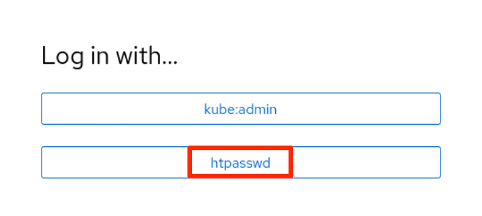
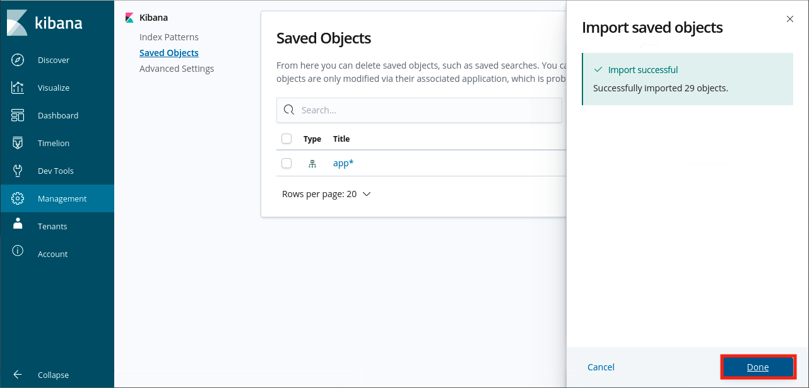
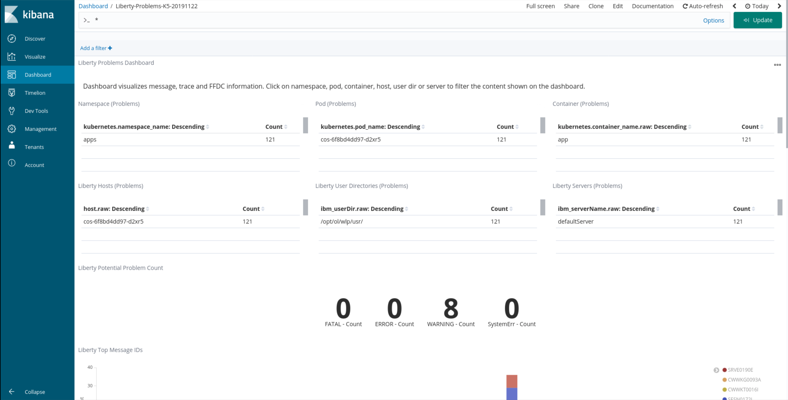
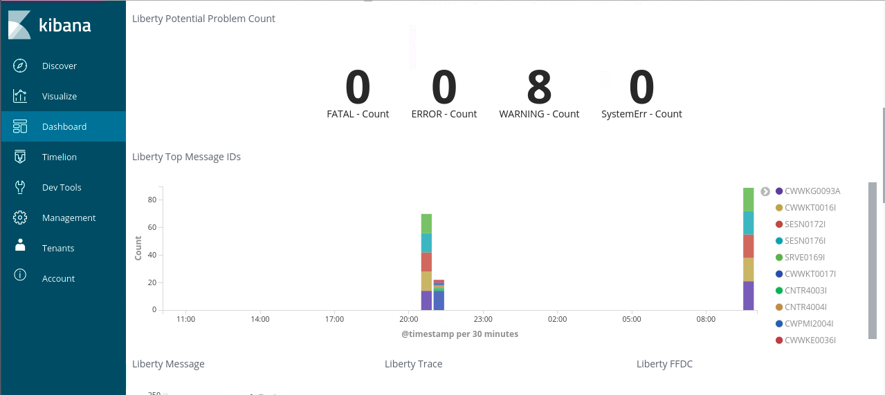
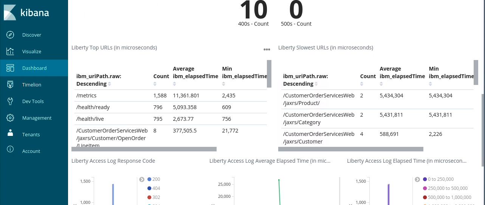
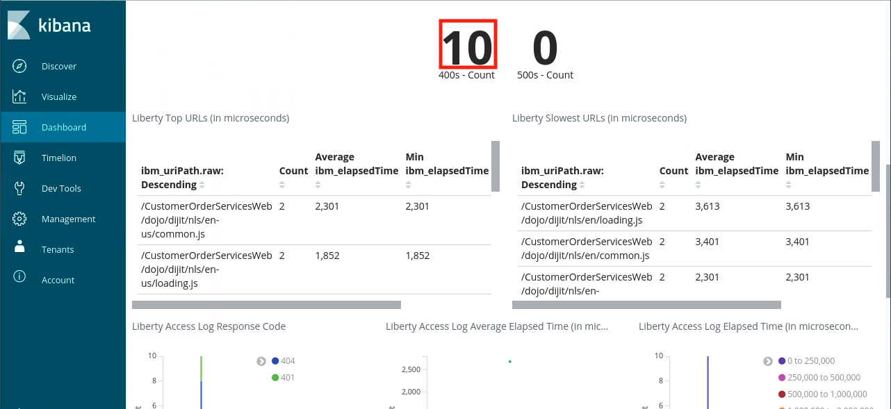
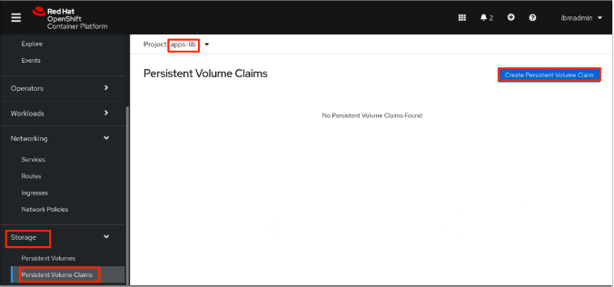

In this lab, you learn about managing your running applications efficiently using various tools available to you as part of OpenShift and OperatorHub, including the Open Liberty Operator.

### 1. Introduction

How to conduct **Day 2 Operations** in a hybrid cloud environment is one of the challenges customers are facing in their journey to the cloud, it is hard to quickly determine the root cause of an issue or to get the information needed to make decisions with too many views, tools and inconsistencies. IBM Cloud Paks and Red Hat OpenShift provide tools and solutions to address such issues. The application logs are aggregated using Elasticsearch, Fluentd and Kibana (**EFK**). Elasticsearch is a search and analytics engine. Fluentd receives, cleans and parses the log data. Kibana lets users visualize data stored in Elasticsearch with charts and graphs. The tools allow users to effectively manage their applications log data and ensure no loss of log data occurs when a pod terminates. The tools help users persist, search, and visualize the log data gathered from the pods across the cluster.

### 2. Objective

The objectives of this lab are to help you to learn how to conduct Day 2 Operations in an OpenShift cluster environment, including:

* manage your application logs using EFK 
* persist, search, and visualize the log data in Kibana dashboard
* monitor your application with Grafana
* request storage, enable serviceability, and request/access server dump/trace


### 3.	Prerequisites

The following prerequisites must be completed prior to beginning this lab:
*	Familiarity with basic Linux commands
*	Have internet access
*	Have a SkyTap App Mod Lab environment ready

### 4.	What is Already Completed

A six Linux VMs App Mod Lab environment has been provided for this lab. 
 
  

*	The Red Hat OpenShift Container Platform (OCP) v4.6, is installed in 5 VMs, the master1 VM, the master2 VM, the master3 VM, the dns VM and the nfs VM, with 3 master nodes and 3 compute nodes (the master nodes are serving as computer nodes as well).
*	The workstation VM is the one you will use to access and work with OCP cluster in this lab.
  The login credentials for the workstation VM are:
  User ID: **ibmdemo**
  Password: **passw0rd**
  Note: Use the Password above in the workstation VM Terminal for sudo in the Lab.
*	The CLI commands used in this lab are listed in the **Commands.txt** file located at the **/home/ibmdemo/add-mod-labs/d20300st** directory of the workstation VM for you to copy and paste these commands to the Terminal window during the lab.

### 5.	Lab Tasks

During this lab, you complete the following tasks:
*	deploy Liberty applications to OCP cluster
* configure OpenShift user-workload monitoring
* configure the application for monitoring
* import Kibana Dashboard for Open Liberty and monitor Liberty application in Kibana Dashboard
* import Grfana Dashboard for Open Liberty and monitor Liberty application in Grfana Dashboard
* add resources to Open Liberty application
* request Open Liberty dump/trace

### 6.	Execute Lab Tasks

#### 6.1 Log in to the workstation VM and get started 
1.  If the VMs are not already started, start them by clicking the play button for the whole group.

  


2.	After the VMs are started, click the workstation VM icon to access it. 

  

  The Workstation Linux Desktop is displayed. You execute all the lab tasks on this workstation VM.

3.	If requested to log in to the Workstation OS, use credentials: **ibmdemo**/**passw0rd**
4. Open a terminal window by clicking its icon from the Desktop toolbar.

  
5. In the terminal window, run the following command to get the lab materials.

  ```
  /home/ibmdemo/get-lab-materials.sh
  ```

  Sample output

  ```
  Cloning into 'app-mod-labs'...
  warning: redirecting to https://github.com/wtistang/app-mod-labs.git/
  remote: Enumerating objects: 5693, done.
  remote: Counting objects: 100% (185/185), done.
  remote: Compressing objects: 100% (118/118), done.
  remote: Total 5693 (delta 53), reused 184 (delta 53), pack-reused 5508
  Receiving objects: 100% (5693/5693), 277.71 MiB | 57.39 MiB/s, done.
  Resolving deltas: 100% (2250/2250), done.
  Checking out files: 100% (6120/6120), done.
  ```
  
  The lab materials is downloaded to the **/home/ibmdemo/app-mod-labs** directory.
  
6. Open **File Manager** by clicking its icon on the Desktop toolbar.

  

7. Navigate to **/home/ibmdemo/app-mod-labs/d20300st** directory and click to open **Commands.txt** file in the text editor.

  

  This file contains all commands used in the lab.  When you need to enter any command in a terminal window in the lab tasks, you should come back to this file and copy/paste the command from this file, this is because you cannot directly copy and paste from your local workstation to the SkyTap workstation.

#### 6.2 Build and deploy the Liberty application

1. From the terminal window log in to the OCP Cluster using the command below:
  ```
  oc login -u ibmadmin -p engageibm https://api.demo.ibmdte.net:6443
  ``` 
  Sample output:
  ```
  Login successful.

  You have access to 66 projects, the list has been suppressed. You can list all projects with ' projects'

  Using project "default".
  ````
1. From the terminal window, change to the Liberty application directory:
  ```
  cd /home/ibmdemo/app-mod-labs/shared/CustomerOrderServices-liberty
  ```

1. Create and switch over to the project **apps-lib**. Also, enable monitoring for the project. 
  ```
  oc new-project apps-lib
  
  oc label namespace apps-lib app-monitoring=true
  
  ```
  Sample output:
  ```
  Now using project "apps-lib" on server "https://api.demo.ibmdte.net:6443".

  You can add applications to this project with the 'new-app' command. For example, try:

      oc new-app rails-postgresql-example

  to build a new example application in Ruby. Or use kubectl to deploy a simple Kubernetes application:

      kubectl create deployment hello-node --image=k8s.gcr.io/serve_hostname

  namespace/apps-lib labeled

  ```
1. Build and deploy the application by running the commands in the following sequence. 
  ```
  docker build . --tag default-route-openshift-image-registry.apps.demo.ibmdte.net/apps-lib/cos 
  
  docker login -u $(oc whoami) -p $(oc whoami -t) default-route-openshift-image-registry.apps.demo.ibmdte.net
  
  docker push default-route-openshift-image-registry.apps.demo.ibmdte.net/apps-lib/cos
  
  oc apply -k deploy/overlay-apps
  ```
  Sample output:
  ```
  configmap/cos-config created
  secret/db-creds created
  secret/liberty-creds created
  openlibertyapplication.openliberty.io/cos created
  ```

1. Verify your pod is ready:
  ```
  oc get pods 
  ```
  Example output:
  ```
  NAME                   READY   STATUS    RESTARTS   AGE
  cos-54975b94c6-rh6kt   1/1     Running   0          3m11s
  ```
1. Verify the route for the application is created:
  ```
  oc get route cos
  ```
  Sample output:
  ```
  NAME   HOST/PORT                       PATH   SERVICES   PORT       TERMINATION          WILDCARD
  cos    cos-apps.apps.demo.ibmdte.net          cos        9443-tcp   reencrypt/Redirect   None
  ```
1. Get the application URL:
  ```
  echo http://$(oc get route cos  --template='{{ .spec.host }}')/CustomerOrderServicesWeb
  ```
  Sample output:
  ```
  http://cos-apps-lib.apps.demo.ibmdte.net/CustomerOrderServicesWeb 
  ``` 
1. Return to the Firefox browser window, open a new tab and go to the URL outputted by the command run in the previous step.

1. If you see the **Warning: Potential Security Risk Ahead** message, click **Advanced**>**Accept the Risk and continue**.
    
1. You will be prompted to login in order to access the application. Enter the following credentials:
    - Username: **skywalker**
    - Password: **force**

1. After login, the application page titled **Electronic and Movie Depot** will be displayed. From the **Shop** tab, click on an item (a movie) and on the next pop-up panel, drag and drop the item into the shopping cart. Add multiple items to the shopping cart to trigger more logging.

    

1. Add a few items to the cart. As the items are added, they’ll be shown under **Current Shopping Cart** (on the upper right) with **Order Total**.

    
  
#### 6.3 Application Logging

Pod processes running in OpenShift frequently produce logs. You can use Red Hat OpenShift Log aggregation tools to manage this log data, to persist, to search, and to visualize the log data that is gathered from the pods across the cluster. 

If it has been a long time (more than 15 minutes) since the Liberty or WebSphere pods last started, you may want to go to their web pages, add more transections to ensure that Liberty and WebSphere create some recent logs for Kibana to find.

#### 6.3.1 Launch Kibana
1. From the browser window, open a ne tab and click **OpenShift web console** bookmark to open it.

   
  
1. If prompted to log in to Red Hat OpenShift Container Platform, click **htpasswd** field. Then log in with **ibmadmin**/**engageibm** as the username and password.
 
   

   

  The OCP web console Overview page is displayed. 
  
  

1. In the OpenShift console, click **Red Hat Applications** icon from the top-right panel, select **Logging**.

  

  This will open a new tab and take you the Kibana console page.

1. If prompted to log in to Red Hat OpenShift Container Platform, click **htpasswd** field. Then log in with **ibmadmin/engageibm** as the username and password.

1. In the Kibana console, you'll be prompted to create an index pattern. An index pattern tells Kibana what indices to look for in Elasticsearch. Type **app** so that the index pattern looks like this screenshot:

    

    You should see that your pattern matches at least one index. Then click **Next step**.

1. Click the drop-down for **Time Filter field name** and choose **@timestamp**. Then click **Create index pattern**.

    

1. You should see a number of fields populated. To check that the correct fields have been detected, type **ibm** in the **Filter** text box. You should see many fields beginning with the text **ibm**. If not, try clicking the refresh button (arrows in a circle) at the top right of the page.

    

#### 6.3.2 Import dashboard

1. Import dashboards for Liberty to the OCP cluster. Click **Saved Objects** link.

    

1. In the Saved Objects page, click **Import**.

  

1. Click on **Import** from the right panel that is displayed.

  

1. Navigate to **/home/ibmdemo/app-mod-labs/d20300st/kibana** directory and select the **ibm-open-liberty-kibana5-problems-dashboard.json** file. Click **Open**.

    

1. Click the **Import** button at the bottom of the panel. 

    

1. When prompted to resolve pattern conflicts, select **app*** as the new index from the drop down menu. Click **Confirm all changes**. 

    

1. It takes few seconds for the dashboard to import. Click **Done** when it finishes.

    

1. Repeat the steps 2 - 7 to import the **ibm-open-liberty-kibana5-traffic-dashboard.json** file from the **kibana** folder.

#### 6.3.3 Explore dashboards 

1. In the Kibana console, from the left-panel, click on the **Dashboard** tab. You see 2 dashboards on the list. The first 2 are for Liberty. Read the description next to each dashboard.

  


1. Click on the **Liberty-Problems-K5-20191122** dashboard. This dashboard visualizes message, trace and FFDC information from Liberty applications.

    

1. By default, data from the last 15 minutes are rendered. Adjust the time-range (from the top-right corner), so that it includes data from when you tried the Open Liberty application.

    

1. Once the data is rendered, you'll see some information about the namespace, pod, containers where events/problems occurred along with a count for each. 

    

1. Scroll down to **Liberty Potential Problem Count** section which lists the number of ERROR, FATAL, SystemErr and WARNING events. You'll likely see some WARNING events.

1. Below that you'll see **Liberty Top Message IDs**. This helps to quickly identify frequently occurring events and their timeline.

    

1. Click on the number above **WARNING**. The dashboard will change other panels to show just the events for warnings. Using this, you can determine whether the failures occurred on one or multiple pods/servers and whether they occurred around the same or different time.

    

1. Scroll-down to the actual warning messages. In this case, some dojo files were not found. Even though they are warnings, it'll be good to fix them by updating the application (we won't do that as part of this workshop).

    

1. Go back to the list of dashboards and click on **Liberty-Traffic-K5-20191122**. This dashboard helps to identify failing or slow HTTP requests on Liberty applications.

    

1. As before, adjust the time-range at the top right of the page if no data is rendered.

1. You'll see some information about the namespace, pod, containers for the traffic along with a count for each. 

    

1. Scroll-down to the **Liberty Error Response Code Count** section which lists the number of failed requests with HTTP response codes in the 400s and 500s ranges.

1. Scroll-down to **Liberty Top URLs** which lists the most frequently accessed URLs

    

    - The **/health** and **/metrics** endpoints are running on the same server and are queried frequently for readiness/liveness probes and scraping metrics information.

1. On the right-hand side, you'll see list of endpoints that had the slowest response times.

1. Click on the number listed above **400s - Count**. The dashboard will change other panels to show only the traffic with response codes in 400s. You can see the timeline and the actual messages below. These are related to warnings from last dashboard about dojo files not being found (response code 404).

    


#### 6.4 Application Monitoring 

Building observability into applications externalizes the internal status of a system, enabling operations teams to monitor systems more effectively. It is important that applications are written to produce metrics. When the Customer Order Services application was modernized, we used MicroProfile Metrics and it provided a **/metrics** endpoint from where all metrics emitted by the JVM, Open Liberty server and deployed applications could be accessed. Operations teams can gather the metrics and store them in a database with tools like Prometheus. The metrics data can then be visualized and analyzed in dashboards, such as Grafana.

#### 6.4.1 Grafana dashboard 

1. Custom resource defines a set of dashboards for monitoring the Customer Order Services application and Open Liberty. In your terminal, run the following command to create the dashboard resource:

    ```
    cd /home/ibmdemo/app-mod-labs/d20300st
    
    oc apply -f dashboards/grafana/grafana-dashboard-cos.yaml
    ```
    Sample output: 
    ```
    grafanadashboard.integreatly.org/liberty-metrics-dashboard created
    ```

1. In the OpenShift console, from the left-panel, select **Networking** > **Routes**.

1. From the Project drop-down list, select **app-monitoring**. 

1. In the **grafana-route** route, click on the URL listed under the **Location** column.

1. If you see the **Warning: Potential Security Risk Ahead** message, click **Advanced**>**Accept the Risk and continue**.
   
1. Click on **Log in with OpenShift**. 
   
1. If prompted to log in to Red Hat OpenShift Container Platform, click **htpasswd** field. Then log in with **ibmadmin**/**engageibm** as the username and password.
   
1. Click on **Allow selected permissions**.

1. In the Grafana home page, from the left-panel, hover over the dashboard icon and click on **Manage**.

1. Click **app-monitoring** folder icon to open it. You should see **Liberty-Metrics-Dashboard** listed. Click on it.

1. Explore the dashboards. The first 2 are for the Customer Order Services application. The rest are for Liberty.

1. Click on **Customer Order Services - Shopping Cart**. By default, it'll show data from the last 15 minutes. Adjust the time-range from the top-right as necessary. 

  You should see the frequency of requests, number of requests, pod information, and min/max request times.

1. Scroll-down to expand the **CPU** section. You'll see information about process CPU time and CPU system load for pods.

1. Scroll-down to expand the **Servlets** section. You'll see request count and response times for application servlet as well as health and metrics endpoints.

1. Explore the other sections.


#### 6.5 Day-2 Operations

You may need to gather server traces and/or dumps for analyzing some problems. Open Liberty Operator makes it easy to gather these on a server running inside a container.

A storage must be configured so the generated artifacts can persist, even after the Pod is deleted. This storage can be shared by all instances of the Open Liberty applications. Red Hat OpenShift utilizes the storage capabilities provided by the cluster system. In this task, you are going to create a request for storage.

#### 6.5.1 Request storage

1. In the OpenShift web console, from the left-panel, select **Storage** > **Persistent Volume Claims**.

1. From the Project drop-down list, select **apps-lib**. 

1. Click on the **Create Persistent Volume Claim** button.

    

1. Ensure that **Storage Class** is **managed-nfs**. If not, select it from the list.

1. Enter **liberty** for the **Persistent Volume Claim Name** field.

1. Request 1 GiB by entering **1** in the text box for **Size**.

1. Click on **Create**.

    

  The created Persistent Volume Claim will be displayed. Wait for the **Status** field to change from **Pending** to **Bound**. It may take 1-2 minutes.

1. Once bound, you should see the volume displayed under the **Persistent Volume** field.

    

#### 6.5.2 Enable serviceability 

Now, you are going to enable the serviceability option for the Customer Order Services application. It's recommended that you do this step during initial deployment of the application - not when you encounter an issue and need to gather server traces or dumps. OpenShift cannot attach volumes to running Pods. It'll have to create a new Pod, attach the volume, and then take down the old Pod. If the problem is intermittent or hard to reproduce, you may not be able to reproduce it on the new instance of server running in the new Pod. The volume can be shared by all Liberty applications that are in the same namespace and won't be used unless you perform day-2 operation on a particular application. This makes it easy to enable serviceability with initial deployment.

1. Specify the name of the storage request (Persistent Volume Claim) you made earlier to the **spec.serviceability.volumeClaimName** parameter provided by the **OpenLibertyApplication** custom resource. The Open Liberty Operator will attach the volume bound to the claim to each instance of the server. 

    In your terminal, run the following command:

    ```
    oc patch olapp cos -n apps-lib --patch '{"spec":{"serviceability":{"volumeClaimName":"liberty"}}}' --type=merge
    ```
    - This patches the definition of **olapp** (shortname for **OpenLibertyApplication**) instance **cos** in namespace **apps-lib** (indicated by **-n** option). 
    - The **--patch** option specifies the content to patch with. In this case, we set the value of **spec.serviceability.volumeClaimName** field to **liberty**, which is the name of the Persistent Volume Claim you created earlier. 
    - The **--type=merge** option specifies to merge the previous content with the newly specified field and its value.

  Sample output:
  ```
  openlibertyapplication.openliberty.io/cos patched
  ```
1. Run the following command to get the status of **cos** application. Verify that the changes were reconciled and there are no errors:

    ```
    oc get olapp cos -n apps-lib -o wide
    ```
    Example output:
    ```
    NAME IMAGE                                                      EXPOSED   RECONCILED  REASON  MESSAGE  DEPENDENCIESSATISFIED                        AGE
    cos  image-registry.openshift-image-registry.svc:5000/apps-lib/cos  true      True                         True                                   14h

    ```
    The value under **RECONCILED** should be **True**. 
    
    > Note: If it's **False**, then an error occurred. The **REASON** and **MESSAGE** columns will display the cause of the failure. A common mistake is creating the Persistent Volume Claim in another namespace. Ensure that it is created in the **apps-lib** namespace.


1. In the OpenShift console, from the left-panel, click on **Workloads** > **Pods**. Wait until there is only 1 pod on the list and its **Ready** column says 1/1.

1. Click on this pod.

    

1. The pod's name is needed for requesting server dump and trace in the next sections. Scroll down and copy the value under the **Name** field.

    

#### 6.5.3 Request server dump 

You can request a snapshot of the server status including different types of server dumps, from an instance of Open Liberty server running inside a Pod, using Open Liberty Operator and **OpenLibertyDump** custom resource (CR). 

The following steps to request a server dump are illustrated in the screen recording below:

1. From the left-panel of the OpenShift console, click on **Operators** > **Installed Operators**.

1. From the **Open Liberty Operator** row, click on **Open Liberty Dump** (displayed under the **Provided APIs** column).

1. Click on the **Create OpenLibertyDump** button. 

1. Replace **Specify_Pod_Name_Here** in the **Pod Name** text field with the pod name you copied earlier.

1. The **Include** field specifies the type of server dumps to request. Use the default **heap** and **thread** values.

1. Click on the **Create** button.

1. Click on **example-dump** from the list.

1. Scroll-down to the **Conditions** section and you should see **Started** status has value **True**. Wait for the operator to complete the dump operation. You should see status **Completed** with value **True**.


#### 6.5.4 Request server traces

You can also request server traces from an instance of Open Liberty server running inside a Pod using the **OpenLibertyTrace** custom resource (CR).

The following steps to request a server trace are illustrated in the screen recording below:

1. From the left-panel of the OpenShift console, click on **Operators** > **Installed Operators**.

1. From the **Open Liberty Operator** row, click on **Open Liberty Trace**.

1. Click on the **Create OpenLibertyTrace** button.

1. Replace **Specify_Pod_Name_Here** under the **Pod Name** text field with the pod name you copied earlier.

1. The **Trace Specification** field specifies the trace string to be used to selectively enable trace on Liberty server. Use the default value. 

1. Click on the **Create** button.

1. Click on **example-trace** from the list.

1. Scroll-down to the **Conditions** section and you should see **Enabled** status has value **True**. 
    >Note: Once the trace has started, it can be stopped by setting the **disable** parameter to true. Deleting the CR will also stop the tracing. Changing the **podName** will first stop the tracing on the old Pod before enabling traces on the new Pod. Maximum trace file size (in MB) and the maximum number of files before rolling over can be specified using **maxFileSize** and **maxFiles** parameters.


#### 6.5.5 Accessing the generated files

The generated trace and dump files should now be in the persistent volume. You are going to go through a number of steps using a different tool to access those files. Since the volume is attached to the Pod, we can instead use the Pod's terminal to easily verify that the trace and dump files are present.

The following steps to access the files are illustrated in the screen recording below:

1. Remote shell to your pod via one of two ways:
    - From your terminal:
        ```
        oc rsh <pod-name>
        ```

        where **&ltpod-name&gt** is the pod name you copied earlier.
    - From OpenShift web console: click on **Workloads** > **Pods**. Click on the pod and then click on **Terminal** tab. 

1. Enter the following command to list the files:
    ```
    ls -R serviceability/apps-lib
    ```
    Sample output:
    ```
    serviceability/apps-lib:
    cos-697fc489bf-2jdrc

    serviceability/apps-lib/cos-697fc489bf-2jdrc:
    2021-08-17_18:50:46.zip  messages.log  trace.log
    ```
    The shared volume is mounted at the **serviceability** folder. The sub-folder **apps-lib** is the namespace of the pod. You should see a zip file for dumps and trace log files. These are produced by the day-2 operations you performed.
### 7. Summary

In this lab, you have learned Day 2 Operation Application Management solutions in a Red Hat OpenShift cluster environment, including how to manage your application logs using EFK, how to persist, search, and visualize the log data in Kibana dashboard, how to monitor your application with Grafana and how to request storage, enable serviceability, and request/access server dump/trace. To learn more about IBM App Modernization, DevOps, Cloud Native and Day 2 operation solutions, please continue with the rest of the lab series.

**Congratulations! You have successfully completed Application Management Lab!**

