The goal of this session is to provide a hands-on experience with ArgoCD.

### 1. ArgoCD Introduction
Continuous Integration, Delivery, and Deployment are important DevOps practices. These processes are valuable and ensures that the software is up to date timely.
* Continuous Integration is an automation process which allows developers to integrate their work into a repository. When a developer pushes his work into the source code repository, it ensures that the software continues to work properly. It helps to enable collaborative development across the teams and also helps to identify the integration bugs sooner.
* Continuous Delivery comes after Continuous Integration. It prepares the code for release. It automates the steps that are needed to deploy a build.
* Continuous Deployment is the final step which succeeds Continuous Delivery. It automatically deploys the code whenever a code change is done. Entire process of deployment is automated.

GitOps in short is a set of practices to use Git pull requests to manage infrastructure and application configurations. Git repository in GitOps is considered the only source of truth and contains the entire state of the system so that the trail of changes to the system state are visible and auditable.
* Traceability of changes in GitOps is no novelty in itself as this approach is almost universally employed for the application source code. However GitOps advocates applying the same principles (reviews, pull requests, tagging, etc) to infrastructure and application configuration so that teams can benefit from the same assurance as they do for the application source code.
* Although there is no precise definition or agreed upon set of rules, the following principles are an approximation of what constitutes a GitOps practice:

ArgoCD is a declarative, GitOps continuous delivery tool for Kubernetes. Applications, application definitions, configurations, and environments should be declarative and version controlled. Also application deployment and lifecycle management should be automated, auditable, and easy to understand. All this can be done using Argo. Check these guides out if you want to know more about Argo - [Argo CD - Declarative GitOps CD for Kubernetes](https://argoproj.github.io/argo-cd/).

### 2. Objective

The objectives of this lab are to help you:

* learn how to deploy application to OCP cluster using ArgoCD UI
* learn how to work with ArgoCD in command line

### 3.	Prerequisites

The following prerequisites must be completed prior to beginning this lab:
*	Familiarity with basic Linux commands
*	Have internet access
* Have a GitHub account
*	Have a SkyTap App Mod Lab environment ready

### 4.	What is Already Completed

A six Linux VMs App Mod Lab environment has been provided for this lab. 
 
  

*	The Red Hat OpenShift Container Platform (OCP) v4.6, is installed in 5 VMs, the master1 VM, the master2 VM, the master3 VM, the dns VM and the nfs VM, with 3 master nodes and 3 compute nodes (the master nodes are serving as computer nodes as well).
*	The Workstation VM is the one you will use to access and work with OCP cluster in this lab.
  The login credentials for the Workstation VM are:
  User ID: **ibmdemo**
  Password: **passw0rd**
  Note: Use the Password above in the Workstation VM Terminal for sudo in the Lab.
*	The CLI commands used in this lab are listed in the **Commands.txt** file located at the **/home/ibmdemo/add-mod-labs/dv0100st** directory of the Workstation VM for you to copy and paste these commands to the Terminal window during the lab.

### 5.	Lab Tasks

During this lab, you complete the following tasks:
*	push the app code to a GitHub repo
* create an OCP cluster project
* create a ArgoCD project in ArgoCD UI
* deploy a sample app to the OCP cluster from ArgoCD UI
* work with the ArgoCD from command line

### 6.	Execute Lab Tasks

#### 6.1 Log in to the Workstation VM and get started 
1.  If the VMs are not already started, start them by clicking the play button for the whole group.

  

2.	After the VMs are started, click the Workstation VM icon to access it. 

  

  The Workstation Linux Desktop is displayed. You execute all the lab tasks on this workstation VM.

3.	If requested to log in to the Workstation OS, use credentials: **ibmdemo**/**passw0rd**
4. Open a terminal window by clicking its icon from the Desktop toolbar.

  
5. In the terminal window, run the following command to get the lab materials.

  ```
  /home/ibmdemo/get-lab-materials.sh
  ```

  Sample output

  ```
  Cloning into 'app-mod-labs'...
  warning: redirecting to https://github.com/wtistang/app-mod-labs.git/
  remote: Enumerating objects: 5693, done.
  remote: Counting objects: 100% (185/185), done.
  remote: Compressing objects: 100% (118/118), done.
  remote: Total 5693 (delta 53), reused 184 (delta 53), pack-reused 5508
  Receiving objects: 100% (5693/5693), 277.71 MiB | 57.39 MiB/s, done.
  Resolving deltas: 100% (2250/2250), done.
  Checking out files: 100% (6120/6120), done.
  ```
  
  The lab materials is downloaded to the **/home/ibmdemo/app-mod-labs** directory.
  
6. Open **File Manager** by clicking its icon on the Desktop toolbar.

  

7. Navigate to **/home/ibmdemo/app-mod-labs/dv0100st** directory and double-click to open **Commands.txt** file in the text editor.

  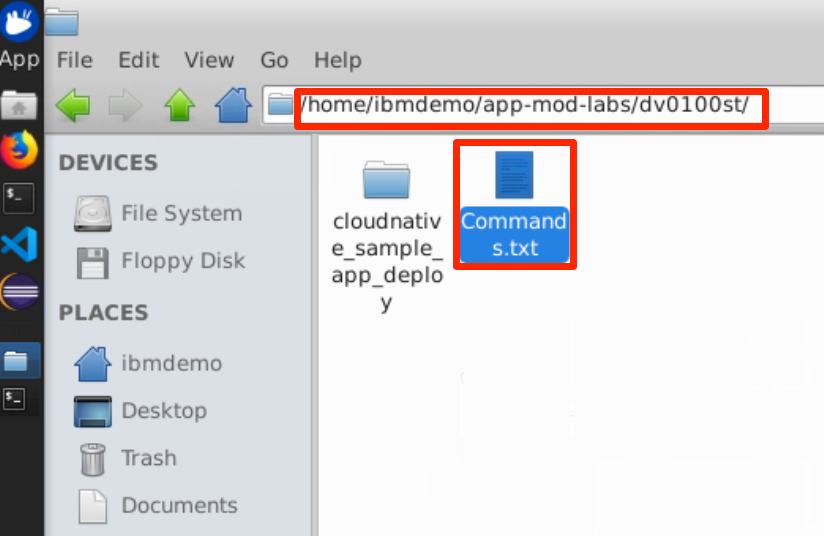

  This file contains all commands used in the lab.  When you need to any command in a terminal window in the future tasks, you should come back to this file and copy/paste the command from this file, this is because you cannot directly copy and paste from your local workstation to the SkyTap workstation.
 
#### 6.2 Push app code to a GitHub repo
Assuming that your development team has the application code ready.  You need to first push it to your GitHub repo in order to deploy it to the OCP cluster.

1. Open a Firefox web browser window by clicking its icon on the Desktop toolbar.

   
2. From the browser window, click the **GitHub** bookmark to open it.

   
3. Login with your GihHub credentials.
4. Click **New** to create a new GitHub repo.

  
5. Enter the new repo name as: **cloudnative_sample_app_deploy** and click **Create Repository**.
  

  You repo is now created.

  
  You will use some of the commands highlighted above to push your application code to the repo.
6. In the terminal window navigate to the application code directory.

  ```
  cd /home/ibmdemo/app-mod-labs/dv0100st/cloudnative_sample_app_deploy
  ```
7. View the contents in this directory.

  ```
  ls -l
  ```
  Sample output:
  ```
  total 16
  drwx------ 3 ibmdemo ibmdemo 4096 Aug 21  2020 chart
  drwx------ 2 ibmdemo ibmdemo 4096 Aug 21  2020 kubernetes
  drwx------ 2 ibmdemo ibmdemo 4096 Jul 14 10:33 openshift
  -rw-rw-r-- 1 ibmdemo ibmdemo   83 Aug 21  2020 README.md
  ```
8.  The deployment artifacts for OCP cluster in under the **openshift** directory.  View its contents.

  ```
  ls -l openshift/
  ```
  Sample output:
  ```
  total 12
  -rw-rw-r-- 1 ibmdemo ibmdemo 915 Aug 21  2020 deployment.yaml
  -rw-rw-r-- 1 ibmdemo ibmdemo 244 Jul 14 10:33 route.yaml
  -rw-rw-r-- 1 ibmdemo ibmdemo 243 Aug 21  2020 service.yaml
  ```

  As you can see, there are YAML files representing the deployment, service and route configurations.
9. Run the git commands to push the application code to your GitHub repo. Note that you have to use your own GitHub repo URL in the command below.

  ```
  git init
  git add .
  git commit -m "first commit"
  git branch -M main
  git remote add origin https://github.com/wtistang/cloudnative_sample_app_deploy.git
  git push -u origin main
  ```
  
  Sample output:
  ```
  [master (root-commit) 6fd8905] first commit
  14 files changed, 297 insertions(+)
  create mode 100644 .gitignore
  create mode 100644 README.md
  create mode 100644 chart/cloudnativesampleapp/Chart.yaml
  create mode 100644 chart/cloudnativesampleapp/templates/basedeployment.yaml
  create mode 100644 chart/cloudnativesampleapp/templates/deployment.yaml
  create mode 100644 chart/cloudnativesampleapp/templates/hpa.yaml
  create mode 100644 chart/cloudnativesampleapp/templates/istio.yaml
  create mode 100644 chart/cloudnativesampleapp/templates/service.yaml
  create mode 100644 chart/cloudnativesampleapp/values.yaml
  create mode 100644 kubernetes/deployment.yaml
  create mode 100644 kubernetes/service.yaml
  create mode 100644 openshift/deployment.yaml
  create mode 100644 openshift/route.yaml
  create mode 100644 openshift/service.yaml
  ```
  When prompted, enter your GitHub credentials.

  Sample output:
  ```
  Username for 'https://github.com': wtistang
  Password for 'https://wtistang@github.com': 
  Counting objects: 19, done.
  Delta compression using up to 12 threads.
  Compressing objects: 100% (17/17), done.
  Writing objects: 100% (19/19), 3.31 KiB | 1.66 MiB/s, done.
  Total 19 (delta 2), reused 0 (delta 0)
  remote: Resolving deltas: 100% (2/2), done.
  To https://github.com/wtistang/cloudnative_sample_app_deploy.git
  ...
  Branch 'main' set up to track remote branch 'main' from 'origin'.
  ```
10. When it is done, refresh your GitHub page, you will see something like this:

  
  
  You have pushed your application code to your GitHub repo.

#### 6.3 Deploy application in ArgoCD UI

##### 6.3.1 Create a new project in OCP Cluster
You are going to create a new project in OCP Cluster so you can deploy the application to the project.

1. From the termncal window, issue the **oc login** command to login to the OCP cluster:

  ```
  oc login https://api.demo.ibmdte.net:6443
  ```

  when prompted, enter the login credentials as: **ibmadmin**/**engageibm**.
  
  Sample output:
  ```
  Authentication required for https://api.demo.ibmdte.net:6443 (openshift)
  Username: ibmadmin
  Password: 
  Login successful.

  You have access to 66 projects, the list has been suppressed. You can list all projects with ' projects'

  Using project "default".
  ``` 
2. Create a new project **dv0100st** in OCP Cluster with command:

  ```
  oc new-project dv0100st
  ```
##### 6.3.2 Get ArgoCD login information from the OCP cluster
ArgoCD can be install to the OpenShift Container Platform (OCP) cluster with ArgoCD operator or from the command line.  

In this lab environment, the ArgoCD is installed to the OCP cluster using IBM Cloud Native Toolkit. The Cloud-Native Toolkit is an open-source collection of assets that enable application development and support teams to deliver business value quickly using Red Hat OpenShift or IBM Cloud-managed Kubernetes. This guide provides information to help Developers, Administrators, and Site Reliability Engineers use the Toolkit to support delivering business applications through the entire Software Development Life Cycle (SDLC). Click the link to learn more about the [Cloud Native Toolkit](https://cloudnativetoolkit.dev).

To access the ArgoCD, you need to get its server and login credentials information from the OCP Cluster.

1. Get ArgoCD username info:

  ```
  export ARGOCD_USER=$(oc get secret argocd-access -n tools -o jsonpath='{.data.ARGOCD_USER}' | base64 -d)
  echo $ARGOCD_USER
  ```
2. Get ArgoCD password info:
  ```
  export ARGOCD_PASSWORD=$(oc get secret argocd-access -n tools -o jsonpath='{.data.ARGOCD_PASSWORD}' | base64 -d)
  echo $ARGOCD_PASSWORD
  ```
3. Get AroCD server info:
  
  ```
  export ARGOCD_URL=$(oc get secret argocd-access -n tools -o jsonpath='{.data.ARGOCD_URL}' | base64 -d)
  export ARGOCD_SERVER=$(echo $ARGOCD_URL|sed -E 's/^\s*.*:\/\///g')
  echo $ARGOCD_SERVER
  ```
4. Write down the ArgoCD username, password and server information.  You will use them to login to the ArgoCD server from the ArgoCD UI and from the commandline.

##### 6.3.3 Create a ArgoCD project in ArgoCD UI

The ArgoCD project is not a kubernetes or ocp project/namespace, it is an Argocd resource which is a parent of the Argocd application. The default ArgiCD project is **default**. In this lab, you are going to create to new ArgoCD project **dk0100st** to host the ArgoCD application.

1. From the browser window, click the Could Native Toolkit **Developer Dashboard** bookmark to open it.

   
  
2. Click **Open with OpenShift** to continue.

  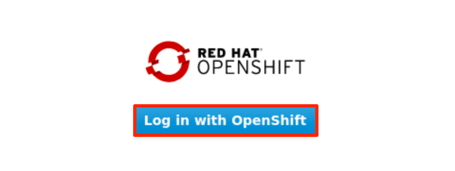

3. If prompted to log in to Red Hat OpenShift Container Platform, click **htpasswd** field. Then log in with **ibmadmin**/**engageibm** as the username and password.
 
   

   

  The IBM Cloud Native Toolkit Developer Dashboard page is displayed. 
  
  

4. Click the ArgoCD link to access the ArgoCD UI

  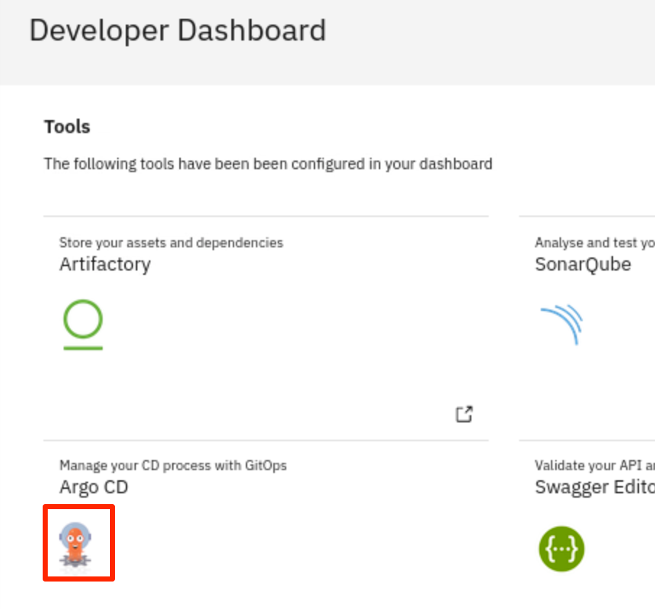 

  The ArgoCD page is displayed.

  

5. Login with the username and password with the information you obtained above and click **SIGN IN**.

  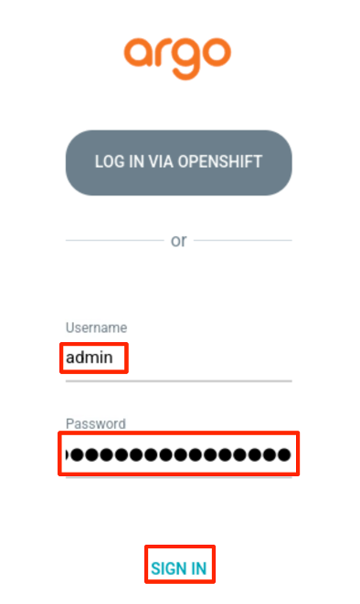
6. From the ArgoCD Home page, click **Settings**, then click **Projects**.

  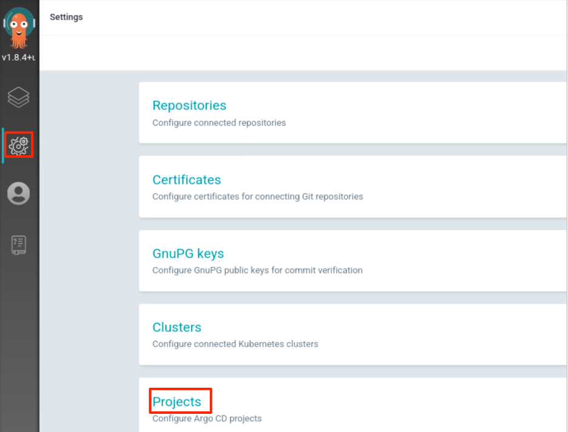
7. Click **New Project**

  

8. Enter the project Name and Description as: **dv0100st** and click **Create**.

  

  The ArgoCD project/namespace is created

  

9. Click the project link to access its details.

  

10. Click the **Edit** on the **RESOURCE REPOSITOIES**

  
  
11. In the **RESOURCE REPOSITOIES** page, click **Add Resource** link.

  

12. Click **Save** to save the change.

  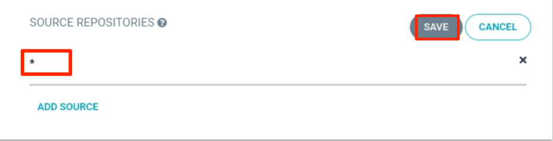
13. Repeat the similar **EDIT** process to add resources to **DESTINATIONS** and **CLUSTER RESOURCE ALLOW LIST**. When you are done, your project settings should look like this:

  

##### 6.3.4 Deploy app through ArgoCD UI
1. From the ArgoCD UI, click the **Manage** icon on the navigation bar, then click **NEW APP** to create a new deployment.

  
  
  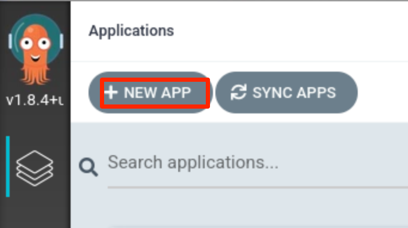

2. Add the following details and click **Create** to finish.  Note: you should replace the GitHub repo URL with your own URL.
  * Application Name: **sample**
  * Project: **dv0100st**
  * SYNC POLICY: **Manual**
  * REPO URL: **https://github.com/wtistang/cloudnative_sample_app_deploy.git**
  * Revision: **HEAD**
  * Path: **openshift**
  * Cluster: **https://kubernetes.default.svc** 
  * Namespace: **dv0100st**

  

  The destination namespace is the OCP cluster project you created before.

  You will now see the available apps. Initially, the app will be out of sync. It is yet to be deployed. You need to sync it for deploying.

   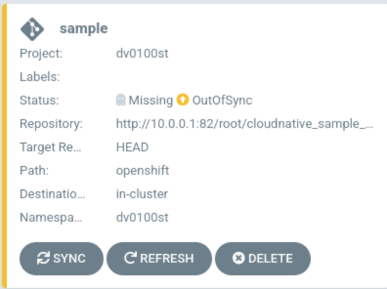

8. To sync the application, click **SYNC** and then click **SYNCHRONIZE**.

  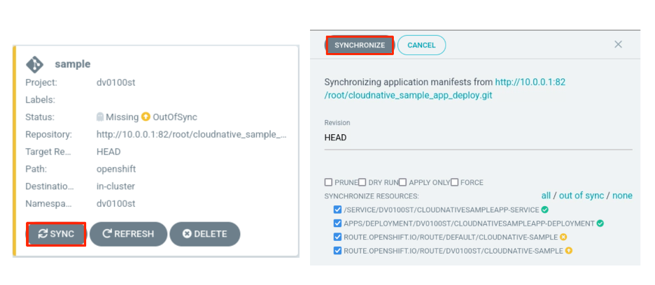

  Once the sync is done, the deployment process gets started. Wait till the app is deployed.

  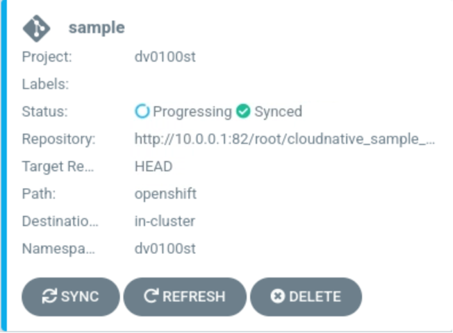

9. Once the app is deployed, click on it to see the details.

  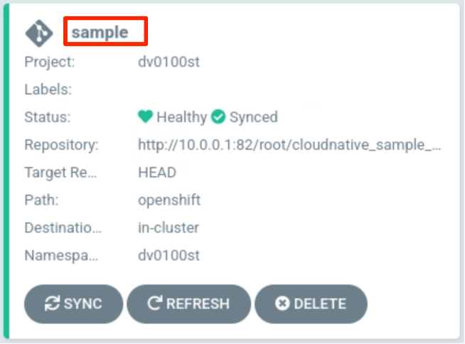

10. In the **APPLICATION DETAILS** page, click each deployment block to view its detail information.

  

##### 6.2.3 Verify and update the deployment
Access the app to verify if it is correctly deployed.

1. Go back to the terminal window, list the **cloudnativesampleapp-service** route with command.

  ```
  oc get route -n dv0100st
  ```
  
  Sample output:
  ```
  No resources found in dv0100st namespace.
  ```
  You get the message indicating that there is no route available in the project, that means the route configuration is not right.  This needs to be fixed.

2. Click the **File Manager** icon on the Desktop toolbar, navigate to **/home/ibmdemo/app-mod-labs/dv0100st/cloudnative_sample_app_deploy/openshift/** directory and double-click the **route.yaml** file to open it for edit.

  
  
  

  As you can see from the YAML file, it is hard-coded to use namespace **default**, that is why no route was created in the **dv0100st** project. This can be fixed.
3. Delete the line **namespace: default** in the file and click **Save** to save the change.

  
4. Next you need to push the change to your GitHub repo with commands:

  ```
  git add .
  git commit -m "change commit"
  git push -u origin main
  ```
5. Go to your ArgoCD **simple** application and click **SYNC** > **SYNCHRONIZE**.

  
  
  The ArgoCD will sync the application with your GitHub repo to get the latest changes and update the deployment.
6. Go back to the terminal window, list the **cloudnativesampleapp-service** route with command.

  ```
  oc get route -n dv0100st
  ```  
  This time it should reruen a hostname under **HOST/PORT** column

  ```
  NAME                 HOST/PORT                                         PATH   SERVICES                       PORT   TERMINATION   WILDCARD
  cloudnative-sample   cloudnative-sample-default.apps.demo.ibmdte.net          cloudnativesampleapp-service   9080                 None
  ```

7. Set an environment variable **APP_URL** using the **HOST/PORT**.

  ```
  export APP_URL="http://$(oc get route cloudnative-sample -o jsonpath='{.status.ingress[0].host}')"
  echo $APP_URL
  ```
  
  The output is:

  ```
  http://cloudnative-sample-default.apps.demo.ibmdte.net
  ```
  
8. Access the app URL using curl:

  ```
  curl "$APP_URL/greeting?name=Carlos"
  ```
  
  Sample output:
  
  ```
  {"id":2,"content":"Welcome to Cloudnative bootcamp !!! Hello, Carlos :)"}
  ```

  You have verified that the deployment is successful.
#### 6.3 Using the ArgoCD CLI
1. Login using the cli.

  ```
  argocd login --username $ARGOCD_USER --password $ARGOCD_PASSWORD $ARGOCD_SERVER
  ```
2. when you see the message like this, type **y** and press **ENTER** to continue.

  ```
  WARNING: server certificate had error: x509: cannot validate certificate for 10.97.240.99 because it doesn't contain any IP SANs. Proceed insecurely (y/n)? y

  'admin' logged in successfully
  ```
3. List the applications

  ```
  argocd app list
  ```
  
  Sample output:
  ```
  NAME    CLUSTER                         NAMESPACE  PROJECT  STATUS  HEALTH   SYNCPOLICY  CONDITIONS  REPO                                                                     PATH   TARGET
  sample  https://kubernetes.default.svc  dv0100st    dv0100st  Synced  Healthy  <none>      <none>      https://github.com/wtistang/cloudnative_sample_app_deploy.git  openshift  HEAD
  ```
4. Get application details

  ```
  argocd app get sample
  ```
  
  Sample output:
  ```
  Name:               sample
  Project:            dv0100st
  Server:             https://kubernetes.default.svc
  Namespace:          dv0100st
  URL:                https://10.97.240.99/applications/sample
  Repo:               https://github.com/wtistang/cloudnative_sample_app_deploy.git
  Target:             HEAD
  Path:               openshift
  SyncWindow:         Sync Allowed
  ```

5. Show application deployment history

  ```
  argocd app history sample
  ```
  
  Sample output:
  ```
  ID  DATE                           REVISION
  0   2021-02-12 21:10:32 -0500 EST  HEAD (9684037)
  ```

### 7.	Summary
In this lab, you have learned some basic features and functions of ArgoCD and how to use it. To learn more about App Mod and DevOps, please continue with the rest of the lab series.

**Congratulations! You have successfully completed ArgoCD Introduction Lab!**

