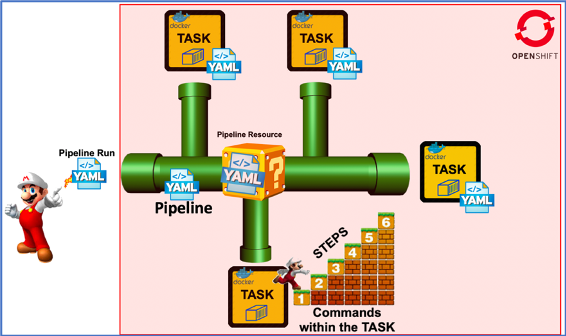
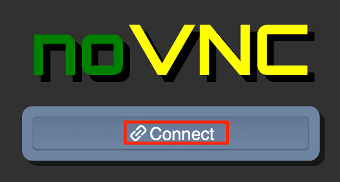
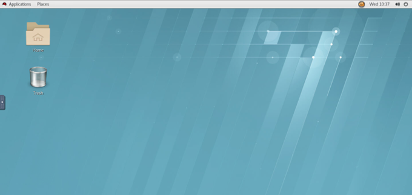
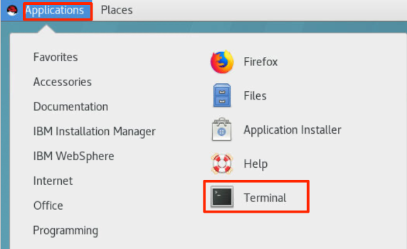
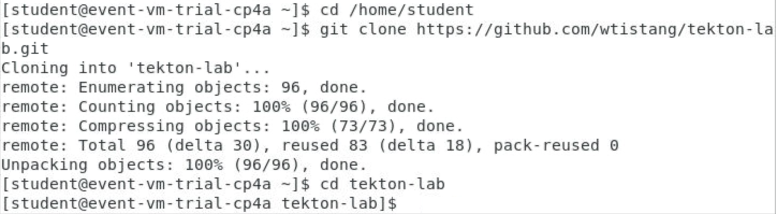
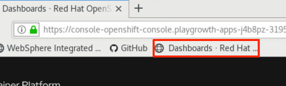
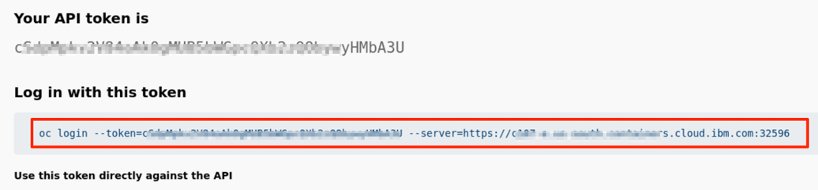
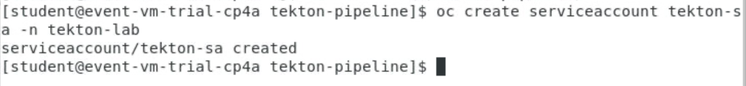
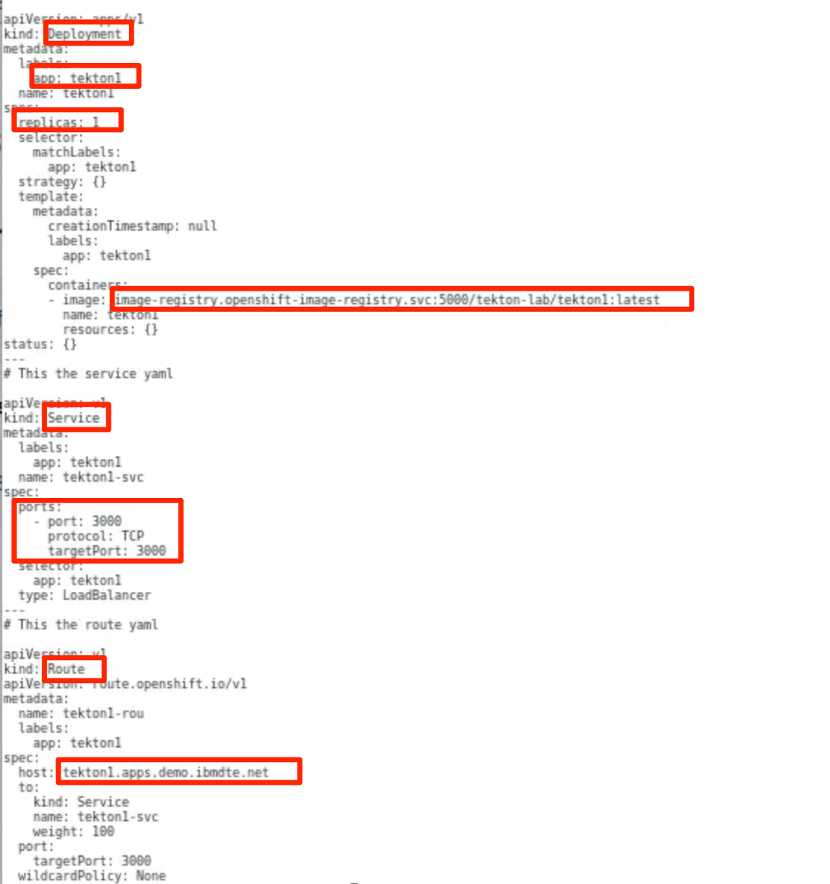
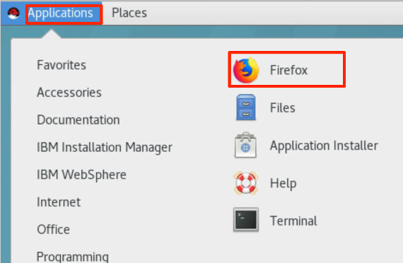

One of the features included in the Cloud Pak for Applications is Tekton, a set of Kubernetes custom resource definitions (CRD) as standard constructs for creating Continuous Integration and Continuous Delivery (CI/CD) pipelines. 

The following is a brief introduction to the Tekton CRDs. 
*	Task: A sequence of commands (steps) that are run in separate containers in a pod
*	Pipeline: A collection of tasks that are executed in a defined order
*	PipelineResource: Inputs (e.g. git repo) and outputs (e.g. image registry) to a pipeline
*	TaskRun: Runtime representation of an execution of a task
*	PipelineRun: Runtime representation of an execution of a pipeline


As explained above, all objects within a Tekton pipeline are Kubernetes objects. 
Pipelines have tasks, which are actually a CRD that runs a container. 
Within the task you define steps, which are commands that you run inside the container. 
Pipelines normally have resources associated with them, which can be accessed by all tasks within that pipeline. 
It should be noted that tasks can be used within multiple pipelines, so it's good practice to use pipeline resources to define the resources used, such as GitHub repositories or docker hub image definitions.



For more information about Tekton and IBM Cloud Pak for Applications, please visit Cloud Pak for Applications.
	
In this lab exercise, you deploy a cloud native application to an OpenShift cluster using the Tekton pipeline.

### 1.	Business Scenario

This lab covers the following business scenario:

Your development team has created a cloud native NodeJS application and saved the application code in GitHub, now it is your responsibility to deploy the application to a Red Hat OpenShift Cluster Platform (OCP). You deploy a Tekton Pipeline along with Pipeline Resources, and two Task objects. The pipeline pulls the application source code from GitHub and build the Docker image. Once the image is built, the image is pushed to a local Image repository in a OCP cluster. Lastly, the pipeline runs the task that deploys this containerized application to the OpenShift (Kubernetes) runtime.

Here is a diagram of what you are going to build in this lab.
 


There are a few things you need to configure along with the pipeline, such as secrets and a service account. This lab guides you through all the steps, but you should take some time to learn more about the security roles that are associated with your service account which allow the service account user to push images to the OpenShift registry, and execute the pipeline resources.
 
### 2.	Objective

The objectives of this lab are to:
*	learn how to create a pipeline task 
*	learn how to build a pipeline
*	learn how to configure the OCP cluster to run the pipeline
*	learn how to run the pipeline to deploy the application the OCP cluster

### 3.	Prerequisites
The following prerequisites must be completed prior to beginning this lab:
*	Familiarity with basic Linux commands
*	Have internet access
*	Have completed Lab SU0100 of this lab series and have the CP4Apps installed in IBM Red Hat OpenShift Kubernetes Service (OCP) cluster on IBM Cloud.

### 4.	What is Already Completed

The Workstation VM is pre-configured for you to access and work with the OCP cluster in this lab.

The login credentials for the Workstation VM are provided in your Reservation Details page (**https://www.ibm.com/demos/my-reservations/**).

The CLI commands used in this lab are listed in the Commands.txt file located at the **/home/ibmdemo/app-mod-labs/dv0100** directory of the Workstation VM for you to copy and paste these commands to the Terminal window during the lab.

### 5.	Lab Tasks
During this lab, you complete the following tasks:
*	Clone the Git repository used for this lab and explore the contents
*	Login to OpenShift and create a new project for this lab
*	Create an OpenShift Service Account and its Security Contexts / Roles
*	Create Secret with Login Token for the Service Account
*	Create the Tekton PipelineResources for the Applications Build and Deployment
*	Create Tekton Task
*	Create the Deployment Task
*	Create the Pipeline 
*	Run the Pipeline


### 6.	Execute Lab Tasks
#### 6.1 Log in to the Workstation VM and get started 
1.  Launch the VM from your local workstation web browser with the VM URL.
 
    

2.	Click **Connect** to access the VM.
 
    

3.	Enter the password you obtained from the Reservation Details page and click **Send Password**.

    

    The VM desktop is displayed.

    

    The Workstation Desktop is displayed. You execute all the lab tasks on this VM.
 
#### 6.2	Clone the Git repository used for this lab and explore the contents

1.	Open a terminal window by clicking **Applications**>**Terminal**.
    
    

2.	Clone the tekton-lab GitHub repository to the local VM.
    
    a. From the terminal window, run the following commands to clone the repo:
    
    ```
    cd /home/ibmdemo
	git clone https://github.com/wtistang/tekton-lab.git
	cd tekton-lab
    ```
	
    
    
    These commands above clone the public repo named tekton-lab to the local directory under /home/ibmdemo/tekton-lab directory. 

    b.	List the directory contents using the “ls -l” command
        
    ```
    ls -l
	```
    
    

    You find the following key resources: 
    *	Dockerfile – Used to build the NodeJS Express Application
    *	app.js – The NodeJS Application
    *	tekton-pipeline (folder) – YAML files to create the Pipeline resources for this lab
 
    In the GitHub repo, you find all the YAML files in the tekton-pipeline sub folder. 

3.	Enter commands below to go to the Tekton-pipeline directory and list the contents.
    ```
    cd tekton-pipeline
    ls -l
    ```
    
    

    In the tekton-lab/tekton-pipeline directory, you find all the YAML files needed to create the Tekton pipeline resources to build and deploy a simple NodeJS Express application to OpenShift.
 
    You find the following key resources: 
    *	git-resource.yaml – Creates the Pipeline resource that references the input GitHub repo that contains the source for the application to be built and deployed via the pipeline
    *	image-resource.yaml – Creates the Pipeline resource that references the output Docker image registry where the Docker image is pushed via the pipeline 
    *	task.yaml – Creates the build and push Tekton tasks
    *	pipeline.yaml – Creates the pipeline that invokes the tasks defined 
    *	oc-deploy.yaml – Creates the Tekton deployment Task to deploy the application to OpenShift
    *	deployment.yaml – Invoked by the oc-deployment task to create the OpenShift Deployment, Service and Route for the application 
    *	pipeline-run.yaml – Runtime execution of the pipeline to build and deploy the app

 
#### 6.4	Login to OpenShift and create a new project for this lab

1. From the browser window, click OCP cluster Web Console bookmark to open it with your IBM credentials.

   
2.	In the OpenShift Web Console page, click the **Action** icon next to your username and select **Copy Login** Command to get the OCP login command.

   
3.	In the next page, click **Display Token** link.

   
4.	Copy the OCP login command to the clipboard.

   
5.	Go back to the Terminal window, right-click to paste the OCP login command window press Enter to log in to the OCP cluster.
 
   

6. Create a new project (namespace) as tekton-lab.

    ```
    oc new-project tekton-lab
    ```

    You see the message to confirm that the tekton-lab project is created.

    

#### 6.4	Create an OpenShift Service Account and its Security Contexts / Roles

It is a good OpenShift practice to create a service account for your applications. A service account provides an identity for processes that run in a Pod.

In this step you create a new service account with the name “tekton-sa”. 

1. Create a new service account names tekton-sa in the tekton-lab project with command:

    ```
    oc create serviceaccount tekton-sa -n tekton-lab
	``` 

    

2. Add Privileged access to the Service Account required to run pipelines and deploy applications to the OCP cluster.

    ```
    oc adm policy add-scc-to-user privileged -n tekton-lab -z tekton-sa  
    ```

    

    The tekton-sa Service Account needs privileged access because the pipeline creates pods when it is running and it needs this authority to create the pods.

    NOTE: The “-n” and “-z” params on this command are in reference to the namespace and service account name.
3. Add edit role to the Service Account to allow for deployments to the OCP cluster.

    ```
    oc adm policy add-role-to-user edit -n tekton-lab -z tekton-sa
    ```

    

    The tekton-sa Service Account requires the EDIT role so that it has the proper authority to make the deployment. This happens within the deployment task during the pipeline execution. 
4. Add system:image-builder Role to allow the Service Account to push images to the mage registry.

    The pipeline build pods require the system:image-builder role, which allows pushing images to any image stream in the project using the internal Docker registry.

    ```
    oc adm policy add-role-to-user system:image-builder -n tekton-lab -z tekton-sa
    ```
    

#### 6.5	Create Secret with Login Token for the Service Account

Next, create a new Kubernetes secret with the login token for the tekton-sa Service Account. This is needed by the account for an automated login for the deploy task of the pipeline. 

A two steps process is used to create the secret:
*	The first command extracts the token from the “tekton-sa-token” secret and store it in a file (token.txt). 
*	The second command creates a new secret using that token. The deploy task uses the token within this secret to login and issue the deploy command during the pipeline.

1. Run the following commands to create the new secret for the service account to login to OpenShift while running the Pipeline. 

    a. Get the token from the service account and store it in a file.
	
    ```
    oc get secret $(oc get secret -n tekton-lab | grep tekton-sa-token | head -1 | awk '{print $1}') -n tekton-lab -o jsonpath="{.data.token}" | base64 -d > token.txt
    ```
    

    b. Verify the token was written to the token.txt file

    ```
    cat token.txt
    ```
    

    c. Create a new secret with the token extracted from the service account
	
    ```
    oc create secret generic tekton-lab-deployer-secret --from-literal=user=sa --from-file=token=token.txt -n tekton-lab
    ```
    
    

    d. Verify the new secret with command:
    
    ```
    oc describe secret tekton-lab-deployer-secret
    ```
    
    

#### 6.6	Create the Tekton PipelineResources for the Applications Build and Deployment

Next, you define two PipelineResources to be used by the Tekton pipeline:
*	git-resource.yaml creates a Tekton PipelineResource identifying the GitHub repository from which the pipeline pulls its data during a build.
*	img-resource.yaml creates a Tekton PipelineResource identifying the image location.  The tag for that image must be changed every time the application is updated, and the pipeline executed. 

1. Ensure the Terminal window is in the /home/ibmdemo/tekton-lab/tekton-pipeline directory, where the Pipeline YAML files are located. 

    ```
    cd /home/ibmdemo/tekton-lab/tekton-pipeline
    ```
2. Review the contents of git-resource.yaml. 

    ```
    cat git-resource.yaml 
    ```

    As you can see:
    * The name of the PipelineResource is tekton1-git
    * The source type is git
    * The url to the source git repo is defined in the “url” parameter. 

     

3. Review the contents of img-resource.yaml.

    ```
	cat img-resource.yaml 
    ```
    As you can see:
    * The name of the PipelineResource is tekton1-image
    * The type is “image”
    * The url parameter defines the location of the image registry where the built image is pushed during the execution of the pipeline. 

     
4. Run the following commands to create the PipelineResources using the YAML files

    ```
	oc create -f git-resource.yaml
	oc create -f img-resource.yaml
    ```
    

5. List the new PipelineResources 

    ```	
    oc get pipelineresources 
    ```

    

#### 6.7	Create Tekton Task
You have created the PipelineResources, which define the input and output for the build and created a Service account with the proper privileges and roles, and credentials to run the pipeline, push images to the image registry, and deploy pods to OpenShift. 

In this task, you create a Tekton task to build the Docker image, and push the image to the OpenShift Image Registry

The Tekton task you are ready to create contains two steps: 
*	build the Docker image from the source GitHub repo
*	pushes the image to the OpenShift image registry

Note: There are different ways to build a Docker image inside a task, for this lab, you use buildah to build your application Docker image (https://buildah.io/).
Buildah is a command-line tool for building Open Container Initiative-compatible (that means Docker- and Kubernetes-compatible, too) images quickly and easily. It is easy to incorporate into scripts and build pipelines.

1. Review the task.yaml file using cat command. 

    ```
    cat task.yaml
    ```
    
    The Task resource defines its spec as illustrated below:
    *	The input resource
    *	The output resource
    *	Local parameters used during the execution of the task
    *	Steps. In this lab, “build” and “push” are described. In general, steps are used to isolate individual commands.
    *	The image used for the task execution. It is quay.io/buildah/stable.
    *	Its environment. The env variables are defined, based on configmap and/or secret. Here, a secret is used to define the authentication information.
    *	The commands to execute in the “build” and “push” steps. The first one builds the image, the second pushes it to the target repository. 

     

2. You create the Task using the task.yaml file, then list the new “buildah” task. 

    ```
    oc create -f ./task.yaml
	oc get tasks
    ```
    
    

#### 6.8	Create the Deployment Task
To manage the deployment of this simple NodeJs Express application, tasks are needed to specify a Deployment (controller for pods) and a Service definition in OpenShift. 

The oc-deployment.yaml file defines a Tekton Task that in turn invokes a command to run the deployment.yaml to create the deployment, service and route for the sample application. To enable this action, each task defines with a step using the quay.io/openshift/origin-cli:latest docker image.
1. Review the oc-deploy.yaml  file using cat command. 

    ```
    cat oc-deploy.yaml
    ```

    

2. Review the deployment.yaml file that is used to create the Deployment and Service for the application, and is invoked by deploy-cm Task you reviewed in the previous step  

    ```
    cat deployment.yaml
	```
    
    In this YAML file:
    * The Deployment specifies 1 replica (pod), and is deployed using the Docker image that is pushed to the OpenShift image registry. 
    * The Service defines how the application is accessed internally.
    * The Route defines how the application is be accessed publicly.

    

3. Run the oc-deploy.yaml to create the Tekton Deployment Task. Then list the new task
    ```
    oc create -f ./oc-deploy.yaml
	oc get tasks
    ```

    
#### 6.9	Create the Pipeline 

Now that that tasks have been created, they can be incorporated and orchestrated in a Pipeline. In this task, you create the Tekton pipeline which invokes the build/push and deploy Tasks you created.

The pipeline does the following: 
*	First, the pipeline runs the buildah task that performs the build and push steps 
*	Once the build-push task completes, the deploy-cm task is executed to deploy the app to OpenShift
*	The pipeline orchestrates the order of the task execution using the runAfter tag in the pipeline definition. If the build-push task fails, the deploy task does not run. 

1.	Review the pipeline.yaml file  

    ```
    cat pipeline.yaml
    ```
    
    

    Snippet showing the tasks in the pipeline.yml file
 
2.	Use the pipeline.yaml file to Create the pipeline. Then list the new pipeline 

    ```
	oc create -f ./pipeline.yaml
    oc get pipelines
    ```

    

#### 6.10	Run the Pipeline

To execute the pipeline, a PipelineRun artefact should be created. You can do it in CLI or in Tekton Dashboard. In this lab, you do it from in the Tekton. The Tekton Dashboard is a general purpose, web-based UI for Tekton Pipelines and Tekton triggers resources. It allows users to manage and view Tekton resource creation, execution, and completion.

1. Access the Tekton Dashboard
    a. From the Workstation desktop, open a Firefox window by clicking its icon on the Desktop Tool Bar.

    

    b. 	Click on the Tekton Dashboard bookmark of the Firefox browser window.

    

    The Tekton Dashboard page is displayed.

2. From the Tekton Dashboard, use the Namespace pulldown menu, and select the **tekton-lab** namespace to filter the resources to the namespace used in the lab.

    

3. Click the **PipelineResources** menu option, you can see the two PipelineResources you created in previous step. These resources are needed to run the pipeline. 

    
  
4. Click the PipelineRuns menu option, and click **Create** to create a new PipelineRun.
 
    
     
    A PipelineRun starts a Pipeline and ties it to the Git and image resources that should be used for the specific invocation. It automatically creates and starts the TaskRuns for each Task in the Pipeline.

5.	Fill in the fields for the PipelineRun as illustrated below:

    *	Namespace: tekton-lab

    *	Pipeline: tutorial-pipeline 

    *	Git-source: tekton1-git

    *	Docker-image: tekton1-image

    *	ServiceAccount: tekton-sa

    

    

    

6.	Click Create to run the Pipeline

    

7.	The pipelinerun is started. Click on its name to view the live status of the pipelinerun:

    

    In the pipelinerun page, you can see the pipeline is running
    
    

8.	Wait for the PipelineRun to complete. The Tekton pipeline takes several minutes to complete. As the Pipeline run, you can view its logs to see the details. 

    


####	6.11	Verify the Deployment
When the pipelinerun has completed successfully, view the running application.

1.	Click on the OpenShift web console bookmark

    

 2.	Expand the **Workloads** menu and select **Pods**.
 
    

3.	Change Project to **tekton-lab** project.

    
 
    You can see your application is in Running status. You can click its link to view the details.

    

4.	Expand the Networking menu and select Services.

    
    
    The application service is listed, click its link to view its details.

5.	Expand the Networking menu and select Routes.

    

    The application route is show on the list. Try to click your sample application URL to launch it and you see an error, this is because you are using a default cluster host in the deployment.yaml file which is different from your cluster host name.

6.	To fix the error, run the commands below in the Terminal window to get your cluster host name:

    ```
    export INTERNAL_REG_HOST=`oc get route default-route --template='{{ .spec.host }}' -n openshift-image-registry`

    echo $INTERNAL_REG_HOST | sed 's/default-route-openshift-image-registry.//g'
    ```
 
    The commands above provide you your OCP cluster host name. 
7.	Go back to the Route page and click **Create Route**.

     
 
8.	In the Create Route page, enter the following values and click Create.
    *	Name: tekton-lab
    *	Hostname: tekton-lab.&ltyour cluster host name&gt
    *	Service: tekton1-svc
    *	Target Port: 3000

    Where &ltyour cluster host name&gt is the one you got in the step above.

    

9.	The new route is created, click your sample application URL to launch it.

    
 
    Your sample application page is displayed.
 
    
### 7.	Summary

You have completed the lab and are on your way to developing robust pipelines for CI/CD of your application deployments using containers and OCP.  

In this lab, you learned how to create the Tekton resources to automate CI/CD for microservices deployed to OpenShift. 

*	PipelineResource
*	Task
*	Pipeline
*	PipelineRun

You learned how to configure a Service Account with proper authorization and roles to be able to push Docker images to an image registry and authenticate to OpenShift and deploy the application via the Tekton Pipeline. 
 
As a part of IBM Application Modernization solutions in IBM Cloud Pak for Applications, Transformation Advisor and the Accelerator for Teams (with Application Stacks and Integrated Dev/Ops Toolchain and Pipelines) helps users effectively to develop, package, deploy and manage modernized applications on a Kubernetes cluster. 

To learn more about IBM Application Modernization solutions, please visit [Cloud Pak for Applications](https://www.ibm.com/cloud/cloud-pak-for-applications).

Congratulations! You have successfully completed the lab “Using Tekton Pipelines for CI/CD of Microservices to Red Hat OpenShift Container Platform”.

