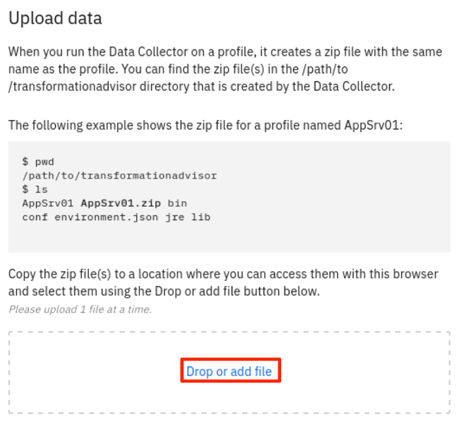

IBM Cloud Transformation Advisor, also called **Transformation Advisor** (**TA**), bridges the gap between existing development activities and cloud-native development together.  TA will accelerate the development process by creating the configuration and deployment artifacts for an application, then facilitate the developer’s use of the enhanced developer productivity tools in IBM Cloud paks.  

Transformation Advisor will simplify the modernization scenario, creating one development experience for both cloud-native and application modernization. This lowers the on-ramp to cloud development, test, deployment for Java EE developers.

### 1.	Business Scenario

As shown in the image below, your company has a web application called Mod Resorts, a WebSphere application showing the weather in various locations. Your company wants to move this application from on-premises to the cloud.
 


As a tech lead, you have already analyzed the application using the Transformation Advisor tool. 

Based on the analysis you know that you can move this application from the traditional WebSphere Server environment to a light-weighted Liberty server environment without any code change.  

Now you are planning to use the Transformation Advisor migration plan to create the migration bundle, to containerize the application, and to deploy the Docker container to an OpenShift Kubernetes cluster environment.
 
### 2.	Objective

The objective of this lab is to learn how to use Transformation Advisor to accelerate the development activities required during the modernization of a Java EE application currently deployed to IBM WebSphere Application Server, Oracle WebLogic, Apache Tomcat or Red Hat JBoss Application Server.  The application will be deployed through a continuous integration and continuous delivery (CI/CD) pipeline to the Open Liberty server in the OpenShift Container Platform (OCP) cluster.

The sample application used in this lab does not require any modification to the source code in its modernization.  This enables the completion of the lab in a pre-determined amount of time.  The modernization of applications that need modifications will be described, but not required for completion of the lab.

### 3.	Prerequisites
The following prerequisites must be completed prior to beginning this lab:
*	Familiarity with basic Linux commands
*	Have internet access
*	Have completed Lab SU0100 of this lab series and have the CP4Apps installed in IBM Red Hat OpenShift Kubernetes Service (OCP) cluster on IBM Cloud.
*	Basic Java app development knowledge
*	GitHub account - you can sign up for a free account at: https://github.com

### 4.	What is Already Completed

A six Linux VMs App Mod Lab environment has been provided for this lab. 
 
  

*	The Red Hat OpenShift Container Platform (OCP) v4.6, is installed in 5 VMs, the master1 VM, the master2 VM, the master3 VM, the dns VM and the nfs VM, with 3 master nodes and 3 compute nodes (the master nodes are serving as computer nodes as well).
*	The workstation VM is the one you will use to access and work with OCP cluster in this lab.
  The login credentials for the workstation VM are:
  User ID: **ibmdemo**
  Password: **passw0rd**
  Note: Use the Password above in the workstation VM Terminal for sudo in the Lab.
*	The CLI commands used in this lab are listed in the **Commands.txt** file located at the **/home/ibmdemo/add-mod-labs/dv0300st** directory of the workstation VM for you to copy and paste these commands to the Terminal window during the lab.

### 5.	Lab Tasks
During this lab, you will complete the following tasks:
*	Login to the workstation VM and open Transformation Advisor
*	View the Transformation Advisor insights for a collection of applications and queue managers
*	Load a data collection for the Mod Resorts application currently deployed on-premise in WebSphere Application Server v9
*	View the migration bundle contents for the Mod Resorts application
*	Push the migration bundle into GitHub 
*	Clone the GitHub repository on the local workstation and import the source for the application
*	Build and package the application in a Liberty container in Codewind using Application Stacks
*	Commit and push the application to the GitHub repository
*	Setu the Tekton Pipeline webhook for the application’s build and deployment
*	Deploy the application to OpenShift via the OpenShift pipeline


### 6.	Execute Lab Tasks
#### 6.1 Log in to the workstation VM and get started (skip this step if you are using your own workstation)
1.  If the VMs are not already started, start them by clicking the play button for the whole group.

  

2.	After the VMs are started, click the workstation VM icon to access it. 

  

  The Workstation Linux Desktop is displayed. You execute all the lab tasks on this workstation VM.

3.	If requested to log in to the Workstation OS, use credentials: **ibmdemo**/**passw0rd**
4. Open a terminal window by clicking its icon from the Desktop toolbar.

  
5. If this is your first time to run the lab series in this lab environment, do the following, otherwise if you have already downloaded the lab materials in other labs, you can skip this step.
  
  a. In the terminal window, run the following command to get the lab materials.

  ```
  /home/ibmdemo/get-lab-materials.sh
  ```

  Sample output

  ```
  Cloning into 'app-mod-labs'...
  warning: redirecting to https://github.com/wtistang/app-mod-labs.git/
  remote: Enumerating objects: 5693, done.
  remote: Counting objects: 100% (185/185), done.
  remote: Compressing objects: 100% (118/118), done.
  remote: Total 5693 (delta 53), reused 184 (delta 53), pack-reused 5508
  Receiving objects: 100% (5693/5693), 277.71 MiB | 57.39 MiB/s, done.
  Resolving deltas: 100% (2250/2250), done.
  Checking out files: 100% (6120/6120), done.
  ```
  
  The lab materials is downloaded to the **/home/ibmdemo/app-mod-labs** directory.
  
6. Open **File Manager** by clicking its icon on the Desktop toolbar.

  

7. Navigate to **/home/ibmdemo/app-mod-labs/dv0300st** directory and double-click to open **Commands.txt** file in the text editor.

  

  This file contains all commands used in the lab.  When you need to any command in a terminal window in the future tasks, you should come back to this file and copy/paste the command from this file, this is because you cannot directly copy and paste from your local workstation to the SkyTap workstation.

#### 6.2	Launch Transformation Advisor 
In this lab, you are going to use Transformation Advisor’s capabilities designed to accelerate the development process by creating the configuration and deployment artifacts for an application.
Using these artifacts, and Accelerators for Teams, you will learn how to facilitate the use of the enhanced developer productivity tools in IBM Cloud Pak for Applications as the application is deployed to RedHat OpenShift, using the Tekton pipelines.  

The Transformation Advisor used in the lab is installed as part of IBM Cloud Pak for Applications version 4.1. IBM Transformation Advisor is also available stand-alone (Beta), run locally in Docker on your workstation. Learn more about the stand-alone version of Transformation Advisor: http://ibm.biz/cloudta

The Transformation Advisor is installed on OCP in IBM Cloud.  In this lab, you use the following steps to access it.

This task requires to have IBM Cloud Pak for Applications installed on OCP cluster in IBM Cloud. If you have completed the lab0 of this lab series, you can continue, otherwise you need to complete lab0 first.

1. From web browser window, click the **IBM Cloud Transformation Advisor** bookmark and log in with the OCP account credentials.

    
 	
2. If prompted to log in to Red Hat OpenShift Container Platform, click **htpasswd** field. Then log in with **ibmadmin**/**engageibm** as the username and password.
 
     

     
    
    The Transformation Advisor Home page is displayed.
 
    
 
#### 6.4	Upload Application Data into Transformation Advisor

The Transformation Advisor can evaluate any Java based applications and help to package the good candidate application to move to cloud. In lab **AM0100** of this lab series, you have learned how to use the tool to evaluate the on-premises WebSphere application, Mod Resorts, and have determined that it is suitable to move this application to cloud without any code change. Now you need to move forward to create the application migration bundle with the Transformation Advisor. 

1. In the Transformation Advisor page, you first create a new workspace by entering the workspace name as **Evaluation** and then clicking **Next**.
 
   

    Note: A workspace is a designated area that houses the migration recommendations provided by Transformation Advisor against your application server environment. You can name and organize these however you want, whether it’s by business application, location or teams. 

2. Enter the collection name as **ModResorts** and click **Let’s go**.
 
    

    Note: Each workspace can be divided into collections for more focused assessment and planning. Like workspaces, collections can be named and organized in whatever way you want.

3. Once the Workspace and Collection are created, you get the data collection options page.  You can either download the Data Collector utility and run it against your application server, or upload an existing data file. In this lab, you are going to use the upload option. Click **Upload data** to go to the upload page.

     

4. Click Drop or Add File.

  
 
5. Navigate to **/home/ibmdemo/app-mod-labs/dv0300st/DataCollections** directory, select **NewDeafaultAppSrv03.zip** file and click **Open**.

   

6. Click **Upload**.

    

    Transformation Advisor will show its recommendations page with details about modernizing the application to Liberty in IBM Cloud Pak for Applications.

    Note: The modresorts-1.0.war application used in this lab does not require any modification to the source code in its modernization.  This enables the completion of the lab in a pre-determined amount of time.  The modernization of applications that need modifications will be described, but not required for completion of the lab. 

    
    
    The Transformation Advisor provides all migration recommendations for all applications deployed to the WAS server based on the specified source and target environments. 
    
    On the Recommendations page, the identified migration source environment is shown in the Profile section, and the target environment is shown in the Preferred migration section. The data collector tool detects that the source environment is your WebSphere Application Server ND **NewDefaultAppSrv03** Profile. The target environment is Liberty on OpenShift, which is the default target environment.

    The Recommendations page also shows the summary analysis results for all the appllications in the **NewDefaultAppSrv03** environment to be moved to a Liberty on OpenShift environment. 
    
    For each app, you can see these results:
    *   Migration Target
    *   Complexity
    *   Issues
    *   Estimated development cost in days

    For example, if you want to move the modresorts-1_0_war application to Compatibale Liberty runtimes, the complexity level is Simple. 

    A Simple complexity score indicates that the application code does not need to be changed before it can be moved to cloud. The application has 1 minor level issue and the estimated development effort is 0 day.


#### 6.4	View the Migration Bundle

In this section, you view the migration bundle contents for the Mod Resorts application.  The migration bundle is created by the Transformation Advisor for a quick deployment to cloud while minimizing the migration error.

1.	Click on the menu with the “hamburger icon” next to the **Mod Resorts** application analysis to display the menu choices and choose **View migration plan**.

    
    
    Transformation Advisor will display details about the migration bundle that it generated to accelerate the modernization of this application into Liberty on OpenShift. The migration bundle includes diverse artifacts, depending on the needs of the application.

    The user can choose to create a migration bundle for either of the options below: 
    *	a binary project of an application (uploading a WAR/EAR file and its dependent libraries), or 
    *	a source project of an application, so that the application source files can be modernized and maintained.  

    The user can also choose to create a migration bundle that will either:
    *	allow the project to integrate with the Accelerator for Teams, making the modernization developer experience align with the developer experience for cloud-native applications
    *	deploy into Red Hat OpenShift cluster via an Operator

    The default selection is for a source project that will integrate with the Accelerator for Teams (derived from the open source project Kabanero.io).

2.	View the migration bundle settings and functions.

    The artifacts change, depending on the user’s modernization choices for the application.  The default selection for an application that uses only EE7 features and above will be to deploy as a source application project, and to use the Accelerator for Teams.  The project will be a source project, with the directory structure set up with a starter application and the Liberty configuration for the application.  

    To accelerate the application modernization, the artifacts produced by Transformation Advisor include the configuration for the Liberty server, the build file for the application and the Accelerator for Teams configuration files (which can used with the Application Stacks).

    Users are able to choose to download the artifacts as a migration bundle or push the bundle contents into a GitHub repository.

    

#### 6.5	Push the migration bundle into GitHub

This step requires that you have a public GitHub account. If you do not have a GitHub account, create a free account at: https://github.com 

1.  Create a GitHub personal access token.  

    a. In a new tab in the browser, click the **GitHub** bookmark to launch it.

    
 
    b. Log in to your existing GitHub account using your userid and password.  
    
    

    c. Once you have logged into your GitHub account, click on your user image in the top right corner and choose **Settings**.

    

    d. On the bottom left of the next screen, click on **Developer settings**.

    

    e. On the next screen, click on **Personal access tokens**.
 
    

    f. On the next screen, click on **Generate new token**.
 
    

    g. Enter the token Name as: **my-new-token** with these three scopes 
    *	repo
    *	admin:org
    *	admin:repo_hook
 
    

    

    g.	At the bottom of the screen, click **Generate token**.

    

    h.	 Be sure to save your access token.  It is valid for all repositories for your account. You save it in the **Commands.txt** file located at **/home/ibmdemo/app-mod-labs/dv0200** directory.
    
2.	Create a public GitHub repo for the application.

    a.	At the top right corner of the GitHub page, click **Add** and select New repository to create a new repository:

    

    b.	Specify the Repository name as “my-repo”, and create the new repository as a Public repository with a README.
 
    

    The URL for your new repository is in the address bar: **<snap>https://</snap>github.com/&lt;your GitHub ID &gt;/my-repo**
 
    Now you have the three values required to push your migration bundle into GitHub: your repository URL, your GitHub ID and your GitHub personal access token.  

3.	Go back to Transformation Advisor page, click on the **ModResorts** COllection link in the breadcrumb.

    
4.	Click on the menu with the “hamburger icon” next to the **Mod Resorts** application analysis and choose **View migration plan**.
5.  Click on Send to Git to prepare to send the migration bundle for Mod Resorts application to Git.

    
6.	Specify the GitHub repository URL, your GitHub ID and your GitHub personal access token: Then Scroll down and click **Send to Git**.

    
5.	Once the application artifacts are sent to GitHub, you can now view the contents of the migration bundle in GitHub by refreshing the home page for the repository URL.

    
#### 6.6	Clone the GitHub Repository 

In this section, you clone your GitHub repository on the local workstation and import the source for the application. 

1.	From the terminal window, clone the GitHub repository using the following commands:

    ```
    cd /home/ibmdemo/app-mod-labs/dv0300st
    git clone https://github.com/<your GitHub ID>/my-repo
    ```

    Where &gt;your GitHub IDE&lt; is your GitHub user id.

3.	Change to the my-repo directory that you just cloned with command:

    ```
    cd my-repo
    ```
4.	From the Terminal window, extract the source code (saved in the /home/ibmdemo/app-mod-labs/dv0200/modresorts_src.zip file) into the local repository source directories using the following command:

    ```
    unzip /home/ibmdemo/app-mod-labs/dv0300st/modresorts_src.zip
    ```

    Note:  answer **A** when prompted to replace the index.html file.

#### 6.7	Build and Package the Application  

The source code development activities might not be executed by the same person as the previous steps.  The solutions architect might use Transformation Advisor’s insights to make decisions about the modernization of the application estate and send projects to GitHub for the developer.

The developer will begin working on the modernization of the application, including any needed source code changes, building and testing using the Accelerator for Teams.

This lab uses Visual Studio Code (VS Code) with the Codewind extension installed; there are no code changes required for the Mod Resorts application modernization.

Applications which require code changes, due to required Java EE and/or Java SE differences in the modern development environment, would benefit from the combination of the Eclipse Codewind and WebSphere Application Migration Toolkit (WAMT) plugins in the Eclipse Integrated Development Environment (IDE).  
See more about the WebSphere Application Migration Toolkit (WAMT) plugin here: http://ibm.biz/WAMT4Eclipse.


1.	Go to the Terminal window and launch VS Code using the following commands: 

    ```
    cd /home/ibmdemo/my-repo 
    code .
    ```

    The VS Code IDE is displayed.

2.	If the local Codewind extension in VS Code is not started, you will need to start it now:

    a.	Click on Local (Stopped) to start Local Codewind.

    

    The Codewind extension will then be started:

3.	Add the ModResorts project to Codewind.

    a.	Click on the icon to Add Existing Project.

    

    b.	Select the **/home/ibmdemo/my-repo** directory and click **Add to Local Codewind**.

    

    c.	Click **Yes** when Codewind detects that the project is for the Java Application Stack.

   

    Codewind will detect that the application project is already in the VS Code workspace. Therefore, Codewind builds and starts the application automatically.

    The application state should automatically change to “Running” once the app is built and started. 

    

    d.	If it seems that the application is not starting, you can view the logs by right-clicking the project name and selecting **Show all logs**.

    
4.	Open the application when it is running.

    a.	When the status of your application changes from Starting to Running, right-click on the application. Then select **Open Application** from the menu. 

    

    Opening the application will load the application (running in a container) in the browser.  The Mod Resorts application home page is displayed.

    

    b. Click **WHERE TO?** dropdown menu to see the city list.

    
 
    c. Click **PARIS, FRANCE** from the list, it shows the weather of the city.

        
 
    c.	When you are satisfied that the application is ready to deploy outside of the local development and test environment, you commit the inclusion of the application source code and any changes made and push the code (using the Github personal access token) into the Git repository using the following commands in the Terminal window:

    ```
    cd /home/ibmdemo/my-repo
    git config --global user.email "you@example.com"
    git config --global user.name "Your Name"
    git add .
    git commit -m "added ModResorts source code"
    git push 
    ```
    Note:  If prompted for a user id, specify your public GitHub user id. If prompted for a password by git push, you must specify your Git personal access token in place of the password if your Git account uses two-phase authentication.

### 6.8	Setup the Tekton Pipeline webhook

Transformation Advisor and the Accelerator for Teams can set up webhooks from the user’s GitHub repository into the Tekton pipelines and trigger the Tekton pipelines when there is a commit to the repository.  

In this task you configure the Pipeline webhook from Tekton Dashboard.

1.	From the web browser window click the **Tekton Dashboard** bookmark.
    
    

2.	The Tekton Dashboard is displayed. Click **Webhooks** to go to the pipeline webhooks page.

    

3. In the Create Webhook page, enter **Name** as **my-webhook**, enter **Repository URL** as your **my-repo** GitHub URL and click Add **Access Token** icon.

    

4. Enter **Access Token** name as **my-new-token**,  copy and paste your GitHub Access Token value to the **Access Token** field and click **Create**.

    

5. Select **my-new-token** from the Access Token dropdown list, enter the following values and click **Create**.
    
    * **NameSpace** = kabanero
    * **Pipeline** = java-microprofile-build-deploy-pl
    * **Service Account** = kabanero-operator
    * **Docker Registry** = image-registry.openshift-image-registry.svc:5000/kabanero  

    

    Your Tekton pipeline webhook is created.

    
#### 6.9	Deploy the application to OpenShift via the Tekton pipeline
After the Tekton pipeline webhook is created, any Git commit will not trigger the pipeline automatically.

In this task, you make a change to the application code and commit the change to your GitHub repo, this will activate the Tekton pipeline to deploy your application to the OCP cluster.

1.	Go back to the VS Code environment and open **my-repo/src/main/webapp/index.html** for editing.

    
2.  In line 49, change the city name from **Miami** to **Chicago** and save the change.

    

3.  Execute the commands below to push the code into the Git repository:

    ```
    cd /home/ibmdemo/my-repo
    git add .
    git commit -m "update ModResorts source code"
    git push 
    ```
    Note:  If prompted for a user id, specify your public GitHub user id. If prompted for a password by git push, you must specify your Git personal access token in place of the password if your Git account uses two-phase authentication.
    
4.	Now go to the Tekton Dashboard window and click **Pipelineruns**, you see your pipeine is activated.

    
 
5.	Click on the name of the new pipeline to view the live status of the run.

   
 
6.	Wait for the PipelineRun to complete. The Tekton pipeline will take several minutes to complete. As the Pipeline run, you can view its logs to see the details. 

   
7.	When the run has completed successfully, view the running application.

    a.	Go back to the OCP cluster Web Console page.
 
    c.	Expand the **Networking** menu, select **Routes** and change project to **kabanero** project.

    
 
    e.	Click on your Mod Resorts application URL

    
    
    f.	View your application running in OCP cluster, you can see that the new city name your changed in the **index.html** is displayed.

    

 
### 7.	Summary

In this lab, you have learned how to modernize a Java application that is running in an on-premise application server environment using Transformation Advisor’s integration with Accelerator for Teams in IBM Cloud Pak for Applications, then deploy it to OpenShift with Application Stacks and Integrated Dev/Ops Toolchain and Pipelines.
 
As a part of IBM Application Modernization solutions in IBM Cloud Pak for Applications, Transformation Advisor and the Accelerator for Teams (with Application Stacks and Integrated Dev/Ops Toolchain and Pipelines) helps users effectively to develop, package, deploy and manage modernized applications on a Kubernetes cluster. 

To learn more about IBM Application Modernization solutions, please visit [Cloud Pak for Applications](https://www.ibm.com/cloud/cloud-pak-for-applications).

Congratulations! You have successfully completed the lab “Modernize Java Apps using IBM Transformation Advisor and Cloud Pak for App”.
