## Reserve environment for the App Mod, DevOps and Day 2 Operation Workshop

### 1.	Workshop Lab Environment Introduction


A six Linux VMs Lab environment has been provided for this workshop. 
 
  

*	The Red Hat OpenShift Container Platform (OCP) v4.6, is installed in 5 VMs, the master1 VM, the master2 VM, the master3 VM, the dns VM and the nfs VM, with 3 master nodes and 3 compute nodes (the master nodes are serving as computer nodes as well). IBM Transformation Advisor and WebSphere Automation have been installed as operators in the cluster.
*	The Workstation VM is the one you will use to access and work with OCP cluster in this workshop. The workstation is pre-configured with lab artifacts, WebSphere Application Servers, Liberty Collective and developer tools, including:
    * Docker
    * VSCode
    * SDK 8.0.5
    * WAS 8.5.5
    * WAS 9.0.5
    * Liberty Collective 
    * IBM Cloud CLI 
    * Node 
    * IBM Garage for Cloud CLI 
    * Tekton CLI Cloud 
    * Native ToolKit 
    * ArgoCD CLI 
    * Knative CLI
    * Hey CLI 

  The login credentials for the Workstation VM are:
  User ID: **ibmdemo**
  Password: **passw0rd**
  Note: Use the Password above in the Workstation VM Terminal for sudo in the Lab.
*	The CLI commands used in each lab are documented in the **Commands.txt** file located at the lab's artifacts directory of the Workstation VM for you to copy and paste these commands to the Terminal window during the lab.

It is recommended to use Chrome or Firefox browser to work with the lab workstation.

### 2.	Make a Reservation for Workshop Lab Environment 

Workshop Lab Environment reservation is available for IBMer's and Business Partners.  You can follow the steps below to reserve your lab environment:

1. Log in to [https://techzone.ibm.com](https://techzone.ibm.com) with your IBM account credentials.

    The **IBM Technology Zone** page is displayed.
    
    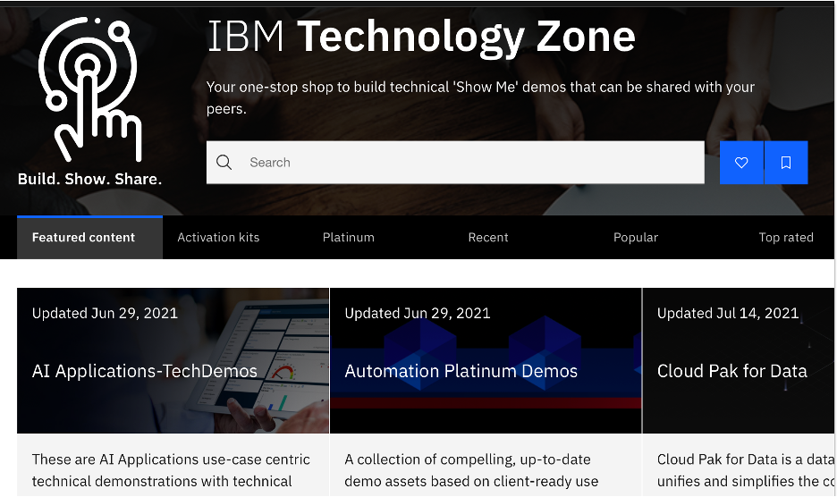

2. Click the **Activation kits** tab to access the **Activation kits** page.

    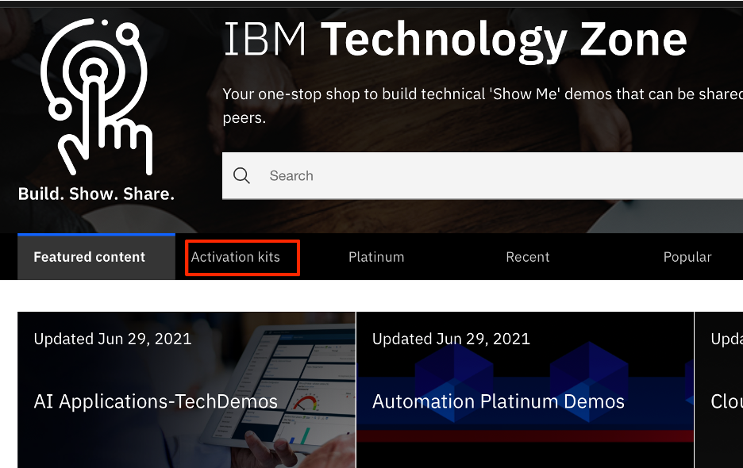

3. Click **App Platform Activation kit** link.

    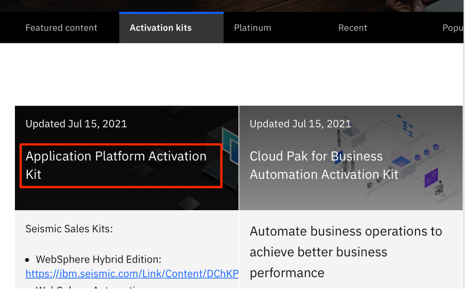

4. In the **App Platform Activation** page, click **Environments** tab.

   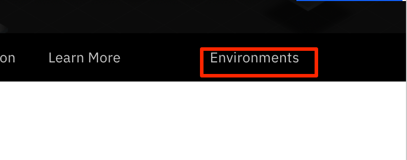

5. Click the **App Mod, DevOps and Day 2 Operation Workshop Environment** to select the environment.

    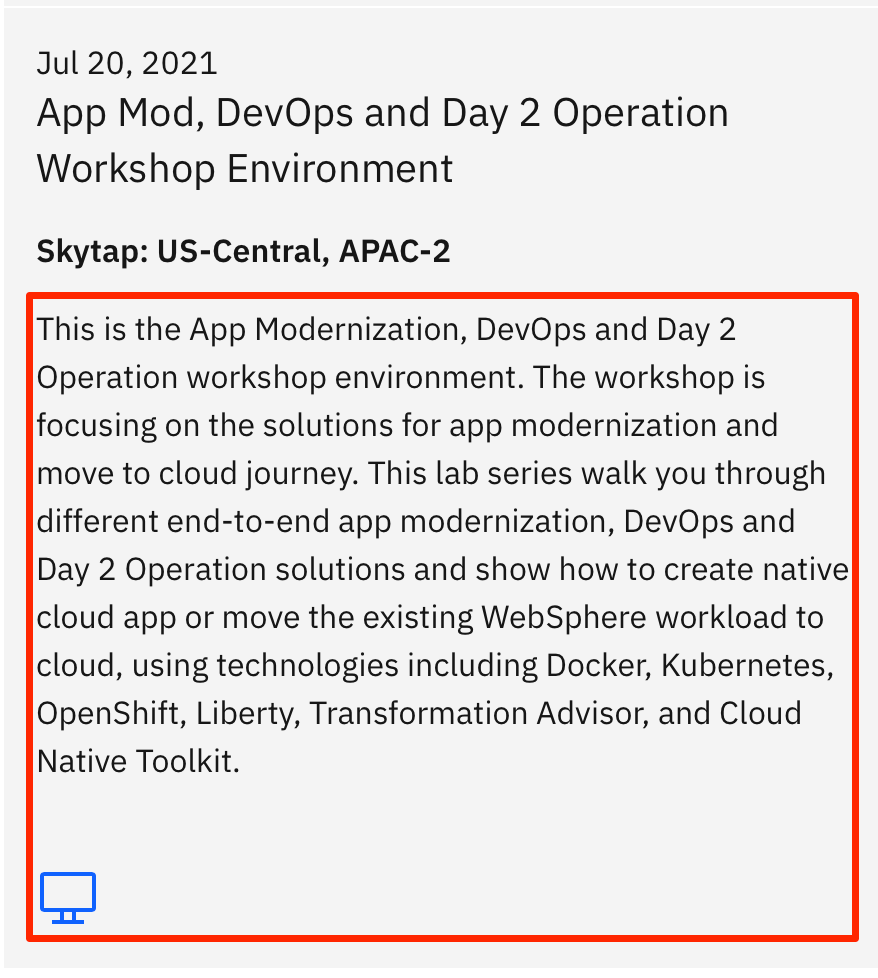

6. In the **Create a reservation** page, click the **Reserve now** to make the reservation right away.

    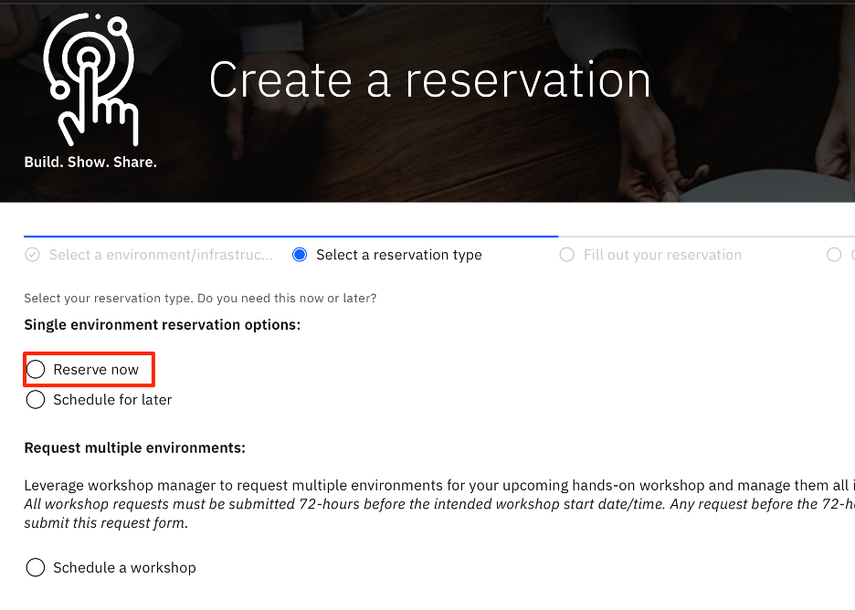

    Note:  You can also select **Schedule for later** option.  The **Schedule a workshop** option is used to provision multiple lab environments for your workshop.

7. Enter your selected values for **Purpose**, **Purpose Description**, **End date and time** and **Referred Geography**, then click **Submit**.  Your reservation is made.

    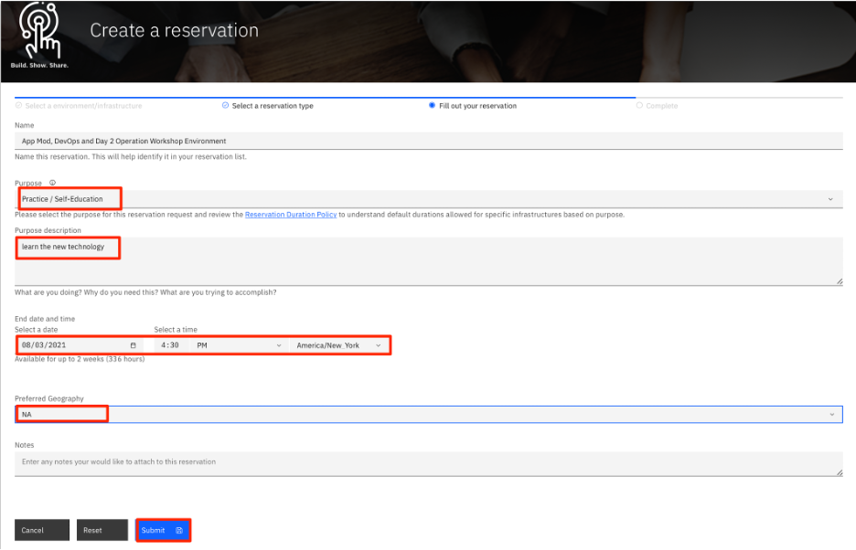

8. Your lab environment reservation is made. When the environment is ready, a email notification will be sent to you. You can also click **My reservations** to access it.

    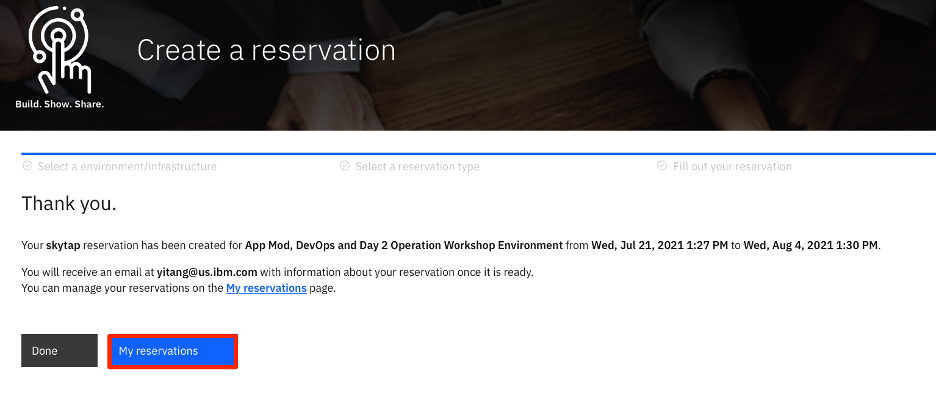

    The email notification will like this:

    ```
    ....
    Your IBM Demonstration is now ready.
    Effective: June 28th, 2021
    IBM Technology Zone has updated environment reservation duration policies. For more information read the 'Reservation duration policies by infrastructure and purpose' resource on our Onboarding collection. 
    Desktop Access Information:
    For full desktop access, connect to https://cloud.skytap.com/vms/3940ac2cb240725d628dfb89081fccf4/desktops
    Desktop password: rg0i6cam

    Asset name:
    App Mod, DevOps and Day 2 Operation Workshop Environment

    Environment name:
    DTE2_2059471_YITAN_2021-07-21 17:30:45_2021-08-04 17:30:00

    Environment ID:
    109495690

    This Environment will Expire at:
    2021-08-04 17:30:00 (GMT)​
     ....
    ```

8. If you clicked **My reservations**, your reservations page is displayed.  Click the lab vm icon:

    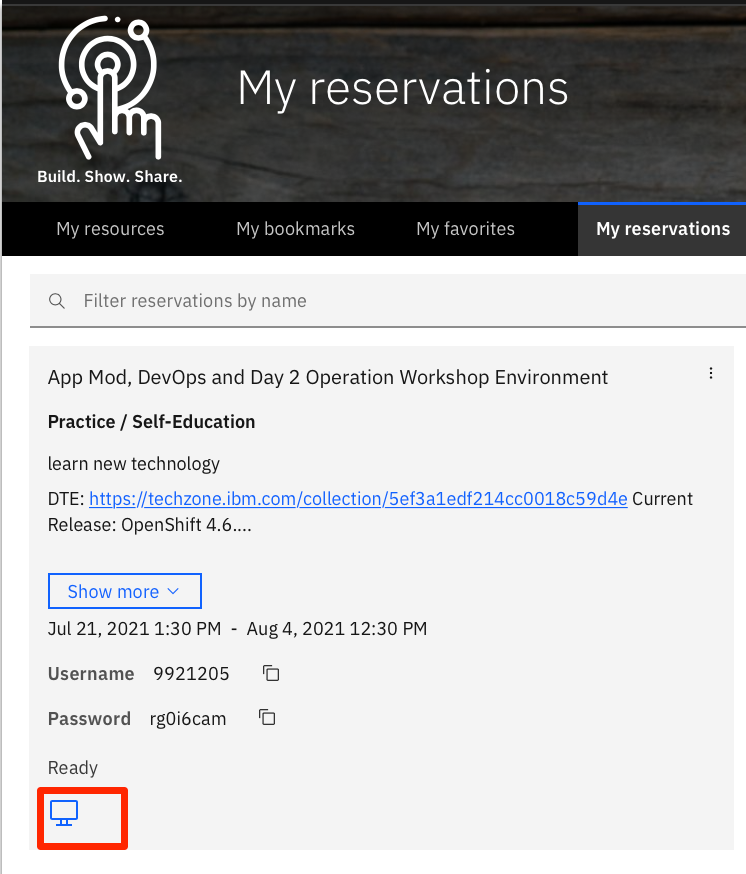

9. Your lab environment reservation page is displayed, click the copy icon under the **Desktop password** to copy it and then click the lab vm icon to login.

    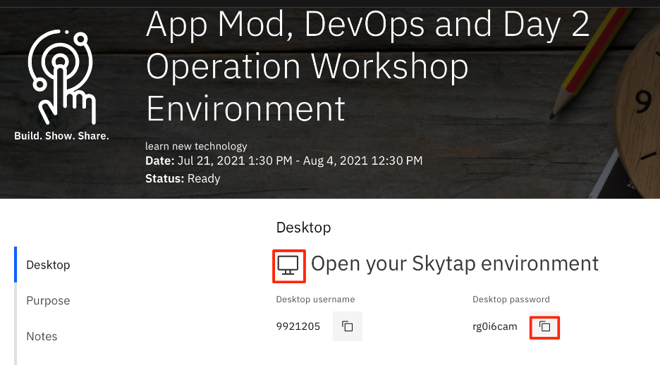

10. Paste the **Desktop password** and click **Submit**. You will be able to access the lab environment page.  From there, you can follow the lab guide to perform lab tasks.

    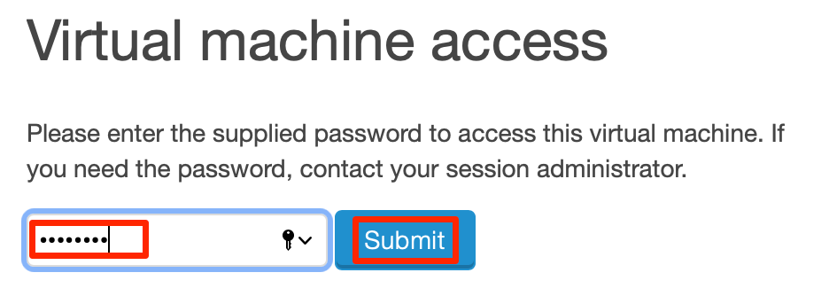