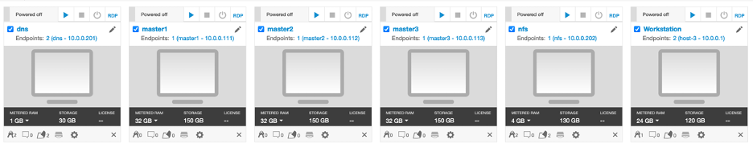

## **Reserves multiple environments for customer facing workshops**

A Skytap workshop lab environment is provided for the labs/demos in this asset. 

### 1.	Make a Reservation for Workshop Lab Environment 

Workshop Lab Environment reservation is available for IBMer's and Business Partners.  You can follow the steps below to reserve your lab environment:

1. Log in to [https://techzone.ibm.com](https://techzone.ibm.com) with your IBM account credentials.

    The **IBM Technology Zone** page is displayed.
    
    

2. Click the **Activation kits** tab to access the **Activation kits** page.

    

3. Click **App Platform Activation kit** link.

    

4. In the **App Platform Activation** page, click **Environments** tab.

   

5. Click the **App Mod, DevOps and Day 2 Operation Workshop Environment** to select the environment.

    

6. In the **Create a reservation** page, select “**Schedule a workshop**” Radio button, and then follow the
    on-screen dialog to schedule a workshop in a Skytap data center
    in the closest Geography (US-Central, EMEA, Asia Pacific)
	
	The **Workshop Manager request form** is displayed. Requesting a workshop is a multi-page request form. 
	
	The form is divided into sections, which are reflected by the **Tabs** across the top. You must fill in ALL required fields on each page before you can go to the next page. 
    
	
	

#### 1.1 Complete the Info Page of the Workshop Request Form	
	
1. Read the important details of workshop scheduling on the **Info** page. Click the **next** button to continue to the next page. 	
	 

#### 1.2 Complete the Environment Information Page of the Workshop Request Form	

1. Complete the **Step 1** **Environment Information** page of the form
	
    a.  The environment **name** should be pre-filled with “**Environment:  Teaching Your Monolith to Dance**”
    
    b.  **Environment Template Region Selection**: Select the Geography closest to your workshop location
	
	 
    
	c. Click the **Next** button
	
	
#### 1.3 Complete the Workshop Justification Page of the Workshop Request Form	

1. Complete the **Step 2** **Workshop Justification** page.
	
	a.  **IBM Product**: Type **liberty** in the field. Type SLOWLY. There is a performance BUG related to how the list is automatically displayed based on the content you type. 
	
	b. Select any product from the list. 
	
	   Example: **IBM WebSphere Application Server Liberty Core**
	
	  **Note:** Unfortunately, the product list is very out dated and WebSphere Hybrid Edition is not in the list. This information is irrelevant to the workshop reservation but is a required field. 
		
	c.  **Workshop Phase**: Select the Phase of the customer engagement that most closely aligns to your situation. This field is required. 
    
	
	
	
	d. **Sales Opportunity Number:** If you have an opportunity number, you may provide that in this field. The field is optional. 
	
	
	e. **Customer Company Name(s):** Yu may enter customer company names to be included in the workshop request. The field is optional. 
		
	f. Click the **Next** button.
	
  

#### 1.4 Complete the Scheduling Information page of the workshop request form	

1. Complete the **Step 3** **Scheduling Information** page

    This page includes important scheduling details and affects when and how your workshop is scheduled. Please take care to provide accurate details. 
   
    **Note:** The workshop request can be updated after submission, up until it is approved. 

    a. ** Instructors:** Provide a _comma delimited_ list of email addresses of all of the workshop instructors. 
	
	  **Note:** Instructors will be authorized access to the Workshop **Instructor Portal** where attendee environments can be observed. 

	b.  **Workshop Delivery Audience:** Select **Internal** or **External** from the drop-down list. The field is required. 
	
	  
	
    c. **Number of Environments:** Enter the numeric value of the number of environments you want to have provisioned for the workshop. 

       This value can be LESS than the number of actual attendees that join. An **Auto-grow** feature selection under the **advanced settings** can be used to automatically add environments as needed for the workshop in case you reach maximum environment limit.  	

    d. **Number of Attendees:** Enter the numeric value of the number of attendees you expect to have at the workshop. 
	
	   Workshops should have some specified limit of attendees, as not to overwhelm the instructors and result in less than favorable delivery and customer satisfaction of the workshop. 

    e. **Start Date  / Time:** Using the date and time widgets, enter the date, time, and Time zone that the workshop should be scheduled to start. 

       This is the date and time that the automated scheduling system should have your environments available and ready. It is better to specify 30 minutes to 60 minutes earlier than the actual start time of the workshop just in case there are technical difficulties. 
  
      
	
	 f. **End Date  / Time:** Using the date and time widgets, enter the date, time, and Time zone that the workshop should be scheduled to end. 

       This is the date and time that the automated scheduling system should shutdown your environments. It is better to specify 60 minutes to 120 minutes later that the actual workshop end time just in case the workshop runs longer than expected. 
  
      
	
 
#### 1.5 ADVANCED SETTINGS on the Scheduling information page. 

Under the **Scheduling Information** page, there are advanced settings that further shape when the environments should be deployed, removed, and grow. 

These advanced settings are optional. The workshop scheduler has default values for deploying and removing environments based on the workshop start / end times that you setup. 
   
1. **Auto Stop Limit:** This field specifies how long an environment must be idle before it either shuts down or suspends the environment. The default time is 180 minutes. 

2. **Auto Stop Behavior:** This field determines the action to take when an environment is idle for the duration specified in the **Auto Stop Limit** field. 

     **TIP:** When the environment includes Redhat OpenShift, ALWAYS specify SHUTDOWN. OpenShift cannot routinely be resumed from a suspended state. 

3. **Deploy On:** This field can be used to specify the date and time for the scheduler to start deploying the environments. 

      **TIP:** Specify approximately 2 hours prior to your workshop to provide sufficient time for the environments to start.  
   
     
   
4. **Remove On:** This field can be used to specify the date and time for the scheduler to remove the environments. 

      **TIP:** Specify approximately 1 hour after your workshop is scheduled to end.  
	  
   
5. **Enable Auto Grow:** Use this field to specify that you want the number of environments to increase if you reach the maximum number of environments that were deployed. The default value is **NO**

6. **Auto grow step size:**  When auto grow is triggered this filed determines how many environment should be added at a time. The default value is **1**. 

	 
7. **Auto grow max:**  Specify the maximum number of environments allowed. 

    Example: If you specified 20 environments, and you want to be able to add 5 additional environments, then this value should be set to 25.  

    

8. Click **Next** when ready to go to the next page of the workshop scheduler form. 

 
#### 1.6 Complete the Workshop Information Page of the Workshop Request Form	

1. Complete the **Step 4** **Workshop Information** page.
	
	a.  **Workshop Title**: Enter a title for your workshop. This title is searchable in your list of scheduled workshops. Attendees will see this this title.
	
	b.  **Workshop Description**: Enter a short description of the workshop. Attendees will see this description 
    
	c. **Physical Location - Region:** From the drop-down list, select the Region of the workshop. 
	
	c. **Physical Location - Physical Location:** For virtual workshops, enter the WEBEX or Meeting URL of the workshop. 
		
	e. **Workshop Password:** Enter a password for the workshop. This is a password that all attendees must enter in order to access the Workshop. As the instructor, you will need to share tis password with the workshop attendees. 
	
	f. **Guide URL:** If you have a URL to the Workshop or Lab guides, you can enter it here. This URL is displayed on the workshop page for attendees to see. 
	
	g. **Survey URL:** If you have a URL to a workshop survey, you can enter it here. This URL is displayed on the workshop page for attendees to see. 
	
	h. Click the **Submit** button to reserve the workshop
	

### 2. How do I find my workshop in IBM Technology Zone

After you submit the workshop request, the workshop details are available in the IBM Technology Zone.

This section describes how to find your workshops in the IBM Technology Zone. 

1. Go to the IBM technology Zone URL: [https://techzone.ibm.com/](https://techzone.ibm.com/)

2. Login using your IBM ID, if requested. 

3. From the main menu in Tech Zone, navigate to **My Library** > **My Workshops**

    

4. You will see your workshops listed. The one you just submitted will be in **Pending Approval** state. 

    

### 3. The workshop Instructor and Attendee URLS for the workshop

Once the workshop is deployed as scheduled, the **Instructor URL** and **Attendee URL** for the workshop can be obtained from the workshop details. 

### 4. The Workshop Environment

Each workshop attendee has access to their own lab environment. 

The lab environment has six Linux VMs as described below. 
 
  

*	The Red Hat OpenShift Container Platform (OCP) v4.6, is installed in 5 VMs, the master1 VM, the master2 VM, the master3 VM, the dns VM and the nfs VM, with 3 master nodes and 3 compute nodes (the master nodes are serving as computer nodes as well). IBM Transformation Advisor and WebSphere Automation have been installed as operators in the cluster.
*	The Workstation VM is the one you will use to access and work with OCP cluster in this workshop. The workstation is pre-configured with lab artifacts, WebSphere Application Servers, Liberty Collective and developer tools, including:
    * Docker
    * VSCode
    * SDK 8.0.5
    * WAS 8.5.5
    * WAS 9.0.5
    * Liberty Collective 
    * IBM Cloud CLI 
    * Node 
    * IBM Garage for Cloud CLI 
    * Tekton CLI Cloud 
    * Native ToolKit 
    * ArgoCD CLI 
    * Knative CLI
    * Hey CLI 

  The login credentials for the Workstation VM are:
  * User ID: **ibmdemo**
  * Password: **passw0rd**
  
**Note:** The **Workstation** VM is the VM the user will login to and use in the lab.

It is recommended to use Chrome or Firefox browser to work with the lab workstation.

**Note:** If the Skytap Cloud environment resources approach capacity limits, you may experience delays in **stating** the environment. If this occurs, you will see **rate limited** messages. Not to worry, the environment will start, but just be delayed while the system is busy. Under certain circumstances, it may take up to **20 minutes** for the environment to start.

Now lab users are ready to use the specific lab guides to do the lab exercises.

The labs are available from the **Navigation** pane on the left side of the page.

