How to conduct “day 2 operations” in a hybrid cloud environment is one of the challenges customers are facing in their journey to the cloud, it is hard to quickly determine the root cause of an issue or to get the information needed to make decisions with too many views, tools and inconsistencies. IBM Cloud Pak for Applications provides tools and solutions to address such issues. Included in this Pak is IBM Application Navigator (**App Navigator**).  It is an app-centric management tool which compliments Red Hat OpenShift (OpenShift), by allowing you to visualize, inspect, and interact with the deployed resources that are comprised of hybrid and cloud native applications. App Navigator is a Kubernetes application that is designed to facilitate an app-centric management experience for cloud native and hybrid applications, across both cloud and traditional platforms. By providing a grouping and visualization capability for those deployed elements that comprise a business level application, combining with both kind-specific out-of-the-box and customizable actions, App Navigator enhances operational understanding and control through a simplified but powerful view of your applications.  It puts the tools you need most in context and at your fingertips and yields a superior user experience for applications that dramatically surpasses the infrastructure view that the Kubernetes platform consoles provide.

### 1.	Business Scenario

Your company has started a project to break a big monolithic application into different components. Via IBM Cloud Transformation Advisor, you received the insight on how to modernize the application the best way. You replaced parts of the business functionality with new cloud native services and deployed them successfully to a Kubernetes cluster environment. In addition, you moved some application components to the light-weighted Liberty Collective environment. Unfortunately, you had to leave some of the complex JEE application components in the traditional existing WebSphere ND Cell infrastructure. So finally, you ended up with a hybrid application which runs across WAS Cell, Liberty Collectives and Containers. This makes it hard for the operations team to find out in an easy way if your application overall is running fine or not.  

In order to quickly determine the root cause of an issue and get the information needed to make decisions for the application across WAS Cell, Liberty Collectives and Containers, you want to use the App Navigator tool to as a single access point to view/navigate/interacts with the applications and their components.  

  
### 2.	Objective

The objectives of this lab are to:
*	Learn how to deploy a cloud native application in a Kubernetes cluster
*	Learn how to configure WAS ND Cell with App Navigator
*	Learn how to configure Liberty Collective with App Navigator
*	Learn how to use App Navigator as an inspection tool to facilitate monitoring and problem determination for WAS ND, Liberty Collective and Kubernetes clusters.

### 3.	Prerequisites
The following prerequisites must be completed prior to beginning this lab:
*	Familiarity with basic Linux commands
*	Have internet access
*	Have completed SU0010 of this lab series and have the CP4Apps installed in IBM Red Hat OpenShift Kubernetes Service (OCP) cluster on IBM Cloud


### 4.	What is Already Completed

The Workstation VM is pre-configured for you to access and work with the OCP cluster in this lab.

The login credentials for the Workstation VM are provided in your Reservation Details page (https://www.ibm.com/demos/my-reservations/).

The CLI commands used in this lab are listed in the Commands.txt file located at the **/home/ibmdemo/app-mod-labs/mm0100** directory of the Workstation VM for you to copy and paste these commands to the Terminal window during the lab.

### 5.	Lab Tasks
During this lab, you complete the following tasks:
*	Deploy a cloud native application
*	Review the cloud application in App Navigator
*	Import the WAS ND Cell to App Navigator
*	Import the Liberty Collective to App Navigator
*	Take actions with App Navigator
*	Troubleshot application issues

### 6.	Execute Lab Tasks

#### 6.1 Log in to the Workstation VM and get started 
1.  Launch the VM from your local workstation web browser with the VM URL.
 
    

2.	Click **Connect** to access the VM.
 
    

3.	Enter the password you obtained from the Reservation Details page and click **Send Password**.

    

    The VM desktop is displayed.

    

    The Workstation Desktop is displayed. You execute all the lab tasks on this VM.

#### 6.2	Deploy a Cloud Native Application to a Kubernetes cluster

In this task, you are going to deploy stocktrader, a sample cloud native application, to an OCP cluster using OpenShift command line. 

1.	Click **Applications**>**Firefox** to launch the web browser.

  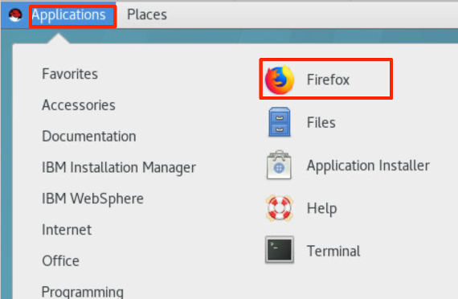
2.	From the browser window, click OCP cluster Web Console bookmark to open it with your IBM credentials.

   
3.	In the OpenShift Web Console page, click the **Action** icon next to your username and select **Copy Login** Command to get the OCP login command.

   
4.	In the next page, click **Display Token** link.

   
5.	Copy the OCP login command to the clipboard.

  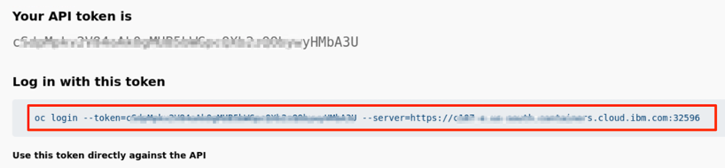 
6.	Open a Terminal window by clicking **Applications**>**Terminal**.

  
7.  In the Terminal window right-click to paste the OCP login command window press Enter to log in to the OCP cluster.
 
   
8.	After the login, create two new OpenShift projects (namespaces) as **demo** and **stocktrader**.

  ```
  oc new-project demo
  oc new-project stocktrader
  ```
    the **demo** project and **stocktrader** project are now created.

8.	Navigate to **/home/ibmdemo/mm0100** directory with command:

    ```
    cd /home/ibmdemo/app-mod-labs/mm0100
    ```

9.  Deploy the **stock-trader** cloud native application to the **stocktrader** namespace with the following command: 

    ```
    oc create -f samples/stocktrader -n stocktrader
    ```
 
  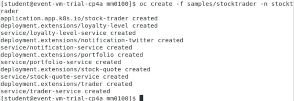
10.	To verify the deployment, go back to the OCP cluster Web Console Home page, click **Workload**>**Deployments** and select the **stocktrader** project.

  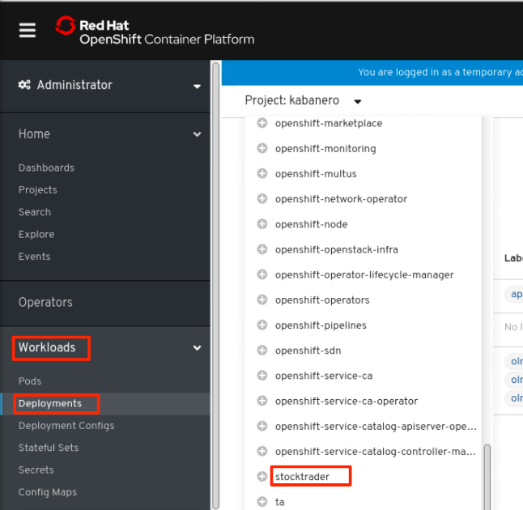
11.	From the stocktrader project Overview page, you can see all the components of the application are deployed and running.
 
  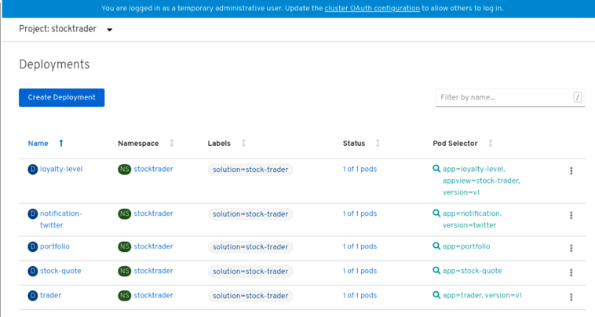 
  
  Once deployed, these cloud native applications are automatically added the App Navigator Applications List. You see later how you can visualize and inspect these cloud native applications with App Navigator.

#### 6.3	Launch and View App Navigator

The App Navigator has been deployed to the OCP cluster as a part of the Cloud Pak for Application installation. You can access all its functions through its web UI.

1.	From the web browser window, click the App Navigator bookmark to launch it.

  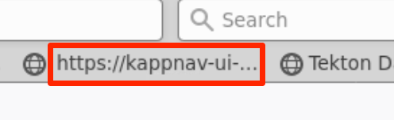

    The App Navigator **Home/Applications** page is displayed.

  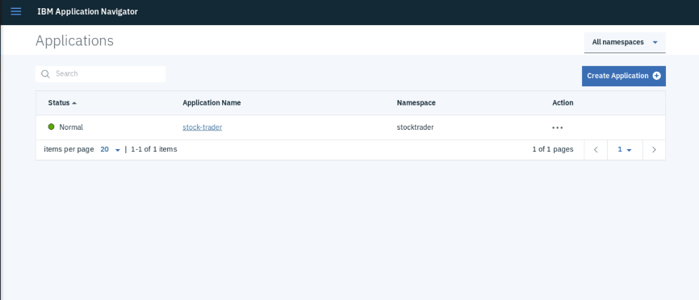
  
    As you can see, The App Navigator **Home/Applications** page lists all Kubernetes applications deployed in all OCP Cluster namespaces.  Currently, the **stocktrader** application is listed.

    Note: The stocktrader is a typical Kubernetes Application with a collection of loosely coupled, but related resources.  It is different from a traditional JEE application which is represented as a single resource.  A Kubernetes “Application” could be comprised of multiple JEE applications.  

3.	Click the Navigation menu icon on the top left corner of the page to access the function pages of the App Navigator.

   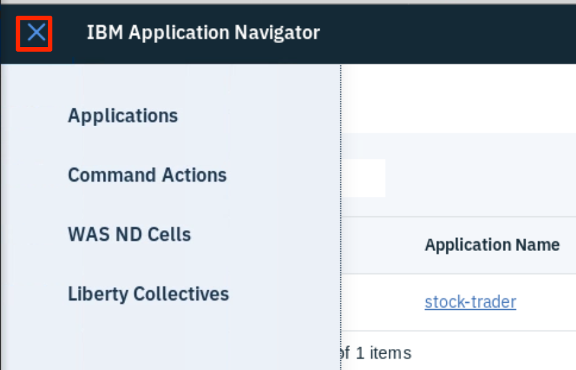

   App Navigator has four function pages, including:
    * Applications – let user to view and perform actions for Kubernetes applications and their related resource.
    * Command Actions – provide a view of command action the user previously initiated.
    * WAS ND Cell – allow user to add WAS ND Cells to App Navigator, to view and perform actions for JEE applications in these cells.
    * Liberty Collective - allow user to add Liberty Collectives to App Navigator, to view and perform actions for JEE applications in these collectives.

#### 6.4 Import a WAS ND cell into App Navigator

In this task, you learn to process import a WAS V9 ND cell into the App Navigator, this establishes visibility and access to the WAS cell from the App Navigator.  It creates a WAS-ND-Cell (twas-cell) Kubernetes custom resource to represent that cell. It also automatically discovers JEE applications deployed on that cell and creates WAS-Traditional-App (twas-apps) Kubernetes custom resources to represent them.  App Navigator periodically polls the cell to keep the state of the twas-cell and twas-apps in sync with the cell.  

A WAS ND Cell can be imported into App Navigator via UI or CLI.  In this lab, you learn how to import a WAS ND cell via App Navigator UI. 

Note: The best practice is that all WAS cells should be imported into the same Kubernetes namespace.  

In order to import a WAS ND cell to App Navigator, the WAS ND cell should be in the same network as the OCP cluster. Due to the network constrain of the lab environment, a hypothetical WAS ND cell with the following settings is used here to show the import process:

**Host IP**: 10.0.0.1

**Admin Console URL**: https://10.0.0.1:9044/ibm/console

**Username/password**: wsadmin/wsadmin

1.	From the App Navigator UI, click **Navigate**>**WAS ND Cells**. 

  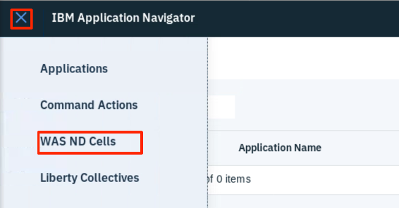
2.	In the WAS ND Cells page, click **Create WAS ND Cell** to add the local WAS ND cell resources to App Navigator.

  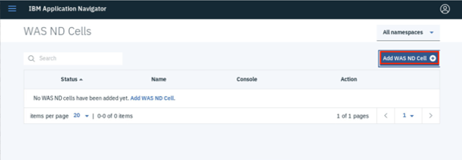
3.	In the **General** panel, enter the **Name** as **mywasndcell** for your WAS ND cell and select the **demo** namespace.

  

    Note: The WAS ND Cell Name is a name you choose, it has to be a unique name within the same namespace on Kubernetes Cluster. It is not necessarily the same as the WAS Cell actual name, because many times that name is the default name and therefore is not unique among multiple cells.    

4.	Click **Endpoints**, enter the Host as **10.0.0.1** and change the Console URL port to **9044**.

 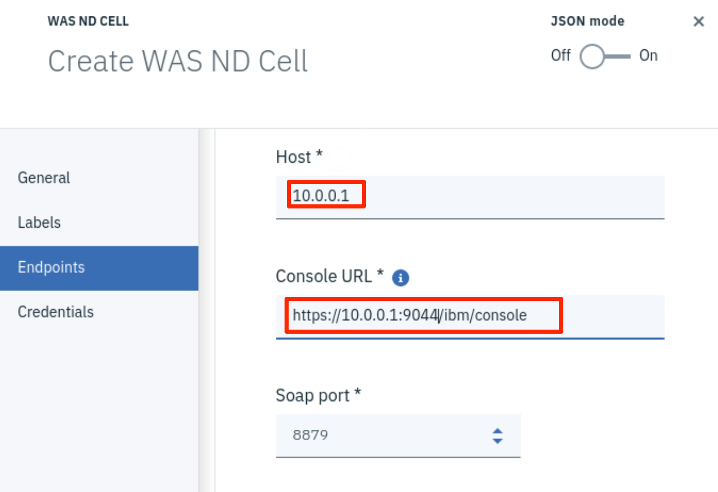

5.	Click **Credentials**, accept the default, you need to create a secret setting, enter Username and Password as: **wsadmin**/**wsadmin**, confirm the password and click **Add**.
 
  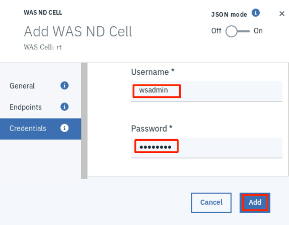
 
  Your WAS ND cell resources have been created and the WAS ND cell info are starting to be imported to App Navigator.  Since you are using a hypothetical WAS ND cell, the WAS ND cell resources status changes from **Unknown** to **Problem**. In real situation, after the import is done, the WAS ND cell resources status turns from **Unknown** to **Normal**.

  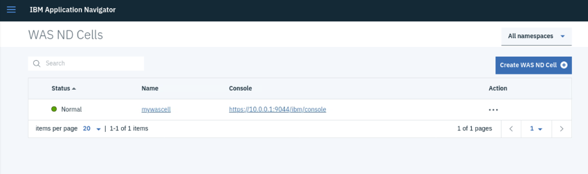

#### 6.5	Import a Liberty Collective Resources into App Navigator

Similarly, you can import a Liberty Collective into App Navigator establishes visibility and access to the collective from it.  It creates a Liberty-Collective Kubernetes custom resource to represent that collective. It also automatically discovers JEE applications deployed on that collective and creates Liberty-App Kubernetes custom resources to represent those.  App Navigator periodically polls the cell to keep the state of the Liberty-Collective and Liberty-Apps in sync with the collective.  

Note: Best practice: all Liberty Collectives should be imported into the same Kubernetes namespace.  

Again, in order to import a Liberty Collective to App Navigator, the iberty Collective should be in the same network as the OCP cluster. Due to the network constrain of the lab environment, a hypothetical a Liberty Collective with the following settings is used here to show the import process:

**Host IP**:	10.0.0.1

**Admin Console URL**:	https://10.0.0.1:9045/adminCenter

**Username/password**:	admin/admin

1.	From the App Navigator UI, click **Navigate** > **Liberty Collectives** to go to the Liberty Collective page.

  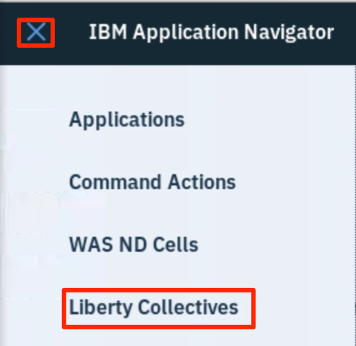
2.	In the Liberty Collective page, click **Create Liberty Collective** to add the local Liberty Collective resources to App Navigator.

  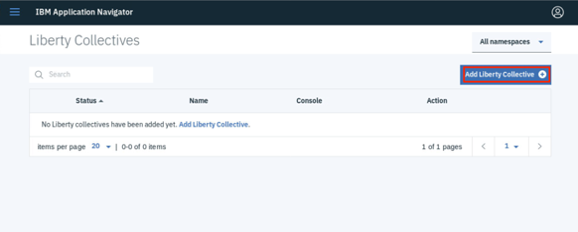

3.	In the General panel, enter the **Name** as **mylibertycollective** for your Liberty Collective and select the **demo** namespace.

  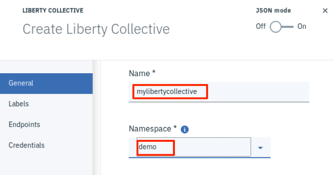 

    Note: The Liberty Collective Name is a name you choose, it has to be a unique name within the same namespace on Kubernetes Cluster. It is not necessarily the same as the Liberty Collective actual name, because many times that name is the default name and therefore is not unique among multiple Liberty Collectives.    

4.	Click **Endpoints**, enter the Host as **10.0.0.1** and change the Console URL port to **9445**.

   
5.	Click **Credentials**, accept the default I need to create a secret setting, enter Username and Password as: **admin**/**admin**, confirm the password and click **Add**.

  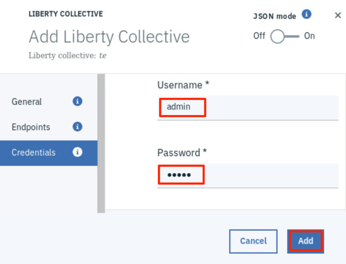

    Your Liberty Collective resources have been created and the Collective info are starting to be imported to App Navigator.  Since you are using a hypothetical Liberty Collective, the Liberty Collective resources status changes from **Unknown** to **Problem**. In real situation, after the import is done, the Liberty Collective resources status turns from **Unknown** to **Normal**.

  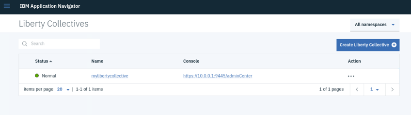
### 6.6	Take actions with App Navigator (Reviewing Only)

In this section, you learn how to perform App Navigator actions.

Note:  Since you are using the hypothetical WAS ND cell and Liberty Collective in the lab environment, you cannot perform any App Navigator actions against **mywasndcell** and **mylibertycollectibe** you added in the step above. These Action processes presented in this section are for your reference only. If you want to have a hands-on experience on how to execute these actions, you can run the **MM0100ST** lab in [BludDemo2459](https://bluedemos.com/show/2459).

The App Navigator provides context sensitive actions that you can perform on Kubernetes resources. In this task, you select an application component and perform an action.  

The available actions in App Navigator are listed below:

### Kind-**Action**-Description
* Application-**Edit**-Edit the JSON resource
* Application-**Remove**-Delete the application from the cluster.
* Application-**Detail**-Hyperlink to detail page.
* Deployment-**Detail**-Hyperlink to detail page.
* Deployment.Liberty-**View Metrics**-View the Liberty Grafana dashboard.
* Deployment.Liberty-**View Kibana Logs**-View the Liberty Kibana dashboard for containers.
* Deployment.tWAS-**View**-Kibana Logs	For WebSphere Application Server traditional, view the Kibana dashboard for containers.
* Ingress	Detail-**Hyperlink**-to detail page.
* Job	Detail-**Hyperlink**-to detail page.
* Liberty-App-**Detail**-Hyperlink to detail page.
* Liberty-App-**Edit**-Edit the JSON resource.
* Liberty-App-**Access Admin Center**-Open the Liberty Admin Center home page**.
* Liberty-App-**View Kibana Logs**-View the Liberty Kibana dashboard for virtual machines (VMs).
* Pod	Detail-**Hyperlink**-to detail page.
* Service-**Detail**-Hyperlink to detail page.
* tWAS-App-**Detail**-Hyperlink to detail page.
* tWAS-App-**Edit**-Edit the JSON resource.
* tWAS-App-**Access Admin Console**-Open WAS Admin Console home page.
* tWAS-App-**View Kibana Logs**-For WebSphere Application Server traditional, view Kibana dashboard for VMs.
* tWAS-App-**Set Trace**-Set a trace string for WebSphere Application Server traditional servers.


1.	Execute actions for tWAS-App (Do not run any tasks in this step).

  After the WAS ND Cells and the Liberty Collectives are added and their status are **Normal**, you can perform the following App Navigator Action tasks to it.   
  
  a.	In the App navigator page, click **Navigation Menu**>**WAS ND Cells**.
  
  b.	Click Action context menu of the **mywasndcell** and select **Edit**.

  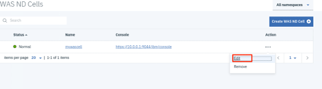

    As you can see, you use the Edit action to make changes to configure JSON object to add label and annotations of the WAS ND Cell. The purpose of editing the WAS/Liberty JSON object is to follow the philosophy of the OCP cluster console, which gives you edit access to the JSON for all objects.  
  
  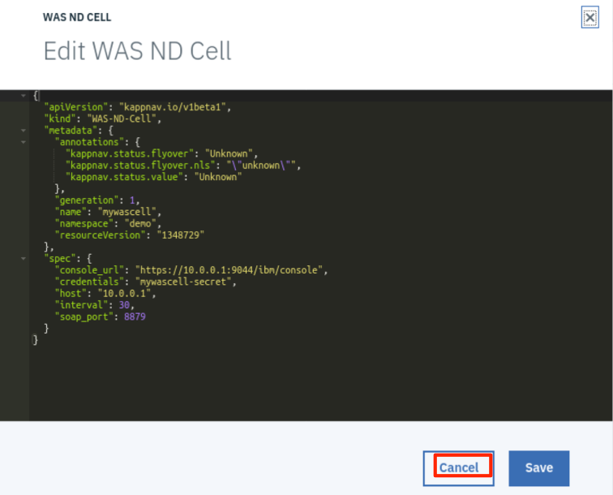

  d.	Go back to the App Navigator page and click the **mywasndcell** link to access the **mywasndcell** detail page which contains the WAS cell details info and all JEE applications deployed to the cell.

  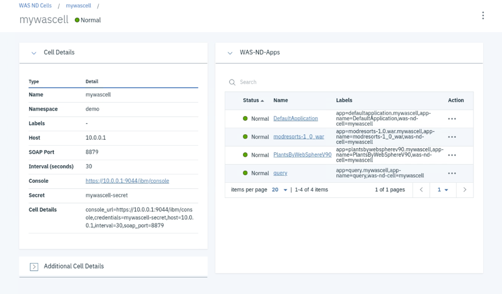

  e.	Click the Action context menu of the **query** JEE application, you can see the actions available for the application, including editing the JSON object of the application, accessing WAS Admin Console, viewing Kibana log and setting application trace.
 
  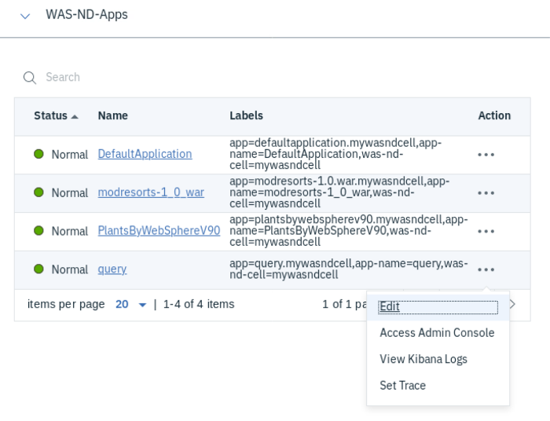
  
  As you can see from the application list, all four JEE applications are not associated with the stocktrader Kubernetes Application and they are not show up in the stocktrader Application list, this is because that none of these JEE applications are represented as part of any Kubernetes Application by default. 

  To represent any JEE applications as a part of a Kubernetes Application, they must be assigned using a two-part formula: 

  *	Add a resource kind to componentsKinds list of chosen Kubernetes Application
  *	Add a label to resource instance that matches the chosen Kubernetes Application’s label selector. 

  If you pretend that the query JEE application is a component application of stocktrader, you can use the Edition Action to modify its JSON object and label it as the stocktrader application.  Then you add the resource kind of the query JEE application to stocktrader application JSON object. Once you do that, the query application is added to the stocktrader application list.

  f.	Click the Edit Action of the query application, add "solution": "stock-trader", string to its JSON object and save the change. Make sure that you add "," in the end of the string.

  ```
  "solution": "stock-trader",
  ```
  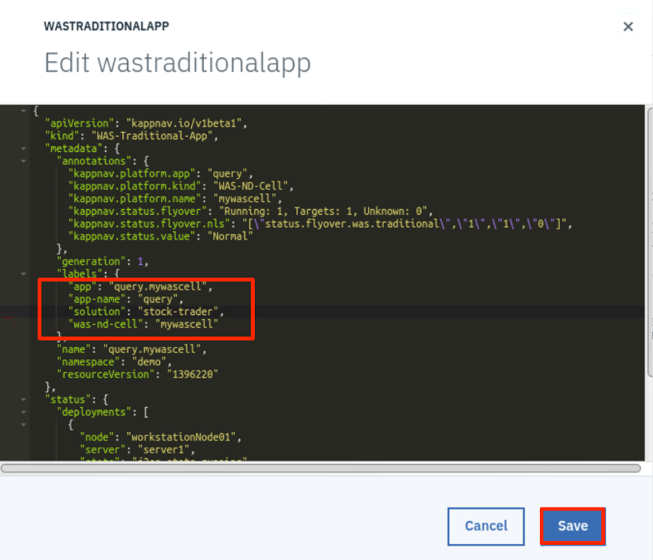
  
  g.	Click the query application Name link to view its detail info.  You can see the new label you just added is displayed.

  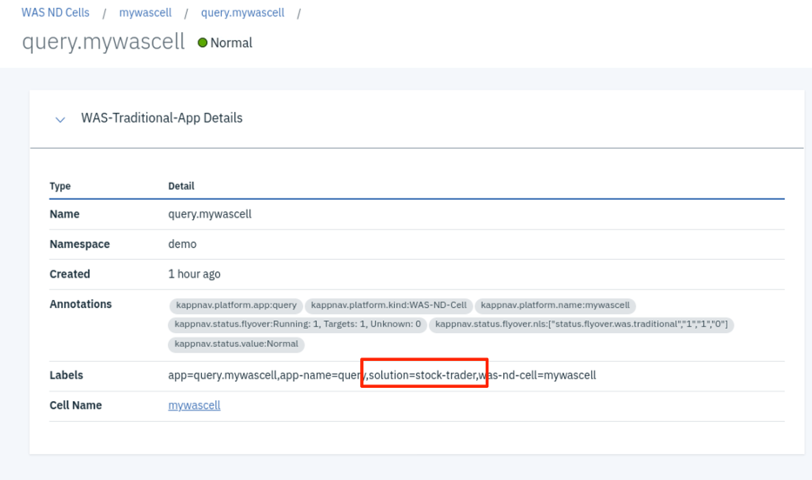

  h.	Next, go back to the App Navigator **Applications** page and click **Edit** action from the **stocktrader** application Action Context Menu.

  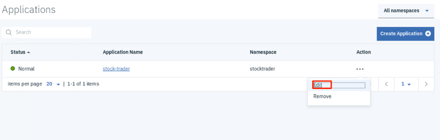

  i.	 First add a special annotation for the WAS ND Cell namespace as "kappnav.component.namespaces": "demo", to the JSON object. Make sure that you add "," in the end of the string.

  ```
  "kappnav.component.namespaces": "demo",
  ```

  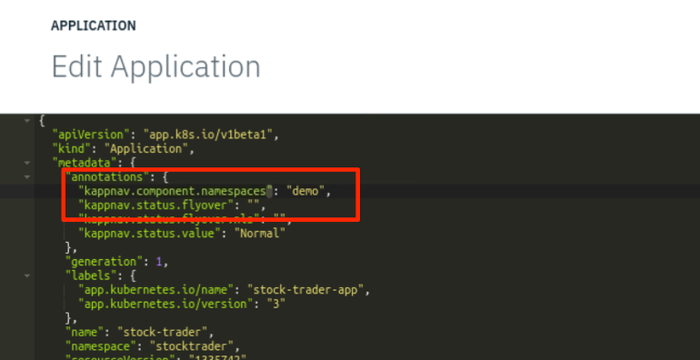

  j.	Add a new componentKinds group with legacy group name and WAS-Traditional-App kind to the JSON object and click Save to save the change.

  ```
  {
    "group": "legacy",
    "kind": "WAS-Traditional-App"
  },
  ```
  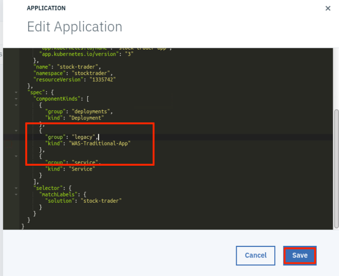

  k.	Now click the stocktrader Application Name link to view its details.

  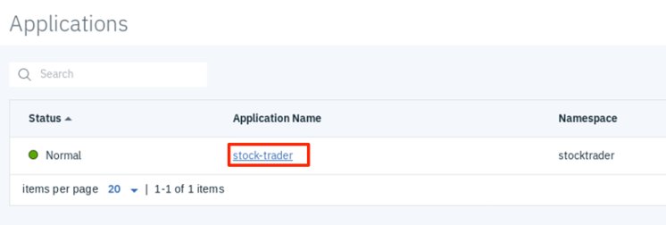

  You see that the query JEE application is showing in the Application list.
 
  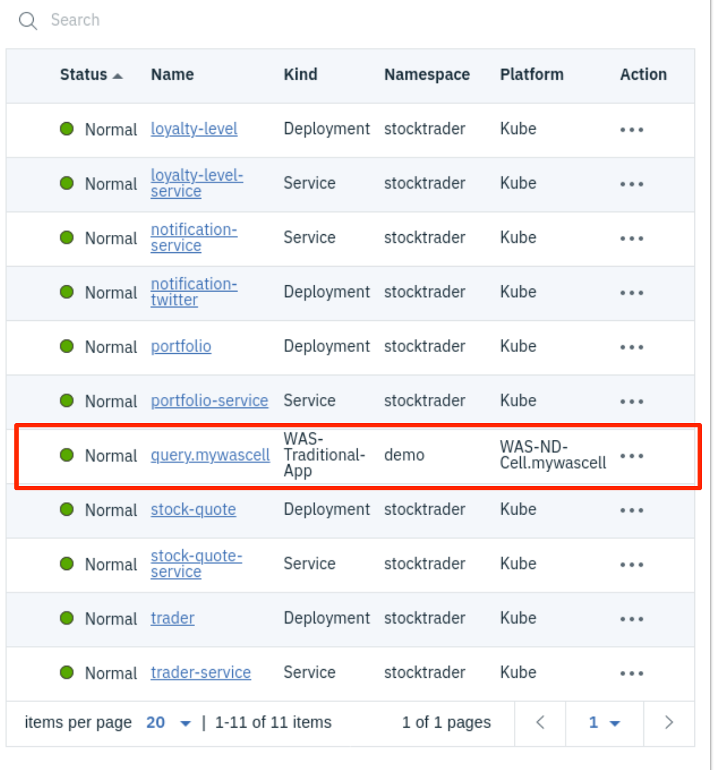

2.	Execute actions for the Liberty Collective App (do not run any tasks in this step).
  
  a.	In the App Navigator page, click **Navigation**>**Liberty Collectives**.
  
  b.	Click Action context menu of the **mylibertycollective** and select **Edit**.
    
  c.	As you can see, you can use the Edit action to make changes to configure JSON object. But in this lab, you are just viewing the contents of the object, so click Cancel to close the window.
  
  d.	Click the mylibertycollective link to access the mylibertycollective page.

  e.	Click the Action context menu of the **PlantsByWebSphere** JEE application, you can see the actions you can use for the application, including editing the JSON object of the application, accessing Liberty Collective Admin Center and viewing Kibana log.
 
  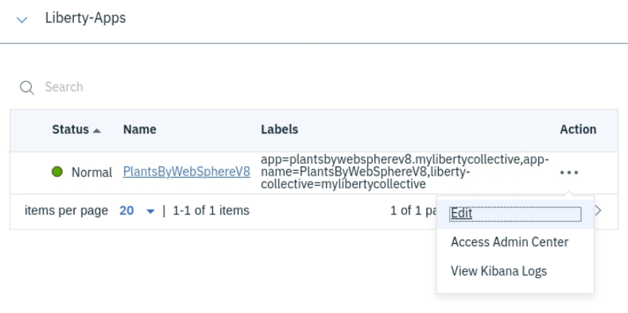

  Again, if you pretend that the **PlantsByWebSphereV8** JEE application is another component application of stocktrader, you can follow the same approach as you did for the query JEE Application in WAS ND Cell case to add it to the stocktrader application list.

  f.	Click the Edit Action of the **PlantsByWebSphereV8** application, add "solution": "stock-trader", string to its JSON object and save the change. Make sure that you add "," in the end of the string.

  ```
  "solution": "stock-trader",
  ```
 
  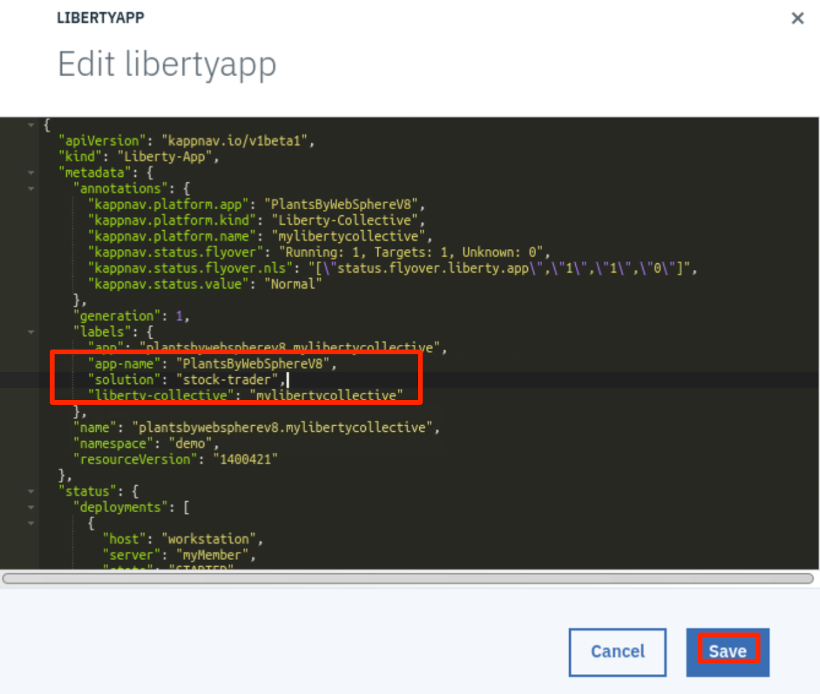

  g.	Click the **PlantsByWebSphereV8** application Name link to view its detail info.  You can see the new label you just added is displayed.
  
  h.	Next, go back to the App Navigator **Applications** page and click **Edit** action from the stocktrader application Action context menu.

  i.	Add a new componentKinds group with legacy group name and Liberty-App kind to the JSON object and click Save to save the change.

  ```
  {
    "group": "legacy",
    "kind": "Liberty-App"
  },
  ```
  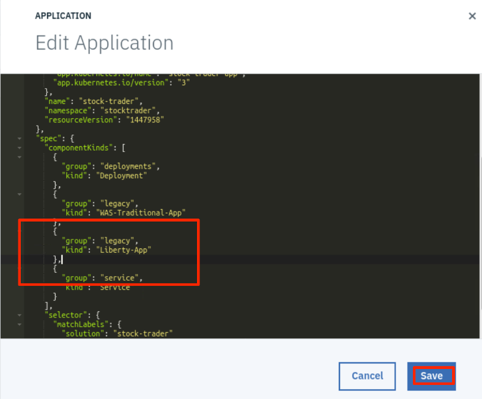
  j.	After the change, click the **stocktrader** application link, you see that the PlantsByWebSphereV8 application is showing in the Application list.

  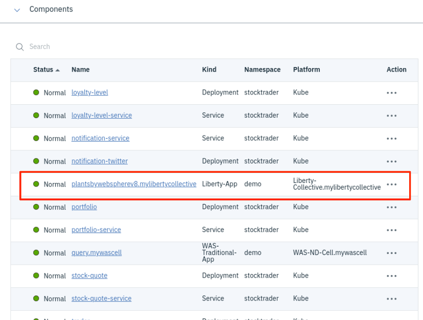
3.	Execute actions for the Cloud Deployment

    a.	In the App Navigator page, click **Navigation**>**Applications**.

    b.	Click the **stock-trader** link to access the **stock-trader** application page.

    c.	Click the Action context menu of the loyalty-level deployment pod, you can see a list of available actions. For example, if you take an action **View Replicas**, clicking the link takes you to OCP cluster **Workloads**>**Replica Sets** page of that application.
    
    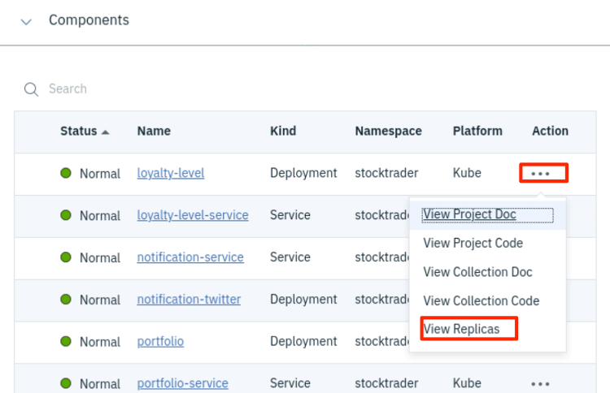
    d.	Click any of the cloud native application Name link, it takes you to either ROSK cluster **Workloads**>**Deployments** page or **Networking**/**Services** page of that application, depending on the application Kind.

#### 6.7	Troubleshooting Applications Issues

Naturally, in a production environment, application status is monitored by Application Performance Management (APM) tools. If the deployed applications and components are running into issues, APM automation process takes care most of the issues and the responsible party is notified if manual intervention is required. When the manual intervention is required, the App Navigators status indicators help direct the user immediately to the affected component and provides in-context access to relevant tools.

In this section, you simulate an application error using the loyalty-level application and setting its pod to 0. After the setting change, the loyalty-level application stops running.  You learn how you can recognize the error in App Navigator, be able to easily drill down to identify the issue and make a decision how to address it. 
 
1.	Go back to the OCP cluster Web Console page, click **Workloads**>**Deployments** and select **stocktrader** project.

  
2.	Click **loyalty-level** application deployment link.

  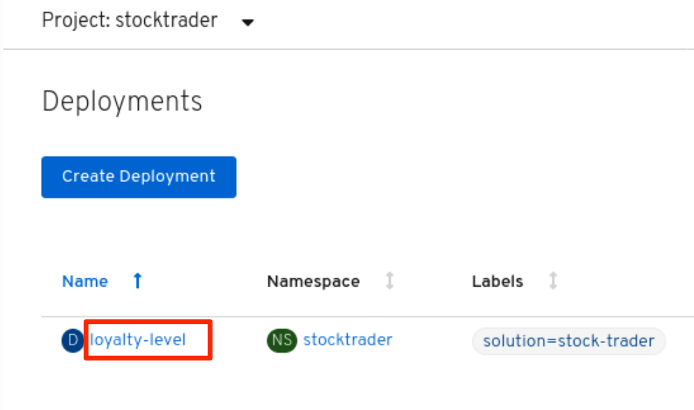
3.	From the **loyalty-level** application deployment page, click **Actions**>**Edit Count**.

  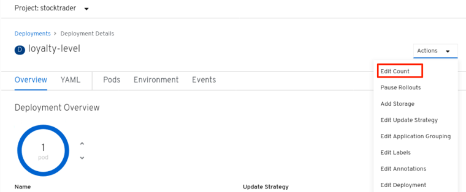
4.	Set the pod number to **0** and click **Save**.

  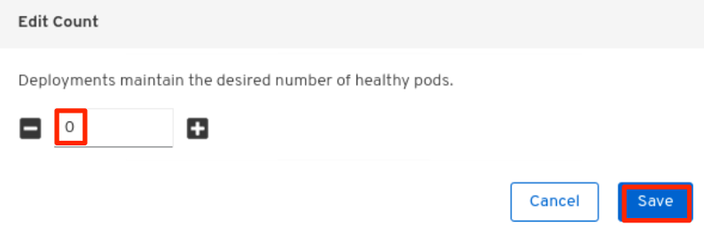
5.	Now the loyalty-level application is down. Assuming this error is detected by the APM system, but cannot be corrected automatically.  You received a notification and need to investigate manually. You open the App Navigator Applications page, you see that you do have an issue with the stocktrader application. Click the Application Name link to drill into it.

  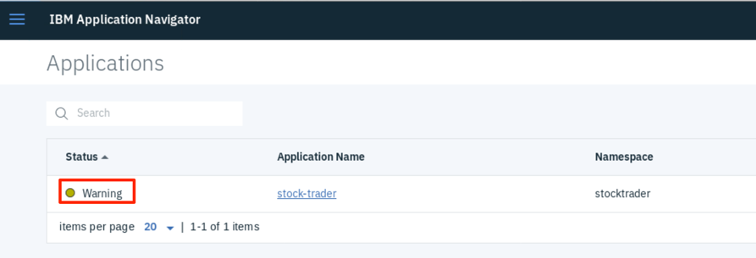

  You see that you have a problem with the loyalty-level application deployment.

  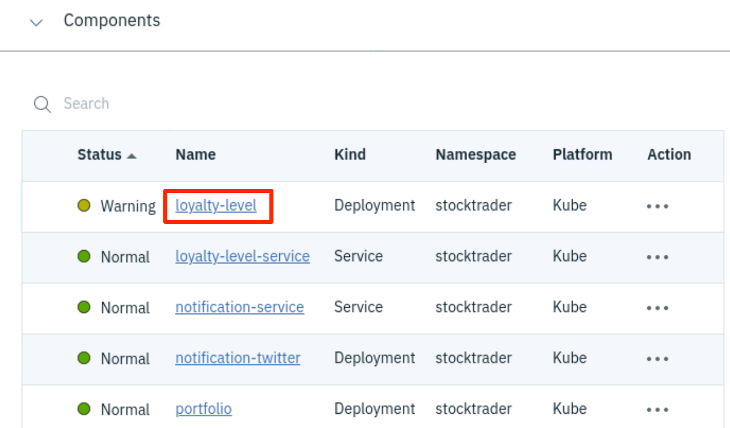
6.	Click the loyalty-level application deployment Name link to drill down, you are taken to the OCP cluster **Workloads**>**Deployments** page of the loyalty-level application and you can see that the problem is that there is no pod available.

  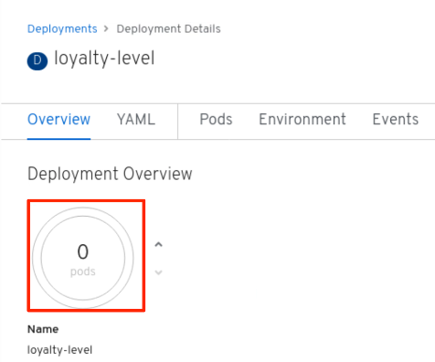
7.	To fix the issue, click **Actions**>**Edit Count**, set the pod number back to **1** and save the change.
8.	Switch back to the App Navigator Application view and you see in a moment that the status color of stocktrader application goes from red to green and the loyalty-levels application is back up and running. The problem has been solved. 

### 7.	Summary

In this lab, you have learned how to use IBM App Navigator tool to inspect your applications on-prem and in cloud. App Navigator enhances operational understanding and control through a simplified but powerful view of your applications, allows you to easily view/navigate/interacts with the applications and their components.
To learn more about IBM App Modernization solutions and Cloud Pak for Application capabilities, please visit [Cloud Pak for Applications](https://www.ibm.com/cloud/cloud-pak-for-applications).

Congratulations! You have successfully completed the lab “App Centric Management with Application Navigator”
