## Setup IBM Cloud Pak for Applications on OCP Cluster in IBM Cloud 

This lab is the first part of the Cloud Pak for Applications on Red Hat OpenShift Kubernetes Service (OCP) lab series which focus on application modernization and cloud native related solutions. This lab walks you through the process to setup the lab environment by installing CP4Apps on a OCP cluster in IBM Cloud.

Note: currently you can only reserve one CP4Apps instance per OCP cluster.  If you want to install another CP4Apps instance, you have to delete your CP4Apps OCP cluster from the [Reservation](https://www.ibm.com/demos/my-reservations/) page first, and reserve a new one.

### 1.	Lab Environment

As shown in the image below, the lab environment consists of two parts, the IBM Cloud Pak for Applications (CP4Apps) running on a OCP cluster in IBM Cloud, and a Developer Workstation VM on IBM Cloud.


Note: The Developer Workstation is pre-configured with lab artifacts, WebSphere Application Servers, Liberty Collective and developer tools, including:
* Docker
* VSCode
* SDK 8.0.5
* WAS 8.5.5
* WAS 9.0.5
* Liberty Collective 

The Developer Workstation is provisioned for you when you provision the OCP cluster. You access your OCP cluster and conduct tasks for all labs in the [Hands-on Lab List](/labs/) from the Workstation.

It is recommended to use Chrome or Firefox browser to work with the Developer Worksation.
### 2.	Objective

The objectives of this lab are to:

*	learn how to create a Red Hat OpenShift Cluster using IBM Cloud Managed Red Hat OpenShift Kubernetes Service (OCP);
*	learn how to deploy IBM Cloud Pak for Applications to the OCP Cluster.

### 3.	Prerequisites
The following prerequisites must be completed prior to beginning this lab:

*	have internet access
*	have an IBM Cloud account

### 4.	Lab Tasks

In this lab, you access IBM Cloud to create a OCP cluster and deploy the IBM Cloud Pak for Applications to the cluster.

Here are the activities involved in this process:

*   Create a OCP cluster in IBM Cloud
*	Install Cloud Pak for Applications to the OCP cluster
*   Configure the Developer Workstation
*   Setup OCP cluster Internal Image Registry Route

### 5.	Execute Lab Tasks

#### 5.1 Create a OCP Cluster in IBM Cloud

In this task, you are going to create a OCP cluster in IBM Cloud using the IBM Cloud Managed Red Hat OpenShift Service (OCP).

1.	From your local workstation, launch the web browser.
 
2.	Log in to IBM Demos site at **www.ibm.com/demos** with your IBM credentials.

3.	On the IBM Demos page, click **Cloud Pak for Applications** link.
 
    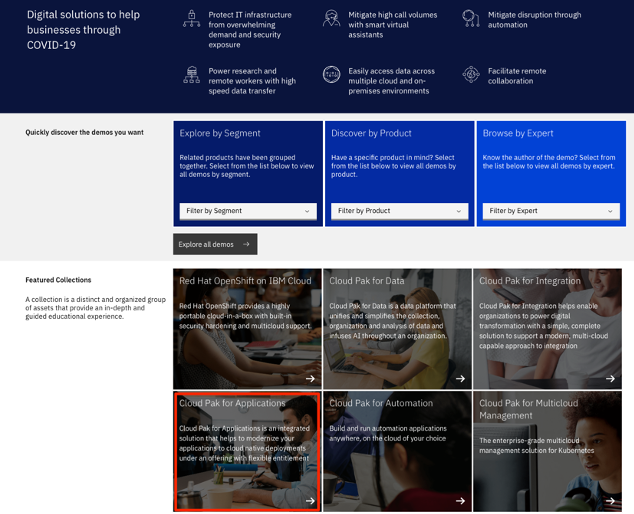

    The Cloud Pak for Applications Collection page is displayed.

    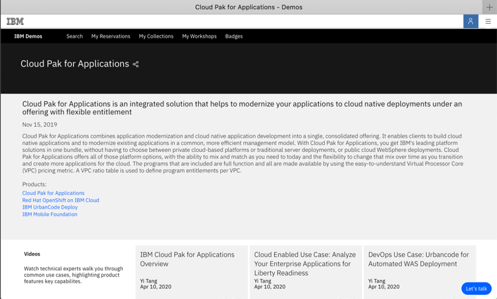
 
4.	Scroll down to the **Demo Environments** section and click **Reserve Instance** link of the **BETA - Cloud Pak for Applications OCP 4.4.17 with Desktop VM (Express)** environment.

    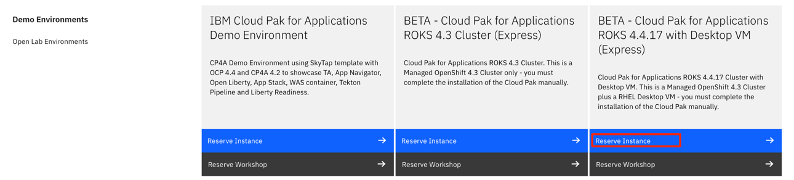 

5.	Fill out the Purpose, Duration and Location information which are required to provision the cluster, check the **I'm not a robot** box and click **Create**.
    
    Note: you can select a date up to 2 weeks out.  If you select more than two weeks, the system will revert to 2 hours.
 
    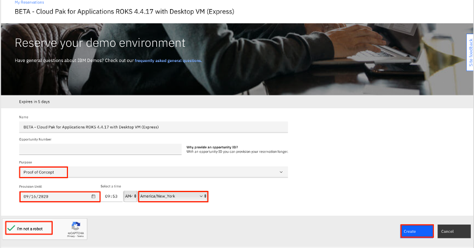

    With a few minutes, your OCP cluster and a Developer Workstation VM are created

    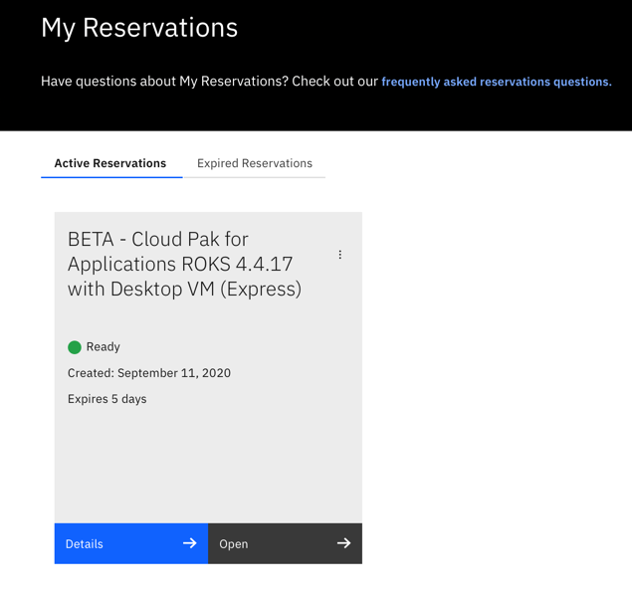
 
6.	Click **Details** to view more reservation information about your OCP cluster and the Developer Workstation VM.

    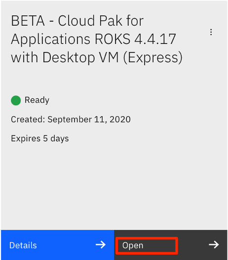

7.  The **Reservation Details** page lists information you need to do the Cloud Pak for Applications on OCP labs, including the lab environment setup guide, and the Developer Workstation VM URL and login credentials. Write down the VM URL and username/password, you are going to use the VM in your labs.  Close the page when you are done. 
    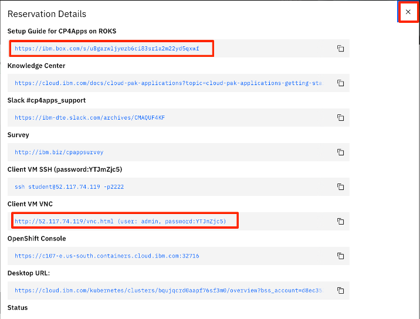

8. Click the **Open** link on the reservation to access your OCP cluster with your IBM account credentials.

    
 
    Your OCP cluster is displayed in IBM Cloud and you see that the system has assigned a DTE user account to your IBM Cloud account. 
 
    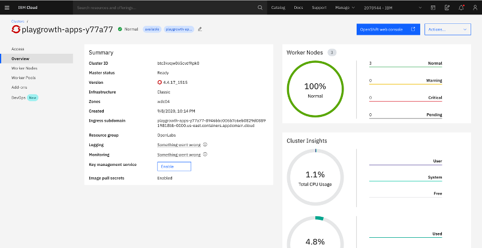
   
    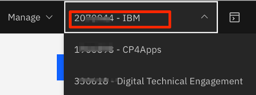
 
    You have created your OCP cluster in IBM Cloud.

#### 5.2 Install Cloud Pak for Applications

After the cluster is created, you can install IBM Cloud Pak for Applications on it.  The installation process is very easy with two simple steps.

1.	In your IBM Cloud page, go to the **Catalog** page, then click **Software**.

    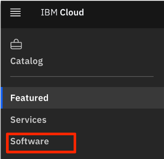
 
2.	Click to select **Cloud Pak for Applications** from the catalog list.

    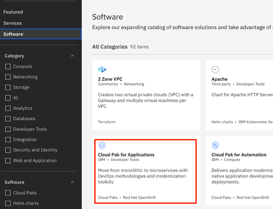
 
3.	Select the OCP cluster you just created and set the Project as **default**.

    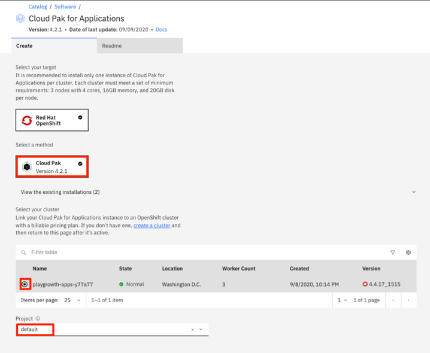

    Note:  You might have a wait for a few minutes for the Project list to get populated.
4.	Scroll down and click **Run script** to execute the preinstallation script.

    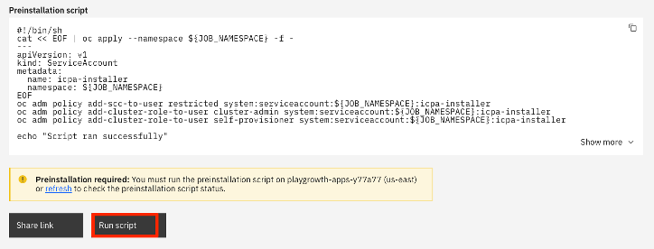

    The script runs for a few minutes

    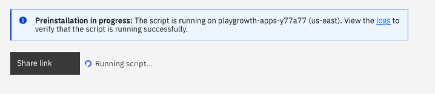
 
5.	When the script run is completed, you are ready to install the Pak. Check the **License agreement** box and click **Install** to start the installation process.

    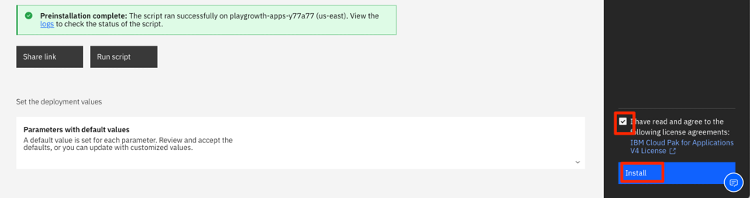

    The installation is in progress, it takes about 20 minutes.

    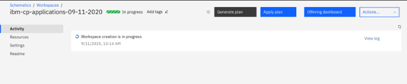

    When it is done, you see that the Cloud Pak for Applications is in **Active** status.

    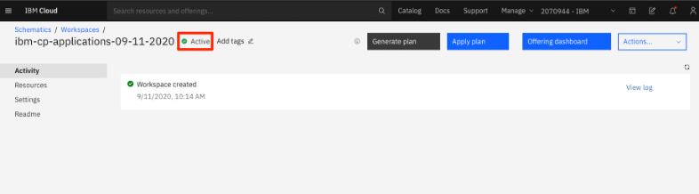

6.	To view the offerings included in the Cloud Pak for Applications, click the **Offering baseboard**.

    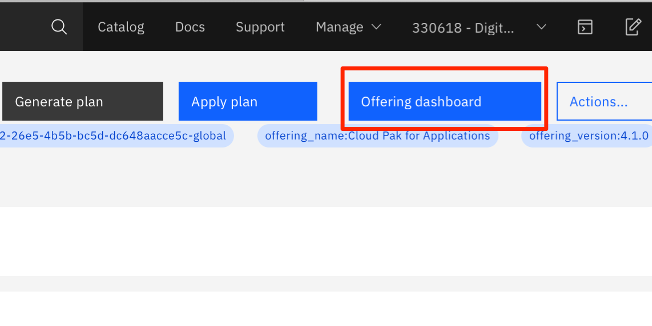
 
7.	The Cloud Pak for Application Offering Dashboard page is displayed. Click the **Instance** icon on the left navigation menu bar to see all the available offerings in the Pak.

    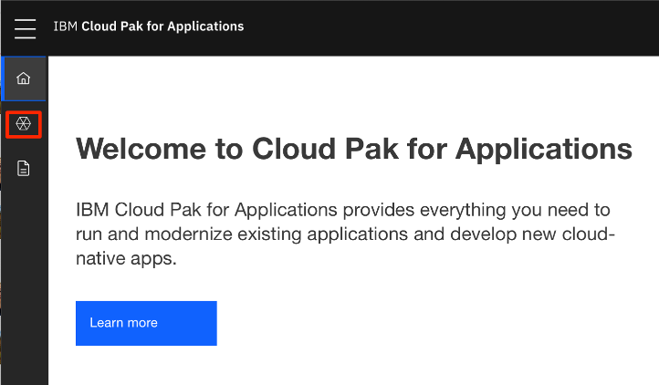

	The Instances page lists all products/offerings available.

    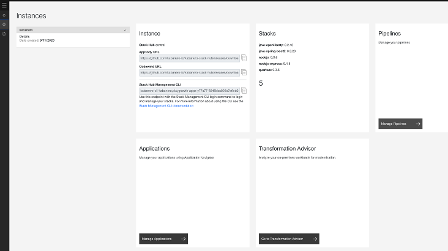
 
    You have installed Cloud Pak for Applications on the OCP cluster and it is ready.

#### 5.3	Configure Developer Workstation

In the CP4Apps on OCP lab series, you are going to use the Developer Workstation to access the OCP cluster and execute lab tasks.

The Developer Workstation VM is created for you when you created the cluster.

1.	Launch the VM from your local workstation web browser with the VM URL you recorded earlier.
 
    

2.	Click **Connect** to access the VM.
 
    

3.	Enter the password you obtained from the Reservation Details page and click **Send Password**.

    

    The VM desktop is displayed.

    
 
4.	Click **Applications**>**Firefox** to launch the web browser.

    
 
5.	From the browser window, click the IBM cloud bookmark to access your IBM Cloud account with your IBM Cloud account credentials.

    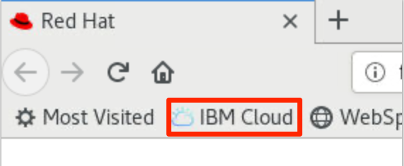
 
6.	In your IBM Cloud page, click **Clusters**.

    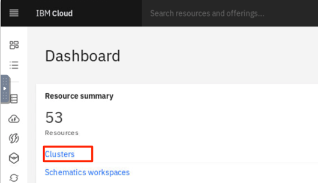
 
7.	Click the cluster you just created.

    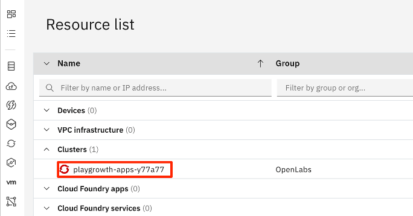

8.  Click **OpenShift web console** to access the OpenShift Web Console of the cluster.
 
    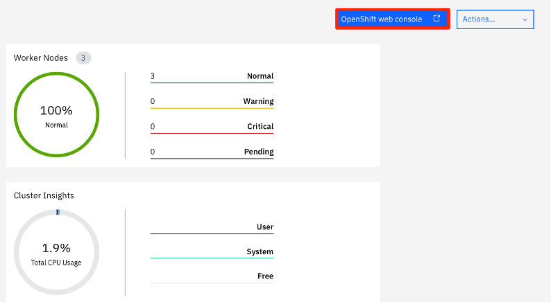

    The OpenShift Web Console page is opened in a new browser window. 
    
9.	Add a bookmark for OCP cluster Web Console. 

    a.	Go to the OCP cluster Web Console page, click its URL icon and drag it to the browser bookmark bar to create a bookmark for the URL.

    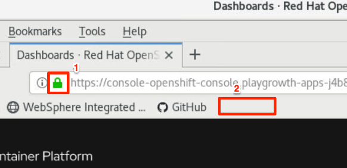

     When it is done, it looks like this:
 
    

10.	Add bookmarks for **Transformation Advisor**, **Application Navigator** and **Tekton Dashboard**

    a. Go to the Cloud Pak for Applications **Instance** page, click the link for **Transformation Advisor** to open it in a new browser window.
 
    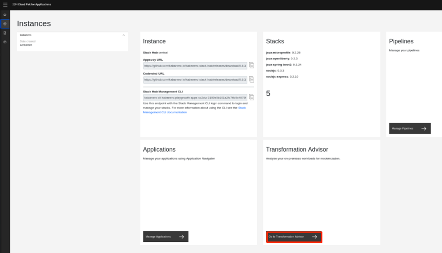

    b.	Go to the **Transformation Advisor** window, follow the same procedure in step above and drag its URL icon to the browser bookmark bar to create a bookmark for the **Transformation Advisor** page.
  
    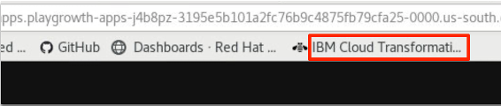

    c.	 Repeat the same steps to add bookmarks for **Application Navigator** and **Tekton Pipeline Dashboard** bookmarks.

    d.	If you see the **Authorize Access** message, click **Allow selected permissions** to continue.

    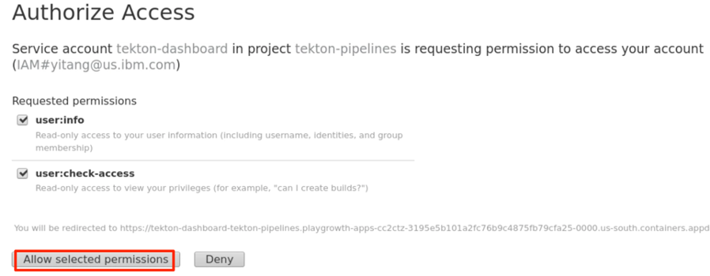
 
    When you are done, your browser bookmark bar looks like this:

    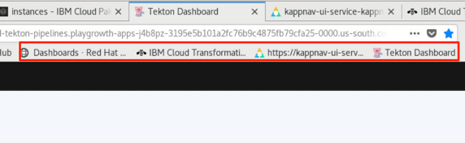

 11. Setup Lab Artifacts   

    The CP4Apps on OCP lab artifacts are stored in GitHub repo: **https://github.ibm.com/yitang/app-mod-labs**
    
    a. Access the lab artifacts repo from the browser window withe the repo URL.
    
    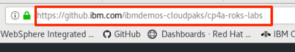

    b. Download the lab artifacts by clicking **Clone or download**>**Download ZIP** to download the artifacts to the default **Downloads** directory of the VM.
    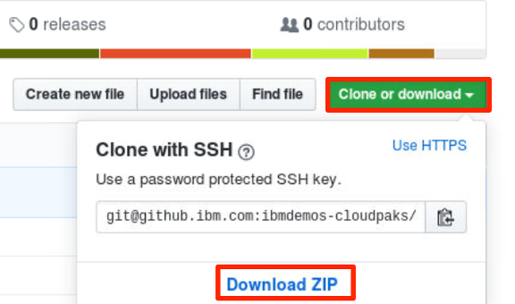

    c. Launch the Desktop File Explorer tool by clicking **Applications**>**Files**.
    
    

    d. From the Files Explorer navigate to **/home/ibmdemo/Downloads** directory. Right-click the downloaded zip file and select **Open With Archive Manager**.
    
    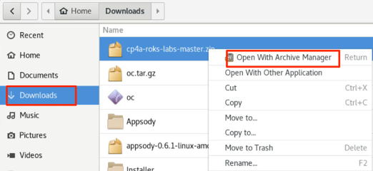

    e. Click **Extract**.
    
    

    f. Select **Home** as the extracting target folder and click **Extract**.  The Lab artifacts will be unpacked in **/home/ibmdemo/cap4-OCP-labs-master** directory.
    
    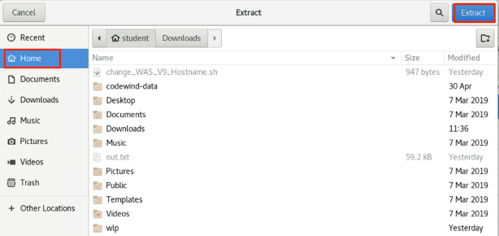

    g. Use Files Explorer to rename **/home/ibmdemo/cap4-OCP-labs-master** directory as **home/ibmdemo/cap4-OCP-labs**.
    
    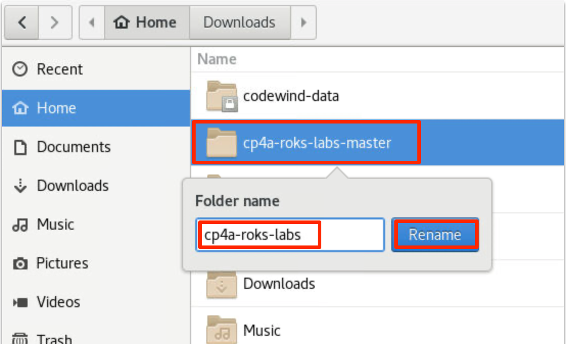


#### 5.4 Configure OCP Cluster

In the CP4Apps on OCP lab series, you are going to use the OCP cluster Internal Image Registry to host your application Docker images.  The Internal Image Registry is installed when you created the cluster, but its route has not been setup yet, so you cannot access the image registry from outside the cluster. 

In this task, you configure the image registry route through the OCP cluster Command Line Interface (CLI).

1.	From the Lab VM, go back to your OCP cluster Web Console page.

2.	Click the Action icon next to your username and select **Copy Login Command** to get the OCP cluster login command.
 
    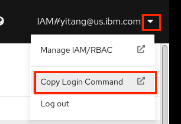

3.	In the next page, click **Display Token** link.

    
 
4.	Copy the OCP login command to the clipboard.

    
 
5.	Open a Terminal window in the Workstation by clicking **Applications**>**Terminal**.

    
 
6.	Right-click to paste the OCP cluster login command to the Terminal window and press **Enter** to log in to the cluster.

    
 
7.	To setup Image Registry Route, issue the OpenShift CLI command below:

    ```
    oc patch configs.imageregistry.operator.openshift.io/cluster --patch '{"spec":{"defaultRoute":true}}' --type=merge
    
    ```

    The Image Registry Route is now configured.    

#### 5.5 Delete OCP Cluster (Optional)

After you are done with your OCP cluster, you should delete the cluster to free ROSK resources for others to use. It is easy to delete the cluster as well as the Developer Workstation VM from your IBM Cloud account.

1.	From your local workstation browser window, access your IBM Demo [Reservation](https://www.ibm.com/demos/my-reservations/) page with your IBM Cloud credentials.

2.  Locate your reservation, click its action menu and select **Delete** to delete the reservation.

    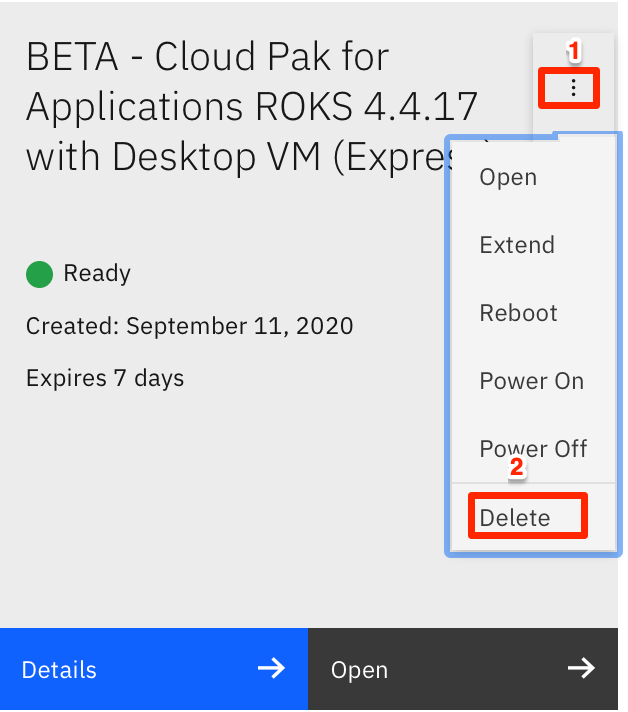
    
    Your OCP cluster and the Developer Workstation VM associated with the reservation are deleted from your IBM Cloud account.
 
### 7.	Summary

In this lab, you learned how to create a OCP cluster using IBM Cloud Managed Red Hat OpenShift Kubernetes Service and how to install IBM Cloud Pak for Applications on the cluster. Now you are ready to use the OCP cluster with Cloud Pak for Applications to run the rest of the Cloud Pak for Applications on OCP lab series. To learn more about IBM App Modernization solutions, please visit [Cloud Pak for Applications](https://www.ibm.com/cloud/cloud-pak-for-applications) .

**Congratulations! You have successfully completed the lab “Setup IBM Cloud Pak for Applications on OCP Cluster in IBM Cloud”.
**
